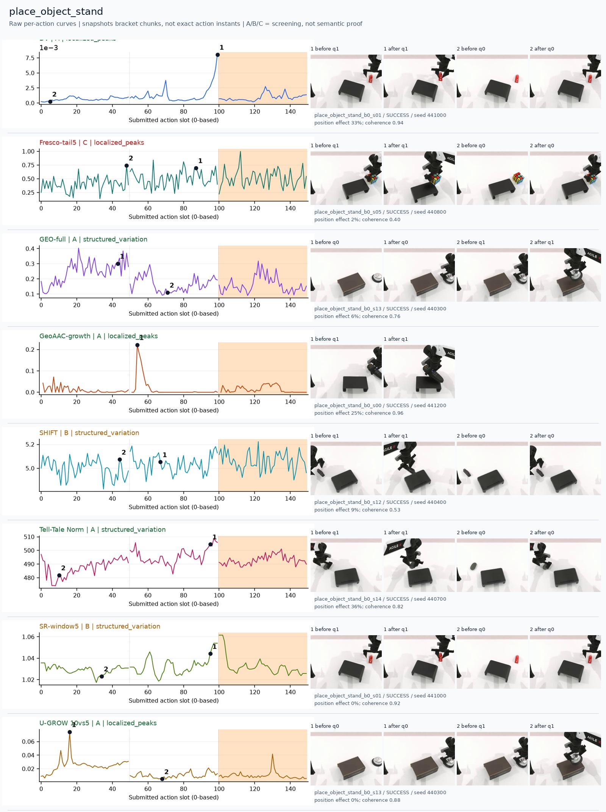
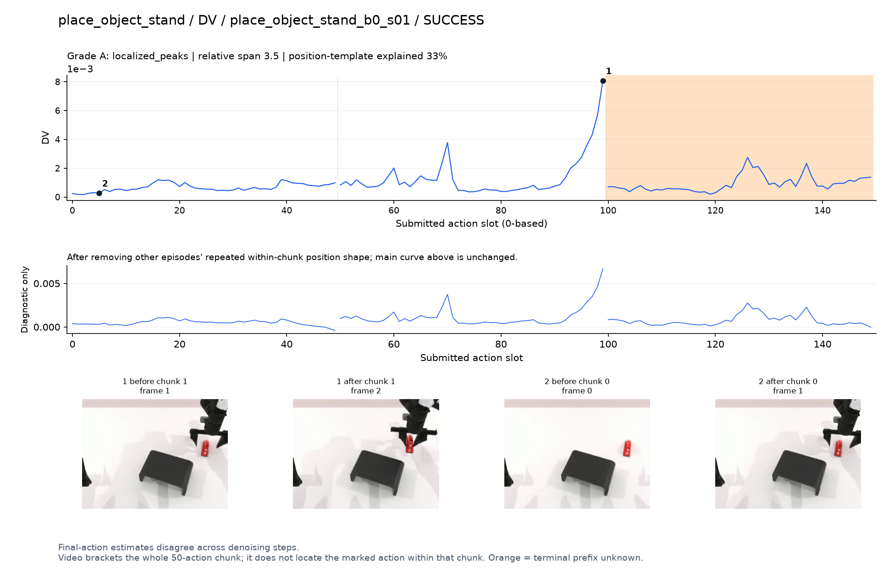
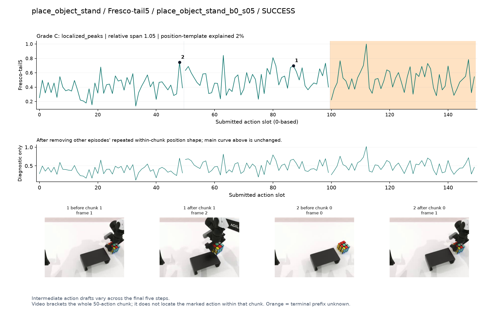
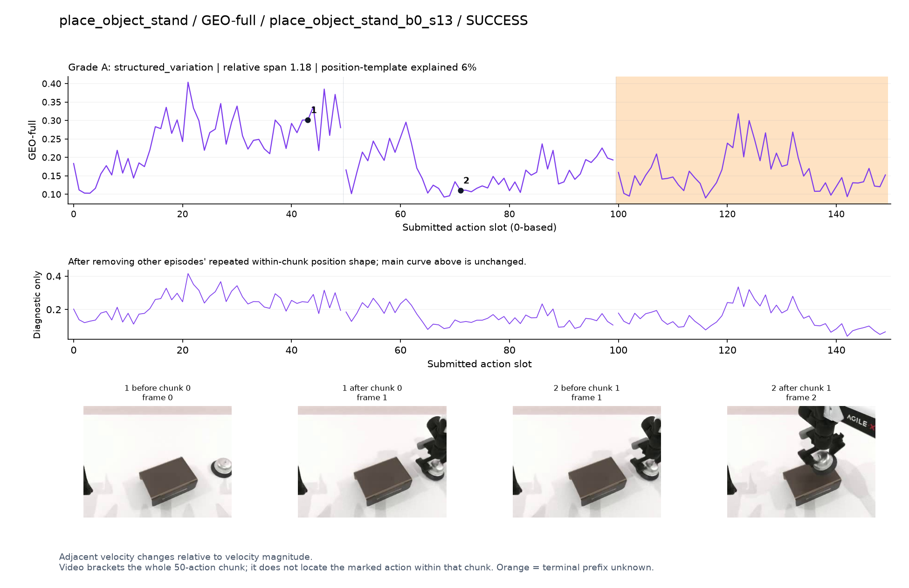
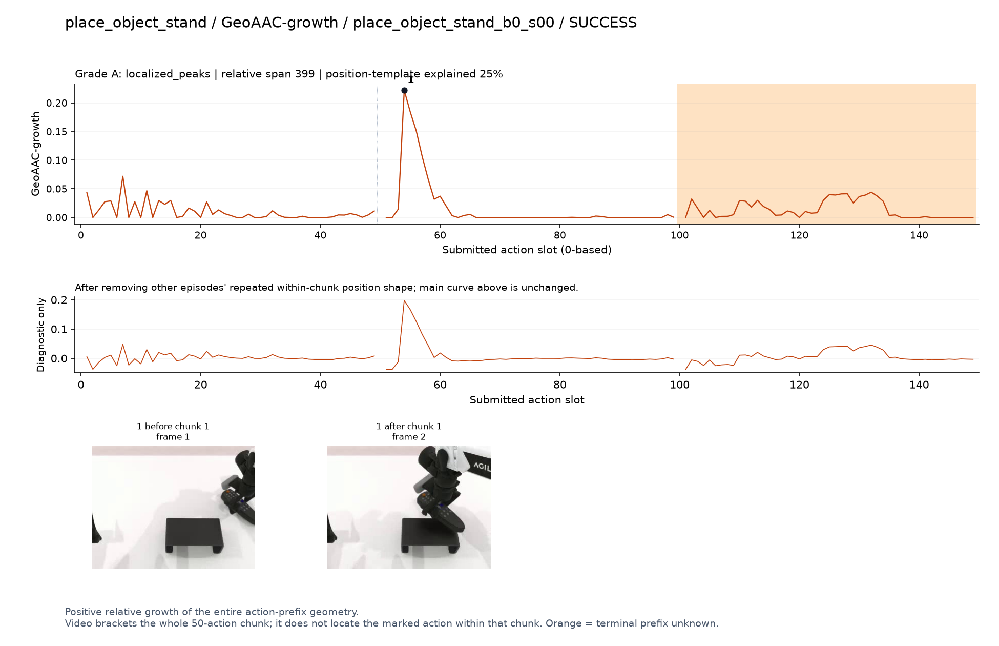
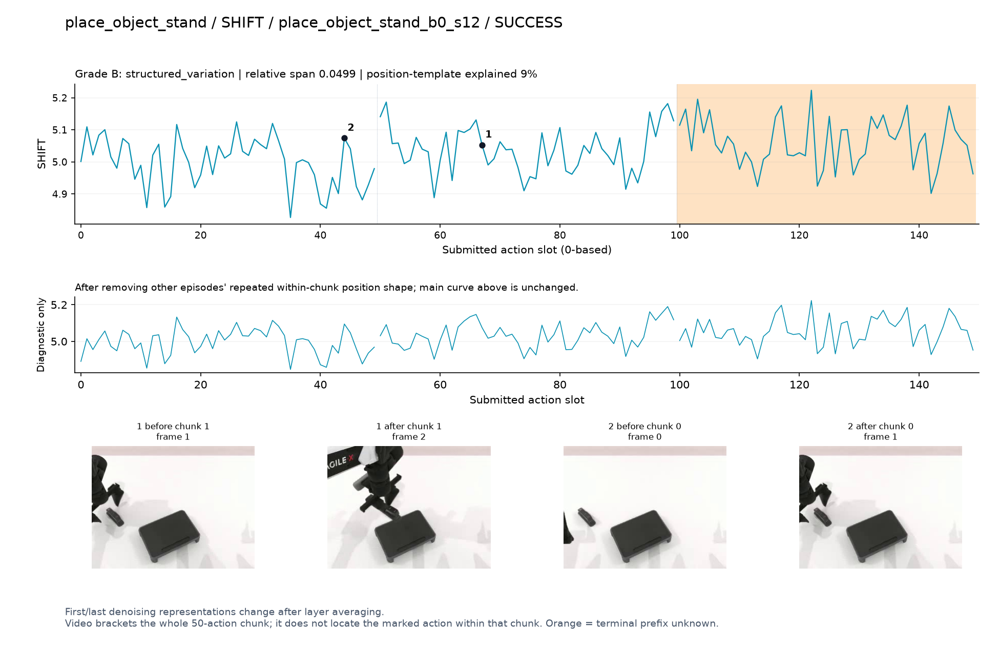
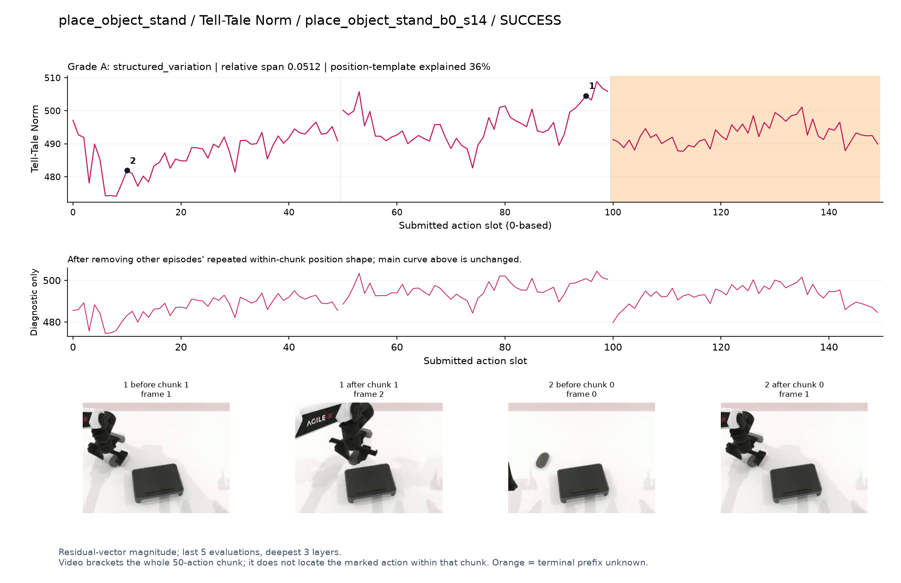
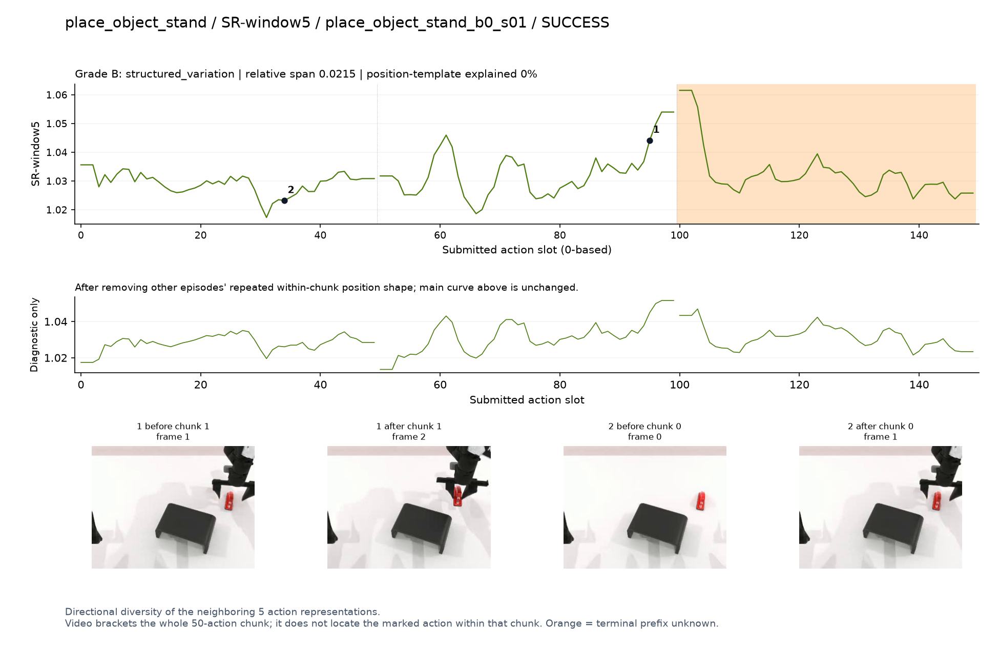
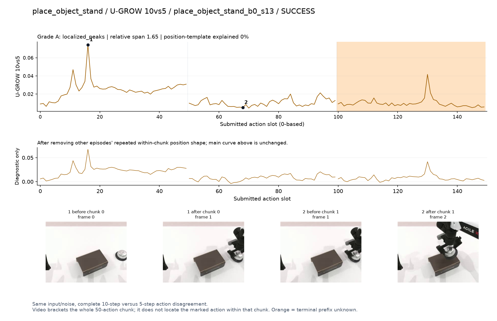

# place_object_stand

[全部任务](../README.md#全部任务) · [按信号看](../README.md#按信号看)

主图保留逐动作原始值；细虚线为chunk边界，橙色为终止段实际执行长度不明，未用于筛选。帧只对应chunk前后，不能精确定位某个h的接触瞬间。A/B/C是形态筛选等级，优先读人工备注。

## DV

**可解释候选**：候选：q1提起并移向台子时末段升高；只有一批数据。

轨迹 `place_object_stand_b0_s01`；成功；种子 `441000`；正式验收。

[PNG原图](../figures/place_object_stand/dv.png) · [SVG矢量图](../figures/place_object_stand/dv.svg) · [完整元数据](../entries/place_object_stand/dv.json)

对应帧：[1 before q1](../frames/place_object_stand/place_object_stand_b0_s01/f001.jpg) · [1 after q1](../frames/place_object_stand/place_object_stand_b0_s01/f002.jpg) · [2 before q0](../frames/place_object_stand/place_object_stand_b0_s01/f000.jpg) · [2 after q0](../frames/place_object_stand/place_object_stand_b0_s01/f001.jpg)

## Fresco-tail5

**较弱**：弱：逐动作抖动较密，未见可靠独立事件对应；全数据与噪声到最终动作距离高度相关。

轨迹 `place_object_stand_b0_s05`；成功；种子 `440800`；正式验收。

[PNG原图](../figures/place_object_stand/fresco.png) · [SVG矢量图](../figures/place_object_stand/fresco.svg) · [完整元数据](../entries/place_object_stand/fresco.json)

对应帧：[1 before q1](../frames/place_object_stand/place_object_stand_b0_s05/f001.jpg) · [1 after q1](../frames/place_object_stand/place_object_stand_b0_s05/f002.jpg) · [2 before q0](../frames/place_object_stand/place_object_stand_b0_s05/f000.jpg) · [2 after q0](../frames/place_object_stand/place_object_stand_b0_s05/f001.jpg)

## GEO-full

**可解释候选**：候选：q0接近物体时高，q1移动较低。

轨迹 `place_object_stand_b0_s13`；成功；种子 `440300`；正式验收。

[PNG原图](../figures/place_object_stand/geo.png) · [SVG矢量图](../figures/place_object_stand/geo.svg) · [完整元数据](../entries/place_object_stand/geo.json)

对应帧：[1 before q0](../frames/place_object_stand/place_object_stand_b0_s13/f000.jpg) · [1 after q0](../frames/place_object_stand/place_object_stand_b0_s13/f001.jpg) · [2 before q1](../frames/place_object_stand/place_object_stand_b0_s13/f001.jpg) · [2 after q1](../frames/place_object_stand/place_object_stand_b0_s13/f002.jpg)

## GeoAAC-growth

**受其他因素影响**：谨慎：q1物体移上台子的前缀开头峰。

轨迹 `place_object_stand_b0_s00`；成功；种子 `441200`；正式验收。

[PNG原图](../figures/place_object_stand/geoaac.png) · [SVG矢量图](../figures/place_object_stand/geoaac.svg) · [完整元数据](../entries/place_object_stand/geoaac.json)

对应帧：[1 before q1](../frames/place_object_stand/place_object_stand_b0_s00/f001.jpg) · [1 after q1](../frames/place_object_stand/place_object_stand_b0_s00/f002.jpg)

## SHIFT

**较弱**：弱：小幅抖动/阶段基线变化，未见可靠独立事件对应；路径长度混杂强。

轨迹 `place_object_stand_b0_s12`；成功；种子 `440400`；正式验收。

[PNG原图](../figures/place_object_stand/shift.png) · [SVG矢量图](../figures/place_object_stand/shift.svg) · [完整元数据](../entries/place_object_stand/shift.json)

对应帧：[1 before q1](../frames/place_object_stand/place_object_stand_b0_s12/f001.jpg) · [1 after q1](../frames/place_object_stand/place_object_stand_b0_s12/f002.jpg) · [2 before q0](../frames/place_object_stand/place_object_stand_b0_s12/f000.jpg) · [2 after q0](../frames/place_object_stand/place_object_stand_b0_s12/f001.jpg)

## Tell-Tale Norm

**可解释候选**：阶段候选：q1拿物体靠近台面时较高，边界影响不可忽略。

轨迹 `place_object_stand_b0_s14`；成功；种子 `440700`；正式验收。

[PNG原图](../figures/place_object_stand/norm.png) · [SVG矢量图](../figures/place_object_stand/norm.svg) · [完整元数据](../entries/place_object_stand/norm.json)

对应帧：[1 before q1](../frames/place_object_stand/place_object_stand_b0_s14/f001.jpg) · [1 after q1](../frames/place_object_stand/place_object_stand_b0_s14/f002.jpg) · [2 before q0](../frames/place_object_stand/place_object_stand_b0_s14/f000.jpg) · [2 after q0](../frames/place_object_stand/place_object_stand_b0_s14/f001.jpg)

## SR-window5

**较弱**：弱：q1末端固定抬高。

轨迹 `place_object_stand_b0_s01`；成功；种子 `441000`；正式验收。

[PNG原图](../figures/place_object_stand/sr.png) · [SVG矢量图](../figures/place_object_stand/sr.svg) · [完整元数据](../entries/place_object_stand/sr.json)

对应帧：[1 before q1](../frames/place_object_stand/place_object_stand_b0_s01/f001.jpg) · [1 after q1](../frames/place_object_stand/place_object_stand_b0_s01/f002.jpg) · [2 before q0](../frames/place_object_stand/place_object_stand_b0_s01/f000.jpg) · [2 after q0](../frames/place_object_stand/place_object_stand_b0_s01/f001.jpg)

## U-GROW 10vs5

**可解释候选**：候选：q0接近物体时有单个主要峰。

轨迹 `place_object_stand_b0_s13`；成功；种子 `440300`；正式验收。

[PNG原图](../figures/place_object_stand/ugrow.png) · [SVG矢量图](../figures/place_object_stand/ugrow.svg) · [完整元数据](../entries/place_object_stand/ugrow.json)

对应帧：[1 before q0](../frames/place_object_stand/place_object_stand_b0_s13/f000.jpg) · [1 after q0](../frames/place_object_stand/place_object_stand_b0_s13/f001.jpg) · [2 before q1](../frames/place_object_stand/place_object_stand_b0_s13/f001.jpg) · [2 after q1](../frames/place_object_stand/place_object_stand_b0_s13/f002.jpg)
