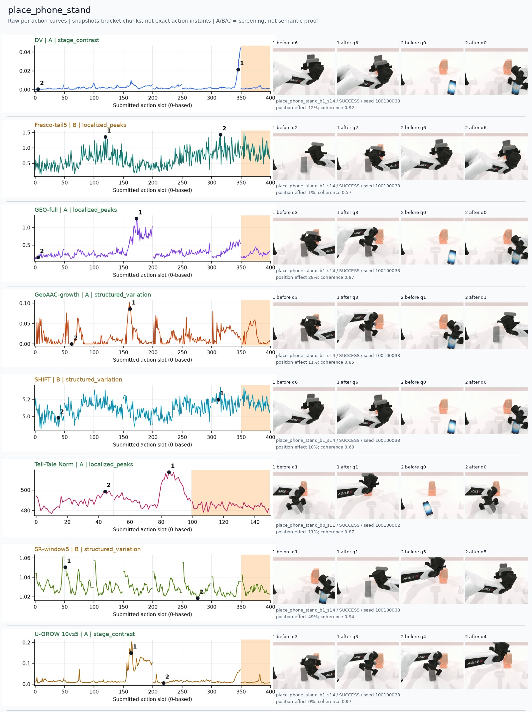
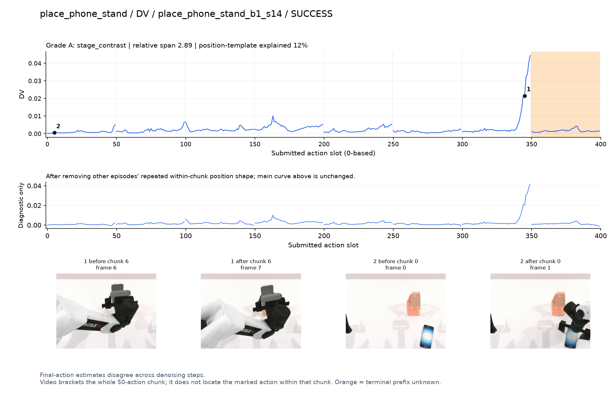
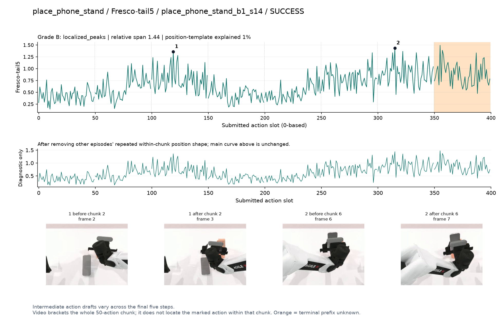
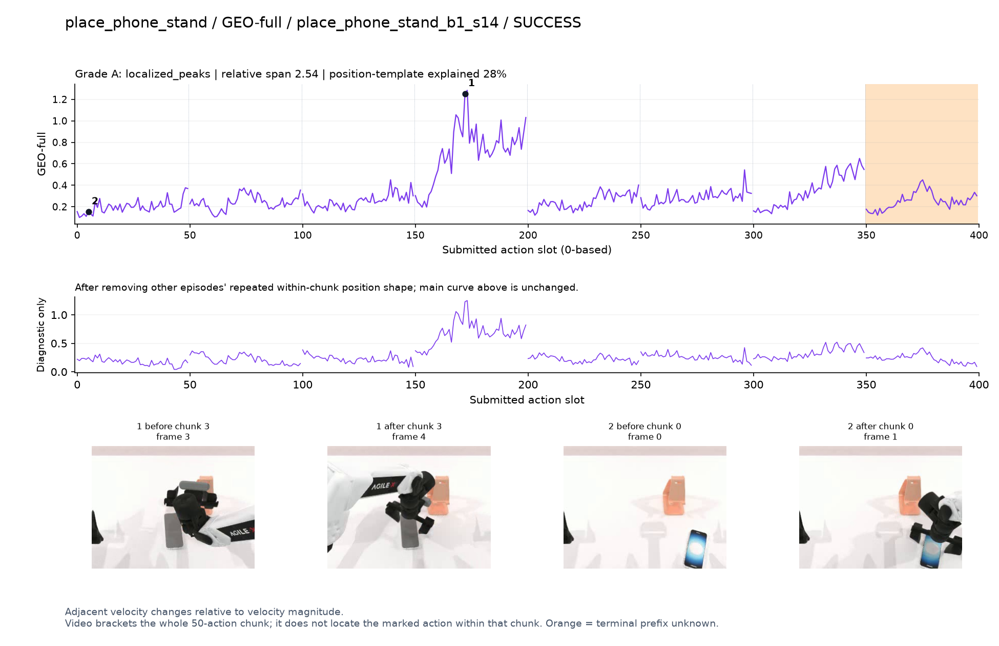
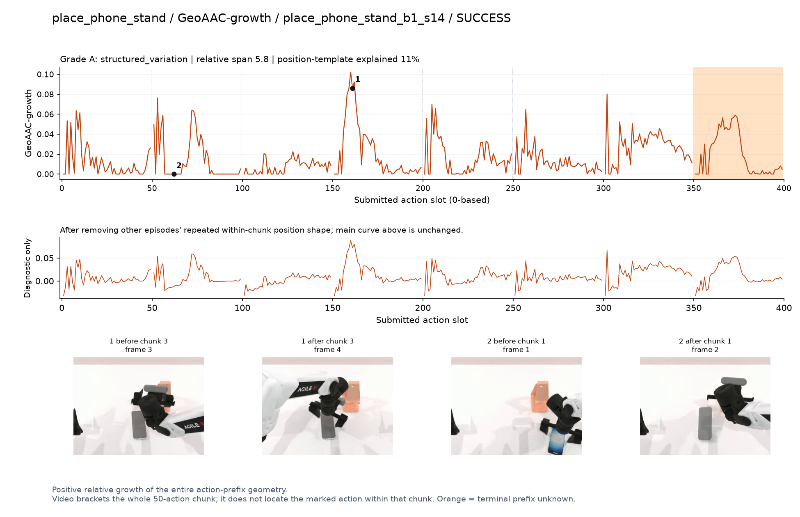
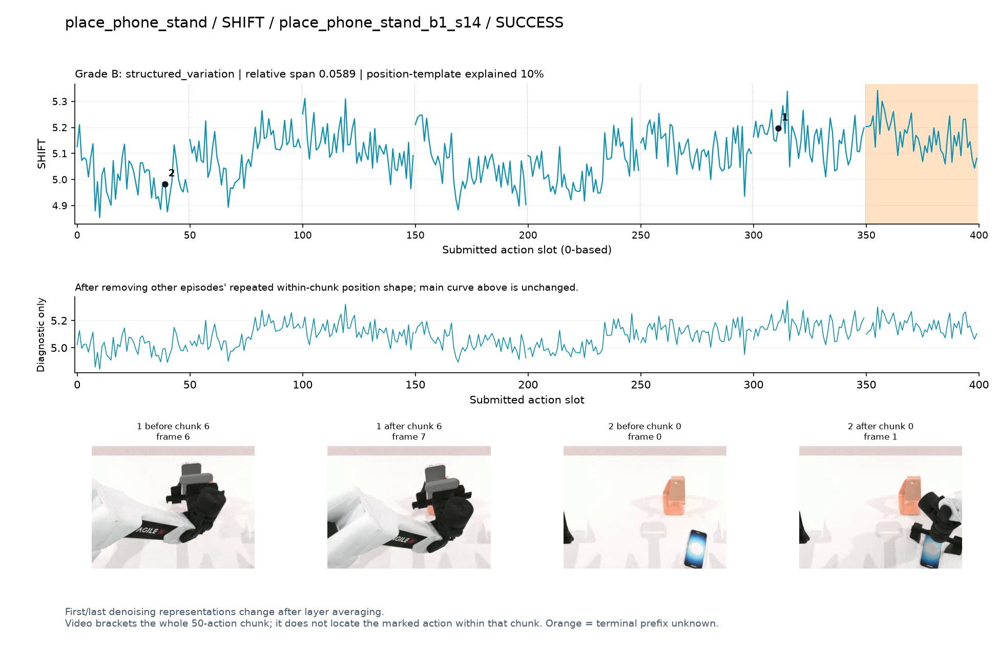
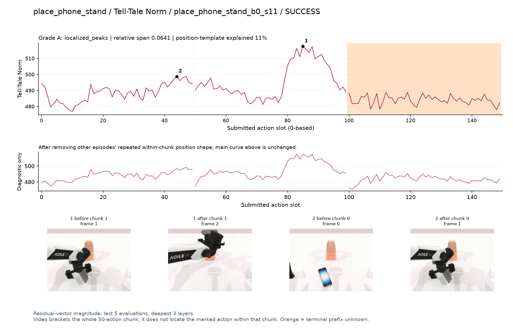
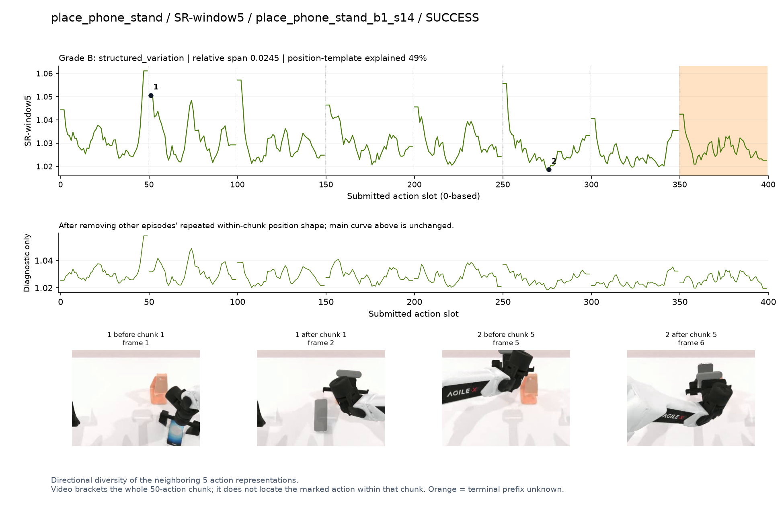
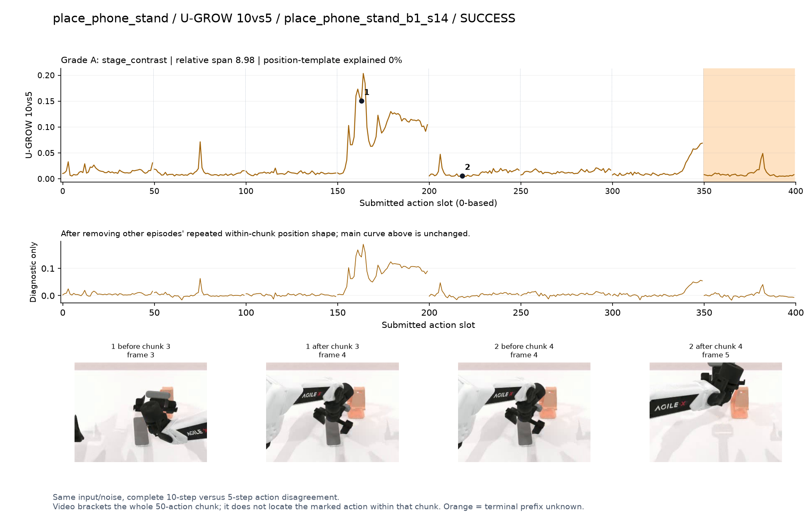

# place_phone_stand

[全部任务](../README.md#全部任务) · [按信号看](../README.md#按信号看)

主图保留逐动作原始值；细虚线为chunk边界，橙色为终止段实际执行长度不明，未用于筛选。帧只对应chunk前后，不能精确定位某个h的接触瞬间。A/B/C是形态筛选等级，优先读人工备注。

## DV

**受其他因素影响**：谨慎：q6握着手机/支架附近末段升高，遮挡大，接触不可辨。

轨迹 `place_phone_stand_b1_s14`；成功；种子 `100100038`；正式验收。

[PNG原图](../figures/place_phone_stand/dv.png) · [SVG矢量图](../figures/place_phone_stand/dv.svg) · [完整元数据](../entries/place_phone_stand/dv.json)

对应帧：[1 before q6](../frames/place_phone_stand/place_phone_stand_b1_s14/f006.jpg) · [1 after q6](../frames/place_phone_stand/place_phone_stand_b1_s14/f007.jpg) · [2 before q0](../frames/place_phone_stand/place_phone_stand_b1_s14/f000.jpg) · [2 after q0](../frames/place_phone_stand/place_phone_stand_b1_s14/f001.jpg)

## Fresco-tail5

**较弱**：弱：逐动作抖动较密，未见可靠独立事件对应；全数据与噪声到最终动作距离高度相关。

轨迹 `place_phone_stand_b1_s14`；成功；种子 `100100038`；正式验收。

[PNG原图](../figures/place_phone_stand/fresco.png) · [SVG矢量图](../figures/place_phone_stand/fresco.svg) · [完整元数据](../entries/place_phone_stand/fresco.json)

对应帧：[1 before q2](../frames/place_phone_stand/place_phone_stand_b1_s14/f002.jpg) · [1 after q2](../frames/place_phone_stand/place_phone_stand_b1_s14/f003.jpg) · [2 before q6](../frames/place_phone_stand/place_phone_stand_b1_s14/f006.jpg) · [2 after q6](../frames/place_phone_stand/place_phone_stand_b1_s14/f007.jpg)

## GEO-full

**可解释候选**：候选：q3手机竖直姿态调整时宽峰。

轨迹 `place_phone_stand_b1_s14`；成功；种子 `100100038`；正式验收。

[PNG原图](../figures/place_phone_stand/geo.png) · [SVG矢量图](../figures/place_phone_stand/geo.svg) · [完整元数据](../entries/place_phone_stand/geo.json)

对应帧：[1 before q3](../frames/place_phone_stand/place_phone_stand_b1_s14/f003.jpg) · [1 after q3](../frames/place_phone_stand/place_phone_stand_b1_s14/f004.jpg) · [2 before q0](../frames/place_phone_stand/place_phone_stand_b1_s14/f000.jpg) · [2 after q0](../frames/place_phone_stand/place_phone_stand_b1_s14/f001.jpg)

## GeoAAC-growth

**可解释候选**：阶段候选：同q3姿态调整前缀增长较高，另有多处尖峰。

轨迹 `place_phone_stand_b1_s14`；成功；种子 `100100038`；正式验收。

[PNG原图](../figures/place_phone_stand/geoaac.png) · [SVG矢量图](../figures/place_phone_stand/geoaac.svg) · [完整元数据](../entries/place_phone_stand/geoaac.json)

对应帧：[1 before q3](../frames/place_phone_stand/place_phone_stand_b1_s14/f003.jpg) · [1 after q3](../frames/place_phone_stand/place_phone_stand_b1_s14/f004.jpg) · [2 before q1](../frames/place_phone_stand/place_phone_stand_b1_s14/f001.jpg) · [2 after q1](../frames/place_phone_stand/place_phone_stand_b1_s14/f002.jpg)

## SHIFT

**较弱**：弱：小幅抖动/阶段基线变化，未见可靠独立事件对应；路径长度混杂强。

轨迹 `place_phone_stand_b1_s14`；成功；种子 `100100038`；正式验收。

[PNG原图](../figures/place_phone_stand/shift.png) · [SVG矢量图](../figures/place_phone_stand/shift.svg) · [完整元数据](../entries/place_phone_stand/shift.json)

对应帧：[1 before q6](../frames/place_phone_stand/place_phone_stand_b1_s14/f006.jpg) · [1 after q6](../frames/place_phone_stand/place_phone_stand_b1_s14/f007.jpg) · [2 before q0](../frames/place_phone_stand/place_phone_stand_b1_s14/f000.jpg) · [2 after q0](../frames/place_phone_stand/place_phone_stand_b1_s14/f001.jpg)

## Tell-Tale Norm

**可解释候选**：候选：较短成功轨迹q1手机向支架移动时宽峰。

轨迹 `place_phone_stand_b0_s11`；成功；种子 `100100002`；正式验收。

[PNG原图](../figures/place_phone_stand/norm.png) · [SVG矢量图](../figures/place_phone_stand/norm.svg) · [完整元数据](../entries/place_phone_stand/norm.json)

对应帧：[1 before q1](../frames/place_phone_stand/place_phone_stand_b0_s11/f001.jpg) · [1 after q1](../frames/place_phone_stand/place_phone_stand_b0_s11/f002.jpg) · [2 before q0](../frames/place_phone_stand/place_phone_stand_b0_s11/f000.jpg) · [2 after q0](../frames/place_phone_stand/place_phone_stand_b0_s11/f001.jpg)

## SR-window5

**较弱**：弱：每chunk开头重复上升。

轨迹 `place_phone_stand_b1_s14`；成功；种子 `100100038`；正式验收。

[PNG原图](../figures/place_phone_stand/sr.png) · [SVG矢量图](../figures/place_phone_stand/sr.svg) · [完整元数据](../entries/place_phone_stand/sr.json)

对应帧：[1 before q1](../frames/place_phone_stand/place_phone_stand_b1_s14/f001.jpg) · [1 after q1](../frames/place_phone_stand/place_phone_stand_b1_s14/f002.jpg) · [2 before q5](../frames/place_phone_stand/place_phone_stand_b1_s14/f005.jpg) · [2 after q5](../frames/place_phone_stand/place_phone_stand_b1_s14/f006.jpg)

## U-GROW 10vs5

**可解释候选**：候选：q3手机姿态调整时形成主要高区。

轨迹 `place_phone_stand_b1_s14`；成功；种子 `100100038`；正式验收。

[PNG原图](../figures/place_phone_stand/ugrow.png) · [SVG矢量图](../figures/place_phone_stand/ugrow.svg) · [完整元数据](../entries/place_phone_stand/ugrow.json)

对应帧：[1 before q3](../frames/place_phone_stand/place_phone_stand_b1_s14/f003.jpg) · [1 after q3](../frames/place_phone_stand/place_phone_stand_b1_s14/f004.jpg) · [2 before q4](../frames/place_phone_stand/place_phone_stand_b1_s14/f004.jpg) · [2 after q4](../frames/place_phone_stand/place_phone_stand_b1_s14/f005.jpg)
