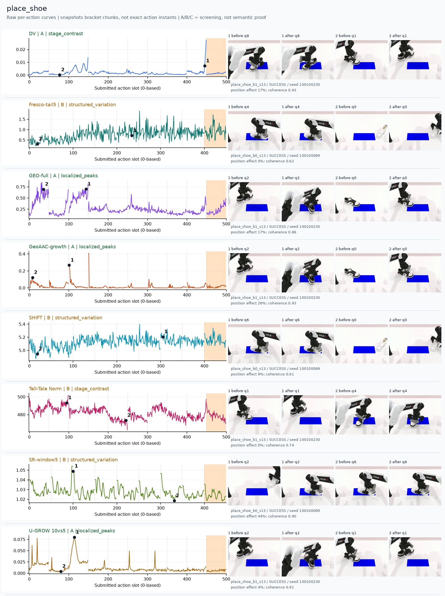
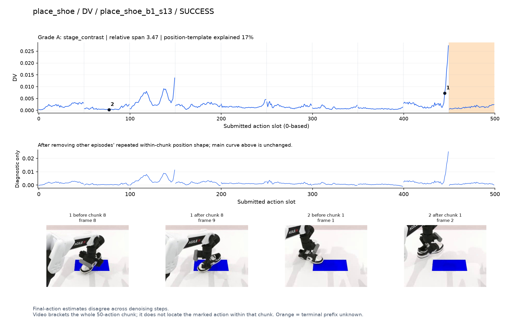
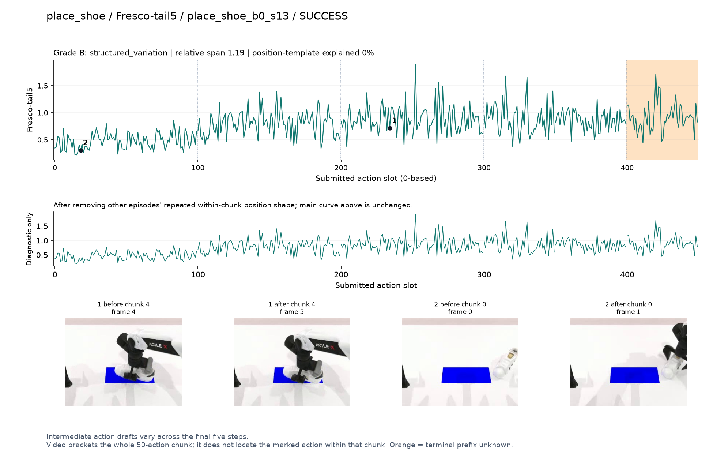
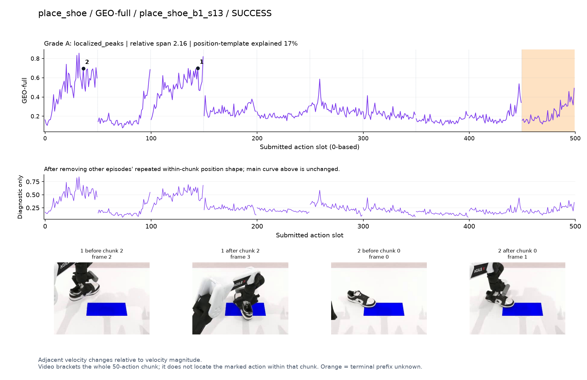
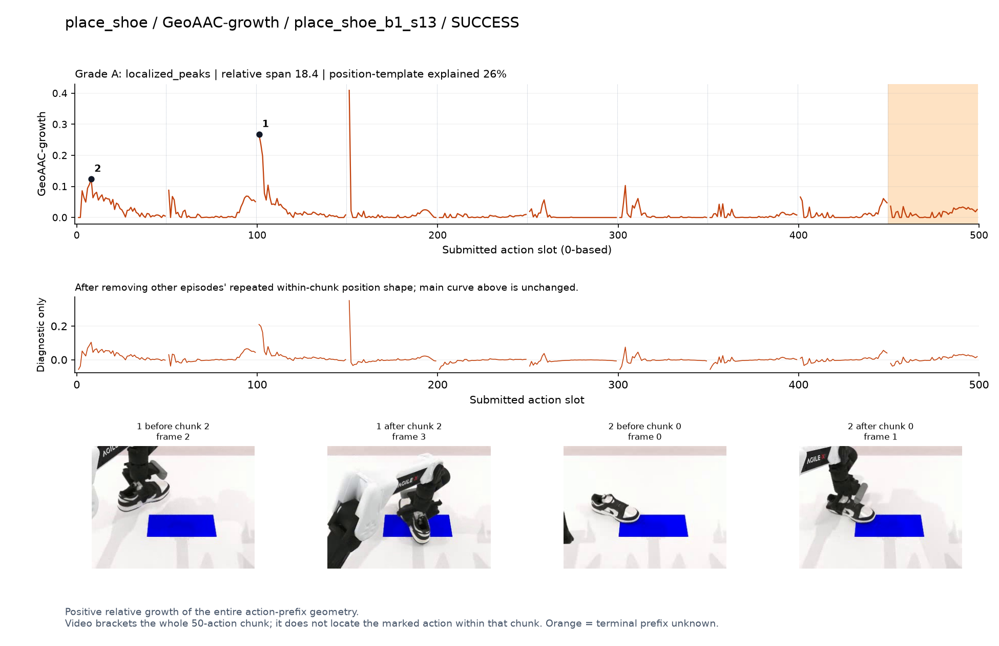
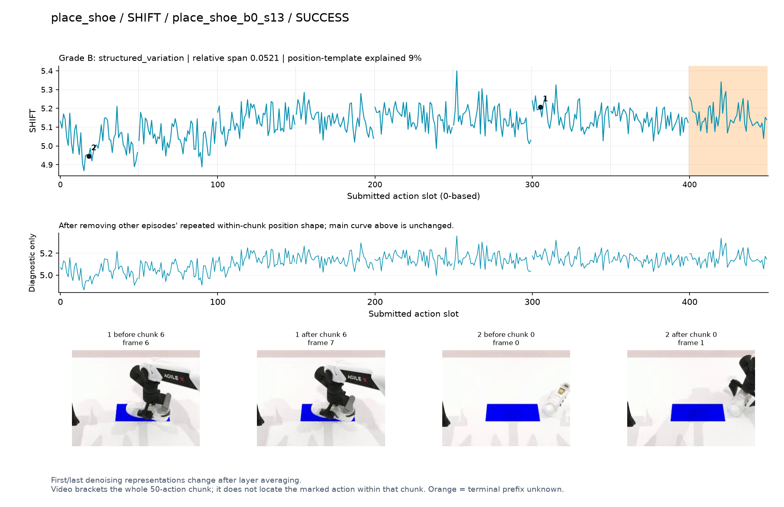
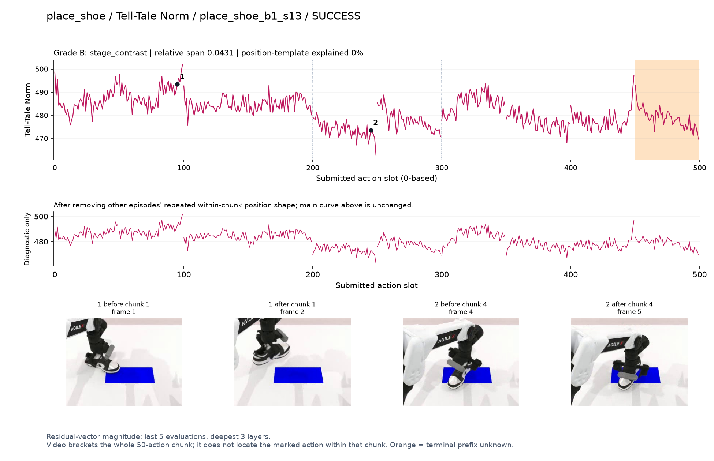
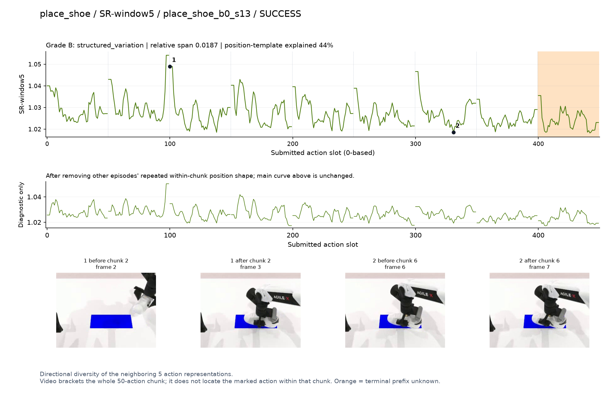
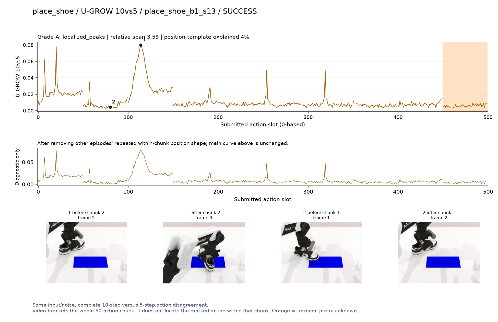

# place_shoe

[全部任务](../README.md#全部任务) · [按信号看](../README.md#按信号看)

主图保留逐动作原始值；细虚线为chunk边界，橙色为终止段实际执行长度不明，未用于筛选。帧只对应chunk前后，不能精确定位某个h的接触瞬间。A/B/C是形态筛选等级，优先读人工备注。

## DV

**受其他因素影响**：谨慎：q8鞋在垫子上调整时末端升高；画面变化小，另有早期峰。

轨迹 `place_shoe_b1_s13`；成功；种子 `100100230`；正式验收。

[PNG原图](../figures/place_shoe/dv.png) · [SVG矢量图](../figures/place_shoe/dv.svg) · [完整元数据](../entries/place_shoe/dv.json)

对应帧：[1 before q8](../frames/place_shoe/place_shoe_b1_s13/f008.jpg) · [1 after q8](../frames/place_shoe/place_shoe_b1_s13/f009.jpg) · [2 before q1](../frames/place_shoe/place_shoe_b1_s13/f001.jpg) · [2 after q1](../frames/place_shoe/place_shoe_b1_s13/f002.jpg)

## Fresco-tail5

**较弱**：弱：逐动作抖动较密，未见可靠独立事件对应；全数据与噪声到最终动作距离高度相关。

轨迹 `place_shoe_b0_s13`；成功；种子 `100100089`；正式验收。

[PNG原图](../figures/place_shoe/fresco.png) · [SVG矢量图](../figures/place_shoe/fresco.svg) · [完整元数据](../entries/place_shoe/fresco.json)

对应帧：[1 before q4](../frames/place_shoe/place_shoe_b0_s13/f004.jpg) · [1 after q4](../frames/place_shoe/place_shoe_b0_s13/f005.jpg) · [2 before q0](../frames/place_shoe/place_shoe_b0_s13/f000.jpg) · [2 after q0](../frames/place_shoe/place_shoe_b0_s13/f001.jpg)

## GEO-full

**可解释候选**：候选：q0抓鞋、q2移向垫子两段高区。

轨迹 `place_shoe_b1_s13`；成功；种子 `100100230`；正式验收。

[PNG原图](../figures/place_shoe/geo.png) · [SVG矢量图](../figures/place_shoe/geo.svg) · [完整元数据](../entries/place_shoe/geo.json)

对应帧：[1 before q2](../frames/place_shoe/place_shoe_b1_s13/f002.jpg) · [1 after q2](../frames/place_shoe/place_shoe_b1_s13/f003.jpg) · [2 before q0](../frames/place_shoe/place_shoe_b1_s13/f000.jpg) · [2 after q0](../frames/place_shoe/place_shoe_b1_s13/f001.jpg)

## GeoAAC-growth

**受其他因素影响**：谨慎：q2向垫子移动增长峰，但正位于chunk开头。

轨迹 `place_shoe_b1_s13`；成功；种子 `100100230`；正式验收。

[PNG原图](../figures/place_shoe/geoaac.png) · [SVG矢量图](../figures/place_shoe/geoaac.svg) · [完整元数据](../entries/place_shoe/geoaac.json)

对应帧：[1 before q2](../frames/place_shoe/place_shoe_b1_s13/f002.jpg) · [1 after q2](../frames/place_shoe/place_shoe_b1_s13/f003.jpg) · [2 before q0](../frames/place_shoe/place_shoe_b1_s13/f000.jpg) · [2 after q0](../frames/place_shoe/place_shoe_b1_s13/f001.jpg)

## SHIFT

**较弱**：弱：小幅抖动/阶段基线变化，未见可靠独立事件对应；路径长度混杂强。

轨迹 `place_shoe_b0_s13`；成功；种子 `100100089`；正式验收。

[PNG原图](../figures/place_shoe/shift.png) · [SVG矢量图](../figures/place_shoe/shift.svg) · [完整元数据](../entries/place_shoe/shift.json)

对应帧：[1 before q6](../frames/place_shoe/place_shoe_b0_s13/f006.jpg) · [1 after q6](../frames/place_shoe/place_shoe_b0_s13/f007.jpg) · [2 before q0](../frames/place_shoe/place_shoe_b0_s13/f000.jpg) · [2 after q0](../frames/place_shoe/place_shoe_b0_s13/f001.jpg)

## Tell-Tale Norm

**阶段变化**：阶段差异较弱：提鞋前后幅度不同，不能单独定位重要事件。

轨迹 `place_shoe_b1_s13`；成功；种子 `100100230`；正式验收。

[PNG原图](../figures/place_shoe/norm.png) · [SVG矢量图](../figures/place_shoe/norm.svg) · [完整元数据](../entries/place_shoe/norm.json)

对应帧：[1 before q1](../frames/place_shoe/place_shoe_b1_s13/f001.jpg) · [1 after q1](../frames/place_shoe/place_shoe_b1_s13/f002.jpg) · [2 before q4](../frames/place_shoe/place_shoe_b1_s13/f004.jpg) · [2 after q4](../frames/place_shoe/place_shoe_b1_s13/f005.jpg)

## SR-window5

**较弱**：弱：多处重复边界峰。

轨迹 `place_shoe_b0_s13`；成功；种子 `100100089`；正式验收。

[PNG原图](../figures/place_shoe/sr.png) · [SVG矢量图](../figures/place_shoe/sr.svg) · [完整元数据](../entries/place_shoe/sr.json)

对应帧：[1 before q2](../frames/place_shoe/place_shoe_b0_s13/f002.jpg) · [1 after q2](../frames/place_shoe/place_shoe_b0_s13/f003.jpg) · [2 before q6](../frames/place_shoe/place_shoe_b0_s13/f006.jpg) · [2 after q6](../frames/place_shoe/place_shoe_b0_s13/f007.jpg)

## U-GROW 10vs5

**可解释候选**：候选：q2持鞋移到垫子附近有局部主峰。

轨迹 `place_shoe_b1_s13`；成功；种子 `100100230`；正式验收。

[PNG原图](../figures/place_shoe/ugrow.png) · [SVG矢量图](../figures/place_shoe/ugrow.svg) · [完整元数据](../entries/place_shoe/ugrow.json)

对应帧：[1 before q2](../frames/place_shoe/place_shoe_b1_s13/f002.jpg) · [1 after q2](../frames/place_shoe/place_shoe_b1_s13/f003.jpg) · [2 before q1](../frames/place_shoe/place_shoe_b1_s13/f001.jpg) · [2 after q1](../frames/place_shoe/place_shoe_b1_s13/f002.jpg)
