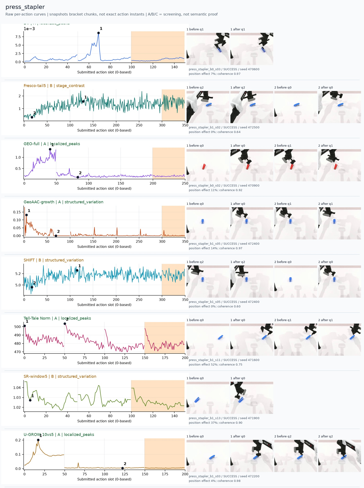
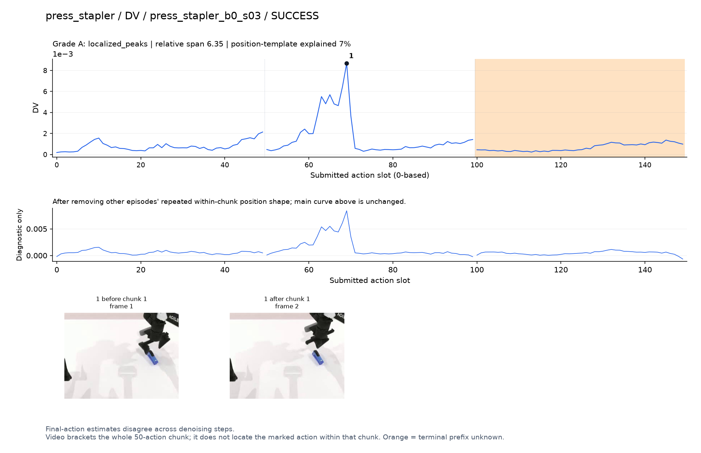
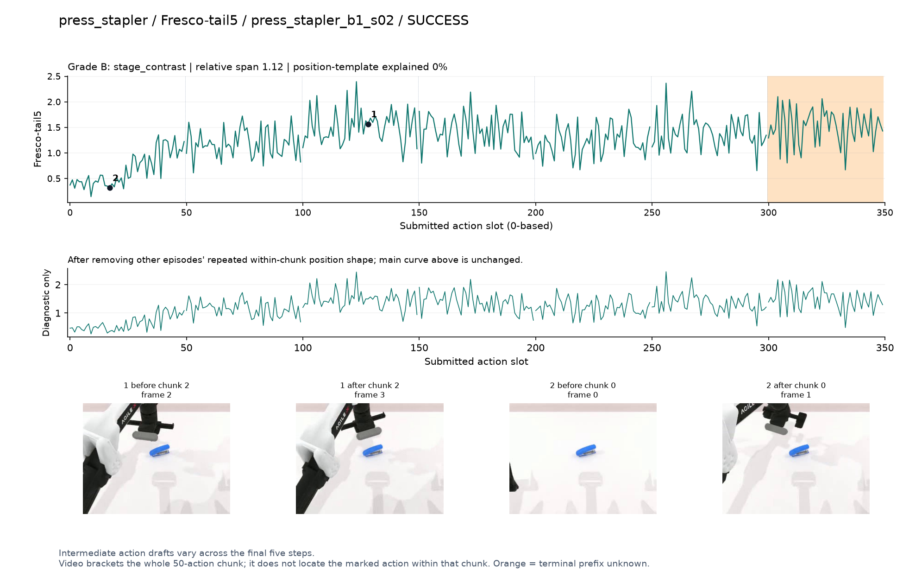
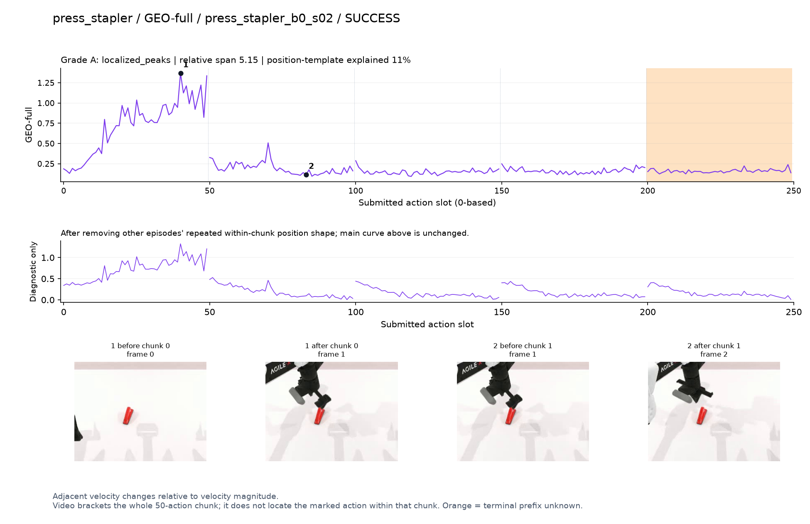
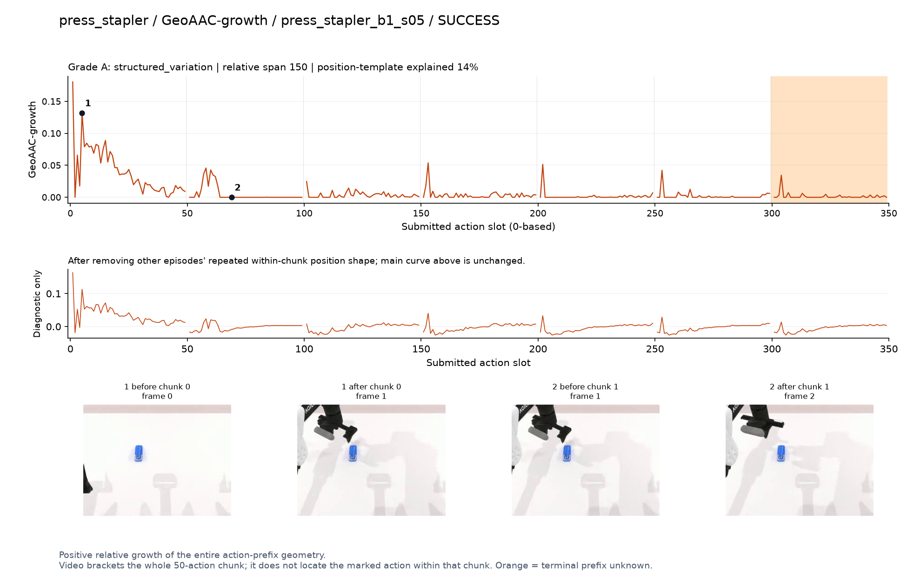
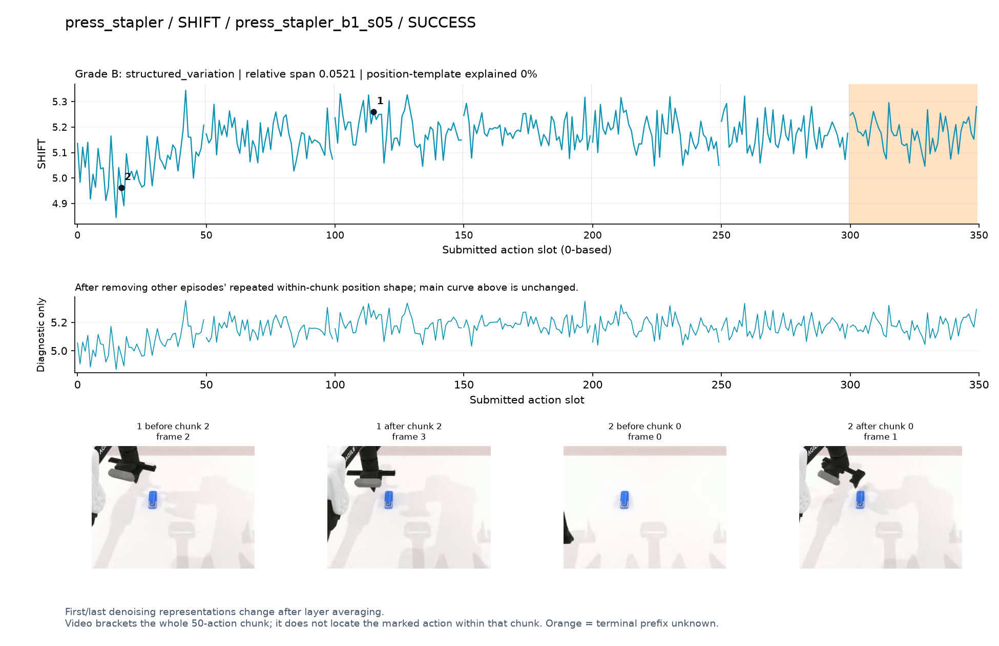
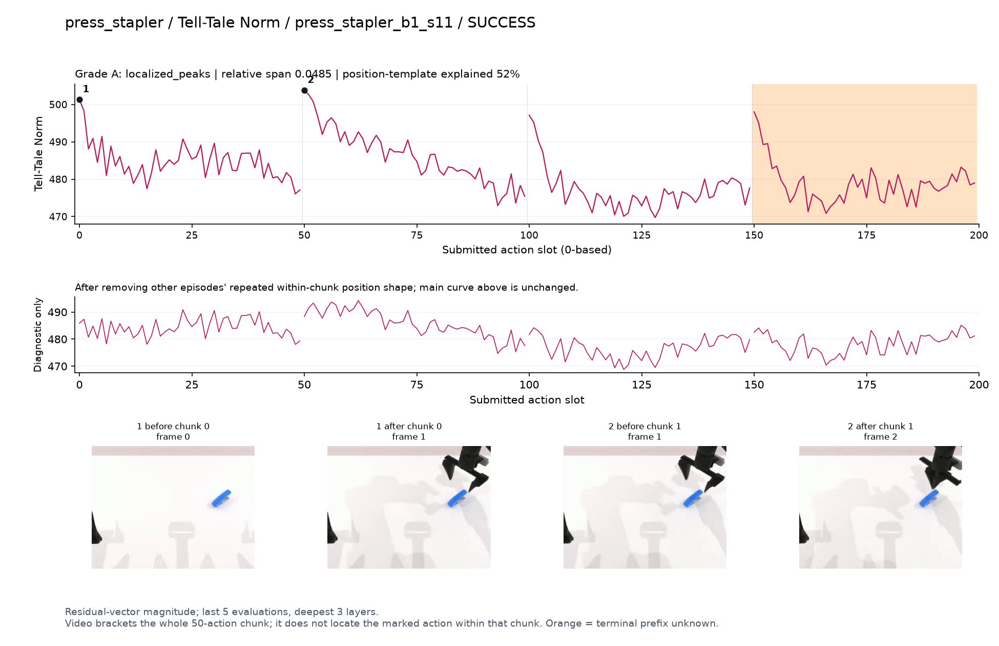
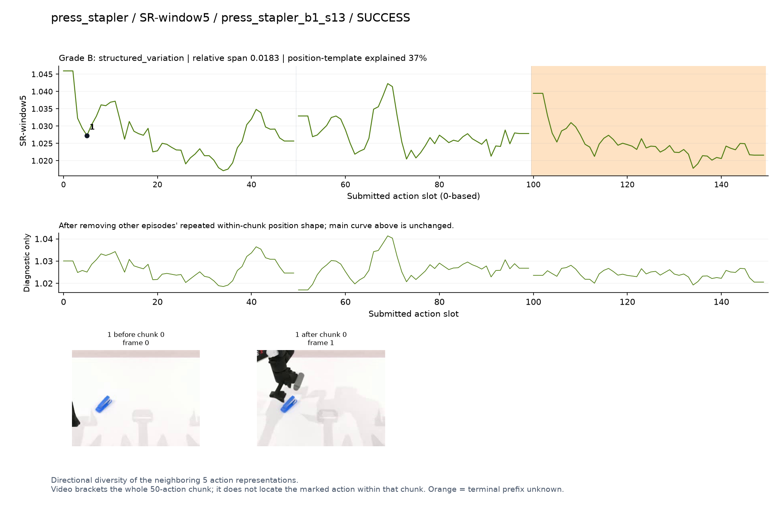
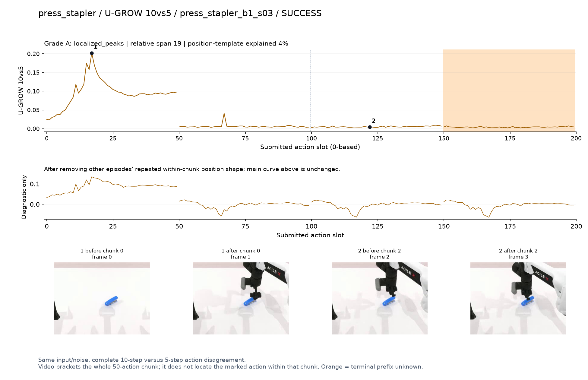

# press_stapler

[全部任务](../README.md#全部任务) · [按信号看](../README.md#按信号看)

主图保留逐动作原始值；细虚线为chunk边界，橙色为终止段实际执行长度不明，未用于筛选。帧只对应chunk前后，不能精确定位某个h的接触瞬间。A/B/C是形态筛选等级，优先读人工备注。

## DV

**可解释候选**：候选：q1手在订书机上方对准/下压附近局部峰；按下瞬间不可辨。

轨迹 `press_stapler_b0_s03`；成功；种子 `470600`；正式验收。

[PNG原图](../figures/press_stapler/dv.png) · [SVG矢量图](../figures/press_stapler/dv.svg) · [完整元数据](../entries/press_stapler/dv.json)

对应帧：[1 before q1](../frames/press_stapler/press_stapler_b0_s03/f001.jpg) · [1 after q1](../frames/press_stapler/press_stapler_b0_s03/f002.jpg)

## Fresco-tail5

**较弱**：弱：逐动作抖动较密，未见可靠独立事件对应；全数据与噪声到最终动作距离高度相关。

轨迹 `press_stapler_b1_s02`；成功；种子 `472500`；正式验收。

[PNG原图](../figures/press_stapler/fresco.png) · [SVG矢量图](../figures/press_stapler/fresco.svg) · [完整元数据](../entries/press_stapler/fresco.json)

对应帧：[1 before q2](../frames/press_stapler/press_stapler_b1_s02/f002.jpg) · [1 after q2](../frames/press_stapler/press_stapler_b1_s02/f003.jpg) · [2 before q0](../frames/press_stapler/press_stapler_b1_s02/f000.jpg) · [2 after q0](../frames/press_stapler/press_stapler_b1_s02/f001.jpg)

## GEO-full

**可解释候选**：候选：q0手接近订书机时持续高区，后续低。

轨迹 `press_stapler_b0_s02`；成功；种子 `470900`；正式验收。

[PNG原图](../figures/press_stapler/geo.png) · [SVG矢量图](../figures/press_stapler/geo.svg) · [完整元数据](../entries/press_stapler/geo.json)

对应帧：[1 before q0](../frames/press_stapler/press_stapler_b0_s02/f000.jpg) · [1 after q0](../frames/press_stapler/press_stapler_b0_s02/f001.jpg) · [2 before q1](../frames/press_stapler/press_stapler_b0_s02/f001.jpg) · [2 after q1](../frames/press_stapler/press_stapler_b0_s02/f002.jpg)

## GeoAAC-growth

**较弱**：弱：初始前缀为最高，后面每chunk开始仍有窄峰。

轨迹 `press_stapler_b1_s05`；成功；种子 `472400`；正式验收。

[PNG原图](../figures/press_stapler/geoaac.png) · [SVG矢量图](../figures/press_stapler/geoaac.svg) · [完整元数据](../entries/press_stapler/geoaac.json)

对应帧：[1 before q0](../frames/press_stapler/press_stapler_b1_s05/f000.jpg) · [1 after q0](../frames/press_stapler/press_stapler_b1_s05/f001.jpg) · [2 before q1](../frames/press_stapler/press_stapler_b1_s05/f001.jpg) · [2 after q1](../frames/press_stapler/press_stapler_b1_s05/f002.jpg)

## SHIFT

**较弱**：弱：小幅抖动/阶段基线变化，未见可靠独立事件对应；路径长度混杂强。

轨迹 `press_stapler_b1_s05`；成功；种子 `472400`；正式验收。

[PNG原图](../figures/press_stapler/shift.png) · [SVG矢量图](../figures/press_stapler/shift.svg) · [完整元数据](../entries/press_stapler/shift.json)

对应帧：[1 before q2](../frames/press_stapler/press_stapler_b1_s05/f002.jpg) · [1 after q2](../frames/press_stapler/press_stapler_b1_s05/f003.jpg) · [2 before q0](../frames/press_stapler/press_stapler_b1_s05/f000.jpg) · [2 after q0](../frames/press_stapler/press_stapler_b1_s05/f001.jpg)

## Tell-Tale Norm

**较弱**：弱：chunk起点反复高值。

轨迹 `press_stapler_b1_s11`；成功；种子 `471600`；正式验收。

[PNG原图](../figures/press_stapler/norm.png) · [SVG矢量图](../figures/press_stapler/norm.svg) · [完整元数据](../entries/press_stapler/norm.json)

对应帧：[1 before q0](../frames/press_stapler/press_stapler_b1_s11/f000.jpg) · [1 after q0](../frames/press_stapler/press_stapler_b1_s11/f001.jpg) · [2 before q1](../frames/press_stapler/press_stapler_b1_s11/f001.jpg) · [2 after q1](../frames/press_stapler/press_stapler_b1_s11/f002.jpg)

## SR-window5

**较弱**：弱：小幅多波动，缺少清楚事件对应。

轨迹 `press_stapler_b1_s13`；成功；种子 `471900`；正式验收。

[PNG原图](../figures/press_stapler/sr.png) · [SVG矢量图](../figures/press_stapler/sr.svg) · [完整元数据](../entries/press_stapler/sr.json)

对应帧：[1 before q0](../frames/press_stapler/press_stapler_b1_s13/f000.jpg) · [1 after q0](../frames/press_stapler/press_stapler_b1_s13/f001.jpg)

## U-GROW 10vs5

**可解释候选**：候选：q0接近订书机时强宽峰，后续大部分低。

轨迹 `press_stapler_b1_s03`；成功；种子 `472200`；正式验收。

[PNG原图](../figures/press_stapler/ugrow.png) · [SVG矢量图](../figures/press_stapler/ugrow.svg) · [完整元数据](../entries/press_stapler/ugrow.json)

对应帧：[1 before q0](../frames/press_stapler/press_stapler_b1_s03/f000.jpg) · [1 after q0](../frames/press_stapler/press_stapler_b1_s03/f001.jpg) · [2 before q2](../frames/press_stapler/press_stapler_b1_s03/f002.jpg) · [2 after q2](../frames/press_stapler/press_stapler_b1_s03/f003.jpg)
