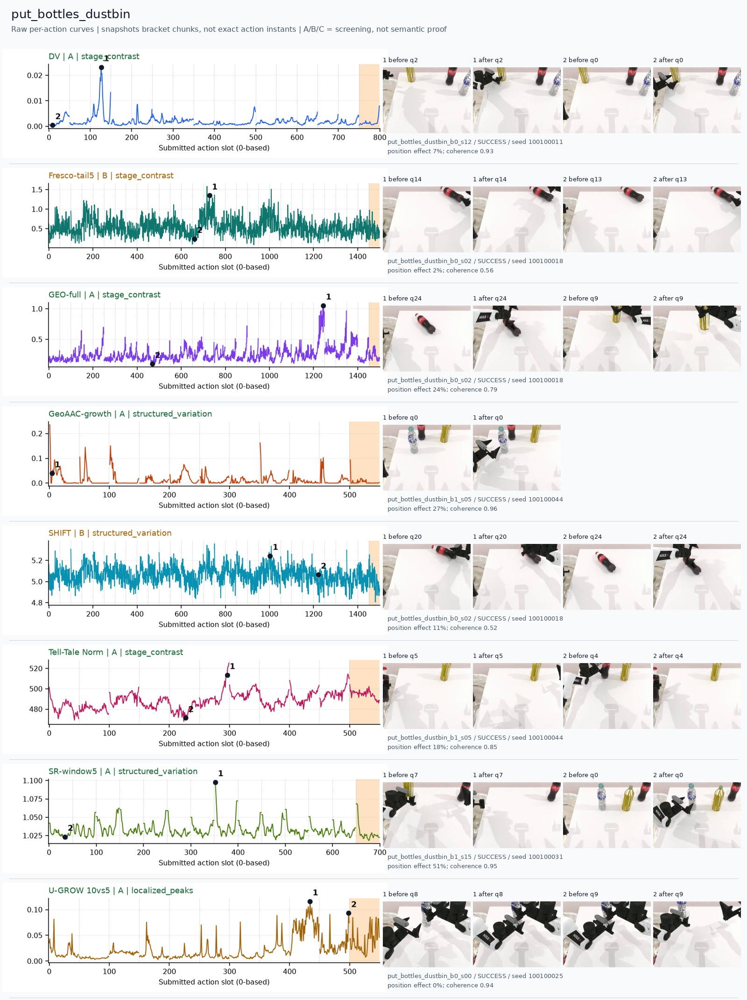
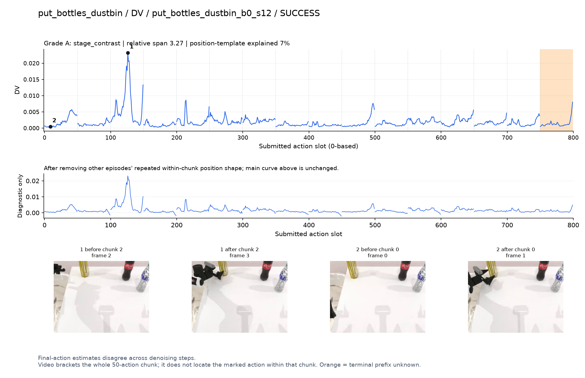
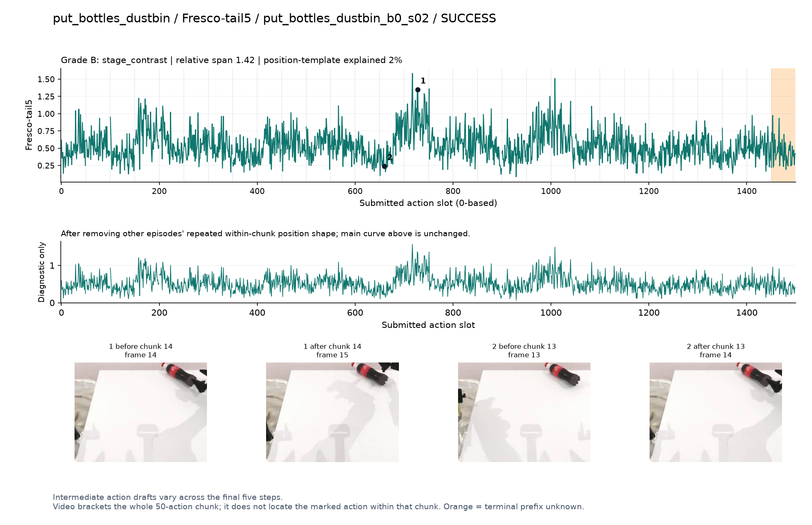
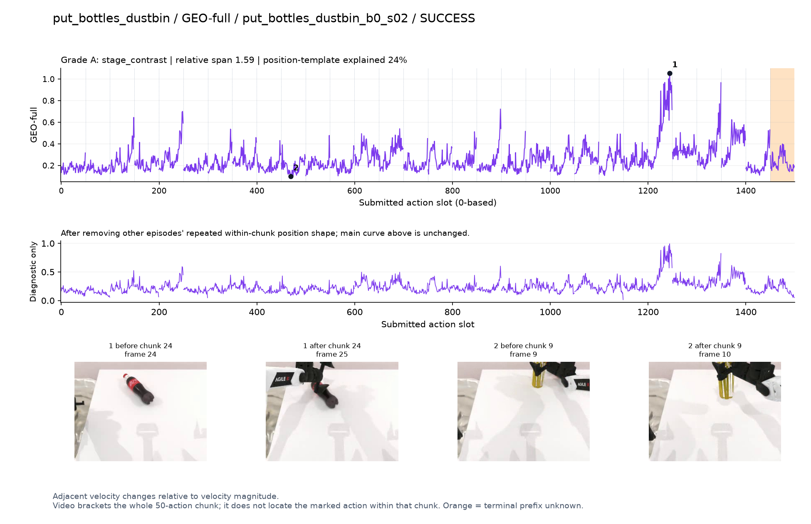
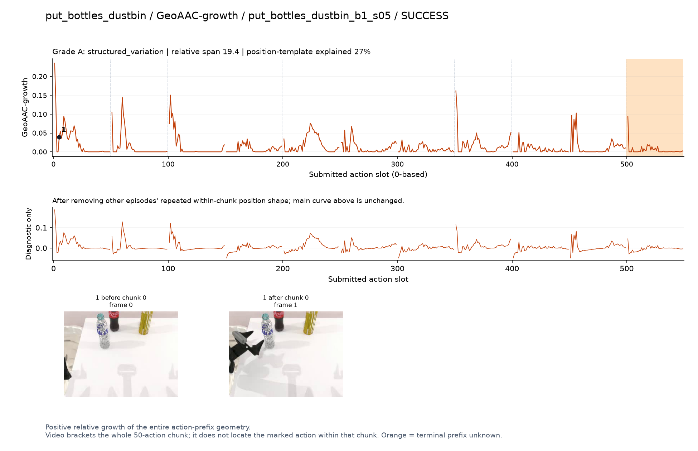
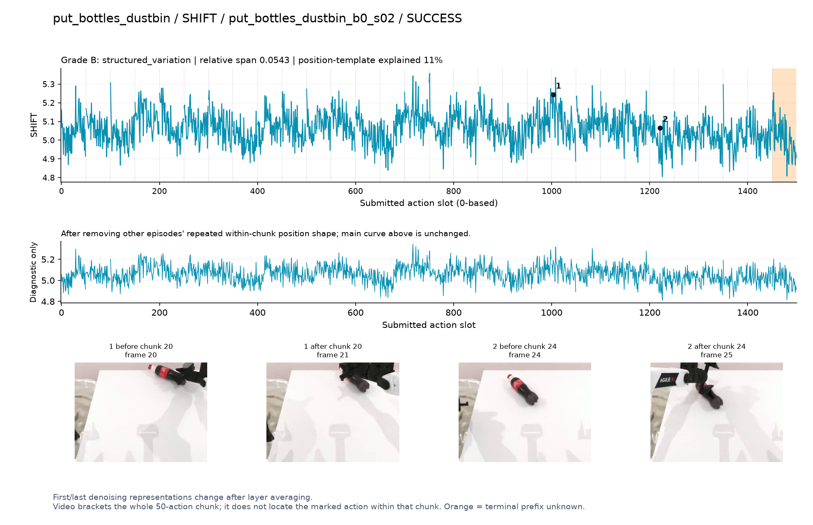
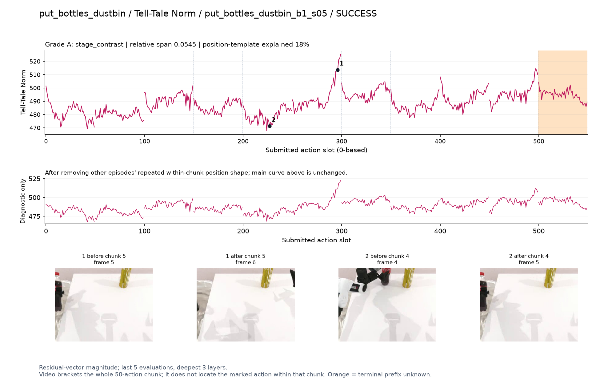
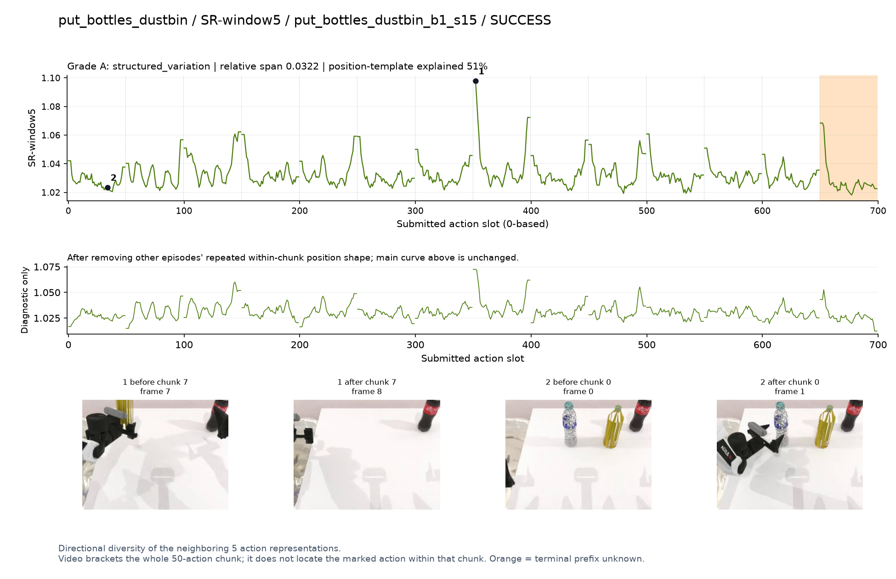
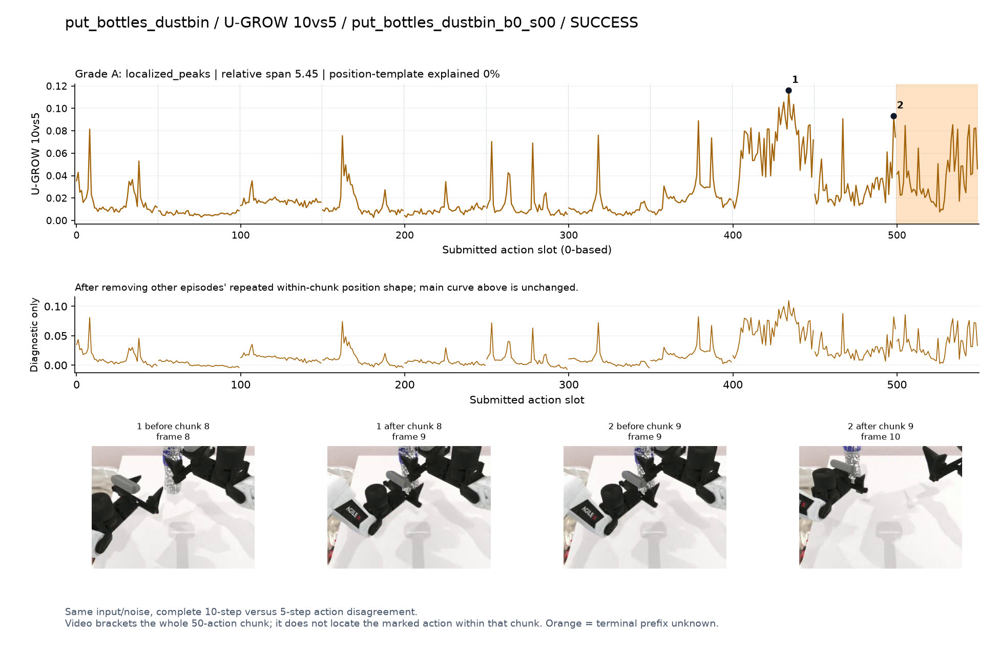

# put_bottles_dustbin

[全部任务](../README.md#全部任务) · [按信号看](../README.md#按信号看)

主图保留逐动作原始值；细虚线为chunk边界，橙色为终止段实际执行长度不明，未用于筛选。帧只对应chunk前后，不能精确定位某个h的接触瞬间。A/B/C是形态筛选等级，优先读人工备注。

## DV

**受其他因素影响**：谨慎：q2有强峰，但夹爪/桶位于画面边缘，无法确认入桶动作。

轨迹 `put_bottles_dustbin_b0_s12`；成功；种子 `100100011`；正式验收。

[PNG原图](../figures/put_bottles_dustbin/dv.png) · [SVG矢量图](../figures/put_bottles_dustbin/dv.svg) · [完整元数据](../entries/put_bottles_dustbin/dv.json)

对应帧：[1 before q2](../frames/put_bottles_dustbin/put_bottles_dustbin_b0_s12/f002.jpg) · [1 after q2](../frames/put_bottles_dustbin/put_bottles_dustbin_b0_s12/f003.jpg) · [2 before q0](../frames/put_bottles_dustbin/put_bottles_dustbin_b0_s12/f000.jpg) · [2 after q0](../frames/put_bottles_dustbin/put_bottles_dustbin_b0_s12/f001.jpg)

## Fresco-tail5

**较弱**：弱：逐动作抖动较密，未见可靠独立事件对应；全数据与噪声到最终动作距离高度相关。

轨迹 `put_bottles_dustbin_b0_s02`；成功；种子 `100100018`；正式验收。

[PNG原图](../figures/put_bottles_dustbin/fresco.png) · [SVG矢量图](../figures/put_bottles_dustbin/fresco.svg) · [完整元数据](../entries/put_bottles_dustbin/fresco.json)

对应帧：[1 before q14](../frames/put_bottles_dustbin/put_bottles_dustbin_b0_s02/f014.jpg) · [1 after q14](../frames/put_bottles_dustbin/put_bottles_dustbin_b0_s02/f015.jpg) · [2 before q13](../frames/put_bottles_dustbin/put_bottles_dustbin_b0_s02/f013.jpg) · [2 after q13](../frames/put_bottles_dustbin/put_bottles_dustbin_b0_s02/f014.jpg)

## GEO-full

**可解释候选**：候选：q24手重新接近倒下的瓶子时高区，长轨迹仍有多峰。

轨迹 `put_bottles_dustbin_b0_s02`；成功；种子 `100100018`；正式验收。

[PNG原图](../figures/put_bottles_dustbin/geo.png) · [SVG矢量图](../figures/put_bottles_dustbin/geo.svg) · [完整元数据](../entries/put_bottles_dustbin/geo.json)

对应帧：[1 before q24](../frames/put_bottles_dustbin/put_bottles_dustbin_b0_s02/f024.jpg) · [1 after q24](../frames/put_bottles_dustbin/put_bottles_dustbin_b0_s02/f025.jpg) · [2 before q9](../frames/put_bottles_dustbin/put_bottles_dustbin_b0_s02/f009.jpg) · [2 after q9](../frames/put_bottles_dustbin/put_bottles_dustbin_b0_s02/f010.jpg)

## GeoAAC-growth

**较弱**：弱：初始前缀及其他chunk重复尖峰，事件特异性弱。

轨迹 `put_bottles_dustbin_b1_s05`；成功；种子 `100100044`；正式验收。

[PNG原图](../figures/put_bottles_dustbin/geoaac.png) · [SVG矢量图](../figures/put_bottles_dustbin/geoaac.svg) · [完整元数据](../entries/put_bottles_dustbin/geoaac.json)

对应帧：[1 before q0](../frames/put_bottles_dustbin/put_bottles_dustbin_b1_s05/f000.jpg) · [1 after q0](../frames/put_bottles_dustbin/put_bottles_dustbin_b1_s05/f001.jpg)

## SHIFT

**较弱**：弱：小幅抖动/阶段基线变化，未见可靠独立事件对应；路径长度混杂强。

轨迹 `put_bottles_dustbin_b0_s02`；成功；种子 `100100018`；正式验收。

[PNG原图](../figures/put_bottles_dustbin/shift.png) · [SVG矢量图](../figures/put_bottles_dustbin/shift.svg) · [完整元数据](../entries/put_bottles_dustbin/shift.json)

对应帧：[1 before q20](../frames/put_bottles_dustbin/put_bottles_dustbin_b0_s02/f020.jpg) · [1 after q20](../frames/put_bottles_dustbin/put_bottles_dustbin_b0_s02/f021.jpg) · [2 before q24](../frames/put_bottles_dustbin/put_bottles_dustbin_b0_s02/f024.jpg) · [2 after q24](../frames/put_bottles_dustbin/put_bottles_dustbin_b0_s02/f025.jpg)

## Tell-Tale Norm

**受其他因素影响**：谨慎：q5高峰画面主要在边缘，语义证据不够。

轨迹 `put_bottles_dustbin_b1_s05`；成功；种子 `100100044`；正式验收。

[PNG原图](../figures/put_bottles_dustbin/norm.png) · [SVG矢量图](../figures/put_bottles_dustbin/norm.svg) · [完整元数据](../entries/put_bottles_dustbin/norm.json)

对应帧：[1 before q5](../frames/put_bottles_dustbin/put_bottles_dustbin_b1_s05/f005.jpg) · [1 after q5](../frames/put_bottles_dustbin/put_bottles_dustbin_b1_s05/f006.jpg) · [2 before q4](../frames/put_bottles_dustbin/put_bottles_dustbin_b1_s05/f004.jpg) · [2 after q4](../frames/put_bottles_dustbin/put_bottles_dustbin_b1_s05/f005.jpg)

## SR-window5

**较弱**：弱：边界高峰反复出现。

轨迹 `put_bottles_dustbin_b1_s15`；成功；种子 `100100031`；正式验收。

[PNG原图](../figures/put_bottles_dustbin/sr.png) · [SVG矢量图](../figures/put_bottles_dustbin/sr.svg) · [完整元数据](../entries/put_bottles_dustbin/sr.json)

对应帧：[1 before q7](../frames/put_bottles_dustbin/put_bottles_dustbin_b1_s15/f007.jpg) · [1 after q7](../frames/put_bottles_dustbin/put_bottles_dustbin_b1_s15/f008.jpg) · [2 before q0](../frames/put_bottles_dustbin/put_bottles_dustbin_b1_s15/f000.jpg) · [2 after q0](../frames/put_bottles_dustbin/put_bottles_dustbin_b1_s15/f001.jpg)

## U-GROW 10vs5

**可解释候选**：阶段候选：q8/q9持瓶操作时高，但入桶目标出画，不标成入桶瞬间。

轨迹 `put_bottles_dustbin_b0_s00`；成功；种子 `100100025`；正式验收。

[PNG原图](../figures/put_bottles_dustbin/ugrow.png) · [SVG矢量图](../figures/put_bottles_dustbin/ugrow.svg) · [完整元数据](../entries/put_bottles_dustbin/ugrow.json)

对应帧：[1 before q8](../frames/put_bottles_dustbin/put_bottles_dustbin_b0_s00/f008.jpg) · [1 after q8](../frames/put_bottles_dustbin/put_bottles_dustbin_b0_s00/f009.jpg) · [2 before q9](../frames/put_bottles_dustbin/put_bottles_dustbin_b0_s00/f009.jpg) · [2 after q9](../frames/put_bottles_dustbin/put_bottles_dustbin_b0_s00/f010.jpg)
