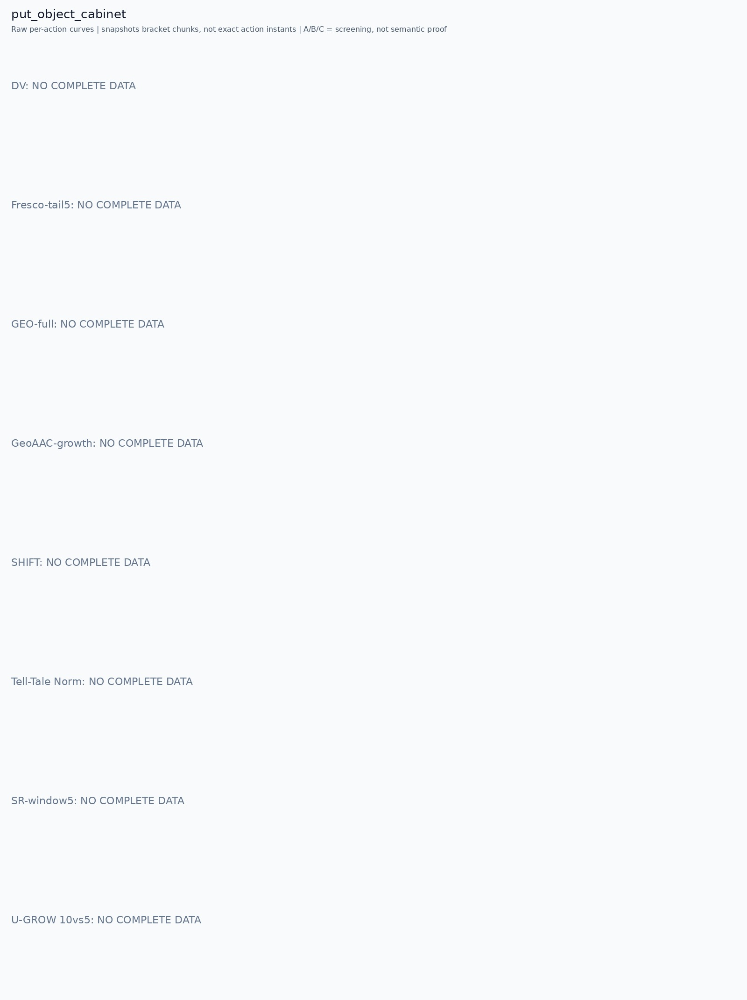

# put_object_cabinet

[全部任务](../README.md#全部任务) · [按信号看](../README.md#按信号看)

主图保留逐动作原始值；细虚线为chunk边界，橙色为终止段实际执行长度不明，未用于筛选。帧只对应chunk前后，不能精确定位某个h的接触瞬间。A/B/C是形态筛选等级，优先读人工备注。

## DV

**缺数据**：该任务未取得完整可复算批次。

## Fresco-tail5

**缺数据**：该任务未取得完整可复算批次。

## GEO-full

**缺数据**：该任务未取得完整可复算批次。

## GeoAAC-growth

**缺数据**：该任务未取得完整可复算批次。

## SHIFT

**缺数据**：该任务未取得完整可复算批次。

## Tell-Tale Norm

**缺数据**：该任务未取得完整可复算批次。

## SR-window5

**缺数据**：该任务未取得完整可复算批次。

## U-GROW 10vs5

**缺数据**：该任务未取得完整可复算批次。
