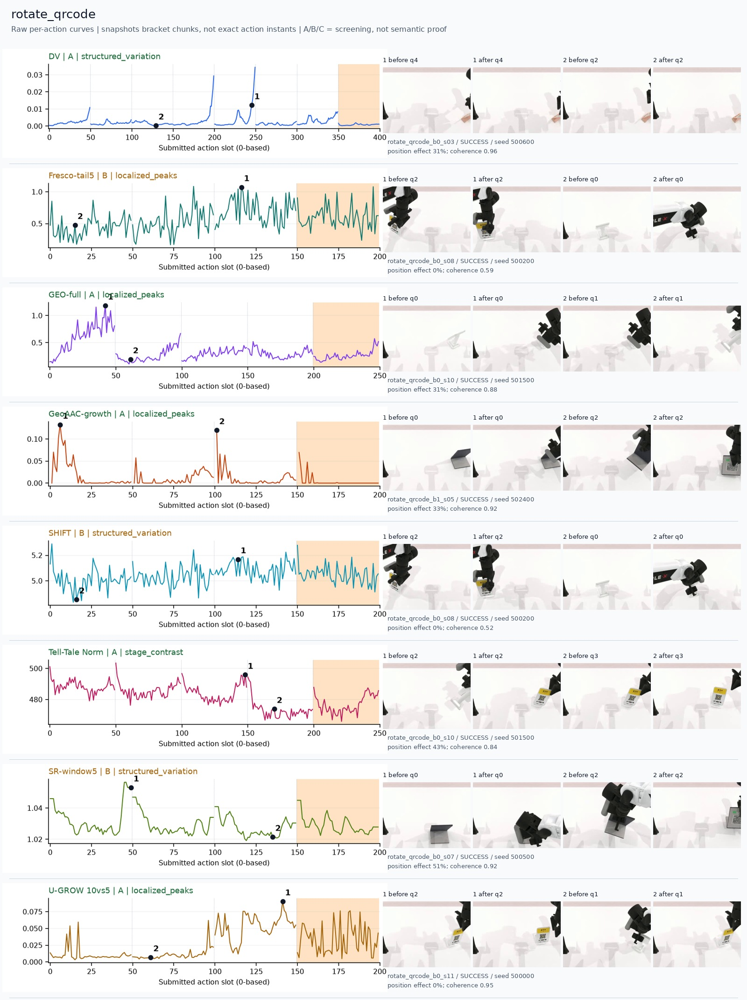
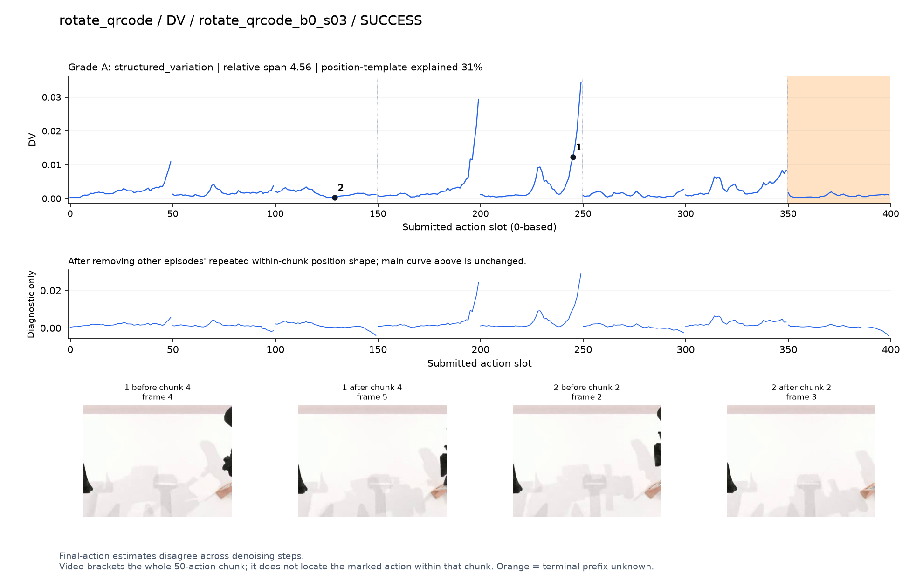
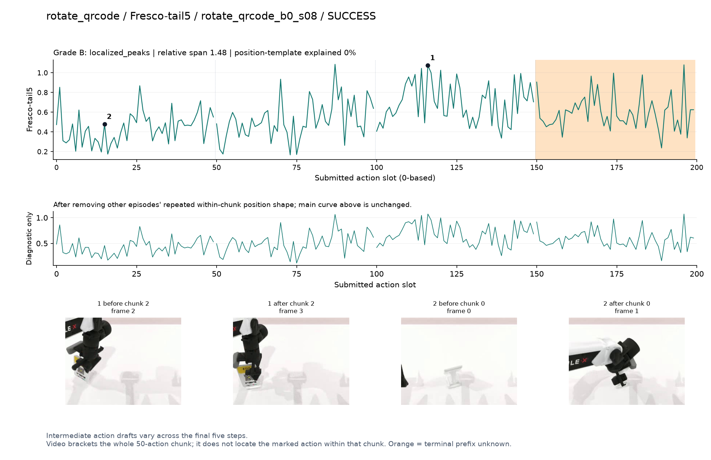
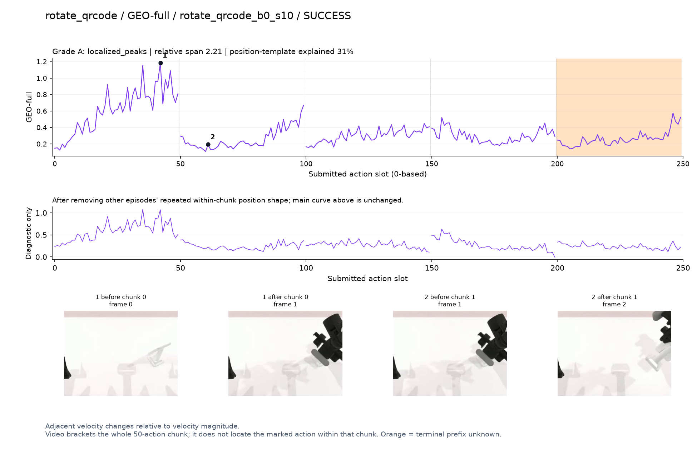
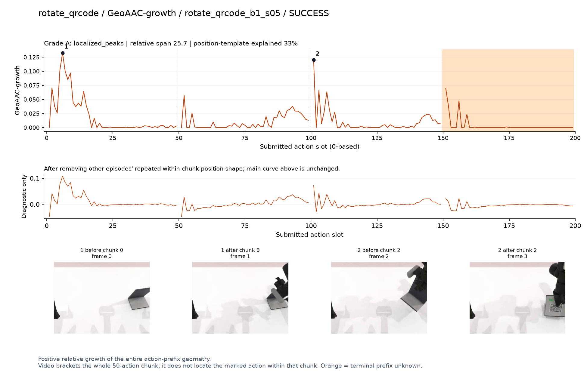
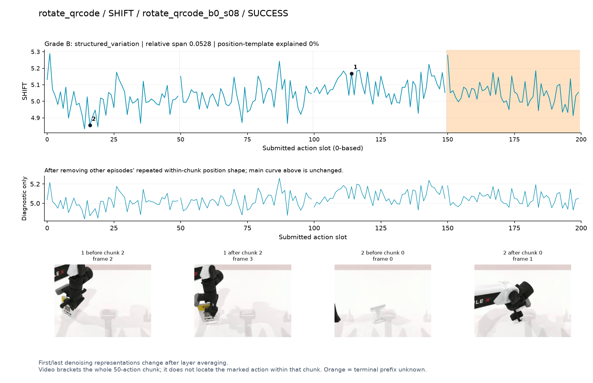
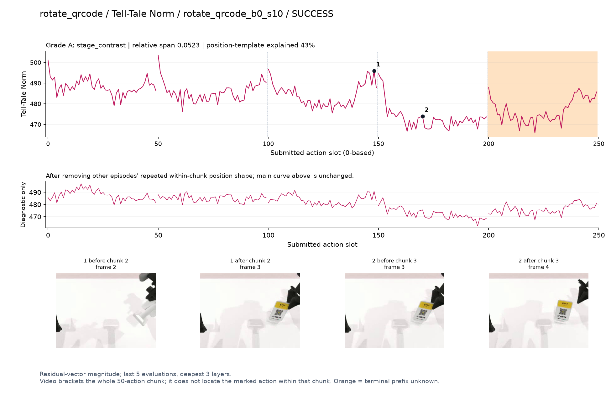
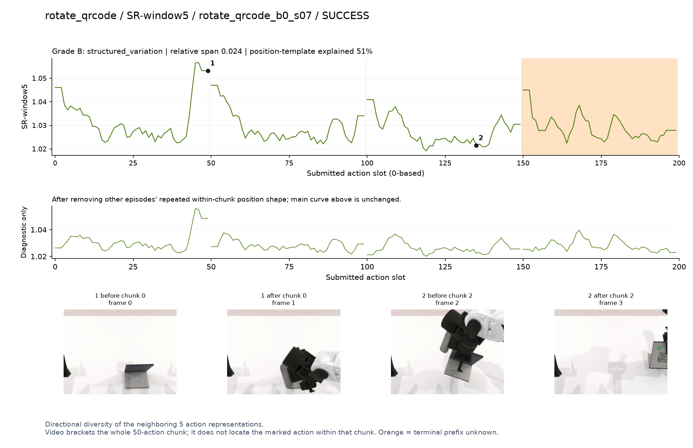
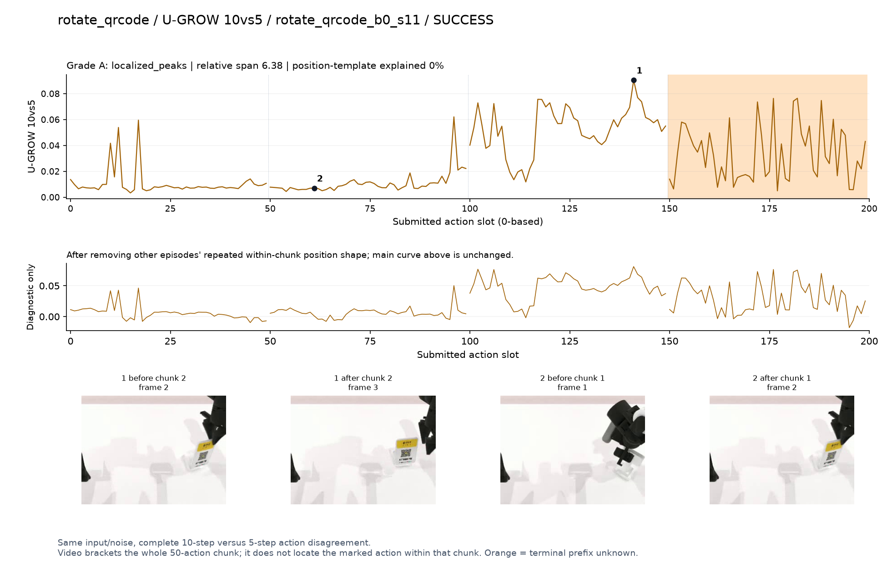

# rotate_qrcode

[全部任务](../README.md#全部任务) · [按信号看](../README.md#按信号看)

主图保留逐动作原始值；细虚线为chunk边界，橙色为终止段实际执行长度不明，未用于筛选。帧只对应chunk前后，不能精确定位某个h的接触瞬间。A/B/C是形态筛选等级，优先读人工备注。

## DV

**较弱**：形态清楚但语义弱：标记片段手和二维码牌大部分出画。

轨迹 `rotate_qrcode_b0_s03`；成功；种子 `500600`；正式验收。

[PNG原图](../figures/rotate_qrcode/dv.png) · [SVG矢量图](../figures/rotate_qrcode/dv.svg) · [完整元数据](../entries/rotate_qrcode/dv.json)

对应帧：[1 before q4](../frames/rotate_qrcode/rotate_qrcode_b0_s03/f004.jpg) · [1 after q4](../frames/rotate_qrcode/rotate_qrcode_b0_s03/f005.jpg) · [2 before q2](../frames/rotate_qrcode/rotate_qrcode_b0_s03/f002.jpg) · [2 after q2](../frames/rotate_qrcode/rotate_qrcode_b0_s03/f003.jpg)

## Fresco-tail5

**较弱**：弱：逐动作抖动较密，未见可靠独立事件对应；全数据与噪声到最终动作距离高度相关。

轨迹 `rotate_qrcode_b0_s08`；成功；种子 `500200`；正式验收。

[PNG原图](../figures/rotate_qrcode/fresco.png) · [SVG矢量图](../figures/rotate_qrcode/fresco.svg) · [完整元数据](../entries/rotate_qrcode/fresco.json)

对应帧：[1 before q2](../frames/rotate_qrcode/rotate_qrcode_b0_s08/f002.jpg) · [1 after q2](../frames/rotate_qrcode/rotate_qrcode_b0_s08/f003.jpg) · [2 before q0](../frames/rotate_qrcode/rotate_qrcode_b0_s08/f000.jpg) · [2 after q0](../frames/rotate_qrcode/rotate_qrcode_b0_s08/f001.jpg)

## GEO-full

**可解释候选**：候选：q0夹爪靠近并夹住牌架时高区，物体在画面右缘。

轨迹 `rotate_qrcode_b0_s10`；成功；种子 `501500`；正式验收。

[PNG原图](../figures/rotate_qrcode/geo.png) · [SVG矢量图](../figures/rotate_qrcode/geo.svg) · [完整元数据](../entries/rotate_qrcode/geo.json)

对应帧：[1 before q0](../frames/rotate_qrcode/rotate_qrcode_b0_s10/f000.jpg) · [1 after q0](../frames/rotate_qrcode/rotate_qrcode_b0_s10/f001.jpg) · [2 before q1](../frames/rotate_qrcode/rotate_qrcode_b0_s10/f001.jpg) · [2 after q1](../frames/rotate_qrcode/rotate_qrcode_b0_s10/f002.jpg)

## GeoAAC-growth

**受其他因素影响**：谨慎：q0/q2首部峰，夹起/转动牌架画面可见但前缀混杂。

轨迹 `rotate_qrcode_b1_s05`；成功；种子 `502400`；正式验收。

[PNG原图](../figures/rotate_qrcode/geoaac.png) · [SVG矢量图](../figures/rotate_qrcode/geoaac.svg) · [完整元数据](../entries/rotate_qrcode/geoaac.json)

对应帧：[1 before q0](../frames/rotate_qrcode/rotate_qrcode_b1_s05/f000.jpg) · [1 after q0](../frames/rotate_qrcode/rotate_qrcode_b1_s05/f001.jpg) · [2 before q2](../frames/rotate_qrcode/rotate_qrcode_b1_s05/f002.jpg) · [2 after q2](../frames/rotate_qrcode/rotate_qrcode_b1_s05/f003.jpg)

## SHIFT

**较弱**：弱：小幅抖动/阶段基线变化，未见可靠独立事件对应；路径长度混杂强。

轨迹 `rotate_qrcode_b0_s08`；成功；种子 `500200`；正式验收。

[PNG原图](../figures/rotate_qrcode/shift.png) · [SVG矢量图](../figures/rotate_qrcode/shift.svg) · [完整元数据](../entries/rotate_qrcode/shift.json)

对应帧：[1 before q2](../frames/rotate_qrcode/rotate_qrcode_b0_s08/f002.jpg) · [1 after q2](../frames/rotate_qrcode/rotate_qrcode_b0_s08/f003.jpg) · [2 before q0](../frames/rotate_qrcode/rotate_qrcode_b0_s08/f000.jpg) · [2 after q0](../frames/rotate_qrcode/rotate_qrcode_b0_s08/f001.jpg)

## Tell-Tale Norm

**可解释候选**：阶段候选：q2牌面被转到镜头前时幅度高，q3保持时低。

轨迹 `rotate_qrcode_b0_s10`；成功；种子 `501500`；正式验收。

[PNG原图](../figures/rotate_qrcode/norm.png) · [SVG矢量图](../figures/rotate_qrcode/norm.svg) · [完整元数据](../entries/rotate_qrcode/norm.json)

对应帧：[1 before q2](../frames/rotate_qrcode/rotate_qrcode_b0_s10/f002.jpg) · [1 after q2](../frames/rotate_qrcode/rotate_qrcode_b0_s10/f003.jpg) · [2 before q3](../frames/rotate_qrcode/rotate_qrcode_b0_s10/f003.jpg) · [2 after q3](../frames/rotate_qrcode/rotate_qrcode_b0_s10/f004.jpg)

## SR-window5

**较弱**：弱：每chunk边缘重复高值。

轨迹 `rotate_qrcode_b0_s07`；成功；种子 `500500`；正式验收。

[PNG原图](../figures/rotate_qrcode/sr.png) · [SVG矢量图](../figures/rotate_qrcode/sr.svg) · [完整元数据](../entries/rotate_qrcode/sr.json)

对应帧：[1 before q0](../frames/rotate_qrcode/rotate_qrcode_b0_s07/f000.jpg) · [1 after q0](../frames/rotate_qrcode/rotate_qrcode_b0_s07/f001.jpg) · [2 before q2](../frames/rotate_qrcode/rotate_qrcode_b0_s07/f002.jpg) · [2 after q2](../frames/rotate_qrcode/rotate_qrcode_b0_s07/f003.jpg)

## U-GROW 10vs5

**可解释候选**：候选：q2转动二维码牌到可见方向时持续高区。

轨迹 `rotate_qrcode_b0_s11`；成功；种子 `500000`；正式验收。

[PNG原图](../figures/rotate_qrcode/ugrow.png) · [SVG矢量图](../figures/rotate_qrcode/ugrow.svg) · [完整元数据](../entries/rotate_qrcode/ugrow.json)

对应帧：[1 before q2](../frames/rotate_qrcode/rotate_qrcode_b0_s11/f002.jpg) · [1 after q2](../frames/rotate_qrcode/rotate_qrcode_b0_s11/f003.jpg) · [2 before q1](../frames/rotate_qrcode/rotate_qrcode_b0_s11/f001.jpg) · [2 after q1](../frames/rotate_qrcode/rotate_qrcode_b0_s11/f002.jpg)
