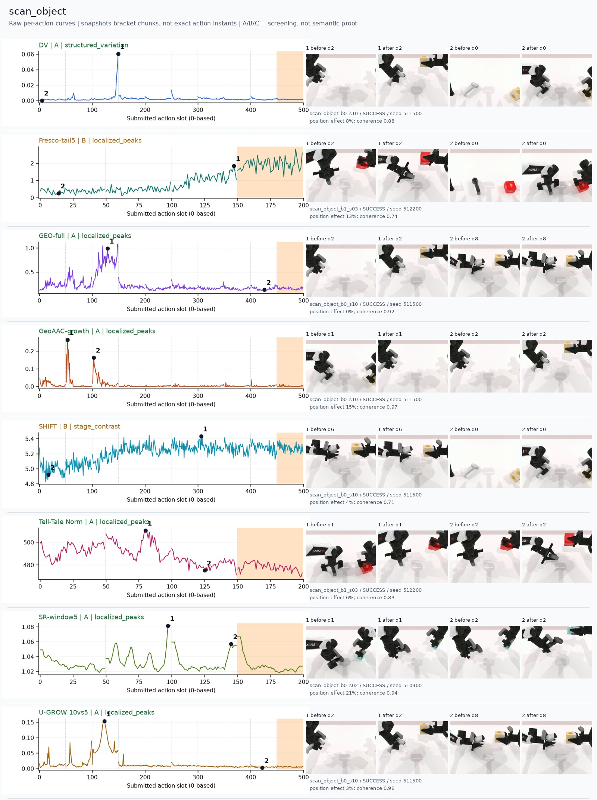
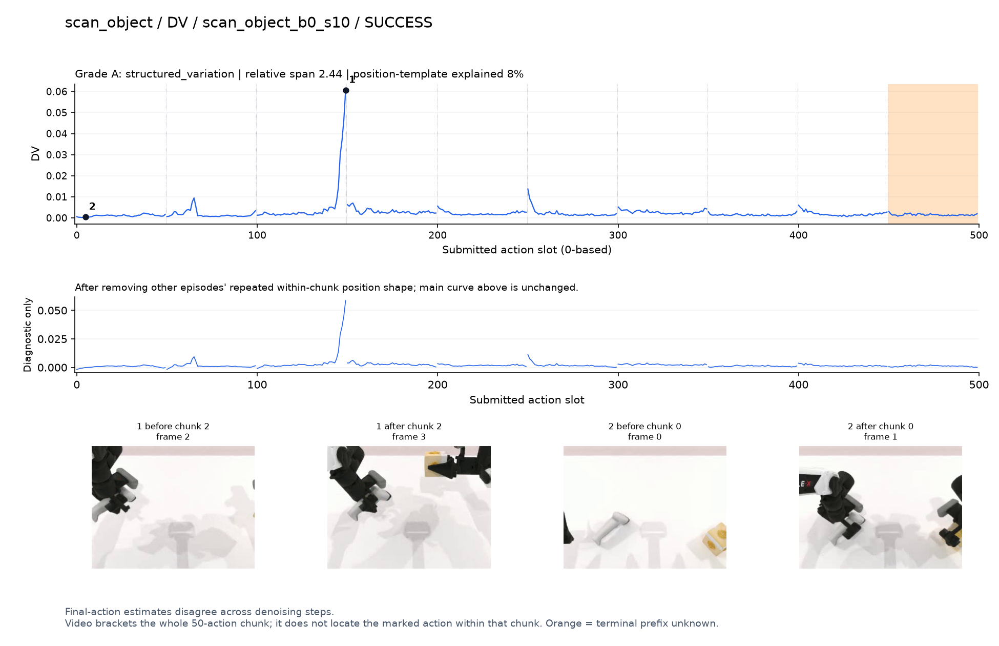
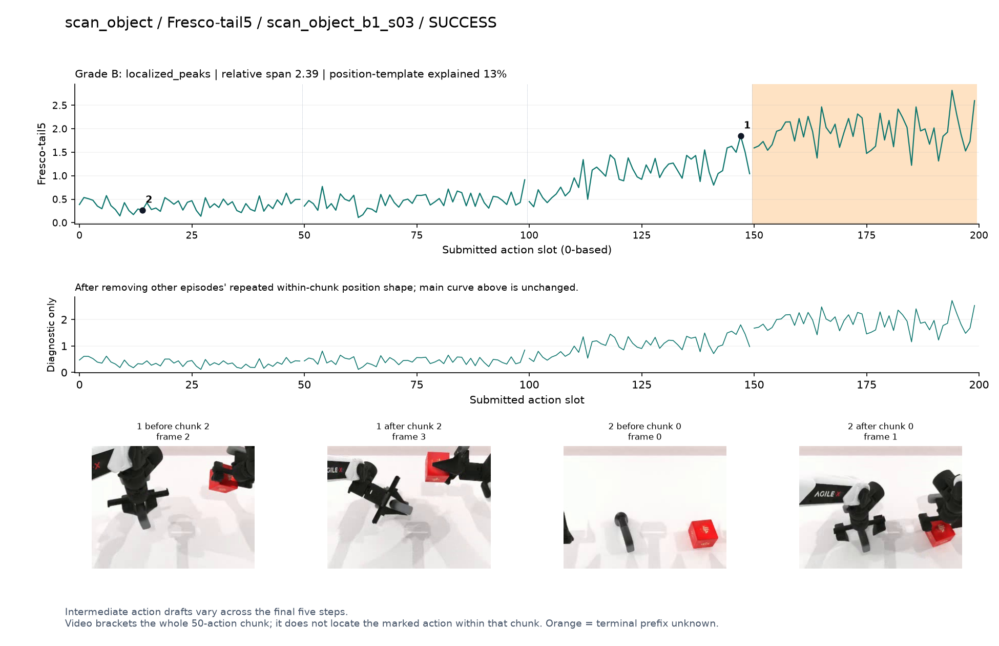
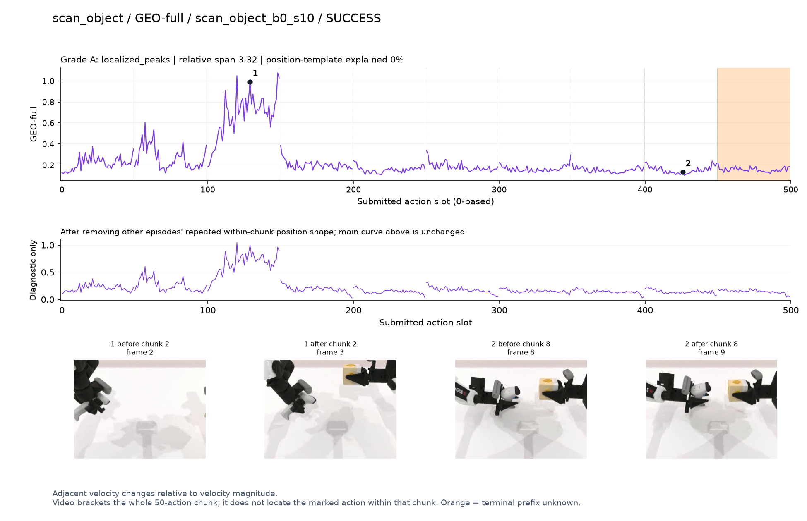
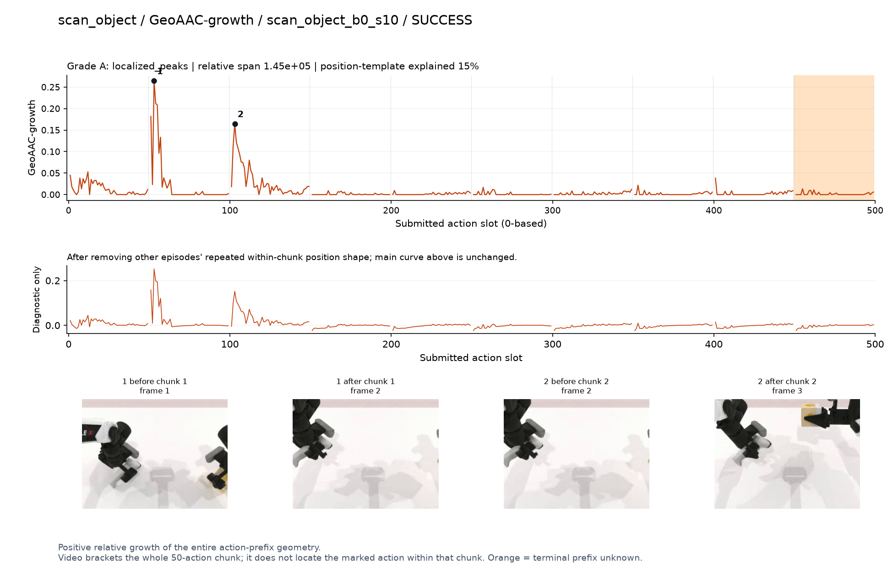
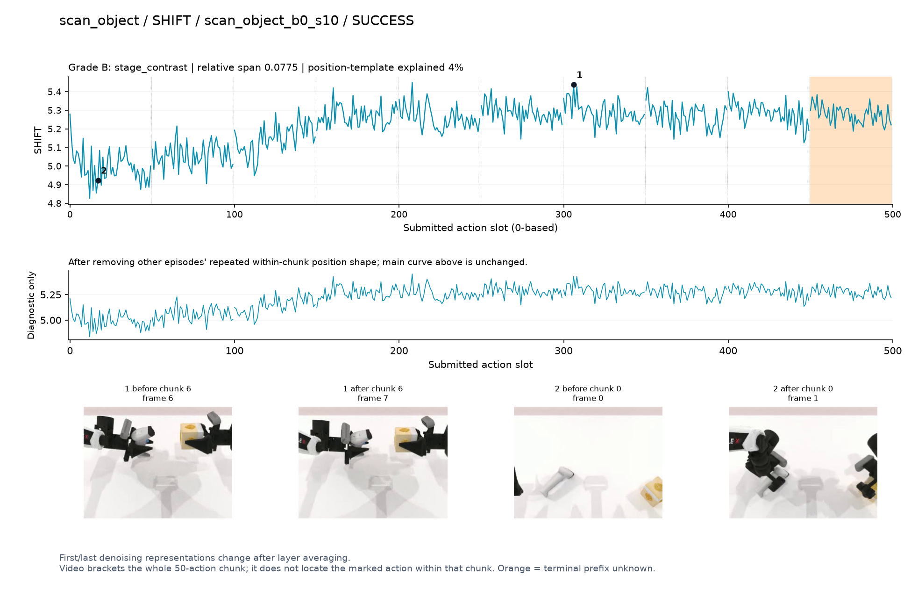
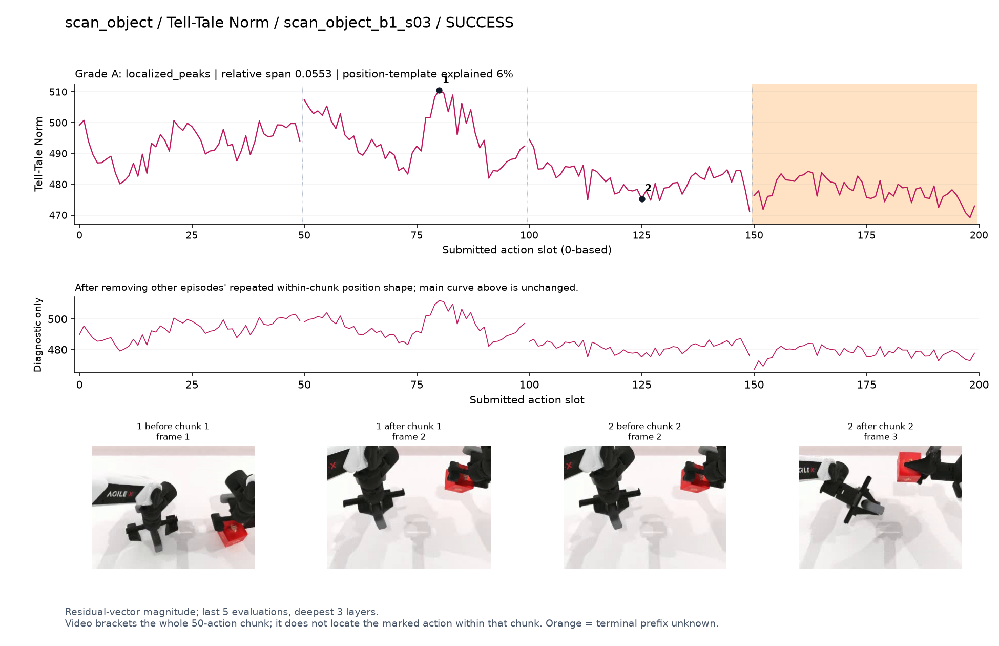
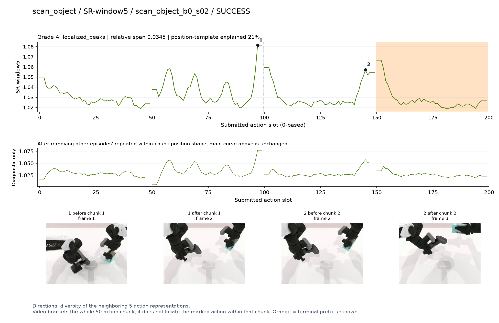
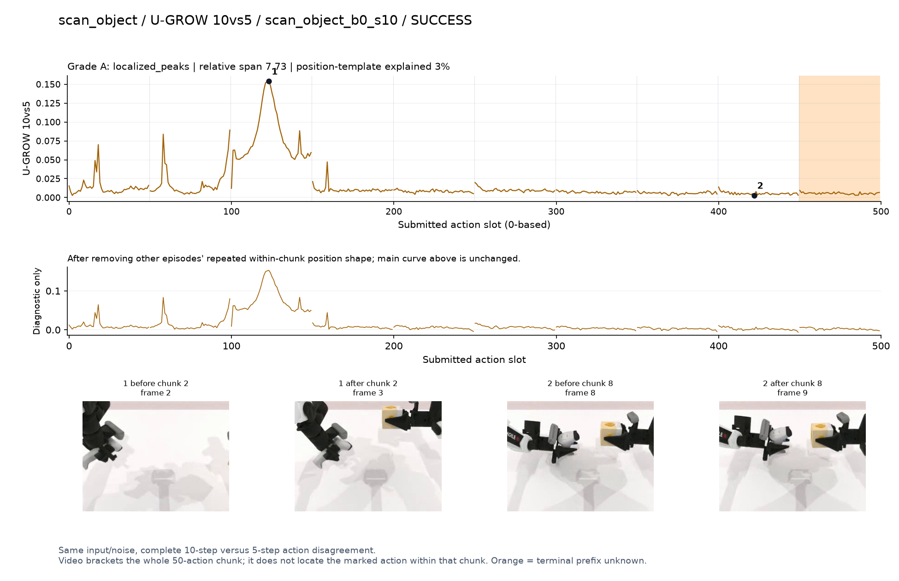

# scan_object

[全部任务](../README.md#全部任务) · [按信号看](../README.md#按信号看)

主图保留逐动作原始值；细虚线为chunk边界，橙色为终止段实际执行长度不明，未用于筛选。帧只对应chunk前后，不能精确定位某个h的接触瞬间。A/B/C是形态筛选等级，优先读人工备注。

## DV

**可解释候选**：候选：q2扫描器在夹爪内转动、另一手持物时末段孤立峰。

轨迹 `scan_object_b0_s10`；成功；种子 `511500`；正式验收。

[PNG原图](../figures/scan_object/dv.png) · [SVG矢量图](../figures/scan_object/dv.svg) · [完整元数据](../entries/scan_object/dv.json)

对应帧：[1 before q2](../frames/scan_object/scan_object_b0_s10/f002.jpg) · [1 after q2](../frames/scan_object/scan_object_b0_s10/f003.jpg) · [2 before q0](../frames/scan_object/scan_object_b0_s10/f000.jpg) · [2 after q0](../frames/scan_object/scan_object_b0_s10/f001.jpg)

## Fresco-tail5

**较弱**：弱阶段趋势：扫描器改变姿态后升高，路径长度混杂。

轨迹 `scan_object_b1_s03`；成功；种子 `512200`；正式验收。

[PNG原图](../figures/scan_object/fresco.png) · [SVG矢量图](../figures/scan_object/fresco.svg) · [完整元数据](../entries/scan_object/fresco.json)

对应帧：[1 before q2](../frames/scan_object/scan_object_b1_s03/f002.jpg) · [1 after q2](../frames/scan_object/scan_object_b1_s03/f003.jpg) · [2 before q0](../frames/scan_object/scan_object_b1_s03/f000.jpg) · [2 after q0](../frames/scan_object/scan_object_b1_s03/f001.jpg)

## GEO-full

**可解释候选**：候选：同轨迹q2扫描器转向物体时宽高区。

轨迹 `scan_object_b0_s10`；成功；种子 `511500`；正式验收。

[PNG原图](../figures/scan_object/geo.png) · [SVG矢量图](../figures/scan_object/geo.svg) · [完整元数据](../entries/scan_object/geo.json)

对应帧：[1 before q2](../frames/scan_object/scan_object_b0_s10/f002.jpg) · [1 after q2](../frames/scan_object/scan_object_b0_s10/f003.jpg) · [2 before q8](../frames/scan_object/scan_object_b0_s10/f008.jpg) · [2 after q8](../frames/scan_object/scan_object_b0_s10/f009.jpg)

## GeoAAC-growth

**受其他因素影响**：谨慎：q1/q2抓取与调整段增长峰位于前缀开头。

轨迹 `scan_object_b0_s10`；成功；种子 `511500`；正式验收。

[PNG原图](../figures/scan_object/geoaac.png) · [SVG矢量图](../figures/scan_object/geoaac.svg) · [完整元数据](../entries/scan_object/geoaac.json)

对应帧：[1 before q1](../frames/scan_object/scan_object_b0_s10/f001.jpg) · [1 after q1](../frames/scan_object/scan_object_b0_s10/f002.jpg) · [2 before q2](../frames/scan_object/scan_object_b0_s10/f002.jpg) · [2 after q2](../frames/scan_object/scan_object_b0_s10/f003.jpg)

## SHIFT

**较弱**：弱阶段趋势：拿起扫描器后基线升高，不能解释为扫描成功。

轨迹 `scan_object_b0_s10`；成功；种子 `511500`；正式验收。

[PNG原图](../figures/scan_object/shift.png) · [SVG矢量图](../figures/scan_object/shift.svg) · [完整元数据](../entries/scan_object/shift.json)

对应帧：[1 before q6](../frames/scan_object/scan_object_b0_s10/f006.jpg) · [1 after q6](../frames/scan_object/scan_object_b0_s10/f007.jpg) · [2 before q0](../frames/scan_object/scan_object_b0_s10/f000.jpg) · [2 after q0](../frames/scan_object/scan_object_b0_s10/f001.jpg)

## Tell-Tale Norm

**可解释候选**：阶段候选：q1持扫描器准备转向时幅度高，q2转向后较低。

轨迹 `scan_object_b1_s03`；成功；种子 `512200`；正式验收。

[PNG原图](../figures/scan_object/norm.png) · [SVG矢量图](../figures/scan_object/norm.svg) · [完整元数据](../entries/scan_object/norm.json)

对应帧：[1 before q1](../frames/scan_object/scan_object_b1_s03/f001.jpg) · [1 after q1](../frames/scan_object/scan_object_b1_s03/f002.jpg) · [2 before q2](../frames/scan_object/scan_object_b1_s03/f002.jpg) · [2 after q2](../frames/scan_object/scan_object_b1_s03/f003.jpg)

## SR-window5

**受其他因素影响**：谨慎：q1/q2交界高峰，边界效应仍需区分。

轨迹 `scan_object_b0_s02`；成功；种子 `510900`；正式验收。

[PNG原图](../figures/scan_object/sr.png) · [SVG矢量图](../figures/scan_object/sr.svg) · [完整元数据](../entries/scan_object/sr.json)

对应帧：[1 before q1](../frames/scan_object/scan_object_b0_s02/f001.jpg) · [1 after q1](../frames/scan_object/scan_object_b0_s02/f002.jpg) · [2 before q2](../frames/scan_object/scan_object_b0_s02/f002.jpg) · [2 after q2](../frames/scan_object/scan_object_b0_s02/f003.jpg)

## U-GROW 10vs5

**可解释候选**：候选：同DV轨迹q2扫描器朝目标转向时峰明显。

轨迹 `scan_object_b0_s10`；成功；种子 `511500`；正式验收。

[PNG原图](../figures/scan_object/ugrow.png) · [SVG矢量图](../figures/scan_object/ugrow.svg) · [完整元数据](../entries/scan_object/ugrow.json)

对应帧：[1 before q2](../frames/scan_object/scan_object_b0_s10/f002.jpg) · [1 after q2](../frames/scan_object/scan_object_b0_s10/f003.jpg) · [2 before q8](../frames/scan_object/scan_object_b0_s10/f008.jpg) · [2 after q8](../frames/scan_object/scan_object_b0_s10/f009.jpg)
