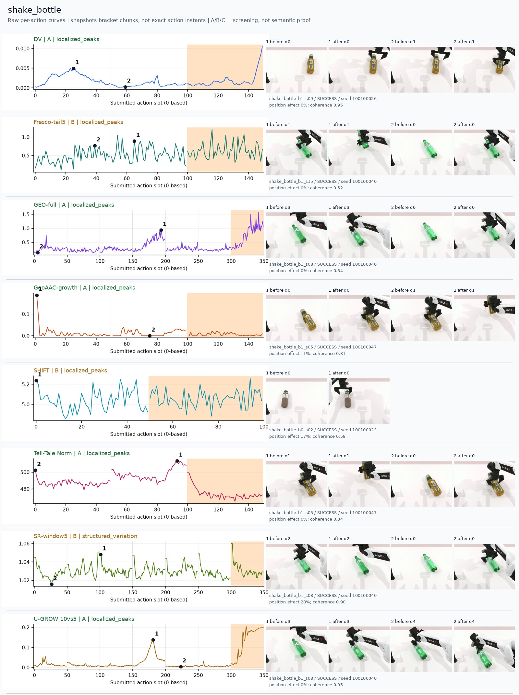
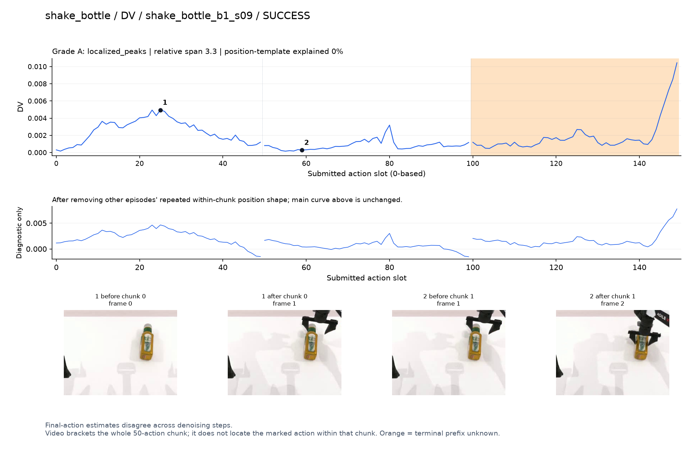
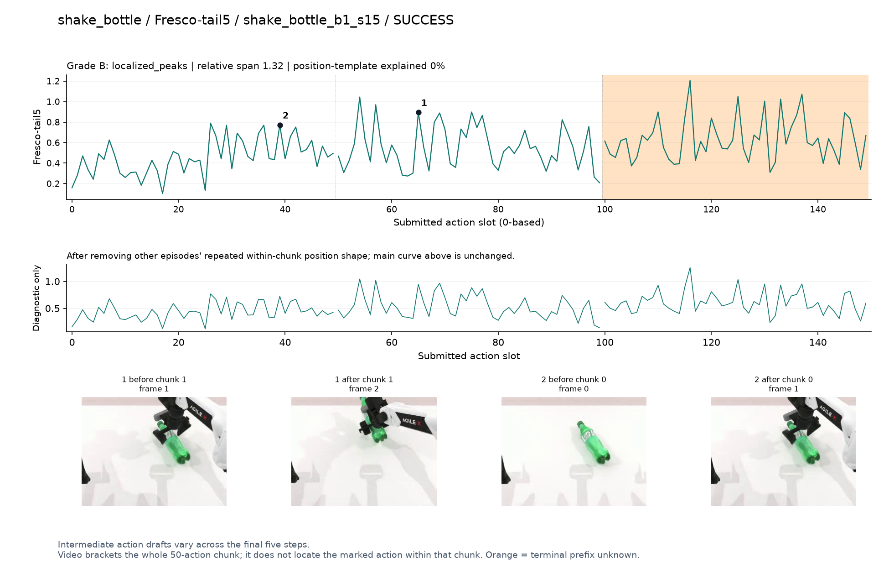
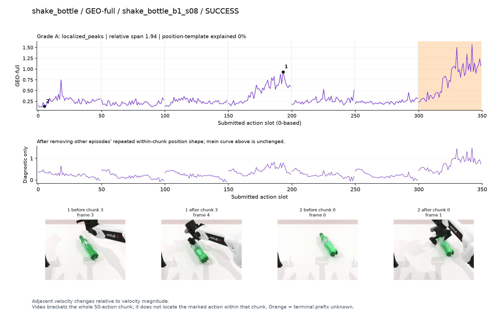
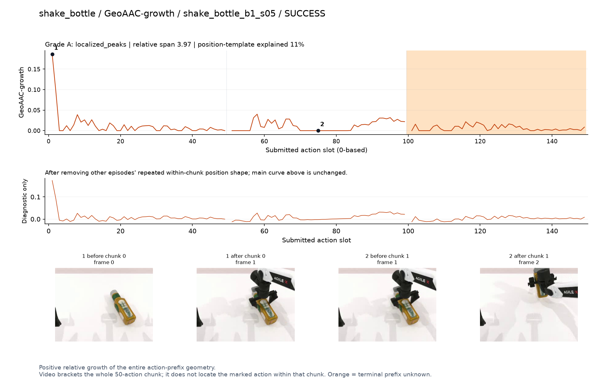
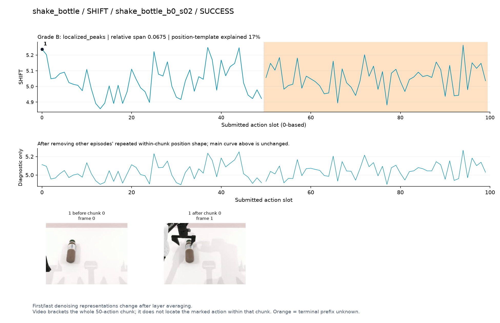
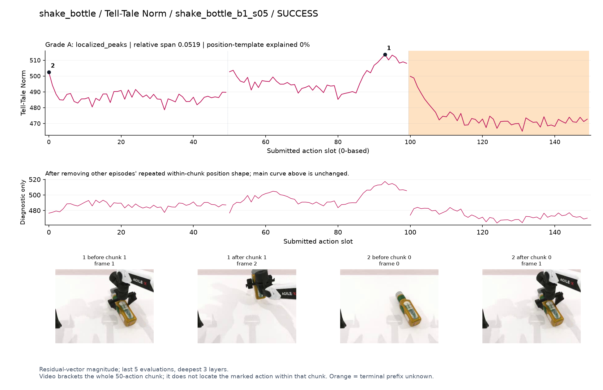
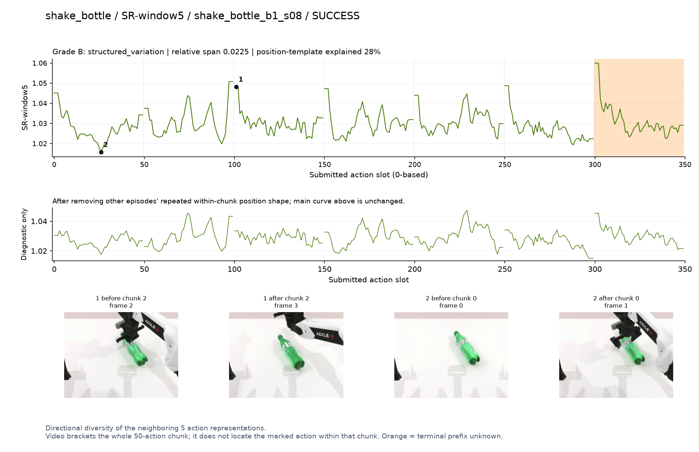
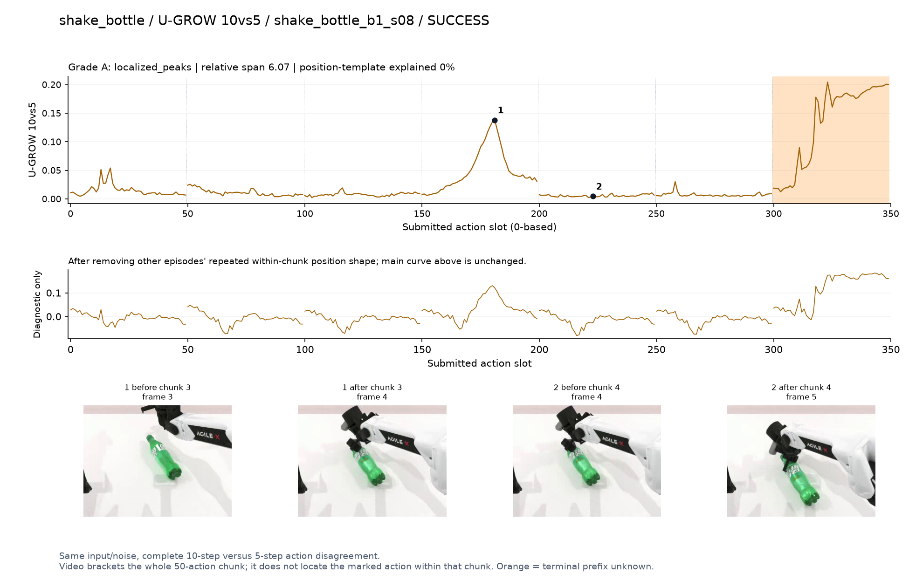

# shake_bottle

[全部任务](../README.md#全部任务) · [按信号看](../README.md#按信号看)

主图保留逐动作原始值；细虚线为chunk边界，橙色为终止段实际执行长度不明，未用于筛选。帧只对应chunk前后，不能精确定位某个h的接触瞬间。A/B/C是形态筛选等级，优先读人工备注。

## DV

**可解释候选**：补充数据候选：q0接近瓶子有宽峰；该任务有重复种子，不计正式验收。

轨迹 `shake_bottle_b1_s09`；成功；种子 `100100056`；补充：实际种子重复，不计正式验收。

[PNG原图](../figures/shake_bottle/dv.png) · [SVG矢量图](../figures/shake_bottle/dv.svg) · [完整元数据](../entries/shake_bottle/dv.json)

对应帧：[1 before q0](../frames/shake_bottle/shake_bottle_b1_s09/f000.jpg) · [1 after q0](../frames/shake_bottle/shake_bottle_b1_s09/f001.jpg) · [2 before q1](../frames/shake_bottle/shake_bottle_b1_s09/f001.jpg) · [2 after q1](../frames/shake_bottle/shake_bottle_b1_s09/f002.jpg)

## Fresco-tail5

**较弱**：弱：逐动作抖动较密，未见可靠独立事件对应；全数据与噪声到最终动作距离高度相关。

轨迹 `shake_bottle_b1_s15`；成功；种子 `100100040`；补充：实际种子重复，不计正式验收。

[PNG原图](../figures/shake_bottle/fresco.png) · [SVG矢量图](../figures/shake_bottle/fresco.svg) · [完整元数据](../entries/shake_bottle/fresco.json)

对应帧：[1 before q1](../frames/shake_bottle/shake_bottle_b1_s15/f001.jpg) · [1 after q1](../frames/shake_bottle/shake_bottle_b1_s15/f002.jpg) · [2 before q0](../frames/shake_bottle/shake_bottle_b1_s15/f000.jpg) · [2 after q0](../frames/shake_bottle/shake_bottle_b1_s15/f001.jpg)

## GEO-full

**可解释候选**：补充数据候选：q3重新接近横卧瓶子时高，并非摇动瞬间。

轨迹 `shake_bottle_b1_s08`；成功；种子 `100100040`；补充：实际种子重复，不计正式验收。

[PNG原图](../figures/shake_bottle/geo.png) · [SVG矢量图](../figures/shake_bottle/geo.svg) · [完整元数据](../entries/shake_bottle/geo.json)

对应帧：[1 before q3](../frames/shake_bottle/shake_bottle_b1_s08/f003.jpg) · [1 after q3](../frames/shake_bottle/shake_bottle_b1_s08/f004.jpg) · [2 before q0](../frames/shake_bottle/shake_bottle_b1_s08/f000.jpg) · [2 after q0](../frames/shake_bottle/shake_bottle_b1_s08/f001.jpg)

## GeoAAC-growth

**较弱**：弱：初始前缀强峰；种子重复的补充数据。

轨迹 `shake_bottle_b1_s05`；成功；种子 `100100047`；补充：实际种子重复，不计正式验收。

[PNG原图](../figures/shake_bottle/geoaac.png) · [SVG矢量图](../figures/shake_bottle/geoaac.svg) · [完整元数据](../entries/shake_bottle/geoaac.json)

对应帧：[1 before q0](../frames/shake_bottle/shake_bottle_b1_s05/f000.jpg) · [1 after q0](../frames/shake_bottle/shake_bottle_b1_s05/f001.jpg) · [2 before q1](../frames/shake_bottle/shake_bottle_b1_s05/f001.jpg) · [2 after q1](../frames/shake_bottle/shake_bottle_b1_s05/f002.jpg)

## SHIFT

**较弱**：弱：小幅抖动/阶段基线变化，未见可靠独立事件对应；路径长度混杂强。

轨迹 `shake_bottle_b0_s02`；成功；种子 `100100023`；补充：实际种子重复，不计正式验收。

[PNG原图](../figures/shake_bottle/shift.png) · [SVG矢量图](../figures/shake_bottle/shift.svg) · [完整元数据](../entries/shake_bottle/shift.json)

对应帧：[1 before q0](../frames/shake_bottle/shake_bottle_b0_s02/f000.jpg) · [1 after q0](../frames/shake_bottle/shake_bottle_b0_s02/f001.jpg)

## Tell-Tale Norm

**可解释候选**：补充数据阶段候选：q1提起瓶子时幅度高。

轨迹 `shake_bottle_b1_s05`；成功；种子 `100100047`；补充：实际种子重复，不计正式验收。

[PNG原图](../figures/shake_bottle/norm.png) · [SVG矢量图](../figures/shake_bottle/norm.svg) · [完整元数据](../entries/shake_bottle/norm.json)

对应帧：[1 before q1](../frames/shake_bottle/shake_bottle_b1_s05/f001.jpg) · [1 after q1](../frames/shake_bottle/shake_bottle_b1_s05/f002.jpg) · [2 before q0](../frames/shake_bottle/shake_bottle_b1_s05/f000.jpg) · [2 after q0](../frames/shake_bottle/shake_bottle_b1_s05/f001.jpg)

## SR-window5

**较弱**：弱：chunk边界反复上升；补充数据。

轨迹 `shake_bottle_b1_s08`；成功；种子 `100100040`；补充：实际种子重复，不计正式验收。

[PNG原图](../figures/shake_bottle/sr.png) · [SVG矢量图](../figures/shake_bottle/sr.svg) · [完整元数据](../entries/shake_bottle/sr.json)

对应帧：[1 before q2](../frames/shake_bottle/shake_bottle_b1_s08/f002.jpg) · [1 after q2](../frames/shake_bottle/shake_bottle_b1_s08/f003.jpg) · [2 before q0](../frames/shake_bottle/shake_bottle_b1_s08/f000.jpg) · [2 after q0](../frames/shake_bottle/shake_bottle_b1_s08/f001.jpg)

## U-GROW 10vs5

**可解释候选**：补充数据候选：q3重新接近瓶子时局部峰，终止段另有高值但不用。

轨迹 `shake_bottle_b1_s08`；成功；种子 `100100040`；补充：实际种子重复，不计正式验收。

[PNG原图](../figures/shake_bottle/ugrow.png) · [SVG矢量图](../figures/shake_bottle/ugrow.svg) · [完整元数据](../entries/shake_bottle/ugrow.json)

对应帧：[1 before q3](../frames/shake_bottle/shake_bottle_b1_s08/f003.jpg) · [1 after q3](../frames/shake_bottle/shake_bottle_b1_s08/f004.jpg) · [2 before q4](../frames/shake_bottle/shake_bottle_b1_s08/f004.jpg) · [2 after q4](../frames/shake_bottle/shake_bottle_b1_s08/f005.jpg)
