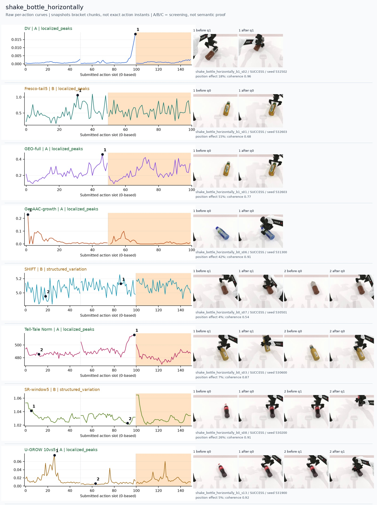
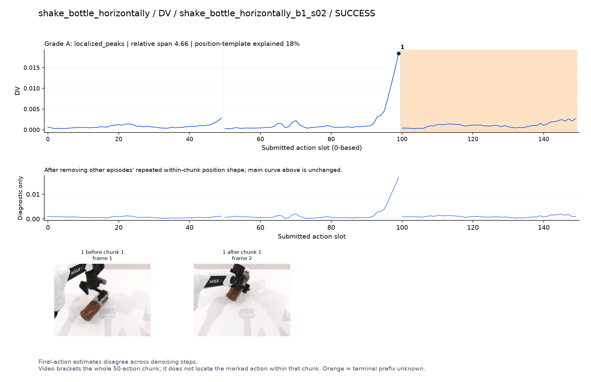
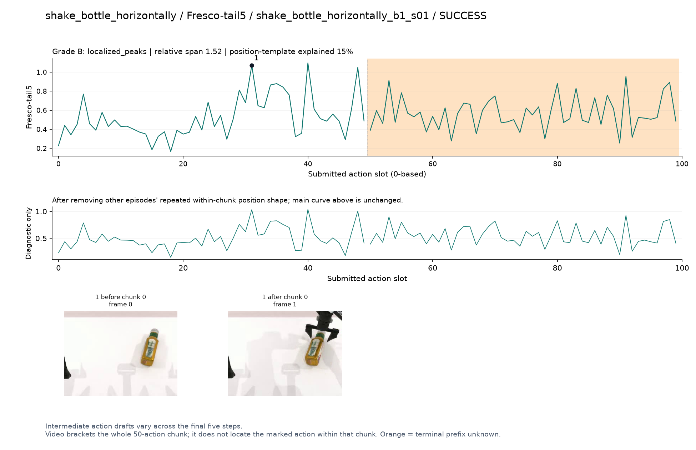
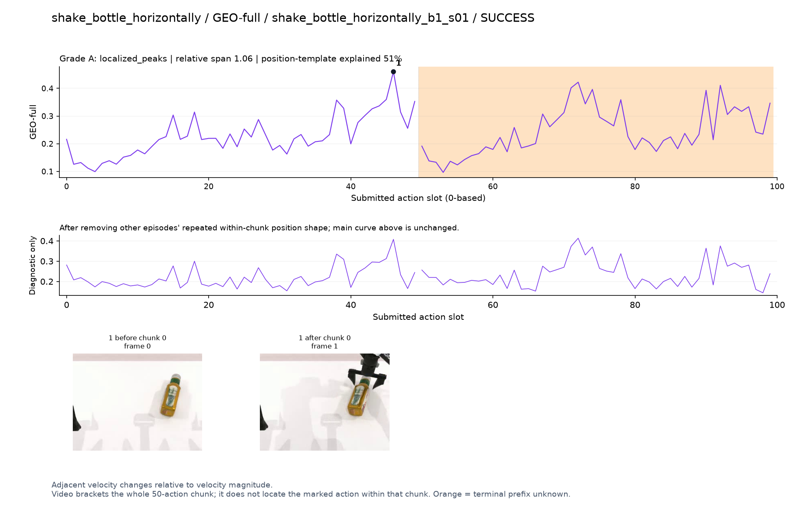
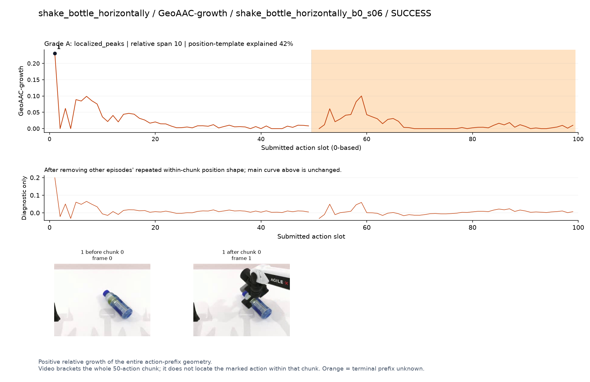
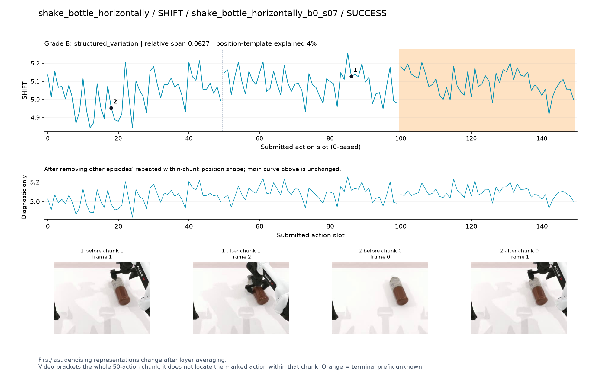
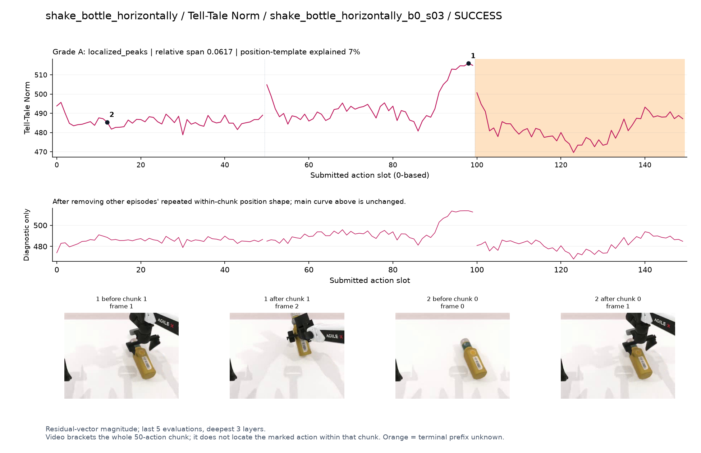
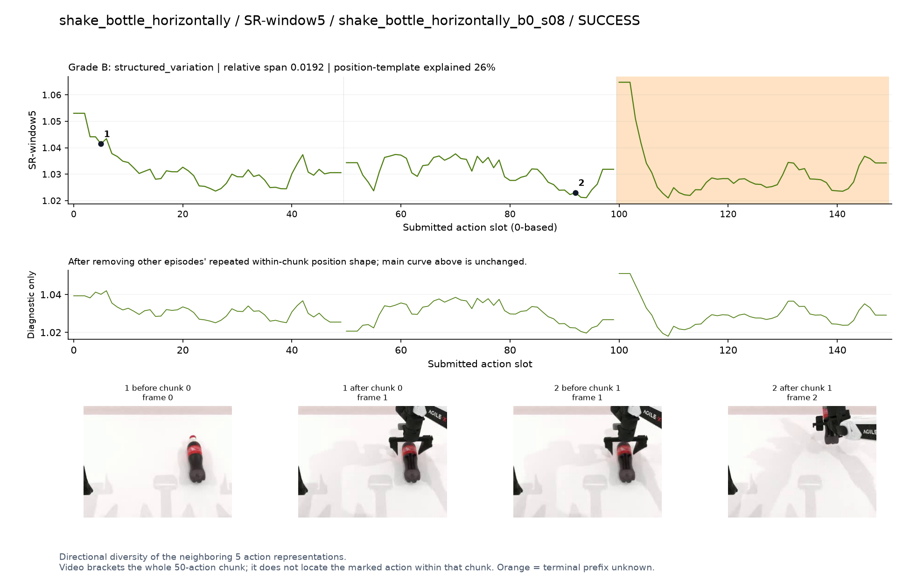
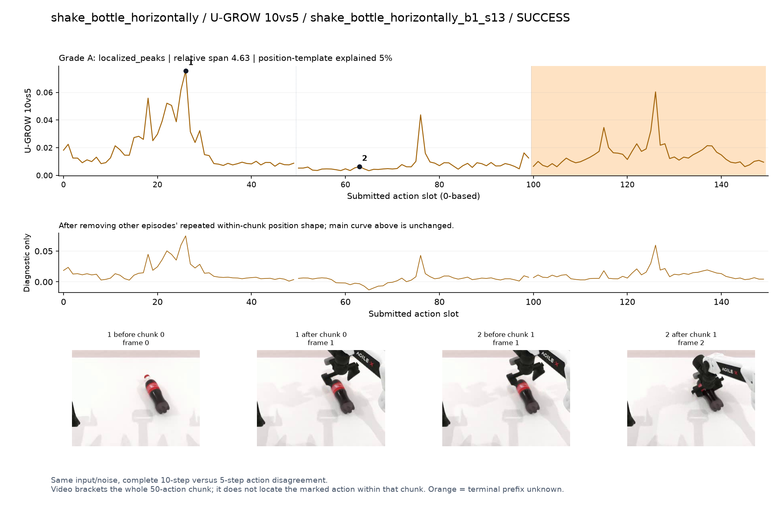

# shake_bottle_horizontally

[全部任务](../README.md#全部任务) · [按信号看](../README.md#按信号看)

主图保留逐动作原始值；细虚线为chunk边界，橙色为终止段实际执行长度不明，未用于筛选。帧只对应chunk前后，不能精确定位某个h的接触瞬间。A/B/C是形态筛选等级，优先读人工备注。

## DV

**可解释候选**：候选：q1夹住并抬起瓶子时末段高峰，未定位摇动。

轨迹 `shake_bottle_horizontally_b1_s02`；成功；种子 `532502`；正式验收。

[PNG原图](../figures/shake_bottle_horizontally/dv.png) · [SVG矢量图](../figures/shake_bottle_horizontally/dv.svg) · [完整元数据](../entries/shake_bottle_horizontally/dv.json)

对应帧：[1 before q1](../frames/shake_bottle_horizontally/shake_bottle_horizontally_b1_s02/f001.jpg) · [1 after q1](../frames/shake_bottle_horizontally/shake_bottle_horizontally_b1_s02/f002.jpg)

## Fresco-tail5

**较弱**：弱：逐动作抖动较密，未见可靠独立事件对应；全数据与噪声到最终动作距离高度相关。

轨迹 `shake_bottle_horizontally_b1_s01`；成功；种子 `532603`；正式验收。

[PNG原图](../figures/shake_bottle_horizontally/fresco.png) · [SVG矢量图](../figures/shake_bottle_horizontally/fresco.svg) · [完整元数据](../entries/shake_bottle_horizontally/fresco.json)

对应帧：[1 before q0](../frames/shake_bottle_horizontally/shake_bottle_horizontally_b1_s01/f000.jpg) · [1 after q0](../frames/shake_bottle_horizontally/shake_bottle_horizontally_b1_s01/f001.jpg)

## GEO-full

**受其他因素影响**：谨慎：q0接近并夹住瓶子时高，位置模板效应较强。

轨迹 `shake_bottle_horizontally_b1_s01`；成功；种子 `532603`；正式验收。

[PNG原图](../figures/shake_bottle_horizontally/geo.png) · [SVG矢量图](../figures/shake_bottle_horizontally/geo.svg) · [完整元数据](../entries/shake_bottle_horizontally/geo.json)

对应帧：[1 before q0](../frames/shake_bottle_horizontally/shake_bottle_horizontally_b1_s01/f000.jpg) · [1 after q0](../frames/shake_bottle_horizontally/shake_bottle_horizontally_b1_s01/f001.jpg)

## GeoAAC-growth

**较弱**：弱：q0最前几个动作尖峰。

轨迹 `shake_bottle_horizontally_b0_s06`；成功；种子 `531300`；正式验收。

[PNG原图](../figures/shake_bottle_horizontally/geoaac.png) · [SVG矢量图](../figures/shake_bottle_horizontally/geoaac.svg) · [完整元数据](../entries/shake_bottle_horizontally/geoaac.json)

对应帧：[1 before q0](../frames/shake_bottle_horizontally/shake_bottle_horizontally_b0_s06/f000.jpg) · [1 after q0](../frames/shake_bottle_horizontally/shake_bottle_horizontally_b0_s06/f001.jpg)

## SHIFT

**较弱**：弱：小幅抖动/阶段基线变化，未见可靠独立事件对应；路径长度混杂强。

轨迹 `shake_bottle_horizontally_b0_s07`；成功；种子 `530501`；正式验收。

[PNG原图](../figures/shake_bottle_horizontally/shift.png) · [SVG矢量图](../figures/shake_bottle_horizontally/shift.svg) · [完整元数据](../entries/shake_bottle_horizontally/shift.json)

对应帧：[1 before q1](../frames/shake_bottle_horizontally/shake_bottle_horizontally_b0_s07/f001.jpg) · [1 after q1](../frames/shake_bottle_horizontally/shake_bottle_horizontally_b0_s07/f002.jpg) · [2 before q0](../frames/shake_bottle_horizontally/shake_bottle_horizontally_b0_s07/f000.jpg) · [2 after q0](../frames/shake_bottle_horizontally/shake_bottle_horizontally_b0_s07/f001.jpg)

## Tell-Tale Norm

**可解释候选**：候选：q1抬起瓶子附近宽峰清楚，尚不能对应摇动周期。

轨迹 `shake_bottle_horizontally_b0_s03`；成功；种子 `530600`；正式验收。

[PNG原图](../figures/shake_bottle_horizontally/norm.png) · [SVG矢量图](../figures/shake_bottle_horizontally/norm.svg) · [完整元数据](../entries/shake_bottle_horizontally/norm.json)

对应帧：[1 before q1](../frames/shake_bottle_horizontally/shake_bottle_horizontally_b0_s03/f001.jpg) · [1 after q1](../frames/shake_bottle_horizontally/shake_bottle_horizontally_b0_s03/f002.jpg) · [2 before q0](../frames/shake_bottle_horizontally/shake_bottle_horizontally_b0_s03/f000.jpg) · [2 after q0](../frames/shake_bottle_horizontally/shake_bottle_horizontally_b0_s03/f001.jpg)

## SR-window5

**较弱**：弱：初段与chunk边缘高，不足以解释摇动。

轨迹 `shake_bottle_horizontally_b0_s08`；成功；种子 `530200`；正式验收。

[PNG原图](../figures/shake_bottle_horizontally/sr.png) · [SVG矢量图](../figures/shake_bottle_horizontally/sr.svg) · [完整元数据](../entries/shake_bottle_horizontally/sr.json)

对应帧：[1 before q0](../frames/shake_bottle_horizontally/shake_bottle_horizontally_b0_s08/f000.jpg) · [1 after q0](../frames/shake_bottle_horizontally/shake_bottle_horizontally_b0_s08/f001.jpg) · [2 before q1](../frames/shake_bottle_horizontally/shake_bottle_horizontally_b0_s08/f001.jpg) · [2 after q1](../frames/shake_bottle_horizontally/shake_bottle_horizontally_b0_s08/f002.jpg)

## U-GROW 10vs5

**可解释候选**：候选：q0接近并抓瓶时主要峰，后续较低。

轨迹 `shake_bottle_horizontally_b1_s13`；成功；种子 `531900`；正式验收。

[PNG原图](../figures/shake_bottle_horizontally/ugrow.png) · [SVG矢量图](../figures/shake_bottle_horizontally/ugrow.svg) · [完整元数据](../entries/shake_bottle_horizontally/ugrow.json)

对应帧：[1 before q0](../frames/shake_bottle_horizontally/shake_bottle_horizontally_b1_s13/f000.jpg) · [1 after q0](../frames/shake_bottle_horizontally/shake_bottle_horizontally_b1_s13/f001.jpg) · [2 before q1](../frames/shake_bottle_horizontally/shake_bottle_horizontally_b1_s13/f001.jpg) · [2 after q1](../frames/shake_bottle_horizontally/shake_bottle_horizontally_b1_s13/f002.jpg)
