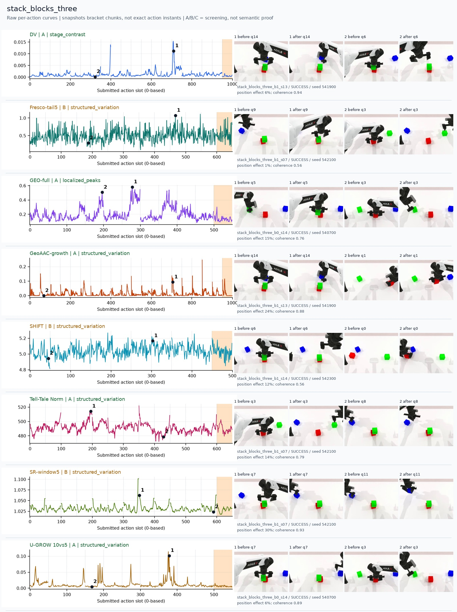
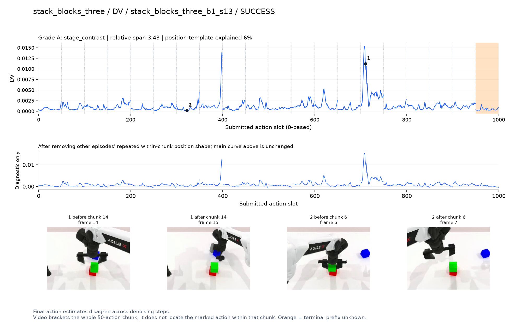
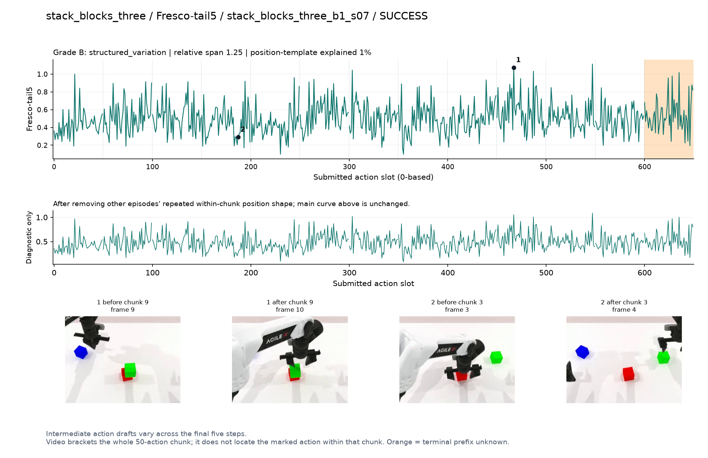
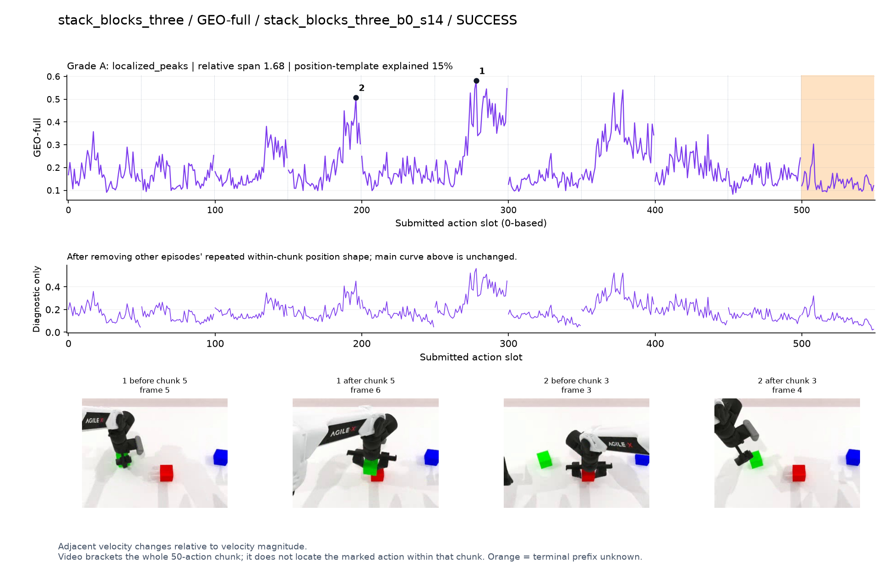
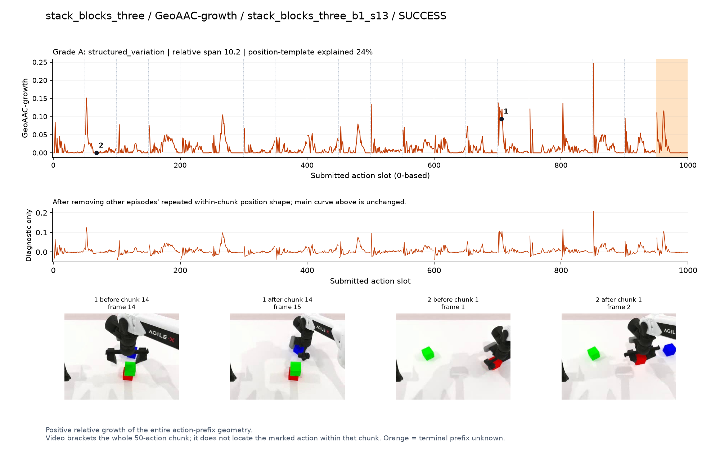
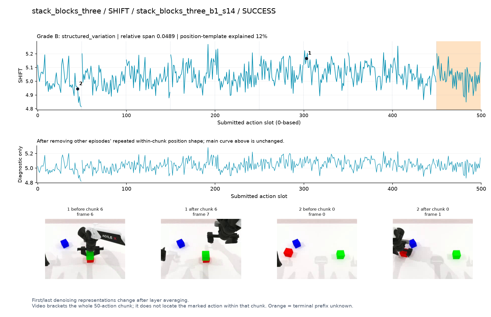
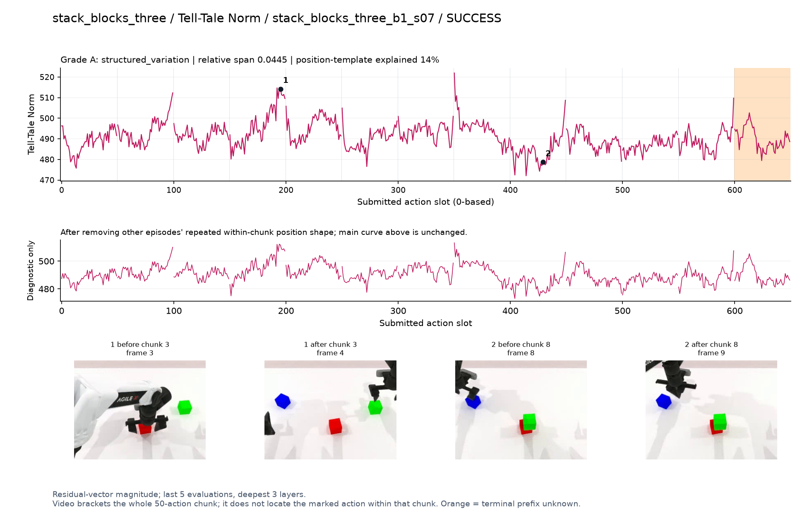
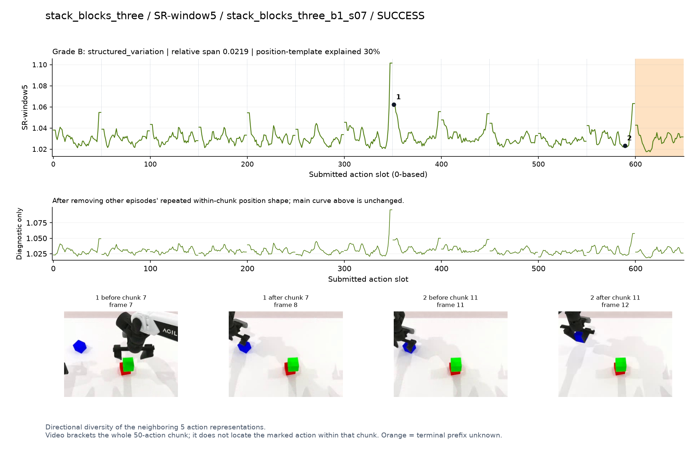
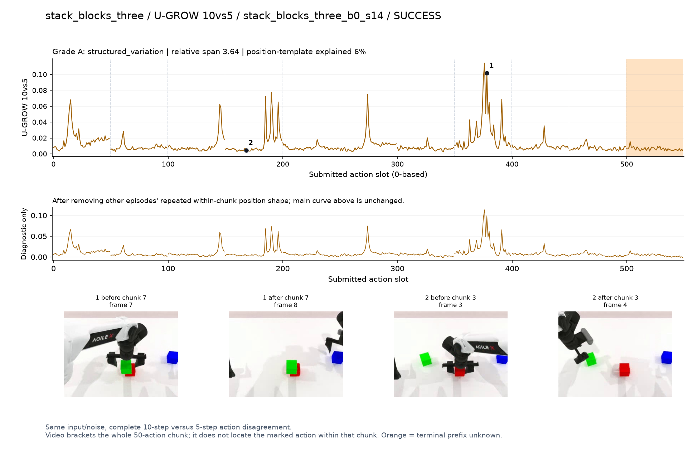

# stack_blocks_three

[全部任务](../README.md#全部任务) · [按信号看](../README.md#按信号看)

主图保留逐动作原始值；细虚线为chunk边界，橙色为终止段实际执行长度不明，未用于筛选。帧只对应chunk前后，不能精确定位某个h的接触瞬间。A/B/C是形态筛选等级，优先读人工备注。

## DV

**可解释候选**：候选：q14第三个方块接近已有堆叠时主峰；另有早期强峰。

轨迹 `stack_blocks_three_b1_s13`；成功；种子 `541900`；正式验收。

[PNG原图](../figures/stack_blocks_three/dv.png) · [SVG矢量图](../figures/stack_blocks_three/dv.svg) · [完整元数据](../entries/stack_blocks_three/dv.json)

对应帧：[1 before q14](../frames/stack_blocks_three/stack_blocks_three_b1_s13/f014.jpg) · [1 after q14](../frames/stack_blocks_three/stack_blocks_three_b1_s13/f015.jpg) · [2 before q6](../frames/stack_blocks_three/stack_blocks_three_b1_s13/f006.jpg) · [2 after q6](../frames/stack_blocks_three/stack_blocks_three_b1_s13/f007.jpg)

## Fresco-tail5

**较弱**：弱：逐动作抖动较密，未见可靠独立事件对应；全数据与噪声到最终动作距离高度相关。

轨迹 `stack_blocks_three_b1_s07`；成功；种子 `542100`；正式验收。

[PNG原图](../figures/stack_blocks_three/fresco.png) · [SVG矢量图](../figures/stack_blocks_three/fresco.svg) · [完整元数据](../entries/stack_blocks_three/fresco.json)

对应帧：[1 before q9](../frames/stack_blocks_three/stack_blocks_three_b1_s07/f009.jpg) · [1 after q9](../frames/stack_blocks_three/stack_blocks_three_b1_s07/f010.jpg) · [2 before q3](../frames/stack_blocks_three/stack_blocks_three_b1_s07/f003.jpg) · [2 after q3](../frames/stack_blocks_three/stack_blocks_three_b1_s07/f004.jpg)

## GEO-full

**可解释候选**：阶段候选：q3/q5拿起、搬运方块形成高区，仍有其他峰。

轨迹 `stack_blocks_three_b0_s14`；成功；种子 `540700`；正式验收。

[PNG原图](../figures/stack_blocks_three/geo.png) · [SVG矢量图](../figures/stack_blocks_three/geo.svg) · [完整元数据](../entries/stack_blocks_three/geo.json)

对应帧：[1 before q5](../frames/stack_blocks_three/stack_blocks_three_b0_s14/f005.jpg) · [1 after q5](../frames/stack_blocks_three/stack_blocks_three_b0_s14/f006.jpg) · [2 before q3](../frames/stack_blocks_three/stack_blocks_three_b0_s14/f003.jpg) · [2 after q3](../frames/stack_blocks_three/stack_blocks_three_b0_s14/f004.jpg)

## GeoAAC-growth

**较弱**：弱：几乎全程反复chunk前缀峰，难指认唯一堆叠事件。

轨迹 `stack_blocks_three_b1_s13`；成功；种子 `541900`；正式验收。

[PNG原图](../figures/stack_blocks_three/geoaac.png) · [SVG矢量图](../figures/stack_blocks_three/geoaac.svg) · [完整元数据](../entries/stack_blocks_three/geoaac.json)

对应帧：[1 before q14](../frames/stack_blocks_three/stack_blocks_three_b1_s13/f014.jpg) · [1 after q14](../frames/stack_blocks_three/stack_blocks_three_b1_s13/f015.jpg) · [2 before q1](../frames/stack_blocks_three/stack_blocks_three_b1_s13/f001.jpg) · [2 after q1](../frames/stack_blocks_three/stack_blocks_three_b1_s13/f002.jpg)

## SHIFT

**较弱**：弱：小幅抖动/阶段基线变化，未见可靠独立事件对应；路径长度混杂强。

轨迹 `stack_blocks_three_b1_s14`；成功；种子 `542300`；正式验收。

[PNG原图](../figures/stack_blocks_three/shift.png) · [SVG矢量图](../figures/stack_blocks_three/shift.svg) · [完整元数据](../entries/stack_blocks_three/shift.json)

对应帧：[1 before q6](../frames/stack_blocks_three/stack_blocks_three_b1_s14/f006.jpg) · [1 after q6](../frames/stack_blocks_three/stack_blocks_three_b1_s14/f007.jpg) · [2 before q0](../frames/stack_blocks_three/stack_blocks_three_b1_s14/f000.jpg) · [2 after q0](../frames/stack_blocks_three/stack_blocks_three_b1_s14/f001.jpg)

## Tell-Tale Norm

**可解释候选**：阶段候选：q3拿起方块时幅度高，q8移开后低。

轨迹 `stack_blocks_three_b1_s07`；成功；种子 `542100`；正式验收。

[PNG原图](../figures/stack_blocks_three/norm.png) · [SVG矢量图](../figures/stack_blocks_three/norm.svg) · [完整元数据](../entries/stack_blocks_three/norm.json)

对应帧：[1 before q3](../frames/stack_blocks_three/stack_blocks_three_b1_s07/f003.jpg) · [1 after q3](../frames/stack_blocks_three/stack_blocks_three_b1_s07/f004.jpg) · [2 before q8](../frames/stack_blocks_three/stack_blocks_three_b1_s07/f008.jpg) · [2 after q8](../frames/stack_blocks_three/stack_blocks_three_b1_s07/f009.jpg)

## SR-window5

**较弱**：弱：标记高区在chunk边缘，峰多。

轨迹 `stack_blocks_three_b1_s07`；成功；种子 `542100`；正式验收。

[PNG原图](../figures/stack_blocks_three/sr.png) · [SVG矢量图](../figures/stack_blocks_three/sr.svg) · [完整元数据](../entries/stack_blocks_three/sr.json)

对应帧：[1 before q7](../frames/stack_blocks_three/stack_blocks_three_b1_s07/f007.jpg) · [1 after q7](../frames/stack_blocks_three/stack_blocks_three_b1_s07/f008.jpg) · [2 before q11](../frames/stack_blocks_three/stack_blocks_three_b1_s07/f011.jpg) · [2 after q11](../frames/stack_blocks_three/stack_blocks_three_b1_s07/f012.jpg)

## U-GROW 10vs5

**可解释候选**：候选：q7堆叠/释放附近有局部主峰，q3等也有其他峰。

轨迹 `stack_blocks_three_b0_s14`；成功；种子 `540700`；正式验收。

[PNG原图](../figures/stack_blocks_three/ugrow.png) · [SVG矢量图](../figures/stack_blocks_three/ugrow.svg) · [完整元数据](../entries/stack_blocks_three/ugrow.json)

对应帧：[1 before q7](../frames/stack_blocks_three/stack_blocks_three_b0_s14/f007.jpg) · [1 after q7](../frames/stack_blocks_three/stack_blocks_three_b0_s14/f008.jpg) · [2 before q3](../frames/stack_blocks_three/stack_blocks_three_b0_s14/f003.jpg) · [2 after q3](../frames/stack_blocks_three/stack_blocks_three_b0_s14/f004.jpg)
