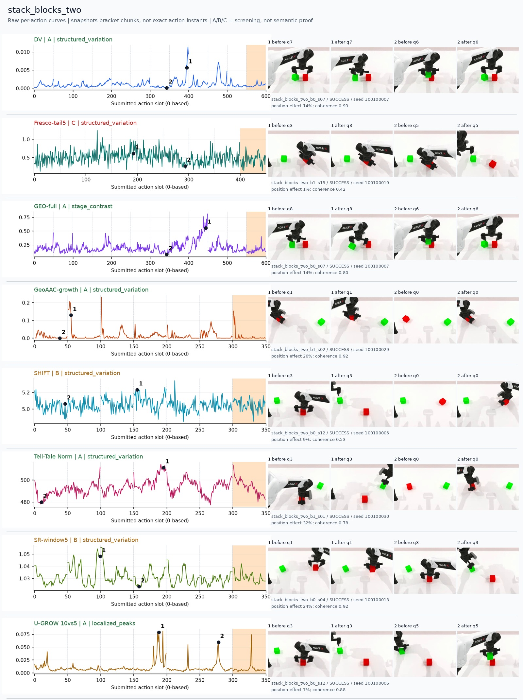
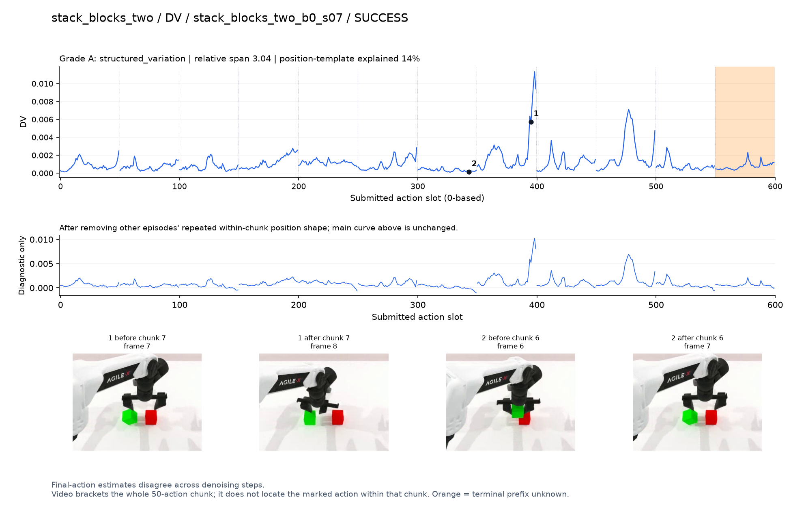
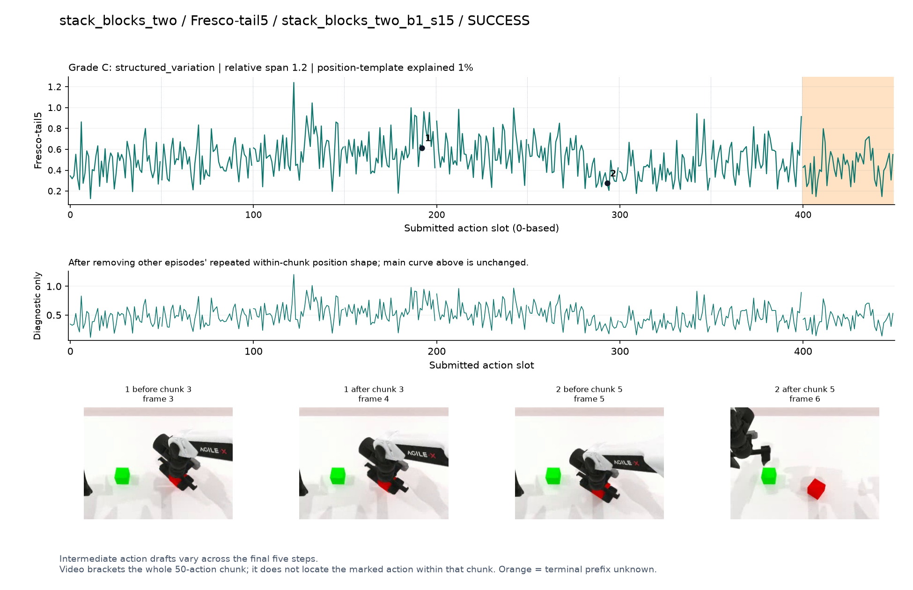
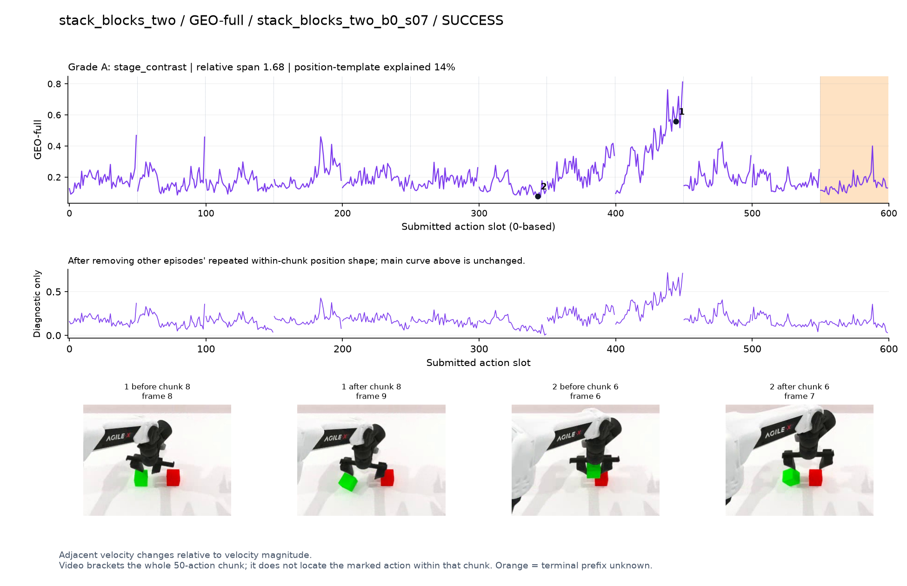
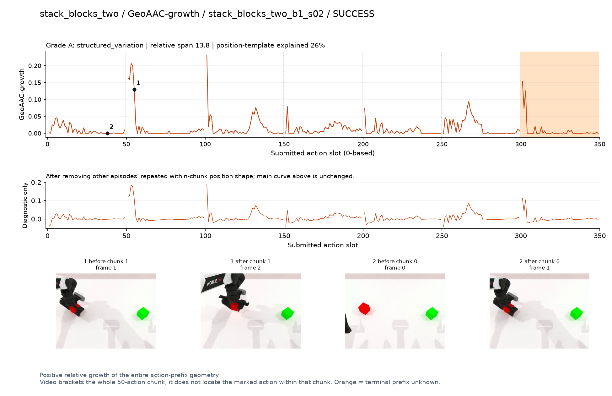
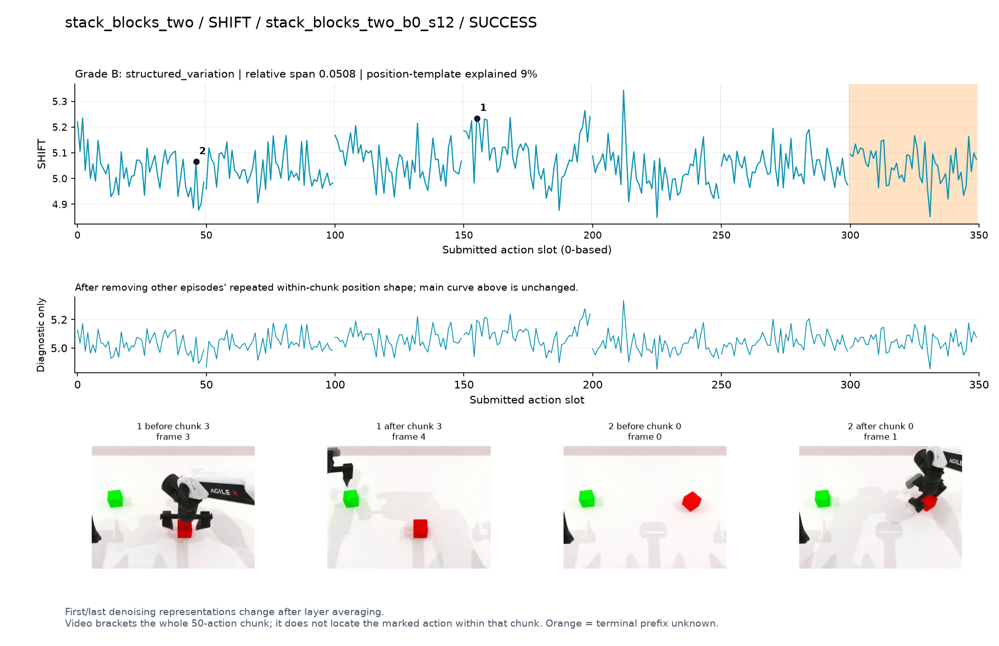
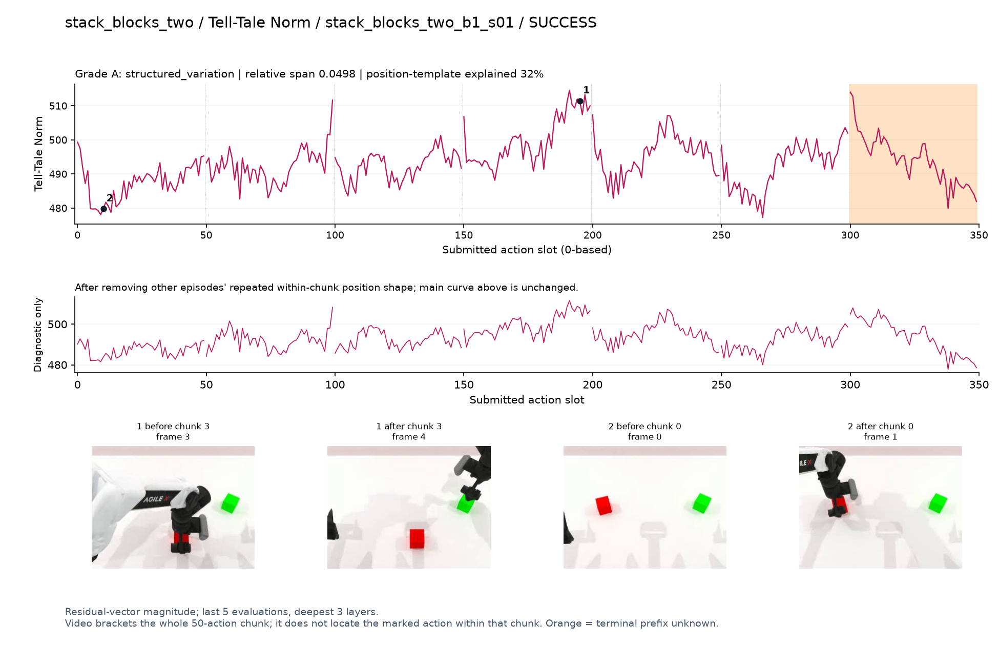
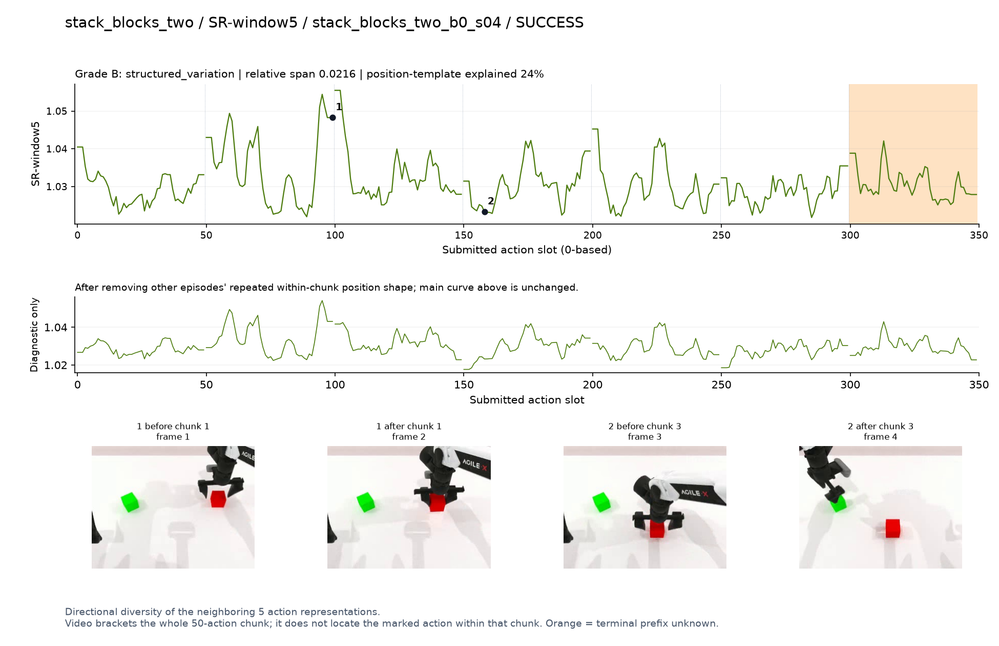
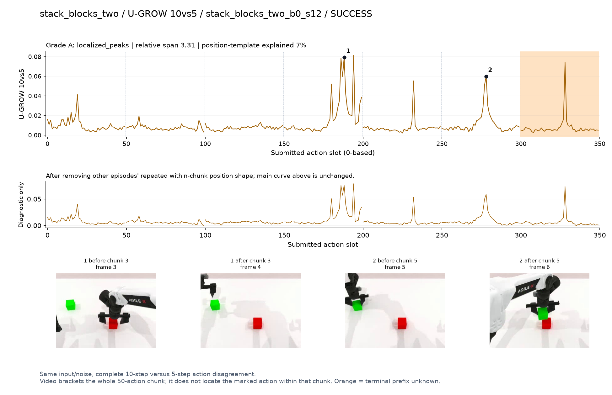

# stack_blocks_two

[全部任务](../README.md#全部任务) · [按信号看](../README.md#按信号看)

主图保留逐动作原始值；细虚线为chunk边界，橙色为终止段实际执行长度不明，未用于筛选。帧只对应chunk前后，不能精确定位某个h的接触瞬间。A/B/C是形态筛选等级，优先读人工备注。

## DV

**可解释候选**：候选：q7在两块积木上方反复调整时高，另有后续峰。

轨迹 `stack_blocks_two_b0_s07`；成功；种子 `100100007`；正式验收。

[PNG原图](../figures/stack_blocks_two/dv.png) · [SVG矢量图](../figures/stack_blocks_two/dv.svg) · [完整元数据](../entries/stack_blocks_two/dv.json)

对应帧：[1 before q7](../frames/stack_blocks_two/stack_blocks_two_b0_s07/f007.jpg) · [1 after q7](../frames/stack_blocks_two/stack_blocks_two_b0_s07/f008.jpg) · [2 before q6](../frames/stack_blocks_two/stack_blocks_two_b0_s07/f006.jpg) · [2 after q6](../frames/stack_blocks_two/stack_blocks_two_b0_s07/f007.jpg)

## Fresco-tail5

**较弱**：弱：逐动作抖动较密，未见可靠独立事件对应；全数据与噪声到最终动作距离高度相关。

轨迹 `stack_blocks_two_b1_s15`；成功；种子 `100100019`；正式验收。

[PNG原图](../figures/stack_blocks_two/fresco.png) · [SVG矢量图](../figures/stack_blocks_two/fresco.svg) · [完整元数据](../entries/stack_blocks_two/fresco.json)

对应帧：[1 before q3](../frames/stack_blocks_two/stack_blocks_two_b1_s15/f003.jpg) · [1 after q3](../frames/stack_blocks_two/stack_blocks_two_b1_s15/f004.jpg) · [2 before q5](../frames/stack_blocks_two/stack_blocks_two_b1_s15/f005.jpg) · [2 after q5](../frames/stack_blocks_two/stack_blocks_two_b1_s15/f006.jpg)

## GEO-full

**可解释候选**：候选：q8夹持方块调整姿态时宽高区。

轨迹 `stack_blocks_two_b0_s07`；成功；种子 `100100007`；正式验收。

[PNG原图](../figures/stack_blocks_two/geo.png) · [SVG矢量图](../figures/stack_blocks_two/geo.svg) · [完整元数据](../entries/stack_blocks_two/geo.json)

对应帧：[1 before q8](../frames/stack_blocks_two/stack_blocks_two_b0_s07/f008.jpg) · [1 after q8](../frames/stack_blocks_two/stack_blocks_two_b0_s07/f009.jpg) · [2 before q6](../frames/stack_blocks_two/stack_blocks_two_b0_s07/f006.jpg) · [2 after q6](../frames/stack_blocks_two/stack_blocks_two_b0_s07/f007.jpg)

## GeoAAC-growth

**较弱**：弱：多chunk开头重复尖峰，难分辨堆叠事件。

轨迹 `stack_blocks_two_b1_s02`；成功；种子 `100100029`；正式验收。

[PNG原图](../figures/stack_blocks_two/geoaac.png) · [SVG矢量图](../figures/stack_blocks_two/geoaac.svg) · [完整元数据](../entries/stack_blocks_two/geoaac.json)

对应帧：[1 before q1](../frames/stack_blocks_two/stack_blocks_two_b1_s02/f001.jpg) · [1 after q1](../frames/stack_blocks_two/stack_blocks_two_b1_s02/f002.jpg) · [2 before q0](../frames/stack_blocks_two/stack_blocks_two_b1_s02/f000.jpg) · [2 after q0](../frames/stack_blocks_two/stack_blocks_two_b1_s02/f001.jpg)

## SHIFT

**较弱**：弱：小幅抖动/阶段基线变化，未见可靠独立事件对应；路径长度混杂强。

轨迹 `stack_blocks_two_b0_s12`；成功；种子 `100100006`；正式验收。

[PNG原图](../figures/stack_blocks_two/shift.png) · [SVG矢量图](../figures/stack_blocks_two/shift.svg) · [完整元数据](../entries/stack_blocks_two/shift.json)

对应帧：[1 before q3](../frames/stack_blocks_two/stack_blocks_two_b0_s12/f003.jpg) · [1 after q3](../frames/stack_blocks_two/stack_blocks_two_b0_s12/f004.jpg) · [2 before q0](../frames/stack_blocks_two/stack_blocks_two_b0_s12/f000.jpg) · [2 after q0](../frames/stack_blocks_two/stack_blocks_two_b0_s12/f001.jpg)

## Tell-Tale Norm

**可解释候选**：阶段候选：q3从原位置提起方块时宽峰。

轨迹 `stack_blocks_two_b1_s01`；成功；种子 `100100030`；正式验收。

[PNG原图](../figures/stack_blocks_two/norm.png) · [SVG矢量图](../figures/stack_blocks_two/norm.svg) · [完整元数据](../entries/stack_blocks_two/norm.json)

对应帧：[1 before q3](../frames/stack_blocks_two/stack_blocks_two_b1_s01/f003.jpg) · [1 after q3](../frames/stack_blocks_two/stack_blocks_two_b1_s01/f004.jpg) · [2 before q0](../frames/stack_blocks_two/stack_blocks_two_b1_s01/f000.jpg) · [2 after q0](../frames/stack_blocks_two/stack_blocks_two_b1_s01/f001.jpg)

## SR-window5

**较弱**：弱：多峰且主要高点位于chunk边界。

轨迹 `stack_blocks_two_b0_s04`；成功；种子 `100100013`；正式验收。

[PNG原图](../figures/stack_blocks_two/sr.png) · [SVG矢量图](../figures/stack_blocks_two/sr.svg) · [完整元数据](../entries/stack_blocks_two/sr.json)

对应帧：[1 before q1](../frames/stack_blocks_two/stack_blocks_two_b0_s04/f001.jpg) · [1 after q1](../frames/stack_blocks_two/stack_blocks_two_b0_s04/f002.jpg) · [2 before q3](../frames/stack_blocks_two/stack_blocks_two_b0_s04/f003.jpg) · [2 after q3](../frames/stack_blocks_two/stack_blocks_two_b0_s04/f004.jpg)

## U-GROW 10vs5

**可解释候选**：候选：q3提起方块和q5移到另一方块上方两个局部高区。

轨迹 `stack_blocks_two_b0_s12`；成功；种子 `100100006`；正式验收。

[PNG原图](../figures/stack_blocks_two/ugrow.png) · [SVG矢量图](../figures/stack_blocks_two/ugrow.svg) · [完整元数据](../entries/stack_blocks_two/ugrow.json)

对应帧：[1 before q3](../frames/stack_blocks_two/stack_blocks_two_b0_s12/f003.jpg) · [1 after q3](../frames/stack_blocks_two/stack_blocks_two_b0_s12/f004.jpg) · [2 before q5](../frames/stack_blocks_two/stack_blocks_two_b0_s12/f005.jpg) · [2 after q5](../frames/stack_blocks_two/stack_blocks_two_b0_s12/f006.jpg)
