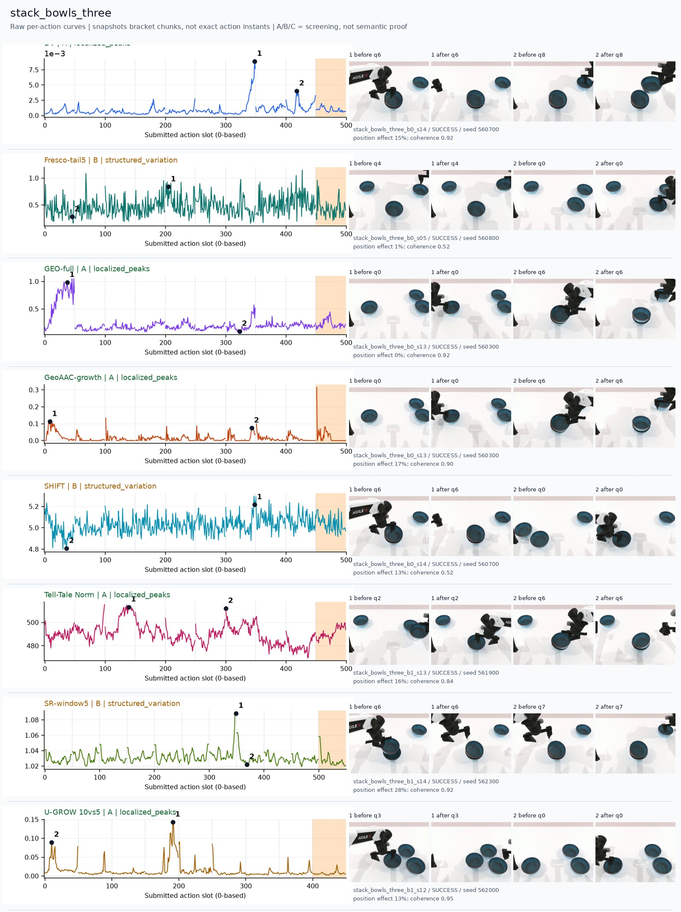
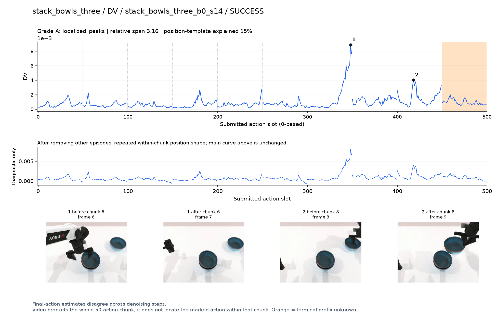
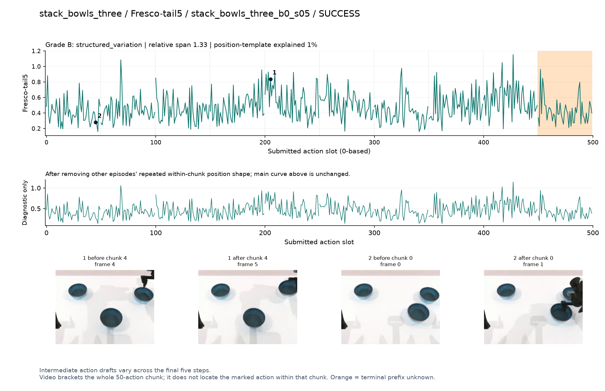
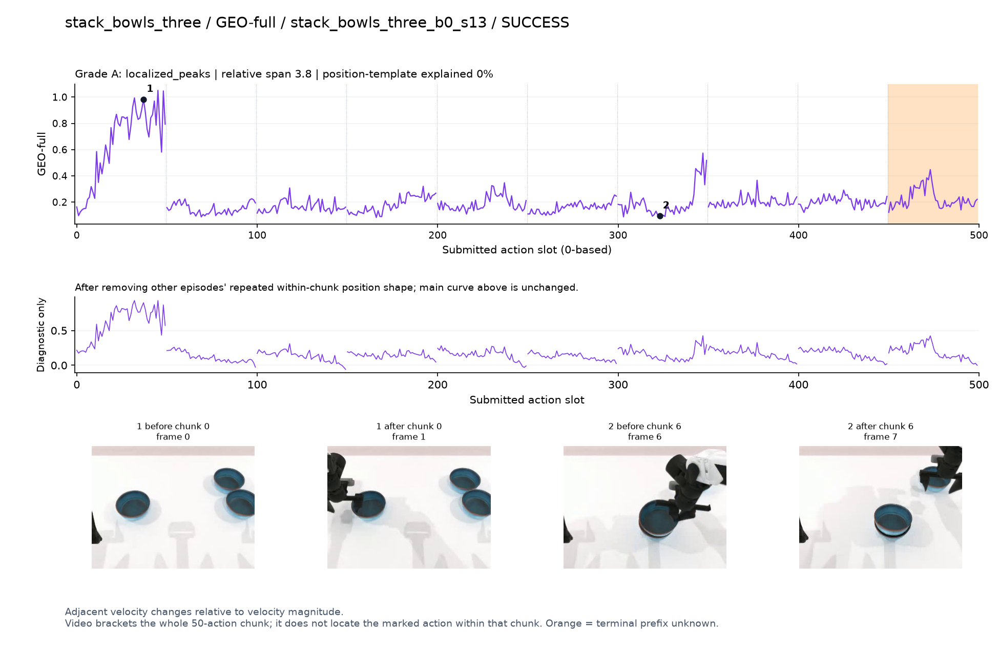
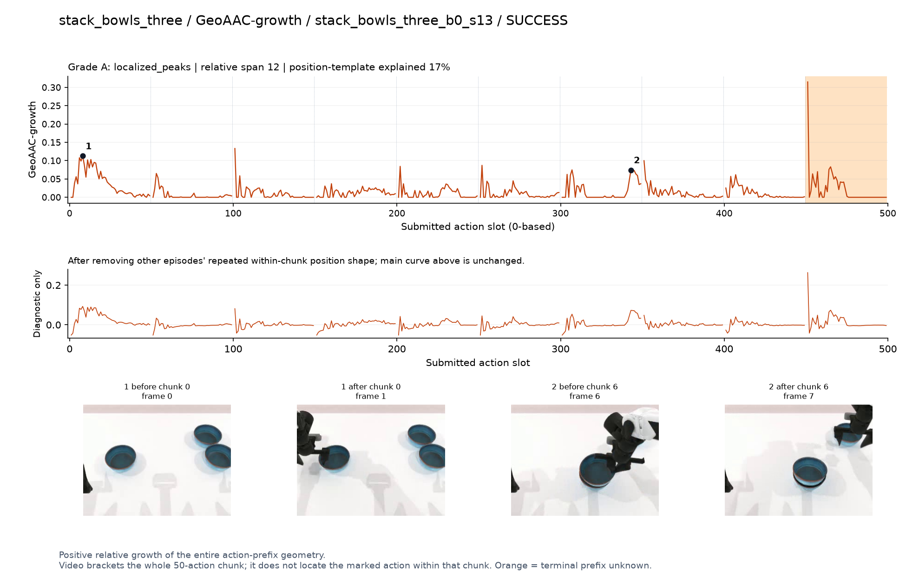
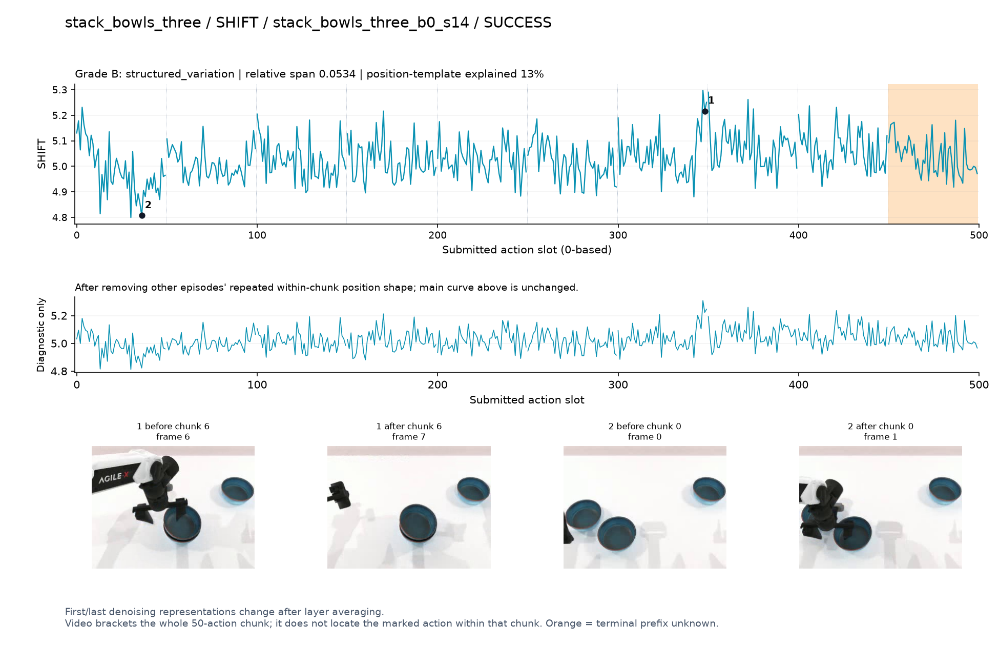
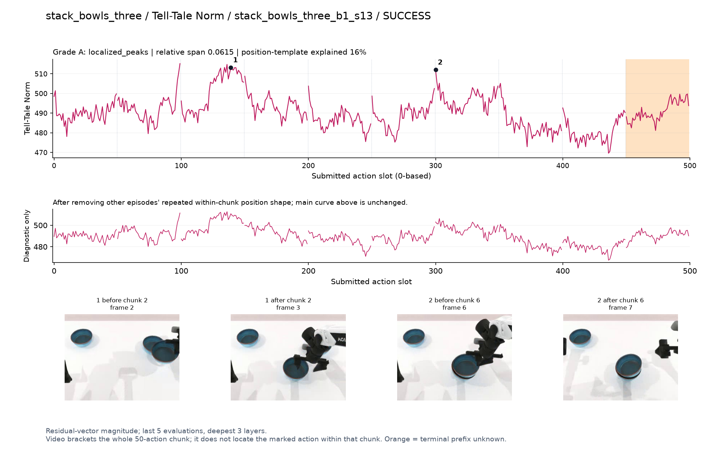
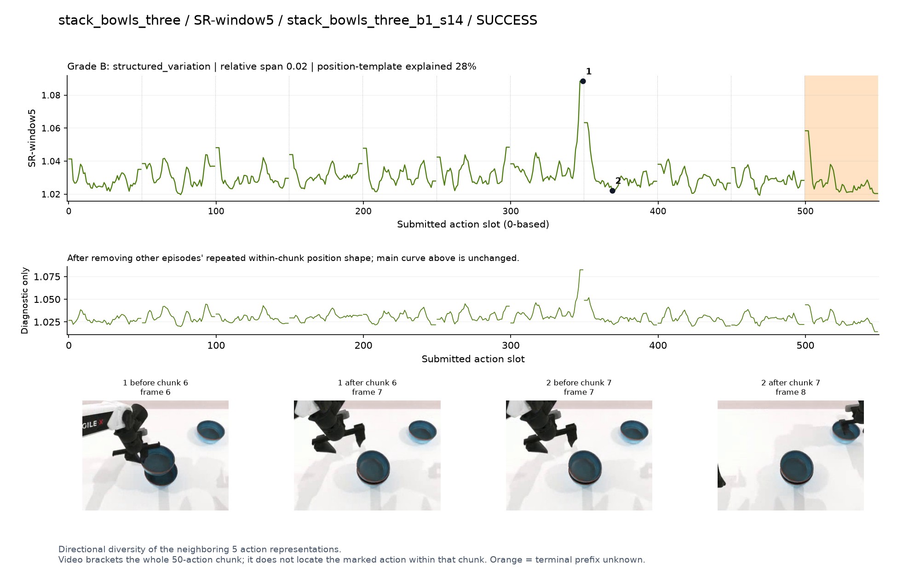
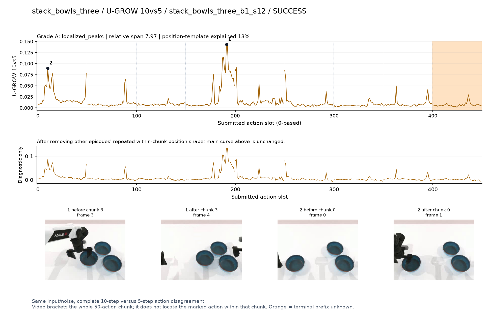

# stack_bowls_three

[全部任务](../README.md#全部任务) · [按信号看](../README.md#按信号看)

主图保留逐动作原始值；细虚线为chunk边界，橙色为终止段实际执行长度不明，未用于筛选。帧只对应chunk前后，不能精确定位某个h的接触瞬间。A/B/C是形态筛选等级，优先读人工备注。

## DV

**可解释候选**：候选：q6手从已叠碗边缘移开时主峰，q8再抓碗有次峰。

轨迹 `stack_bowls_three_b0_s14`；成功；种子 `560700`；正式验收。

[PNG原图](../figures/stack_bowls_three/dv.png) · [SVG矢量图](../figures/stack_bowls_three/dv.svg) · [完整元数据](../entries/stack_bowls_three/dv.json)

对应帧：[1 before q6](../frames/stack_bowls_three/stack_bowls_three_b0_s14/f006.jpg) · [1 after q6](../frames/stack_bowls_three/stack_bowls_three_b0_s14/f007.jpg) · [2 before q8](../frames/stack_bowls_three/stack_bowls_three_b0_s14/f008.jpg) · [2 after q8](../frames/stack_bowls_three/stack_bowls_three_b0_s14/f009.jpg)

## Fresco-tail5

**较弱**：弱：逐动作抖动较密，未见可靠独立事件对应；全数据与噪声到最终动作距离高度相关。

轨迹 `stack_bowls_three_b0_s05`；成功；种子 `560800`；正式验收。

[PNG原图](../figures/stack_bowls_three/fresco.png) · [SVG矢量图](../figures/stack_bowls_three/fresco.svg) · [完整元数据](../entries/stack_bowls_three/fresco.json)

对应帧：[1 before q4](../frames/stack_bowls_three/stack_bowls_three_b0_s05/f004.jpg) · [1 after q4](../frames/stack_bowls_three/stack_bowls_three_b0_s05/f005.jpg) · [2 before q0](../frames/stack_bowls_three/stack_bowls_three_b0_s05/f000.jpg) · [2 after q0](../frames/stack_bowls_three/stack_bowls_three_b0_s05/f001.jpg)

## GEO-full

**可解释候选**：候选：q0最初接近碗时高，后续大部分低。

轨迹 `stack_bowls_three_b0_s13`；成功；种子 `560300`；正式验收。

[PNG原图](../figures/stack_bowls_three/geo.png) · [SVG矢量图](../figures/stack_bowls_three/geo.svg) · [完整元数据](../entries/stack_bowls_three/geo.json)

对应帧：[1 before q0](../frames/stack_bowls_three/stack_bowls_three_b0_s13/f000.jpg) · [1 after q0](../frames/stack_bowls_three/stack_bowls_three_b0_s13/f001.jpg) · [2 before q6](../frames/stack_bowls_three/stack_bowls_three_b0_s13/f006.jpg) · [2 after q6](../frames/stack_bowls_three/stack_bowls_three_b0_s13/f007.jpg)

## GeoAAC-growth

**受其他因素影响**：谨慎：初始前缀及q6有增长，另有多处边界尖峰。

轨迹 `stack_bowls_three_b0_s13`；成功；种子 `560300`；正式验收。

[PNG原图](../figures/stack_bowls_three/geoaac.png) · [SVG矢量图](../figures/stack_bowls_three/geoaac.svg) · [完整元数据](../entries/stack_bowls_three/geoaac.json)

对应帧：[1 before q0](../frames/stack_bowls_three/stack_bowls_three_b0_s13/f000.jpg) · [1 after q0](../frames/stack_bowls_three/stack_bowls_three_b0_s13/f001.jpg) · [2 before q6](../frames/stack_bowls_three/stack_bowls_three_b0_s13/f006.jpg) · [2 after q6](../frames/stack_bowls_three/stack_bowls_three_b0_s13/f007.jpg)

## SHIFT

**较弱**：弱：小幅抖动/阶段基线变化，未见可靠独立事件对应；路径长度混杂强。

轨迹 `stack_bowls_three_b0_s14`；成功；种子 `560700`；正式验收。

[PNG原图](../figures/stack_bowls_three/shift.png) · [SVG矢量图](../figures/stack_bowls_three/shift.svg) · [完整元数据](../entries/stack_bowls_three/shift.json)

对应帧：[1 before q6](../frames/stack_bowls_three/stack_bowls_three_b0_s14/f006.jpg) · [1 after q6](../frames/stack_bowls_three/stack_bowls_three_b0_s14/f007.jpg) · [2 before q0](../frames/stack_bowls_three/stack_bowls_three_b0_s14/f000.jpg) · [2 after q0](../frames/stack_bowls_three/stack_bowls_three_b0_s14/f001.jpg)

## Tell-Tale Norm

**可解释候选**：阶段候选：q2搬碗、q6堆叠附近有两个较宽高区。

轨迹 `stack_bowls_three_b1_s13`；成功；种子 `561900`；正式验收。

[PNG原图](../figures/stack_bowls_three/norm.png) · [SVG矢量图](../figures/stack_bowls_three/norm.svg) · [完整元数据](../entries/stack_bowls_three/norm.json)

对应帧：[1 before q2](../frames/stack_bowls_three/stack_bowls_three_b1_s13/f002.jpg) · [1 after q2](../frames/stack_bowls_three/stack_bowls_three_b1_s13/f003.jpg) · [2 before q6](../frames/stack_bowls_three/stack_bowls_three_b1_s13/f006.jpg) · [2 after q6](../frames/stack_bowls_three/stack_bowls_three_b1_s13/f007.jpg)

## SR-window5

**受其他因素影响**：谨慎：q6放下/离开碗附近有局部峰，但临近边界。

轨迹 `stack_bowls_three_b1_s14`；成功；种子 `562300`；正式验收。

[PNG原图](../figures/stack_bowls_three/sr.png) · [SVG矢量图](../figures/stack_bowls_three/sr.svg) · [完整元数据](../entries/stack_bowls_three/sr.json)

对应帧：[1 before q6](../frames/stack_bowls_three/stack_bowls_three_b1_s14/f006.jpg) · [1 after q6](../frames/stack_bowls_three/stack_bowls_three_b1_s14/f007.jpg) · [2 before q7](../frames/stack_bowls_three/stack_bowls_three_b1_s14/f007.jpg) · [2 after q7](../frames/stack_bowls_three/stack_bowls_three_b1_s14/f008.jpg)

## U-GROW 10vs5

**可解释候选**：候选：q3夹爪把碗移向另一碗时局部高区。

轨迹 `stack_bowls_three_b1_s12`；成功；种子 `562000`；正式验收。

[PNG原图](../figures/stack_bowls_three/ugrow.png) · [SVG矢量图](../figures/stack_bowls_three/ugrow.svg) · [完整元数据](../entries/stack_bowls_three/ugrow.json)

对应帧：[1 before q3](../frames/stack_bowls_three/stack_bowls_three_b1_s12/f003.jpg) · [1 after q3](../frames/stack_bowls_three/stack_bowls_three_b1_s12/f004.jpg) · [2 before q0](../frames/stack_bowls_three/stack_bowls_three_b1_s12/f000.jpg) · [2 after q0](../frames/stack_bowls_three/stack_bowls_three_b1_s12/f001.jpg)
