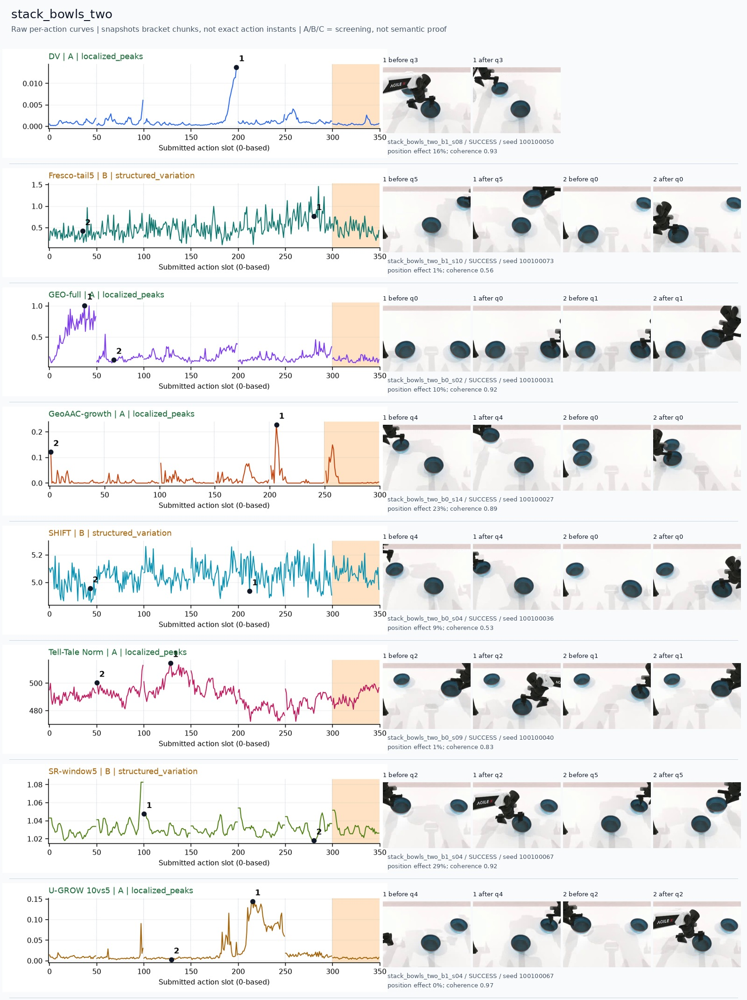
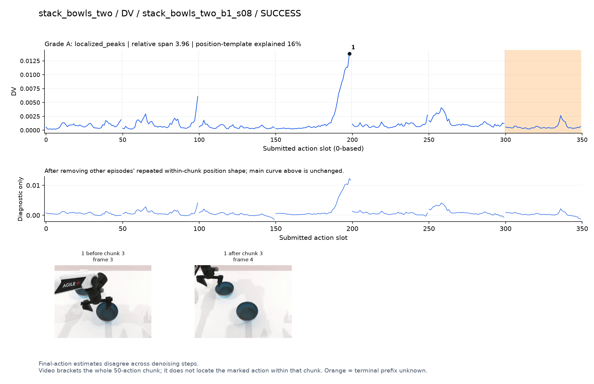
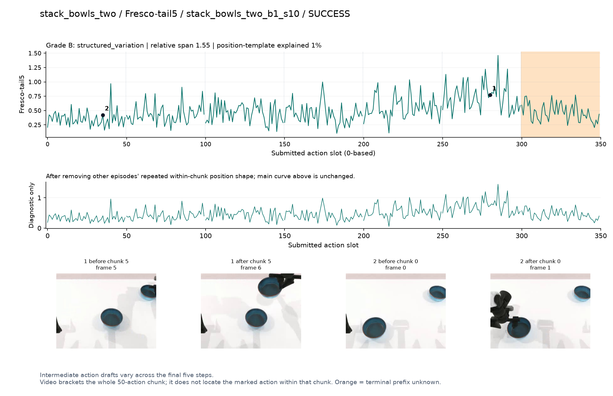
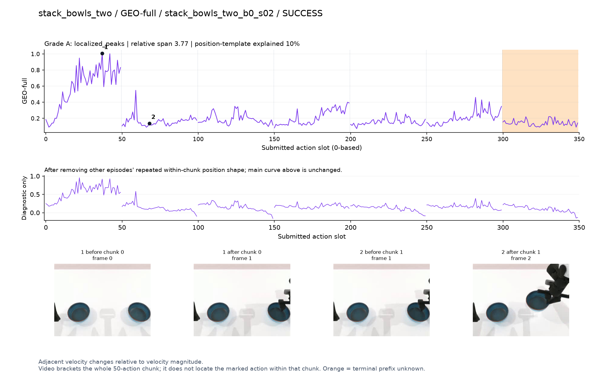
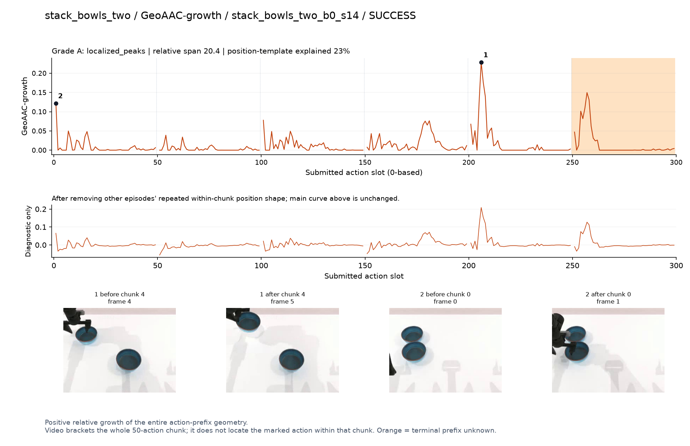
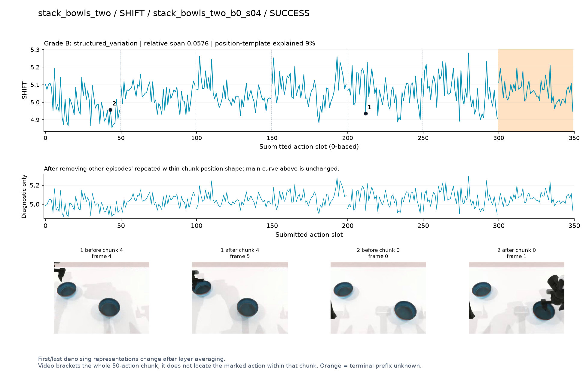
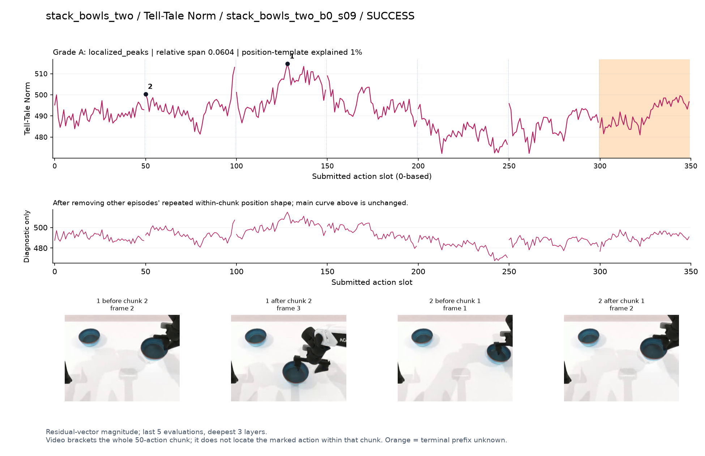
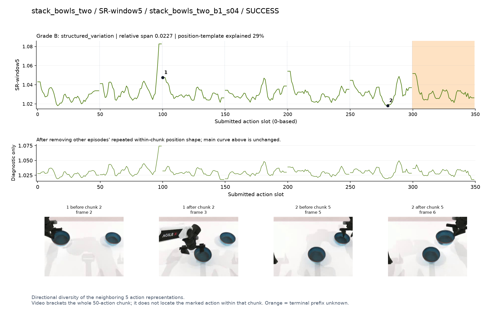
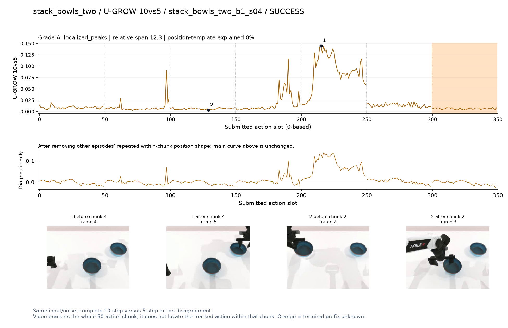

# stack_bowls_two

[全部任务](../README.md#全部任务) · [按信号看](../README.md#按信号看)

主图保留逐动作原始值；细虚线为chunk边界，橙色为终止段实际执行长度不明，未用于筛选。帧只对应chunk前后，不能精确定位某个h的接触瞬间。A/B/C是形态筛选等级，优先读人工备注。

## DV

**可解释候选**：候选：q3夹爪从碗边抬起/再次调整时强峰。

轨迹 `stack_bowls_two_b1_s08`；成功；种子 `100100050`；正式验收。

[PNG原图](../figures/stack_bowls_two/dv.png) · [SVG矢量图](../figures/stack_bowls_two/dv.svg) · [完整元数据](../entries/stack_bowls_two/dv.json)

对应帧：[1 before q3](../frames/stack_bowls_two/stack_bowls_two_b1_s08/f003.jpg) · [1 after q3](../frames/stack_bowls_two/stack_bowls_two_b1_s08/f004.jpg)

## Fresco-tail5

**较弱**：弱：逐动作抖动较密，未见可靠独立事件对应；全数据与噪声到最终动作距离高度相关。

轨迹 `stack_bowls_two_b1_s10`；成功；种子 `100100073`；正式验收。

[PNG原图](../figures/stack_bowls_two/fresco.png) · [SVG矢量图](../figures/stack_bowls_two/fresco.svg) · [完整元数据](../entries/stack_bowls_two/fresco.json)

对应帧：[1 before q5](../frames/stack_bowls_two/stack_bowls_two_b1_s10/f005.jpg) · [1 after q5](../frames/stack_bowls_two/stack_bowls_two_b1_s10/f006.jpg) · [2 before q0](../frames/stack_bowls_two/stack_bowls_two_b1_s10/f000.jpg) · [2 after q0](../frames/stack_bowls_two/stack_bowls_two_b1_s10/f001.jpg)

## GEO-full

**可解释候选**：候选：q0最初接近碗时宽高区。

轨迹 `stack_bowls_two_b0_s02`；成功；种子 `100100031`；正式验收。

[PNG原图](../figures/stack_bowls_two/geo.png) · [SVG矢量图](../figures/stack_bowls_two/geo.svg) · [完整元数据](../entries/stack_bowls_two/geo.json)

对应帧：[1 before q0](../frames/stack_bowls_two/stack_bowls_two_b0_s02/f000.jpg) · [1 after q0](../frames/stack_bowls_two/stack_bowls_two_b0_s02/f001.jpg) · [2 before q1](../frames/stack_bowls_two/stack_bowls_two_b0_s02/f001.jpg) · [2 after q1](../frames/stack_bowls_two/stack_bowls_two_b0_s02/f002.jpg)

## GeoAAC-growth

**受其他因素影响**：谨慎：q4提碗时增长峰贴近chunk前缘。

轨迹 `stack_bowls_two_b0_s14`；成功；种子 `100100027`；正式验收。

[PNG原图](../figures/stack_bowls_two/geoaac.png) · [SVG矢量图](../figures/stack_bowls_two/geoaac.svg) · [完整元数据](../entries/stack_bowls_two/geoaac.json)

对应帧：[1 before q4](../frames/stack_bowls_two/stack_bowls_two_b0_s14/f004.jpg) · [1 after q4](../frames/stack_bowls_two/stack_bowls_two_b0_s14/f005.jpg) · [2 before q0](../frames/stack_bowls_two/stack_bowls_two_b0_s14/f000.jpg) · [2 after q0](../frames/stack_bowls_two/stack_bowls_two_b0_s14/f001.jpg)

## SHIFT

**较弱**：弱：小幅抖动/阶段基线变化，未见可靠独立事件对应；路径长度混杂强。

轨迹 `stack_bowls_two_b0_s04`；成功；种子 `100100036`；正式验收。

[PNG原图](../figures/stack_bowls_two/shift.png) · [SVG矢量图](../figures/stack_bowls_two/shift.svg) · [完整元数据](../entries/stack_bowls_two/shift.json)

对应帧：[1 before q4](../frames/stack_bowls_two/stack_bowls_two_b0_s04/f004.jpg) · [1 after q4](../frames/stack_bowls_two/stack_bowls_two_b0_s04/f005.jpg) · [2 before q0](../frames/stack_bowls_two/stack_bowls_two_b0_s04/f000.jpg) · [2 after q0](../frames/stack_bowls_two/stack_bowls_two_b0_s04/f001.jpg)

## Tell-Tale Norm

**可解释候选**：候选：q2搬碗时宽高区，幅度变化可见但不是重要性的证明。

轨迹 `stack_bowls_two_b0_s09`；成功；种子 `100100040`；正式验收。

[PNG原图](../figures/stack_bowls_two/norm.png) · [SVG矢量图](../figures/stack_bowls_two/norm.svg) · [完整元数据](../entries/stack_bowls_two/norm.json)

对应帧：[1 before q2](../frames/stack_bowls_two/stack_bowls_two_b0_s09/f002.jpg) · [1 after q2](../frames/stack_bowls_two/stack_bowls_two_b0_s09/f003.jpg) · [2 before q1](../frames/stack_bowls_two/stack_bowls_two_b0_s09/f001.jpg) · [2 after q1](../frames/stack_bowls_two/stack_bowls_two_b0_s09/f002.jpg)

## SR-window5

**较弱**：弱：q1/q2边界高峰，后续多处重复。

轨迹 `stack_bowls_two_b1_s04`；成功；种子 `100100067`；正式验收。

[PNG原图](../figures/stack_bowls_two/sr.png) · [SVG矢量图](../figures/stack_bowls_two/sr.svg) · [完整元数据](../entries/stack_bowls_two/sr.json)

对应帧：[1 before q2](../frames/stack_bowls_two/stack_bowls_two_b1_s04/f002.jpg) · [1 after q2](../frames/stack_bowls_two/stack_bowls_two_b1_s04/f003.jpg) · [2 before q5](../frames/stack_bowls_two/stack_bowls_two_b1_s04/f005.jpg) · [2 after q5](../frames/stack_bowls_two/stack_bowls_two_b1_s04/f006.jpg)

## U-GROW 10vs5

**可解释候选**：候选：q4抓取/抬起第二只碗时集中宽高区。

轨迹 `stack_bowls_two_b1_s04`；成功；种子 `100100067`；正式验收。

[PNG原图](../figures/stack_bowls_two/ugrow.png) · [SVG矢量图](../figures/stack_bowls_two/ugrow.svg) · [完整元数据](../entries/stack_bowls_two/ugrow.json)

对应帧：[1 before q4](../frames/stack_bowls_two/stack_bowls_two_b1_s04/f004.jpg) · [1 after q4](../frames/stack_bowls_two/stack_bowls_two_b1_s04/f005.jpg) · [2 before q2](../frames/stack_bowls_two/stack_bowls_two_b1_s04/f002.jpg) · [2 after q2](../frames/stack_bowls_two/stack_bowls_two_b1_s04/f003.jpg)
