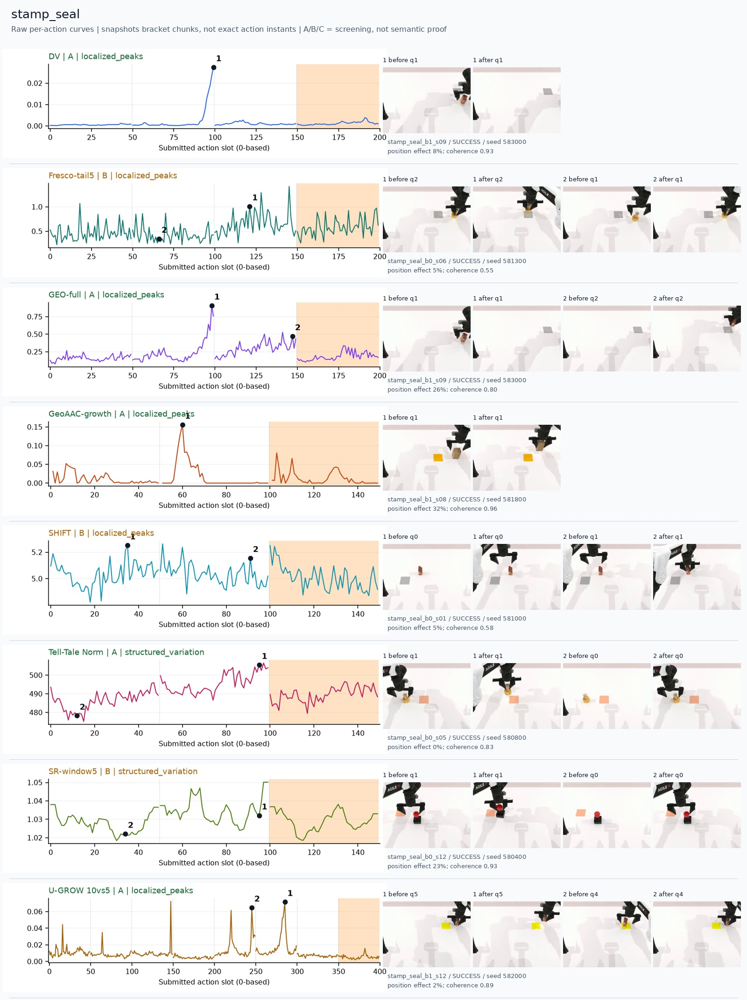
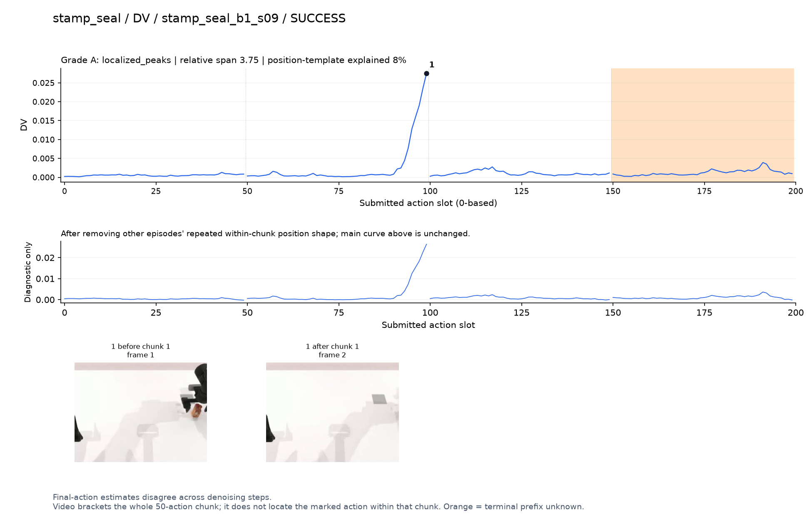
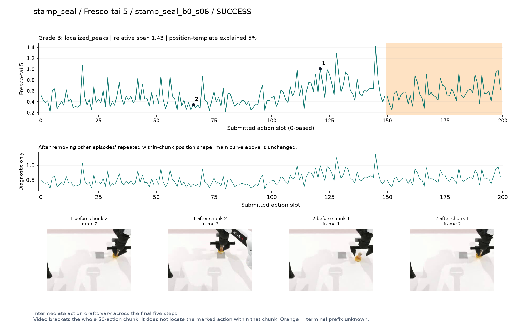
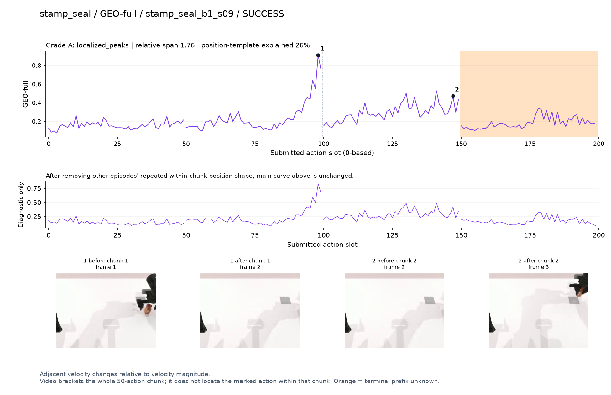
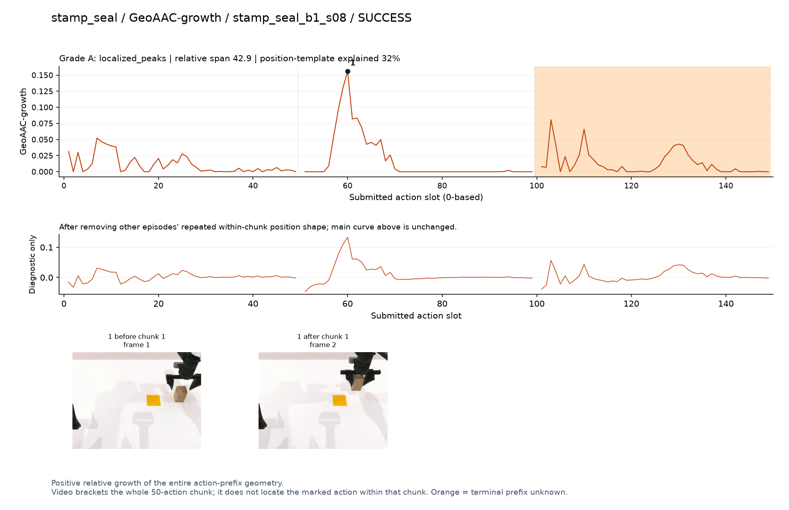
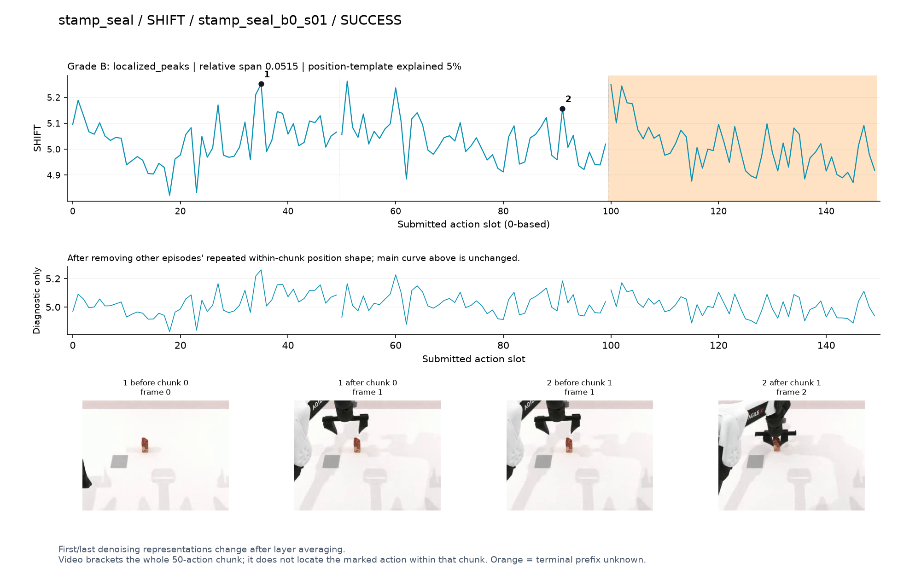
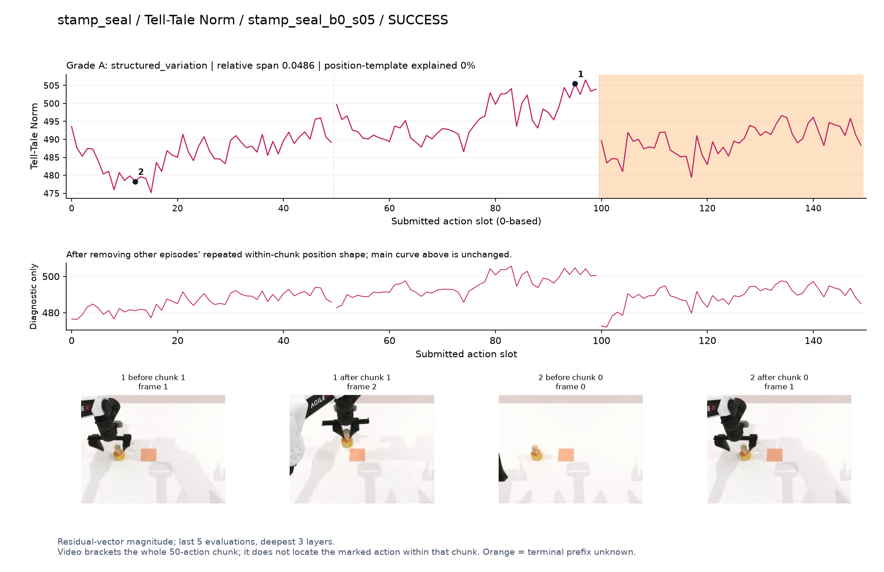
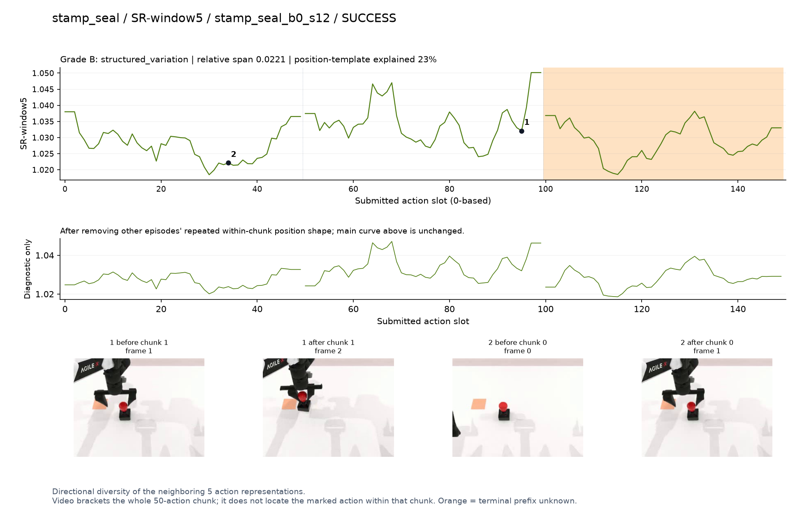
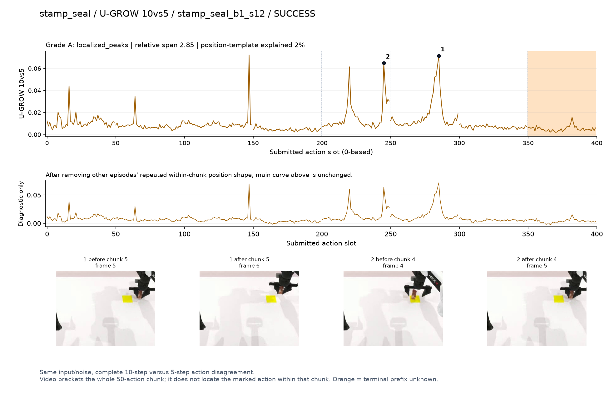

# stamp_seal

[全部任务](../README.md#全部任务) · [按信号看](../README.md#按信号看)

主图保留逐动作原始值；细虚线为chunk边界，橙色为终止段实际执行长度不明，未用于筛选。帧只对应chunk前后，不能精确定位某个h的接触瞬间。A/B/C是形态筛选等级，优先读人工备注。

## DV

**较弱**：形态清楚但语义弱：q1强峰片段手和印章出画较多。

轨迹 `stamp_seal_b1_s09`；成功；种子 `583000`；正式验收。

[PNG原图](../figures/stamp_seal/dv.png) · [SVG矢量图](../figures/stamp_seal/dv.svg) · [完整元数据](../entries/stamp_seal/dv.json)

对应帧：[1 before q1](../frames/stamp_seal/stamp_seal_b1_s09/f001.jpg) · [1 after q1](../frames/stamp_seal/stamp_seal_b1_s09/f002.jpg)

## Fresco-tail5

**较弱**：弱：逐动作抖动较密，未见可靠独立事件对应；全数据与噪声到最终动作距离高度相关。

轨迹 `stamp_seal_b0_s06`；成功；种子 `581300`；正式验收。

[PNG原图](../figures/stamp_seal/fresco.png) · [SVG矢量图](../figures/stamp_seal/fresco.svg) · [完整元数据](../entries/stamp_seal/fresco.json)

对应帧：[1 before q2](../frames/stamp_seal/stamp_seal_b0_s06/f002.jpg) · [1 after q2](../frames/stamp_seal/stamp_seal_b0_s06/f003.jpg) · [2 before q1](../frames/stamp_seal/stamp_seal_b0_s06/f001.jpg) · [2 after q1](../frames/stamp_seal/stamp_seal_b0_s06/f002.jpg)

## GEO-full

**较弱**：形态清楚但语义弱：与DV同片段峰，无法可靠看清盖章动作。

轨迹 `stamp_seal_b1_s09`；成功；种子 `583000`；正式验收。

[PNG原图](../figures/stamp_seal/geo.png) · [SVG矢量图](../figures/stamp_seal/geo.svg) · [完整元数据](../entries/stamp_seal/geo.json)

对应帧：[1 before q1](../frames/stamp_seal/stamp_seal_b1_s09/f001.jpg) · [1 after q1](../frames/stamp_seal/stamp_seal_b1_s09/f002.jpg) · [2 before q2](../frames/stamp_seal/stamp_seal_b1_s09/f002.jpg) · [2 after q2](../frames/stamp_seal/stamp_seal_b1_s09/f003.jpg)

## GeoAAC-growth

**可解释候选**：候选：q1拿起并向印面移动时局部增长区，仍要区分前缀效应。

轨迹 `stamp_seal_b1_s08`；成功；种子 `581800`；正式验收。

[PNG原图](../figures/stamp_seal/geoaac.png) · [SVG矢量图](../figures/stamp_seal/geoaac.svg) · [完整元数据](../entries/stamp_seal/geoaac.json)

对应帧：[1 before q1](../frames/stamp_seal/stamp_seal_b1_s08/f001.jpg) · [1 after q1](../frames/stamp_seal/stamp_seal_b1_s08/f002.jpg)

## SHIFT

**较弱**：弱：小幅抖动/阶段基线变化，未见可靠独立事件对应；路径长度混杂强。

轨迹 `stamp_seal_b0_s01`；成功；种子 `581000`；正式验收。

[PNG原图](../figures/stamp_seal/shift.png) · [SVG矢量图](../figures/stamp_seal/shift.svg) · [完整元数据](../entries/stamp_seal/shift.json)

对应帧：[1 before q0](../frames/stamp_seal/stamp_seal_b0_s01/f000.jpg) · [1 after q0](../frames/stamp_seal/stamp_seal_b0_s01/f001.jpg) · [2 before q1](../frames/stamp_seal/stamp_seal_b0_s01/f001.jpg) · [2 after q1](../frames/stamp_seal/stamp_seal_b0_s01/f002.jpg)

## Tell-Tale Norm

**可解释候选**：候选：q1印章移向印面时逐渐升高。

轨迹 `stamp_seal_b0_s05`；成功；种子 `580800`；正式验收。

[PNG原图](../figures/stamp_seal/norm.png) · [SVG矢量图](../figures/stamp_seal/norm.svg) · [完整元数据](../entries/stamp_seal/norm.json)

对应帧：[1 before q1](../frames/stamp_seal/stamp_seal_b0_s05/f001.jpg) · [1 after q1](../frames/stamp_seal/stamp_seal_b0_s05/f002.jpg) · [2 before q0](../frames/stamp_seal/stamp_seal_b0_s05/f000.jpg) · [2 after q0](../frames/stamp_seal/stamp_seal_b0_s05/f001.jpg)

## SR-window5

**较弱**：弱：宽小波动夹杂末端升高，无法单独定位盖章。

轨迹 `stamp_seal_b0_s12`；成功；种子 `580400`；正式验收。

[PNG原图](../figures/stamp_seal/sr.png) · [SVG矢量图](../figures/stamp_seal/sr.svg) · [完整元数据](../entries/stamp_seal/sr.json)

对应帧：[1 before q1](../frames/stamp_seal/stamp_seal_b0_s12/f001.jpg) · [1 after q1](../frames/stamp_seal/stamp_seal_b0_s12/f002.jpg) · [2 before q0](../frames/stamp_seal/stamp_seal_b0_s12/f000.jpg) · [2 after q0](../frames/stamp_seal/stamp_seal_b0_s12/f001.jpg)

## U-GROW 10vs5

**可解释候选**：候选：q4/q5印章在印面附近调整的两个峰；接触瞬间不可定位。

轨迹 `stamp_seal_b1_s12`；成功；种子 `582000`；正式验收。

[PNG原图](../figures/stamp_seal/ugrow.png) · [SVG矢量图](../figures/stamp_seal/ugrow.svg) · [完整元数据](../entries/stamp_seal/ugrow.json)

对应帧：[1 before q5](../frames/stamp_seal/stamp_seal_b1_s12/f005.jpg) · [1 after q5](../frames/stamp_seal/stamp_seal_b1_s12/f006.jpg) · [2 before q4](../frames/stamp_seal/stamp_seal_b1_s12/f004.jpg) · [2 after q4](../frames/stamp_seal/stamp_seal_b1_s12/f005.jpg)
