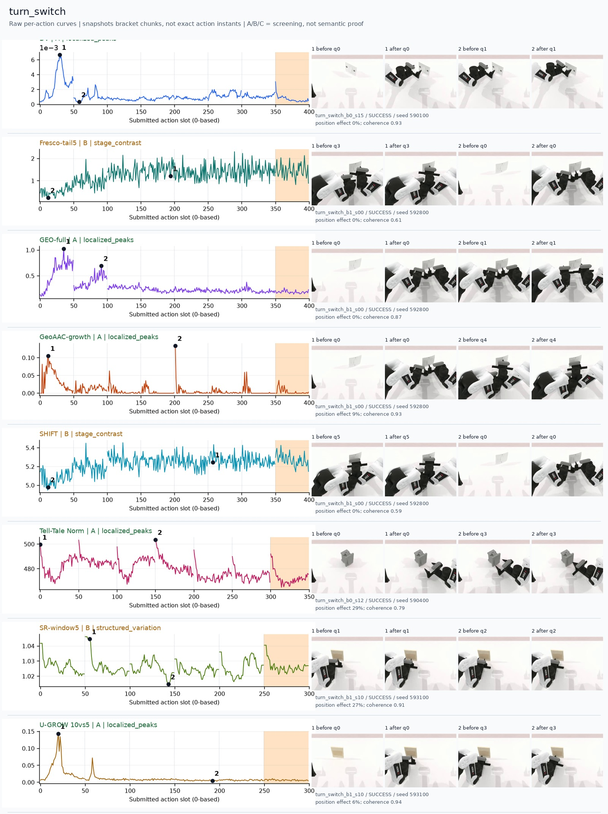
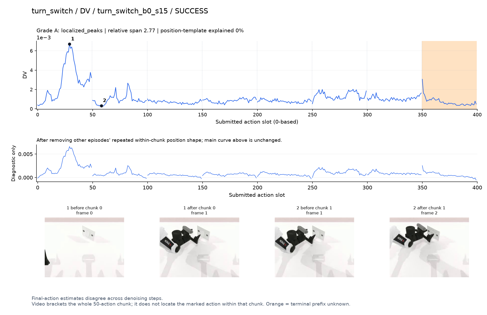
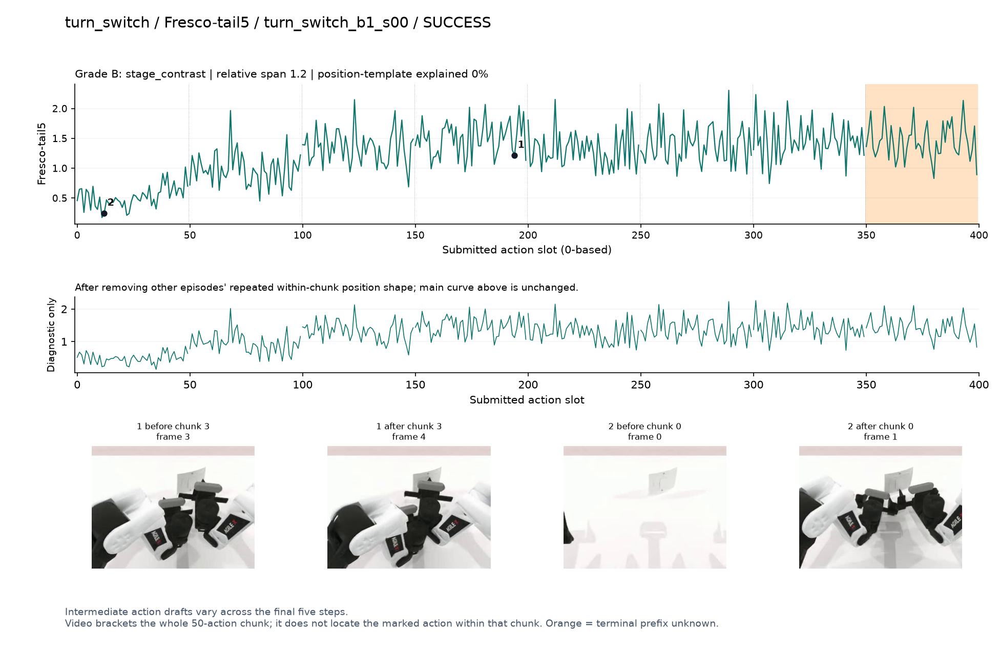
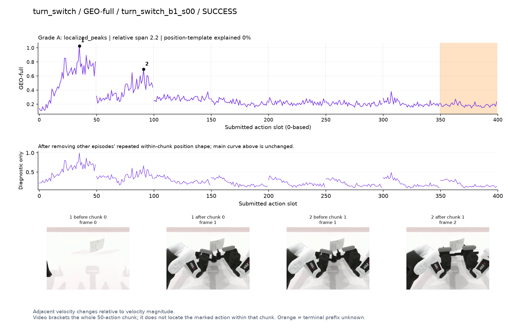
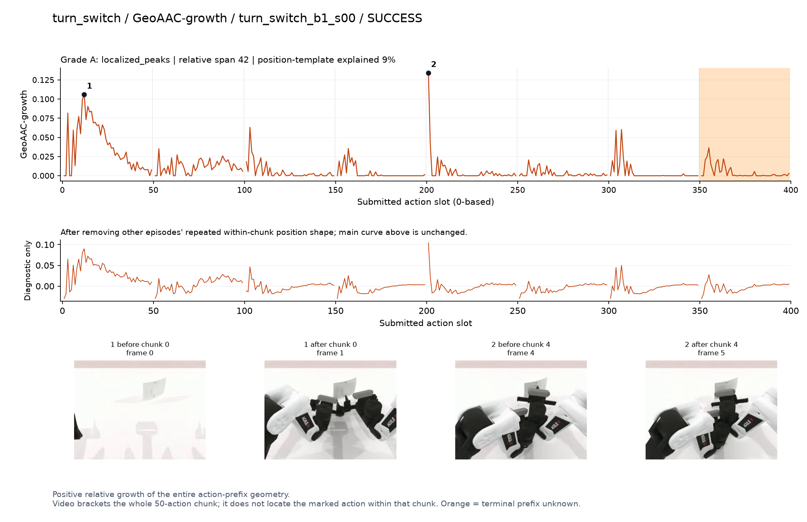
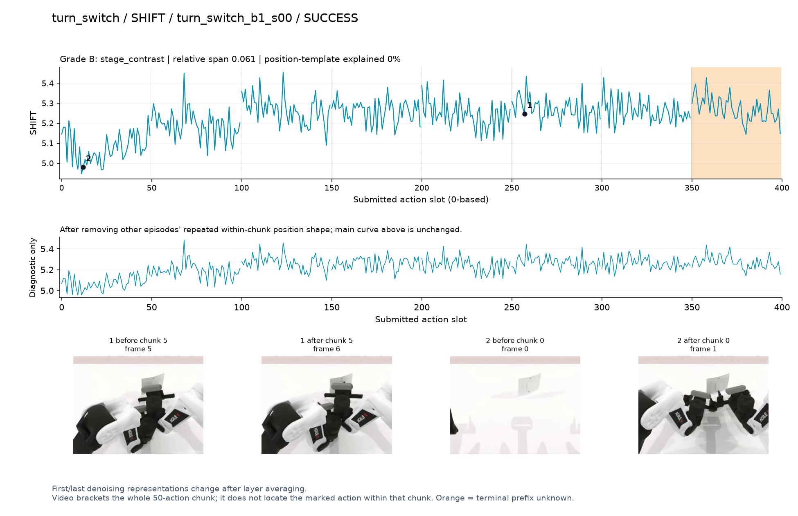
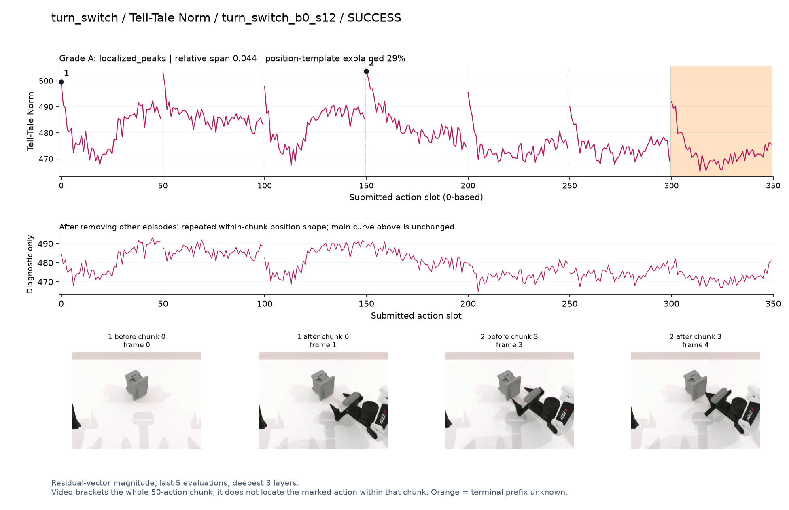
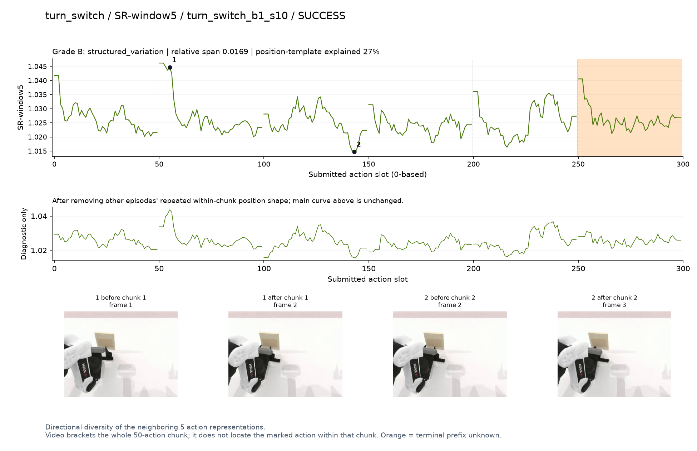
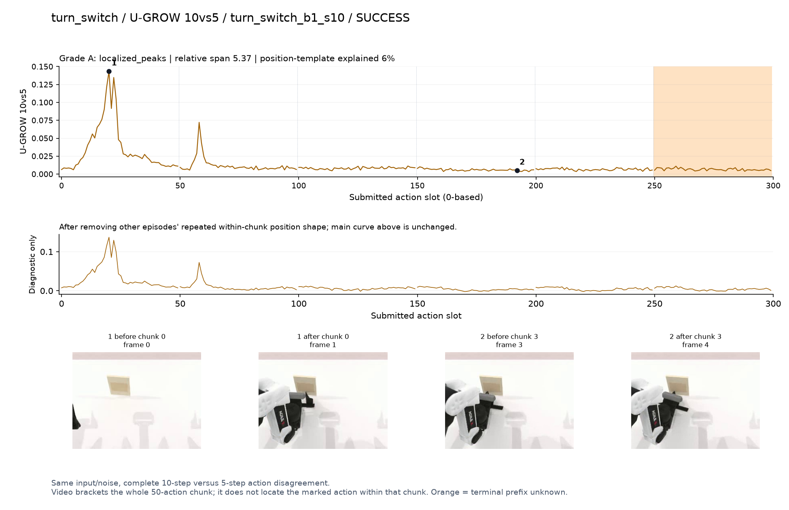

# turn_switch

[全部任务](../README.md#全部任务) · [按信号看](../README.md#按信号看)

主图保留逐动作原始值；细虚线为chunk边界，橙色为终止段实际执行长度不明，未用于筛选。帧只对应chunk前后，不能精确定位某个h的接触瞬间。A/B/C是形态筛选等级，优先读人工备注。

## DV

**可解释候选**：候选：q0夹爪从远处伸到开关处时集中峰；不是后期拨动的唯一高点。

轨迹 `turn_switch_b0_s15`；成功；种子 `590100`；正式验收。

[PNG原图](../figures/turn_switch/dv.png) · [SVG矢量图](../figures/turn_switch/dv.svg) · [完整元数据](../entries/turn_switch/dv.json)

对应帧：[1 before q0](../frames/turn_switch/turn_switch_b0_s15/f000.jpg) · [1 after q0](../frames/turn_switch/turn_switch_b0_s15/f001.jpg) · [2 before q1](../frames/turn_switch/turn_switch_b0_s15/f001.jpg) · [2 after q1](../frames/turn_switch/turn_switch_b0_s15/f002.jpg)

## Fresco-tail5

**较弱**：弱阶段趋势：靠近开关后基线升高但抖动密集，生成路径长度混杂强。

轨迹 `turn_switch_b1_s00`；成功；种子 `592800`；正式验收。

[PNG原图](../figures/turn_switch/fresco.png) · [SVG矢量图](../figures/turn_switch/fresco.svg) · [完整元数据](../entries/turn_switch/fresco.json)

对应帧：[1 before q3](../frames/turn_switch/turn_switch_b1_s00/f003.jpg) · [1 after q3](../frames/turn_switch/turn_switch_b1_s00/f004.jpg) · [2 before q0](../frames/turn_switch/turn_switch_b1_s00/f000.jpg) · [2 after q0](../frames/turn_switch/turn_switch_b1_s00/f001.jpg)

## GEO-full

**可解释候选**：候选：q0接近、q1开关附近调整两个高区。

轨迹 `turn_switch_b1_s00`；成功；种子 `592800`；正式验收。

[PNG原图](../figures/turn_switch/geo.png) · [SVG矢量图](../figures/turn_switch/geo.svg) · [完整元数据](../entries/turn_switch/geo.json)

对应帧：[1 before q0](../frames/turn_switch/turn_switch_b1_s00/f000.jpg) · [1 after q0](../frames/turn_switch/turn_switch_b1_s00/f001.jpg) · [2 before q1](../frames/turn_switch/turn_switch_b1_s00/f001.jpg) · [2 after q1](../frames/turn_switch/turn_switch_b1_s00/f002.jpg)

## GeoAAC-growth

**受其他因素影响**：谨慎：q0接近有宽区，q4窄峰在chunk首部，后者不宜解释为新接触。

轨迹 `turn_switch_b1_s00`；成功；种子 `592800`；正式验收。

[PNG原图](../figures/turn_switch/geoaac.png) · [SVG矢量图](../figures/turn_switch/geoaac.svg) · [完整元数据](../entries/turn_switch/geoaac.json)

对应帧：[1 before q0](../frames/turn_switch/turn_switch_b1_s00/f000.jpg) · [1 after q0](../frames/turn_switch/turn_switch_b1_s00/f001.jpg) · [2 before q4](../frames/turn_switch/turn_switch_b1_s00/f004.jpg) · [2 after q4](../frames/turn_switch/turn_switch_b1_s00/f005.jpg)

## SHIFT

**较弱**：弱阶段趋势：靠近开关后基线略抬高，抖动与路径长度混杂强。

轨迹 `turn_switch_b1_s00`；成功；种子 `592800`；正式验收。

[PNG原图](../figures/turn_switch/shift.png) · [SVG矢量图](../figures/turn_switch/shift.svg) · [完整元数据](../entries/turn_switch/shift.json)

对应帧：[1 before q5](../frames/turn_switch/turn_switch_b1_s00/f005.jpg) · [1 after q5](../frames/turn_switch/turn_switch_b1_s00/f006.jpg) · [2 before q0](../frames/turn_switch/turn_switch_b1_s00/f000.jpg) · [2 after q0](../frames/turn_switch/turn_switch_b1_s00/f001.jpg)

## Tell-Tale Norm

**较弱**：弱：每chunk开头反复高，难解释为每次都发生关键事件。

轨迹 `turn_switch_b0_s12`；成功；种子 `590400`；正式验收。

[PNG原图](../figures/turn_switch/norm.png) · [SVG矢量图](../figures/turn_switch/norm.svg) · [完整元数据](../entries/turn_switch/norm.json)

对应帧：[1 before q0](../frames/turn_switch/turn_switch_b0_s12/f000.jpg) · [1 after q0](../frames/turn_switch/turn_switch_b0_s12/f001.jpg) · [2 before q3](../frames/turn_switch/turn_switch_b0_s12/f003.jpg) · [2 after q3](../frames/turn_switch/turn_switch_b0_s12/f004.jpg)

## SR-window5

**较弱**：弱：chunk边界重复高、小幅多波动。

轨迹 `turn_switch_b1_s10`；成功；种子 `593100`；正式验收。

[PNG原图](../figures/turn_switch/sr.png) · [SVG矢量图](../figures/turn_switch/sr.svg) · [完整元数据](../entries/turn_switch/sr.json)

对应帧：[1 before q1](../frames/turn_switch/turn_switch_b1_s10/f001.jpg) · [1 after q1](../frames/turn_switch/turn_switch_b1_s10/f002.jpg) · [2 before q2](../frames/turn_switch/turn_switch_b1_s10/f002.jpg) · [2 after q2](../frames/turn_switch/turn_switch_b1_s10/f003.jpg)

## U-GROW 10vs5

**可解释候选**：候选：q0接近开关时孤立主峰，其余较低。

轨迹 `turn_switch_b1_s10`；成功；种子 `593100`；正式验收。

[PNG原图](../figures/turn_switch/ugrow.png) · [SVG矢量图](../figures/turn_switch/ugrow.svg) · [完整元数据](../entries/turn_switch/ugrow.json)

对应帧：[1 before q0](../frames/turn_switch/turn_switch_b1_s10/f000.jpg) · [1 after q0](../frames/turn_switch/turn_switch_b1_s10/f001.jpg) · [2 before q3](../frames/turn_switch/turn_switch_b1_s10/f003.jpg) · [2 after q3](../frames/turn_switch/turn_switch_b1_s10/f004.jpg)
