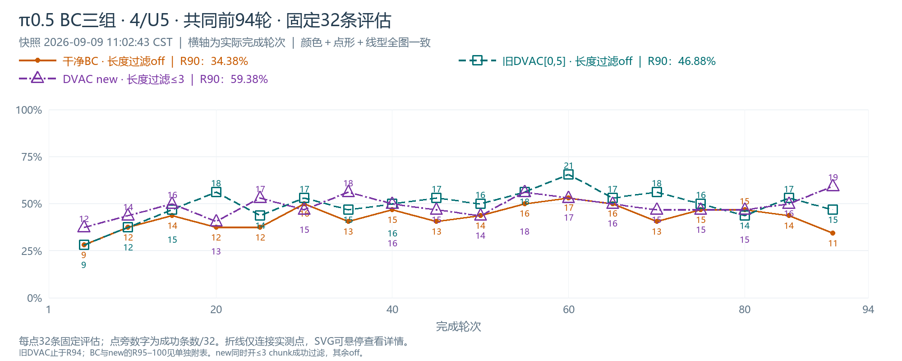
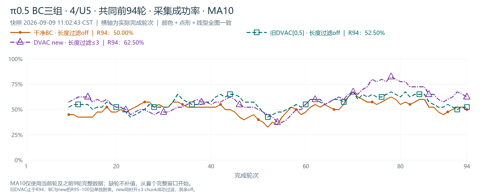
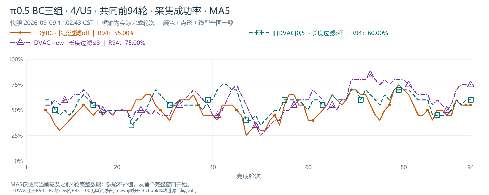
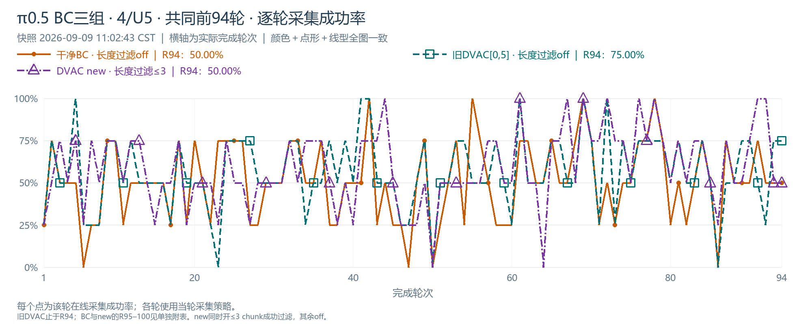
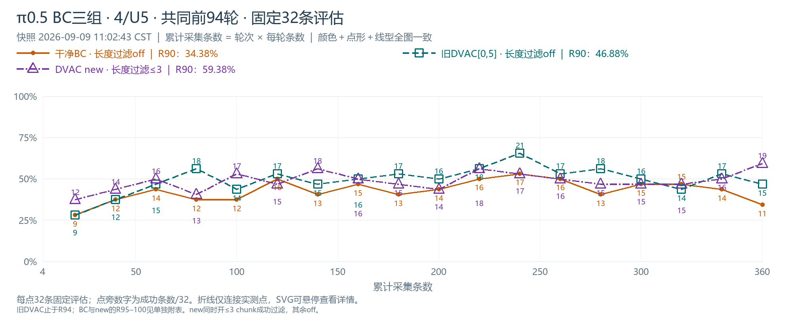
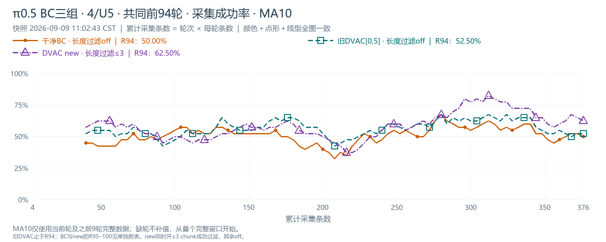
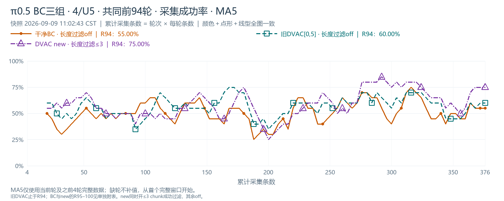
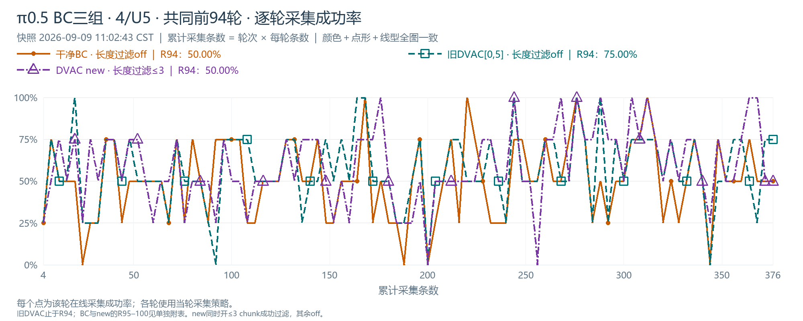

# π0.5 4/U5：干净BC、旧DVAC与DVAC new

三组均为每轮4条、U5、batch1024/micro32。干净BC和new已完成R100，旧DVAC主动停止于R94。本图册复用已落盘最终数据（new来源快照 2026-09-09 11:02:43 CST），不访问或改变服务器。

**共同R5–90：new相对旧DVAC -0.69个百分点，7胜2平9负。** 新方法相对干净BC的增益不能证明它超过旧DVAC。new还同时开启成功长度过滤≤3 chunk；另外两组未过滤，归因需考虑此差异。

| 比较（候选−参照） | 18个共同fixed点平均 | 胜/平/负 | 最后5个共同fixed点 R70–90 |
|---|---:|---:|---:|
| 旧DVAC[0,5] · 长度过滤off − 干净BC · 长度过滤off | +6.60 pp | 15/2/1 | +7.50 pp |
| DVAC new · 长度过滤≤3 − 干净BC · 长度过滤off | +5.90 pp | 12/5/1 | +7.50 pp |
| DVAC new · 长度过滤≤3 − 旧DVAC[0,5] · 长度过滤off | -0.69 pp | 7/2/9 | +0.00 pp |

| 共同窗口 | 干净BC | 旧DVAC | DVAC new＋长度过滤 |
|---|---:|---:|---:|
| fixed R5–90均值 | 42.88% | 49.48% | 48.78% |
| fixed R5–30均值 | 39.06% | 44.27% | 45.31% |
| fixed R35–60均值 | 45.83% | 53.65% | 51.04% |
| fixed R65–90均值 | 43.75% | 50.52% | 50.00% |
| R1–94采集成功率 | 50.80% | 56.38% | 58.78% |
| R94采集MA5 | 55.00% | 60.00% | 75.00% |
| R94采集MA10 | 50.00% | 52.50% | 62.50% |

**数据池与权重线索（共同R94）：**

| 实验 | 累计采集成功 | 入池成功episode | 过滤成功episode | 池中query |
|---|---:|---:|---:|---:|
| 干净BC · 长度过滤off | 191 | 191 | 0 | 597 |
| 旧DVAC[0,5] · 长度过滤off | 212 | 212 | 0 | 669 |
| DVAC new · 长度过滤≤3 | 221 | 202 | 19 | 606 |

- new在R1–94的训练batch平均W为 1.000000，各轮记录的W标准差均值 0.314；内层/外层标准差均值分别 0.236/0.198。说明新归一化确实保持均重1，权重仍有变化；这不是无干预。
- 旧版有W记录的轮次（R1–94）均值记录平均为 1.102，但旧版统计新入池样本，新版统计实际训练batch，不能把两者直接当同一分布比较。
- 两版都保留高V增加模仿权重的方向；变化是新版的归一化范围、动态批内重算、均值约束以及长度过滤。当前曲线不能单独判断哪一项导致差异。
- success_once始终统计采集是否成功；被长度过滤的成功轨迹仍算采集成功，只是不入训练池。
- 不直接用两版加权actor_loss的绝对值判性能，因损失权重和数据组成不同。

**R95–100补充（旧DVAC已停止，不补点、不外推）：**

| 轮次 | BC原始采集 | new原始采集 | BC MA5/MA10 | new MA5/MA10 | BC/new fixed32 |
|---|---:|---:|---:|---:|---|
| R95 | 50% | 50% | 55.0%/50.0% | 70.0%/62.5% | 15/32、19/32 |
| R96 | 75% | 100% | 55.0%/57.5% | 70.0%/70.0% | — |
| R97 | 75% | 100% | 60.0%/57.5% | 70.0%/72.5% | — |
| R98 | 75% | 25% | 65.0%/60.0% | 65.0%/70.0% | — |
| R99 | 75% | 100% | 70.0%/62.5% | 75.0%/75.0% | — |
| R100 | 75% | 50% | 75.0%/65.0% | 75.0%/72.5% | 14/32、17/32 |

辅助比较完整R5–100：new相对BC +6.41 pp，14胜5平1负；不与旧DVAC不同终点混算。

所有比较均为单seed、同一固定32任务重复评估，检查点不是独立重复样本。MA5/10用完整过去5/10轮，分别对应20/40次训练采集，不补初始窗口。三组每轮采集数相同，因此轮次图与采样图形状相同，后者明确训练采样成本；横轴不含fixed评估采集。

[交互图册：可隐藏任一曲线](index.html) · [完整曲线CSV](data/curves.csv) · [实际绘图点](data/plotted_points.csv) · [统计JSON](summary.json)。

## 完成轮次 · π0.5 BC三组 · 4/U5 · 共同前94轮 · 固定32条评估

[PNG](plots/bc4_all_round_eval.png) · [可编辑SVG](plots/bc4_all_round_eval.svg)

## 完成轮次 · π0.5 BC三组 · 4/U5 · 共同前94轮 · 采集成功率 · MA10

[PNG](plots/bc4_all_round_ma10.png) · [可编辑SVG](plots/bc4_all_round_ma10.svg)

## 完成轮次 · π0.5 BC三组 · 4/U5 · 共同前94轮 · 采集成功率 · MA5

[PNG](plots/bc4_all_round_ma5.png) · [可编辑SVG](plots/bc4_all_round_ma5.svg)

## 完成轮次 · π0.5 BC三组 · 4/U5 · 共同前94轮 · 逐轮采集成功率

[PNG](plots/bc4_all_round_train.png) · [可编辑SVG](plots/bc4_all_round_train.svg)

## 累计训练采样 · π0.5 BC三组 · 4/U5 · 共同前94轮 · 固定32条评估

[PNG](plots/bc4_all_samples_eval.png) · [可编辑SVG](plots/bc4_all_samples_eval.svg)

## 累计训练采样 · π0.5 BC三组 · 4/U5 · 共同前94轮 · 采集成功率 · MA10

[PNG](plots/bc4_all_samples_ma10.png) · [可编辑SVG](plots/bc4_all_samples_ma10.svg)

## 累计训练采样 · π0.5 BC三组 · 4/U5 · 共同前94轮 · 采集成功率 · MA5

[PNG](plots/bc4_all_samples_ma5.png) · [可编辑SVG](plots/bc4_all_samples_ma5.svg)

## 累计训练采样 · π0.5 BC三组 · 4/U5 · 共同前94轮 · 逐轮采集成功率

[PNG](plots/bc4_all_samples_train.png) · [可编辑SVG](plots/bc4_all_samples_train.svg)

