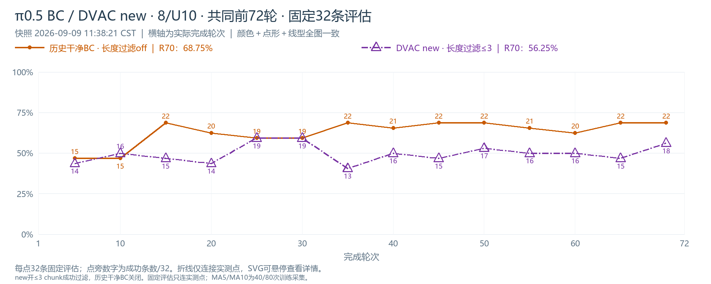
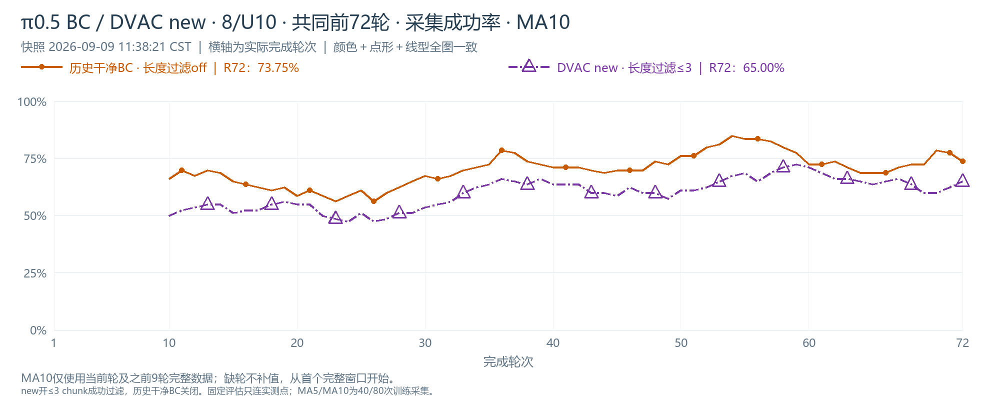
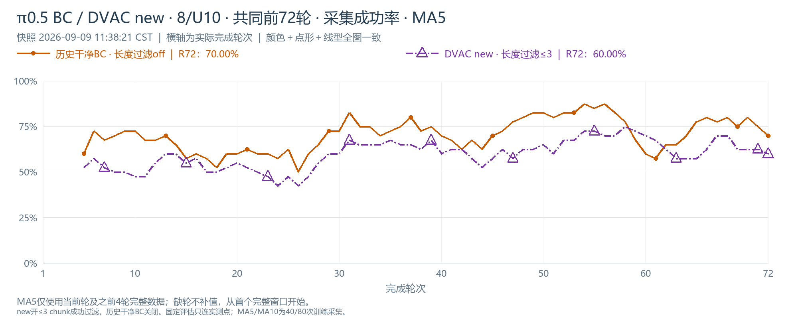
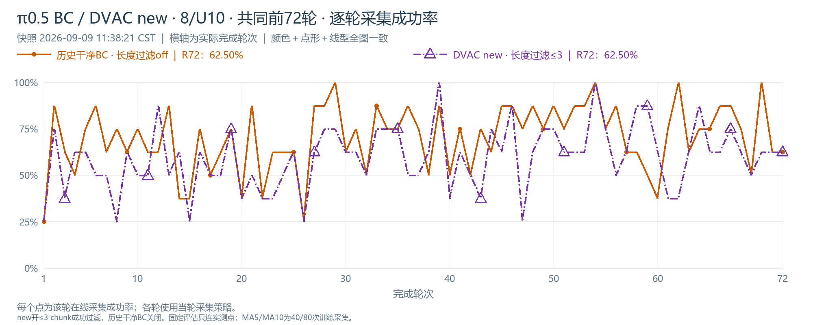

# DVAC new 8/U10最终对照

新8/U10最后完成R72；历史干净BC已完成R100。四图均只比较共同前72轮。

**共同fixed R5–70，14个检查点：new相对干净BC -13.17个百分点，1胜2平11负。**

| 指标 | 历史干净BC | DVAC new＋长度过滤 |
|---|---:|---:|
| 共同fixed检查点均值 | 62.95% | 49.78% |
| 最后5个共同fixed点均值 | 66.88% | 51.25% |
| 最后共同轮采集 R72 | 62.50% | 62.50% |
| 最后共同轮MA5 R72 | 70.00% | 60.00% |
| 最后共同轮MA10 R72 | 73.75% | 65.00% |
| 前72轮采集总体成功率 | 69.97% | 59.38% |

两组均为每轮8条/U10、batch1024/micro32，其余预算沿用各自对照。新版同时改变DVAC权重处理与成功长度过滤，差异按组合效果理解。每点fixed32为同一固定场景集重复评估，单seed结果；检查点不是独立重复。采集曲线不因长度过滤重定义，MA5/10不补未满窗口。

[交互图册](index.html) · [完整曲线CSV](data/curves.csv) · [统计JSON](summary.json)。

## π0.5 BC / DVAC new · 8/U10 · 共同前72轮 · 固定32条评估

[PNG](plots/new8_closeout_eval.png) · [SVG](plots/new8_closeout_eval.svg)

## π0.5 BC / DVAC new · 8/U10 · 共同前72轮 · 采集成功率 · MA10

[PNG](plots/new8_closeout_ma10.png) · [SVG](plots/new8_closeout_ma10.svg)

## π0.5 BC / DVAC new · 8/U10 · 共同前72轮 · 采集成功率 · MA5

[PNG](plots/new8_closeout_ma5.png) · [SVG](plots/new8_closeout_ma5.svg)

## π0.5 BC / DVAC new · 8/U10 · 共同前72轮 · 逐轮采集成功率

[PNG](plots/new8_closeout_train.png) · [SVG](plots/new8_closeout_train.svg)

