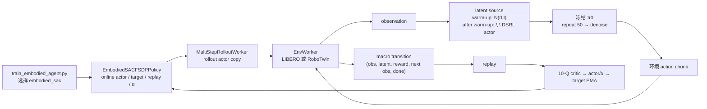

# 完整历史参考（2026-07-28 归档）

> 本文件保留此前的完整材料索引、RLT / RLToken、QAM、设计推导和长验收清单；它是非规范性历史参考。当前 DSRL 实施规范见同目录 `00_INDEX_AND_IMPLEMENTATION_PLAN.md`。

# RLinf × RoboTwin × π0 传统 RL：材料索引与实施路线

> 状态：2026-07-28 首版设计收敛版。
>
> 范围：DSRL、RLT / RLToken、QAM，以及可作为桥梁的 SAC-Flow、RLPD。
>
> 2026-07-28 本轮只做本机代码、历史现场证据与官方材料复核；没有刷新或修改服务器，没有安装依赖、启动或停止训练。
>
> 本文件是本主题当前唯一的索引与实施计划。动态服务器状态仍以仓库根目录 `HANDOFF.md` 的最新现场增量为准。

## 1. 一页结论

1. **DSRL 已经在服务器当前 RLinf pin 中完整存在**，不是只有论文或伪代码：有 π0 / π0.5 接口、LIBERO 配置、轻量图像/状态 encoder、Gaussian latent-noise actor、10-Q critic、SAC replay/target worker、文档与 E2E 定义。它尚未适配或跑通 RoboTwin，是最短的第一条实现路线。
2. **RLT / RLToken 也已经完整存在**，但工作量明显大于 DSRL。它是两阶段方案：先通过 SFT 学 RL-token 表征，再冻结特征模型训练小型 actor-critic。当前公开模板是 π0.5 + ManiSkill/真机，不是用户目标的 π0 + RoboTwin；后者还缺 Stage 1 数据配置、route/switch 语义和 simulator transition 支持。
3. **QAM 不在当前 RLinf pin、工作树、文档或 Git 历史中**。这里指 Qiyang Li 与 Sergey Levine 的 *Q-learning with Adjoint Matching*。官方实现是 JAX/Flax + OGBench，不是 π0 / RoboTwin 的即插即用模块；应作为独立研究分支，而不是和 DSRL、RLT 一次混在一起。
4. 推荐形成一条可解释的实验梯子：

   `π0 SFT / 既有 PPO、GRPO → DSRL → RLT → SAC-Flow 桥梁基线 → QAM`

5. 第一项 N=1 应是 **DSRL × π0 × RoboTwin**。`adjust_bottle` 适合最快工程验证，因为现成 π0 SFT、PPO 配置和评估协议齐全；正式方法比较还应增加一个固定种子下基础成功率有明显余量的任务，避免只在接近饱和的任务上做结论。

## 2. 目标与研究问题

目标不是把多个名字拼成一个算法，而是在同一 π0、同一 RoboTwin 协议和同一 RLinf runner 上比较三种“策略自由度”：

| 路线 | RL 真正优化什么 | π0 主体 | 主要研究问题 |
|---|---|---|---|
| DSRL | 初始 latent noise 的小型 Gaussian policy | 冻结 | 黑盒冻结 VLA 时，小策略能否以最低算力提高成功率？ |
| RLT | 压缩的 RL token + 小型 action policy | Stage 2 冻结 | VLA 内部表征能否让传统 off-policy actor-critic 更快学习精细动作？ |
| QAM | diffusion / flow actor 本身的向量场或可训练适配器 | 需要可训练部分 | 能否用 critic 的 action gradient 稳定优化有表达力的生成式策略？ |

统一比较至少回答：

- 相同 simulator transitions 下的成功率、学习曲线 AUC 和方差；
- reset 次数、wall-clock、GPU-hours、峰值 GPU/RAM；
- critic 稳定性、actor 参数变化、rollout/actor 同步是否真实发生；
- 算法增益来自策略自由度、表示学习，还是更多演示数据与计算。

## 3. 信息分层与维护规则

### 3.1 四层材料

| 层级 | 内容 | 本主题中的位置 | 使用规则 |
|---|---|---|---|
| 原始材料 | 原论文、官方代码、锁定源码、原始日志/旧实验笔记 | 外部链接、服务器路径、E 盘历史文件 | 原文件不复制、不改写；带凭据的文件只记录敏感标记 |
| 索引 | 路径、commit/hash、权威性、覆盖内容、替代关系 | 本文件第 5、6、7 节 | 先查索引，再按问题打开少量原文 |
| 消化摘要 | “里面有什么、证据强度、对本任务有什么用、哪些不能照搬” | 本文件第 6 节 | 摘要不冒充原始证据或当前服务器状态 |
| 动态交接 | 当前进程、GPU/RAM、最新日志、checkpoint、待办 | 根目录 `HANDOFF.md` | 每个新任务重新现场刷新后才能称为“当前” |

### 3.2 权威顺序

1. 服务器现场只读检查；
2. 锁定 commit 的源码、resolved config、原始日志与 checkpoint；
3. 原论文、官方项目页和官方实现；
4. 本项目权威交接与实施记录；
5. 历史流水账、聊天摘要和 Memories。

### 3.3 现有上下文入口

| 入口 | 职责 | 本次如何使用 |
|---|---|---|
| `PROJECT_CONTEXT.md` | 长期安全、目录、实验验收规则 | 保持不变 |
| `HANDOFF.md` | 动态状态入口 | 追加本次现场快照与本文件入口 |
| `C:\Users\86136\Documents\Codex\2026-07-13\n\autodl-rlinf-fastwam-handoff-20260716.md` | π0 / AutoDL 历史权威交接 | 恢复历史后再用现场检查覆盖动态事实 |
| `docs/fastwam-robotwin-rlinf-grpo/00_INDEX.md` | Fast-WAM 迁移总索引 | 只链接，不在这里重写 Fast-WAM 事实 |
| `docs/fastwam-robotwin-rlinf-grpo/01_REFERENCE_MATRIX.md` | Motus、LaWAM、π0、Fast-WAM 旧材料矩阵 | 复用其迁移反例和验收原则 |
| `docs/fastwam-robotwin-rlinf-grpo/05_IMPLEMENTATION_PLAN.md` | Fast-WAM 唯一实施计划 | 本主题不修改、不复制 |
| 本文件 | DSRL / RLT / QAM 的索引与唯一计划 | 后续本主题决策及时写回这里 |

## 4. 服务器现场快照

最新复核时间：**2026-07-27 22:46–22:57 CST**。这只是带时间戳的现场证据，不自动保持为未来状态。

### 4.1 资源与进程

| 项目 | 现场结果 |
|---|---|
| 训练进程 | 没有 RLinf driver、Ray worker 或训练任务；仅有 Jupyter、TensorBoard、面板服务和本轮只读 SSH 命令 |
| GPU | 2 × NVIDIA A800-SXM4-80GB；两卡均 0% utilization、0 MiB 使用 |
| 主机内存 | 总量约 1.0 TiB，可用约 979 GiB；无 swap |
| 当前 cgroup | 上限 240 GiB，`memory.high` 236 GiB；OOM / OOM-kill 计数为 0 |
| 数据盘 | `/root/autodl-tmp` 约 1.9 TiB，总用量 994 GiB，剩余 851 GiB |

### 4.2 代码 pin

| 路径 | HEAD / 分支 | 状态与用途 |
|---|---|---|
| `/root/autodl-tmp/RLinf` | `6d0db56bf26f972cd27fa29535f5eb939e80e5bf`；`local/openpi-a800-2gpu-migration` | π0 现役基座；只有 4 份本地 A800 配置和 `local_scripts/` 未跟踪 |
| `/root/autodl-tmp/RLinf_fastwam_rlinf` | `8138d6700e3838250c1139289ebfba43d48ff7de`；`feat/fastwam-robotwin-grpo` | Fast-WAM 集成，工作树干净 |
| `/root/autodl-tmp/FastWAM` | detached `45d8e1458921d83f8ad6cf9ce993d371208dabd0` | 官方 standalone oracle；有未跟踪的 vendored RoboTwin assets/data/policy |
| `/root/autodl-tmp/RoboTwin` | `c3ddfa8…` | 有 Motus、latent action、StarVLA 与 results 的历史修改/目录 |
| `/root/autodl-tmp/RoboTwin_RLinf` | 实际 repo top 解析到 `/root/autodl-tmp` | 数据盘根部存在异常宽的 `.git` 范围，后续禁止在未厘清前做写操作 |

服务器 pin `6d0db56` 已包含 DSRL 和 RLT 的主体提交；抽查的 10 个核心 blob 与本机较新 RLinf 快照 `c5ca51cc` 相同。

### 4.3 环境与历史产物

| 环境/产物 | 现场状态 |
|---|---|
| `/root/autodl-tmp/RLinf/.venv` | Python 3.11.14，Torch 2.6.0+cu124，Ray 可用 |
| `FastWAM-official` | Python 3.10.20，Torch 2.7.1+cu128，无 Ray |
| `FastWAM-RLinf` | Python 3.11.15，Torch 2.7.1+cu128，Ray 可用 |
| π0 GRPO | 历史 run 已完成；checkpoint 10–100，step 100 DCP 约 9.7 GiB |
| Fast-WAM GRPO | `move_stapler_pad` checkpoints 到 70，DCP 约 27 GiB |
| Fast-WAM PPO | checkpoints 10/20/30；日志在 step 34 记录 Raylet 意外退出，当前没有 cgroup OOM 证据，根因仍未解决 |

### 4.4 服务器上的既有开发索引

| 开发线 | 可复用价值 | 不能直接继承的部分 |
|---|---|---|
| π0 + PPO/GRPO | 当前 RoboTwin/OpenPI outer skeleton、三相机/14D action、tensor-only replay、sync、DCP、资源口径 | 旧训练曲线不等于新方法效果；每次需固定种子复评 |
| Motus + RLinf | train/eval 共用 denoise core、old/new 同 transition replay、FSDP/sync/DCP 反例 | 旧 RLinf、高维 WAM 概率链和已退化 checkpoint |
| LaWAM + RLinf | dtype、query token、固定 replay shape、环境边界经验 | 16D EE action 和 planner 路径不同于 π0 qpos |
| Fast-WAM standalone / GRPO / PPO | 官方 oracle、迁移可追溯模板、集中验收与资源监控 | 单独由既有 Fast-WAM 总文档维护；不作为 DSRL/RLT/QAM 代码来源 |
| TTS / OPD | 候选动作诊断、hard-seed、winner-only 更新和错误共识的反例 | 没有形成可复现的 DSRL/RLT/QAM 实现 |

## 5. 用户提供的七份历史材料：原始文件登记

这些文件是**历史实验笔记/流水账**，不是当前源码或原始服务器日志。至少两份包含敏感凭据；本索引不复制任何凭据。

| 原始文件 | SHA256 | 类型 | 敏感 | 本任务重要性 |
|---|---|---|---|---|
| `E:\0school\研二上\iclr27\0727 sl rl\Exp_snd.md` | `CB2B7923…C7182EA` | 早期综合实验流水账 | 未发现本任务需复制的秘密 | B：历史 DSRL 想法；直接实现 C |
| `E:\0school\研二上\iclr27\0727 sl rl\fastwam rlinf.md` | `78C71634…5FE435` | Fast-WAM × RLinf 实施/训练日记 | `secret_present: true` | B+：验收与事故模板 |
| `E:\0school\研二上\iclr27\0727 sl rl\fastwam.md` | `2337F3DE…766B1C` | Fast-WAM standalone 流水账 | `secret_present: true` | C+；standalone oracle 为 B |
| `E:\0school\研二上\iclr27\0727 sl rl\lawam rlinf.md` | `9571CC2E…1B6A67` | LaWAM 接入流水账 | 不复制认证内容 | B-：窄工程经验 |
| `E:\0school\研二上\iclr27\0727 sl rl\Motus + RLinf.md` | `77776161…0C1D11` | Motus 接入与 RL 实验日记 | 不复制认证内容 | A-：工程模板与负例 |
| `E:\0school\研二上\iclr27\0727 sl rl\Openpi + PPO AutoDL A800.md` | `82C0C861…F03CC` | 早期 π0 PPO 流水账 | 不复制认证内容 | B-：已被后续材料取代 |
| `E:\0school\研二上\iclr27\0727 sl rl\pi0 + ppo_grpo.md` | `B6AB1E97…397996` | π0 PPO/GRPO 综合运行记录 | 不复制认证内容 | A：最接近当前系统基线 |

完整快照 hash：

```text
Exp_snd.md                         CB2B7923AFE733B63A3BAE1758266520E8BF4630FF69629A5FE5F5931C7182EA
fastwam rlinf.md                   78C716341C43C9060E4064897246140716EFF592FE17A394CC694977BA5FE435
fastwam.md                         2337F3DE182BE0E6E8B2DA5B52115FC80A1844E406189803949A702E79766B1C
lawam rlinf.md                     9571CC2EE354D48825A6652C2EF1B795B39948DD0FFCC078AC2E083EB81B6A67
Motus + RLinf.md                   77776161E2C785D1FA2C37ED98CAA0B46BF7C6BA9E9F557749B8BA13A00C1D11
Openpi + PPO AutoDL A800.md         82C0C861B05A7B7E309B1BCD148741920EEECB77C018BC413740E2B6350F03CC
pi0 + ppo_grpo.md                  B6AB1E974D8A3EE9E44FB25A42191E35839E91D4169CCBBC47B60C3C0B397996
```

## 6. 七份材料的消化摘要

| 材料 | 里面有什么 | 对本次最有用 | 不能直接当真或照搬 |
|---|---|---|---|
| `Exp_snd.md` | Motus standalone、TTS 多候选选择、OPD winner-only 在线蒸馏、运行队列；有一段“从 observation 生成 initial noise，再交给 frozen Motus”的 DSRL 想法 | hard-seed、候选 rank/cluster/fallback 诊断；说明用户此前已想到 latent-noise actor | 该“DSRL”没有实现、论文、commit 或 RLinf 接口，不能当作当前 DSRL 证据；文中没有 RLT/QAM |
| `fastwam rlinf.md` | Fast-WAM GRPO/PPO 接入、CUDA IPC、CPU bucket、资源、EV/value-clip 指标缺陷 | 固定种子 eval → parity → 参数 delta → sync → full-buffer critic 的验收顺序 | 不是当前状态；PPO 尚无可靠正向学习证明；含秘密 |
| `fastwam.md` | 官方 Fast-WAM standalone 环境、依赖、checkpoint、单 episode 推理 | 环境隔离和官方 oracle 方法 | 对 π0 DSRL/RLT/QAM 几乎没有直接算法内容；旧安装步骤有已纠正项 |
| `lawam rlinf.md` | adapter、tensor-only replay、flow query token value head、dtype、B=1 PPO 与 B=4 planner timeout | token/mask、dtype/device、checkpoint schema 和环境根因分层 | EE action/planner 与 π0 14D qpos 不同；一步 smoke 不证明学习 |
| `Motus + RLinf.md` | model registry、official/batch eval、denoise/logprob、FSDP、sync、DCP、PPO/GRPO 与多轮修正 | 最重要负例：backward/DCP 成功不等于 RL 正确；train/eval 必须共核，old/new 必须同 transition | 早期版本含手写第二套 denoise、可变 replay、伪兼容；独立 eval 曾 `0.875→0.6875→0.3125` |
| `Openpi + PPO AutoDL A800.md` | 首次 π0/OpenPI PPO、CPU OOM、step 5 eval | 早期环境布局、host RAM 与独立 checkpoint eval 教训 | 已被 `pi0 + ppo_grpo.md` 和现场交接替代；旧 value-clip 解读不可靠 |
| `pi0 + ppo_grpo.md` | 1→2 A800、PPO/GRPO、DCP、offload/RAM、dense reward 草案 | 本任务最重要系统外层：env → action/replay → loss → sync → DCP | 仍是历史快照；没有 RLT/QAM，DSRL 只有旁支概念 |

七份文档的覆盖结论：

- DSRL：只有 `Exp_snd.md` 的未实现历史想法；真正实现证据来自当前 RLinf 源码和官方 DSRL。
- RLT / RLToken：七份均无命中；真正材料来自当前 RLinf RLT 两阶段实现和官方 RLT。
- QAM：七份均无命中；当前 RLinf 也无实现，必须从论文与官方仓库新建研究分支。

## 7. 方法与源码地图

### 7.1 DSRL：当前已有主体

官方材料：

- [论文：Diffusion Steering via Reinforcement Learning](https://arxiv.org/abs/2506.15799)
- [项目页](https://diffusion-steering.github.io/)
- [官方 π0 实现](https://github.com/nakamotoo/dsrl_pi0)
- [通用官方实现](https://github.com/ajwagen/dsrl)
- [RLinf DSRL 文档](https://rlinf.readthedocs.io/en/latest/rst_source/examples/embodied/dsrl.html)

服务器代码：

| 文件 | 关键 symbol / 职责 |
|---|---|
| `docs/source-en/rst_source/examples/embodied/dsrl.rst` | 设计、LIBERO 配方、官方引用 |
| `examples/embodiment/config/libero_spatial_dsrl_openpi.yaml` | π0 + LIBERO 同步 DSRL 配置 |
| `examples/embodiment/config/libero_spatial_async_dsrl_openpi.yaml` | 异步版本；另有 π0.5 对应配置 |
| `rlinf/models/embodiment/openpi/openpi_action_model.py` | `use_dsrl`、`predict_action_batch`、`sac_forward`、`sac_q_forward` |
| `rlinf/models/embodiment/modules/gaussian_policy.py` | squashed Gaussian latent-noise actor |
| `rlinf/models/embodiment/modules/compact_encoders.py` | 64×64 主相机 encoder、state encoder、10-Q ensemble |
| `rlinf/workers/actor/fsdp_sac_policy_worker.py` | replay、critic/actor/temperature、target/EMA、同步 |

调用链：

`RoboTwin observation → 小型 DSRL actor 采样 initial noise → frozen π0 denoise → 真实 action chunk → env → noise transition replay → SAC actor/10-Q/target 更新`

已确认的迁移差异：

1. LIBERO state 是 8D；RoboTwin 是 14D。
2. π0 RoboTwin 基座使用三相机；当前 DSRL actor/critic 只读取 `main_images` 的 64×64 表示。第一版可保持官方 DSRL 语义，但必须把“单相机小策略 + 三相机冻结 π0”写成明确实验设计，不应误称三相机 DSRL。
3. 当前 Gaussian actor 生成一个 32D noise vector 并沿 `action_horizon` 重复；RoboTwin π0 配置为 50 chunks。必须先与官方 `dsrl_pi0` 做固定 observation / 固定 noise parity，再决定是否扩展，而不是直接认定为 bug。
4. SAC 的 chunk reward、`gamma ** num_action_chunks` 和实际 RoboTwin `chunk_step` 必须逐层对齐。
5. 当前没有 RoboTwin DSRL 配置、回归测试或已跑通证据。

关键提交：`42530b72`（π0 DSRL）、`41dcdf03`（π0.5 DSRL）、`72d1e0de`（文档）。

### 7.2 RLT / RLToken：当前已有两阶段主体

官方材料：

- [Physical Intelligence RLT 项目页](https://www.pi.website/research/rlt)
- [论文](https://arxiv.org/abs/2604.23073)
- [论文 PDF](https://www.pi.website/download/rlt.pdf)
- [RLinf RLT 文档](https://rlinf.readthedocs.io/en/latest/rst_source/examples/embodied/rlt.html)

原论文使用 Physical Intelligence 内部的 π0.6，并给出四个真机精细操作任务证据；项目页没有公开对应训练代码或权重。当前可执行代码来自 RLinf 的公开复现，模板基于 π0.5，因此迁移到 π0 + RoboTwin 还包含一次明确的模型版本适配。

服务器代码：

| 文件 | 关键 symbol / 职责 |
|---|---|
| `examples/sft/config/*rlt_stage1_sft_openpi_pi05.yaml` | Stage 1：VLA SFT + RL-token 重建 |
| `rlinf/models/embodiment/modules/rlt_token_transformer.py` | `RLTTokenEncoder`、`RLTTokenDecoder`、`RLTTokenTransformer` |
| `rlinf/models/embodiment/openpi/openpi_action_model.py` | `use_rlt`、从 π0 hidden states 提取 `z_rl` |
| `examples/embodiment/config/maniskill_rlt_stage2_ac_mlp.yaml` | Stage 2 simulator 模板 |
| `rlinf/models/embodiment/mlp_policy/rlt_mlp_policy.py` | `RLTMLPPolicy` |
| `rlinf/algorithms/rlt/{expert,rollout,route,transition}.py` | feature model、student/reference/expert 路由、transition 归属 |
| `rlinf/workers/actor/fsdp_rlt_ac_policy_worker.py` | twin-Q、BC/Q actor loss、replay、更新 schedule |

调用链：

- Stage 1：`π0 prefix hidden states → RL-token encoder/decoder → reconstruction + VLA SFT`。
- Stage 2：`冻结 Stage 1 模型 → {z_rl, proprio, ref_chunk} → 小 MLP actor → route → env → twin-Q + BC/Q actor 更新`。

RoboTwin 的主要阻塞：

1. 需要把 π0.5 模板中的 prefix token/mask 与 hidden-state 取点对齐到目标 π0；不能假定 π0.6 论文设计、π0.5 RLinf 复现和 π0 的 token contract 完全相同。
2. 需要 RoboTwin 演示数据、normalization stats 和 Stage 1 SFT 配置；现成 π0 SFT checkpoint 不能凭空提供新初始化的 RL-token 表征。
3. 当前 simulator 专用 route/replay 只识别 ManiSkill；RoboTwin 会落入 real-world route。
4. RoboTwin 没有现成 `rlt_switch_flags`、专家接管或 critical-phase 标注，默认 route 可能持续选择 reference，无法形成有效 student transition。
5. 需要先决定：全 episode student、规则谓词切换，还是 reference/student 随机混合。该选择会改变研究问题，不能由实现细节暗中决定。
6. 当前 Stage 2 是 twin-Q + BC/Q actor 更新，不应包装成标准 maximum-entropy SAC。

关键提交：`5769c6eb`（RLT 主体）、`3d93750d`（ManiSkill）、`828b1af1`（文档）。

### 7.3 QAM：当前没有实现

这里的 QAM 指：

- [论文：Q-learning with Adjoint Matching](https://arxiv.org/abs/2601.14234)
- [项目页](https://colinqiyangli.github.io/qam/)
- [官方代码](https://github.com/ColinQiyangLi/qam)

它用 TD critic 和 critic action gradient 训练 diffusion / flow policy，并通过 adjoint matching 避免把 actor 梯度不稳定地穿过整条去噪链。官方代码以 JAX/Flax、OGBench 状态向量任务为主，包含 QAM-FQL / QAM-EDIT 等变体；它没有直接提供 π0、RoboTwin、RLinf、FSDP 或 DCP 接口。

和另外两条线的边界：

- DSRL 只训练冻结生成策略之前的 initial-noise actor；QAM 训练生成式 actor 自身的向量场或其可训练适配器。
- RLT 把 VLA 表征压成 token，再训练小动作策略；QAM 不依赖该两阶段 token 重建。
- 三者可以在同一基座比较，但第一版不应互相嵌套，否则无法归因。

### 7.4 两个高价值桥梁

| 方法 | 当前 RLinf | 用途 | 限制 |
|---|---|---|---|
| [SAC-Flow](https://arxiv.org/abs/2509.25756) / [RLinf 文档](https://rlinf.readthedocs.io/en/latest/rst_source/examples/embodied/sac_flow.html) | server pin 有 ManiSkill、真机与异步配置 | 复用 flow actor、SAC worker、replay 和 velocity reparameterization 思路；是 QAM 前的工程桥梁 | 不是 π0 VLA 的直接 QAM 实现 |
| [RLPD](https://arxiv.org/abs/2302.02948) / [官方代码](https://github.com/ikostrikov/rlpd) | server pin 有 demo-buffer 与 real-world 配置 | 把 RoboTwin 演示与 online replay 混合，作为 DSRL/RLT 的训练配方和传统 off-policy 强基线 | 它不是另一种 VLA 参数化；演示数据量与 update-to-data ratio 必须计入公平比较 |

## 8. 实施路线

### 阶段 0：锁定实验协议

目的：先保证研究问题可辨识，避免在饱和任务上浪费训练。

工作：

1. 用当前 π0 SFT checkpoint 对候选 RoboTwin 任务做固定 seeds 的只读评估。
2. 选两类任务：
   - **工程任务**：`adjust_bottle`，用于最快复用现成配置和回归；
   - **研究任务**：基础成功率有明显余量、奖励与 reset 稳定、无 planner 阻塞的任务。
3. 冻结统一预算：simulator transitions、episode resets、评估 seeds、wall-clock 上限、checkpoint 周期。
4. 记录 base SFT、现有 PPO/GRPO 的同协议基线。历史训练曲线只作旁证。

放行条件：

- 同一 checkpoint、同一 seeds 重跑一致；
- reward、termination、chunk-step 语义可解释；
- 任务不是全失败或接近全成功；
- resolved config、commit、模型 hash 和 seed 清单可追溯。

### 阶段 1：DSRL × RoboTwin

#### 1A. 先建立现有 DSRL oracle

在写 RoboTwin 适配前，先对服务器 pin 中现成的 LIBERO + π0 DSRL 路径做一项最小参考验证：

- 如果本机已有对应 LIBERO assets/SFT checkpoint，则做配置 compose、固定 observation/noise parity 和一步小 smoke；
- 如果缺少权重或数据且需要下载，则停在静态调用链与官方 `dsrl_pi0` 数值 fixture，不把下载或安装当成隐式授权；
- 目的不是先复现整条论文曲线，而是证明现有 DSRL 参考链在当前 pin 上可执行，并留下 RoboTwin 改动前的 oracle。

#### 1B. 最小主体实现

以 `libero_spatial_dsrl_openpi.yaml` 和 `robotwin_adjust_bottle_ppo_openpi.yaml` 为双来源，增加一个 RoboTwin DSRL 配置和一批不可省略的窄适配：

- 保留 `pi0_aloha_robotwin`、三相机 base-policy 输入、14D environment action 和官方 normalization；
- DSRL `dsrl_state_dim` 改为 14；
- 第一版保持小 actor/critic 只读主相机，明确记录设计差异；
- 保留 SAC、temperature、10-Q 与标准 RLinf sync/DCP，但修复 macro reward、标准高斯 warm-up、transition replay、动态 UTD 和 target-shadow resume；
- 不为 smoke 修改 π0 模型规模、去噪定义、action horizon 或 runner 主链。

因此这不是“只加 YAML”任务；YAML 只能完成 compose，不能修复算法边界上的单位和状态。

#### 1C. 集中验收

1. Hydra compose 与 tensor contract：image/state/noise/model action/env action/reward/done。
2. 冻结 base：π0 非 DSRL 参数 delta 必须为 0；DSRL actor/critic/target/temperature 的 allowlist 明确。
3. 固定 observation + fixed noise：RLinf 输出与官方 DSRL / OpenPI 语义一致。
4. 同 observation 改 noise 能改变 action；train stochastic；fixed-RNG stochastic eval 可复现，deterministic mean 仅作诊断。
5. replay 中存的是 latent noise，不是 denoised env action；next observation 与 chunk reward 对齐。
6. 一次 critic、actor、target EMA、temperature update 都有 finite gradient 与非零参数 delta。
7. 更新前 actor/rollout parity；更新后同步确实改变 rollout actor。
8. 一步 smoke 保存 checkpoint/replay/FP32 target shadow；resume 再做一步；最后固定 seeds 独立 eval。

阶段成果：

- 一个可复现的 DSRL RoboTwin config；
- base / DSRL 的固定种子曲线；
- transitions、GPU-hours、成功率 AUC 与 Q-ensemble 诊断；
- 对“单相机 latent actor 是否足够”的首个可回答结论。

### 阶段 2：RLT × RoboTwin

#### 2A. Stage 1 表征学习

1. 先对 π0.5 RLT 模板与目标 π0 的 prefix token/mask、hidden-state 取点和 action reference contract 做静态与 fixed-tensor 对照。
2. 生成/核验 RoboTwin demonstration dataset 与 norm stats。
3. 从 `robotwin_sft_openpi*` 和 `*rlt_stage1_sft_openpi_pi05.yaml` 合并配置职责。
4. 训练 RL-token encoder/decoder，并保留 VLA SFT 目标。
5. 验收 hidden-state 取点、token shape、reconstruction loss、base action parity、checkpoint schema。

#### 2B. Stage 2 actor-critic

1. 先写清 RoboTwin route 设计；推荐第一版用**全 episode student + reference action 作为 BC anchor**，避免依赖尚不存在的专家接管信号。
2. 如果改为 critical-phase switch，必须用 RoboTwin 可复现的 simulator predicate 产生 `rlt_switch_flags`，并记录 transition 归属。
3. 适配 `{z_rl, proprio, ref_chunk}`、14D chunk、twin-Q、replay 与 DCP。
4. 分别报告纯 online 与 RLPD demo-mixing；不能把额外 demo 数据带来的增益归给 RLT。

放行条件：

- Stage 1 checkpoint 能稳定重建并保持 base VLA 行为；
- route 单元测试证明 student/reference/expert 每条分支可达；
- replay 中当前/下一 RLT observation 对齐；
- twin-Q、BC/Q actor、target、sync、resume 均通过；
- 固定种子 eval 显示相对 DSRL 的样本效率与算力代价。

### 阶段 3：QAM 独立研究分支

不直接在 π0 上开写，先完成三个递进证据：

1. **官方复现**：在隔离环境复现官方 QAM 的一个 OGBench 任务，锁定 commit、配置、曲线和已知修正。
2. **PyTorch 数值核**：在小型 diffusion/flow actor 上实现 lean-adjoint / VJP 核心，并与官方 JAX 的 fixed tensors、loss、gradient direction 做 parity。
3. **RLinf 小策略桥梁**：先接现有 SAC-Flow 或小型 flow actor，证明 replay、TD critic、adjoint actor update、target 与 DCP。

只有前三项通过后，才进入 π0：

- 明确训练完整 action expert、LoRA/adapter，或附加 policy field；三者不能混称；
- 保持 OpenPI conditioning、scheduler、denoise core 和 50-step action contract；
- 评估每个 denoise step 的 VJP 显存与 wall-clock；
- 用 frozen π0、DSRL、RLT、SAC-Flow 做同预算对照；
- 第一版不再叠加 RLToken 或 DSRL latent actor。

## 9. 统一评估与记录

### 9.1 核心指标

| 类别 | 必须记录 |
|---|---|
| 任务结果 | fixed-seed success、均值/置信区间、学习曲线 AUC、失败类型 |
| 样本效率 | simulator transitions、episodes、resets、demo transitions |
| 计算 | wall-clock、GPU-hours、GPU/RAM 峰值、rollout/update 比例 |
| critic | TD loss、Q 均值/范围、ensemble spread、target-online 差、有限值比例 |
| actor | entropy/std、BC 项、Q 项、gradient norm、parameter delta、饱和比例 |
| 系统一致性 | actor/rollout parity、更新后 sync、replay shape、DCP resume |

### 9.2 每个正式 run 的最小证据包

```text
commit.txt
resolved_config.yaml
command.txt
model_and_data_hashes.txt
train_and_eval_seeds.json
metrics.*
resources.csv
checkpoints/
fixed_seed_eval/
failure_summary.md
```

训练图默认横轴从 step 0 到最新完整 step；真实数据从首个记录 step 开始，不虚构 step 0 数值。交付同时包含桌面交互图和手机可读的成功率、优化指标、资源指标三张独立 PNG。

## 10. 已收敛设计与仍需讨论项

DSRL 首版不再把 LIBERO、Aloha 和 RLinf 当前 YAML 的差异混成多套主线。统一规则是：**算法高层语义跟官方 π0 + LIBERO DSRL；模型、环境和系统合同跟现有 π0 + RoboTwin。**

| 决策 | 首版结论 | 依据 / 后续条件 |
|---|---|---|
| 第一任务 | `adjust_bottle` 做工程 N=1；再选一个基础成功率有余量的研究任务 | 最快接通与可发表比较的任务要求不同 |
| DSRL 小策略相机 | 冻结 π0 继续三相机；小 actor/critic 仅主相机 64×64 | 忠实于官方 simulator DSRL；不使用 Fast-WAM 空间拼图 |
| latent / horizon / execution | $d=32,\ H=N=50$ 全部固定 | 32/50 跟 π0 checkpoint；$N=50$ 跟现有 RoboTwin 执行合同并有官方 Aloha 先例 |
| DSRL 奖励 | 唯一主线为 query-level `成功=0，否则=-1` | 在 SAC/replay 边界 canonicalize；不改共享 RoboTwin reward tensor |
| discount / done | $\gamma^{50}$；成功 termination 不 bootstrap；time-limit truncation bootstrap | 对齐官方 DSRL 与 RLinf `bootstrap_type=standard` |
| warm-up | 500 个**全局有效 macro transitions**；期间使用标准高斯 latent | 跟官方 LIBERO 可执行配方；不是 trajectory objects，也不是未训练 tanh actor |
| 更新比 | 每个新有效 macro transition 做 20 个全局 optimizer updates | 跟官方 `multi_grad_step=20`；由真实新增 transition 数动态计算 |
| replay | 全局 25,000 个压缩 macro transitions 的 DSRL 专用 ring | 来自官方 `500000 / 20`；不是旧 YAML 的 15,000 个 trajectory slots |
| batch | global 256；micro 64，只有显存 profile 不通过才降到 32 | global 跟官方 LIBERO；micro 只控制梯度累积和显存 |
| 采集并发 | 4 env、`rollout_epoch=1` 起步；资源和 policy-lag profile 通过后才试 8 | 第一版不以 16/32 env 为目标 |
| entropy / magnitude | target entropy `-16`；latent magnitude `1.0` | 跟官方 LIBERO；Aloha launcher 的 `0.0/2.0` 不进入首版 |
| resume | 保存/恢复 update step、replay ring 和实际 target-critic FP32 shadow | 不能只在 load 后用 BF16 target 重建并声称 bitwise 连续 |
| RLT route | 第一版全 episode student + reference BC | critical-phase predicate 是额外方法贡献 |
| QAM 的 π0 trainable 部分 | 暂不选；完成 JAX→PyTorch→SAC-Flow 三步后再定 | full expert、LoRA、附加 field 的成本与主张完全不同 |
| demo mixing | 作为独立 RLPD 变量 | 否则 RLT/QAM 增益无法归因 |

因此 DSRL 主体实现前已经没有必须由用户再选择的算法口径。以下只作为结果触发的后续分支，不阻塞实现与 smoke：

1. 若 $N=50$ 主线出现稳定 plateau，第一执行频率消融用 $N=20$；它是官方 LIBERO 直接值且整除 RoboTwin 的 200 步。$N=5$ 仅用于 RLinf-port parity。
2. M0 单主相机形成首条可信曲线后，M1 才在不改 latent、Q、reward、batch 和 hidden width 的前提下增加三相机小策略。

进入服务器写代码阶段仍需新的明确授权。

## 11. DSRL × π0 × RoboTwin 逐调用链实施规格

本节覆盖第 7.1 节和阶段 1 中较早的粗粒度判断。它回答四个问题：LIBERO DSRL 现在怎样运行、哪些东西可以直接搬、哪些是 RoboTwin 独有缝合层、第一批代码应改哪些文件。

### 11.1 先给判断：双来源认识基本对，但不是“二选一抄代码”

更准确的规则是三层：

| 层 | 来源 | 可以直接继承什么 |
|---|---|---|
| 算法层 | π0 + LIBERO DSRL、[DSRL 论文](https://proceedings.mlr.press/v305/wagenmaker25a.html)、[官方 π0 代码](https://github.com/lasgroup/swissai-dsrl) | frozen base、32D latent-noise actor、SAC、10-Q、target/temperature、单相机小 encoder |
| 基座与环境层 | π0 + RoboTwin PPO/GRPO | `pi0_aloha_robotwin`、三相机 π0 输入、14D env action/state、normalization、200-step episode、RoboTwin runner |
| 缝合层 | 两边都没有完整答案 | macro reward、有效 discount/mask、replay schema/capacity、warm-up 计量、并发/UTD、resume target shadow、三相机小策略 ablation |

因此“每个点要么抄 LIBERO DSRL，要么抄 RoboTwin PPO/GRPO”约有八成正确；剩下两成恰好是会决定训练是否有效的接口语义，必须显式设计和验收。**只增加 YAML 可以让 compose 和 rollout 接近可运行，不能得到正确的 RoboTwin DSRL。**

### 11.2 官方 π0 + LIBERO DSRL 语义如何落进 RLinf 主链

下面是完成本计划窄适配后的目标调用流。RLinf 已经具备 actor/rollout/env/replay/SAC/sync 主骨架；需要修的是 latent source、replay 单位、reward 和 update schedule，不是另写一套 runner。



目标每个 collection cycle 的顺序是：

1. actor 参数同步到 rollout worker；
2. rollout 与 env 交互，收集一个或多个完整 trajectory；
3. actor worker 收到 trajectory，写入 replay；
4. 未满 500 个全局有效 macros 时不更新；达标后按本轮实际新增 $D$ 做 $20D$ 个随机 replay mini-batches；
5. 每个更新包含 critic；按 schedule 更新 actor、temperature 和 target；
6. 下一 global step 才把更新后 actor 再同步到 rollout。

当前 RLinf LIBERO 配置的第 4 步实际是“`min_buffer_size=10` 个 trajectory objects 后固定做 `update_epoch=200`”，而且 warm-up 也一直调用未训练 actor；这两点都不是官方 LIBERO 的 500-transition 标准高斯 warm-up + UTD 20，不能原样搬到 RoboTwin。

这是一条**带 replay warm-up 的在线 off-policy SAC**，不是“先一次性收离线数据，再单独训练”。DSRL 的“action”不是最终机械臂动作，而是 π0 的 latent noise：

$$
o_t
\xrightarrow{\pi_\phi^{W}}
z_t\in\mathbb{R}^{32}
\xrightarrow{\operatorname{repeat}(H=50)}
w_t\in\mathbb{R}^{50\times 32}
\xrightarrow{\text{frozen }\pi_0}
a_t^{\text{model}}\in\mathbb{R}^{50\times 32}
\xrightarrow{\text{unnormalize/crop}}
a_t^{\text{env}}\in\mathbb{R}^{N\times 14}.
$$

其中：

- 14 是 RoboTwin 物理 state/action 维度；
- 32 是 π0 padded model-action 和 initial-noise 维度；
- $H=50$ 是模型一次生成的 horizon；
- $N\le H$ 是本次送进环境执行的前缀长度；
- π0 当前使用 4 个 denoise steps；
- replay 应保存 canonical 的 32D $z_t$，而不是 denoised 14D env action。

warm-up 时直接使用标准高斯 latent；开始学习后，Gaussian actor 使用 reparameterized、tanh-squashed sample。scientific parity eval 也做固定 RNG stochastic sampling，`tanh(mean)` 只作为 deterministic 部署诊断。32D joint log-prob 只算一次，不因 repeat 50 次而乘 50。Q 对这一个 32D latent 估值；因此 32D repeat-50 是低维 steering 参数化，不是漏写了 49 个 action。

### 11.3 RoboTwin observation 进入两条不同的视觉路径

RoboTwin observation contract 是：

```text
main_images       uint8 [B, 240, 320, 3]
wrist_images      uint8 [B, 2, 240, 320, 3]
states            float [B, 14]
task_descriptions list[str]
```

同一个 observation 在 `OpenPi0ForRLActionPrediction` 内分叉：

- **冻结 π0 路径**：主相机 + 双腕相机 + 14D state，经 `pi0_aloha_robotwin` transform 和 checkpoint normalization；
- **DSRL 小策略路径**：当前只取原始 `main_images` 和原始 14D state，图像 resize 到 64×64。

所以第一版准确名称应是：

> 三相机冻结 π0 + 单主相机 64×64 DSRL actor/critic

这不是缺陷伪装。官方 simulator DSRL 的小策略同样只看一张主视角，而 base π0 可看主视角和腕部视角；官方真机实现则有 `num_cameras=3`，把 left/right/wrist 分别预处理后沿 channel 维组合。[官方 simulator 配置](https://raw.githubusercontent.com/lasgroup/swissai-dsrl/main/examples/launch_train_sim.py)和[官方真机配置](https://raw.githubusercontent.com/lasgroup/swissai-dsrl/main/examples/launch_train_real.py)都提供了直接先例。

三相机扩展不应照搬 Fast-WAM 的空间拼图。Fast-WAM 的 384×320 拼图是 video model 的输入合同；当前 `LightweightImageEncoder64` 已支持 `num_images`，更自然的 M1 是：

```text
head / left wrist / right wrist
→ 分别 resize 64×64
→ [B, 3, 3, 64, 64]
→ encoder 内 channel-stack 为 [B, 9, 64, 64]
```

建议实验顺序：

1. M0：单主相机，做官方 simulator / RLinf parity 与首条学习曲线；
2. M1：相同 latent、Q、batch、reward、$N$，只把小 actor/critic 改为三相机；
3. 如果 M1 增益显著，再讨论是否增加 encoder 容量。不能同时改相机数和 hidden width。

### 11.4 32D noise、50 horizon 与执行 chunk $N$

四个数不能混在一起：

| 名称 | 值 | 控制什么 | 第一版 |
|---|---:|---|---|
| env state/action dim | 14 | RoboTwin 双臂 qpos contract | 改为/保持 14 |
| latent/model dim | 32 | DSRL action、Q action、π0 padded model space | 保持 32 |
| model horizon $H$ | 50 | π0 一次生成多少动作 | 保持 50 |
| execution chunk $N$ | 50 | 执行多少步后重新观察与重规划 | 固定 50 |

命名提醒：官方 JAX 代码还把 SAC action shape 写成 `(1,32)`，其中“1”表示每次只选择一个 latent token；它不是这里的 RLinf `num_action_chunks`。本计划始终用 $N$ 表示环境实际执行/`query_freq`，而 DSRL latent action 固定为一个 32D vector。

官方论文和 π0 实现特意把原本 $50\times32=1600$ 维 initial noise 约束为一个 32D vector，再沿 50 个时刻重复；这是样本效率设计。若改成每个时刻独立 latent，就必须同时把 actor 输出、Q action input、entropy target、replay 和探索都改成 1600D，它属于新算法，不是 RoboTwin 适配。

$N$ 是真正会改变闭环控制频率的迁移量。直接参照关系是：

| 实现 | episode primitive steps | $N$ | 满长 episode 的 macro transitions |
|---|---:|---:|---:|
| 官方 π0 + LIBERO DSRL | 400 | 20 | 20 |
| RLinf 当前 LIBERO DSRL | 240 | 5 | 48 |
| 官方 π0 + Aloha DSRL | 400 | 50 | 8 |
| 当前 π0 + RoboTwin | 200 | 50 | 4 |

所以“π0 默认一直是 50”不准确，RLinf 当前 LIBERO 配置也不是官方 LIBERO query 频率的复现。但 RoboTwin 首版仍直接固定 $N=50$：

- 保持已经验证的 RoboTwin base-policy 执行合同；
- 一个 32D latent steering π0 生成的完整 50-step chunk，最接近 DSRL 的原始设计；
- 官方 Aloha launcher 同样使用 `query_freq=50`，提供双臂直接先例。[官方 Aloha launcher](https://raw.githubusercontent.com/lasgroup/swissai-dsrl/main/examples/scripts/run_aloha.sh)

每个 200-step episode 只有 4 个 macro decisions 会让 credit 粒度更粗、chunk 内不能重规划、warm-up 需要更多 reset；这是首版必须记录的研究风险，不是实现错误。它不再作为 implementation 前置 gate。若主线 plateau，第一消融是 $N=20$；无论后续怎样改 $N$，模型 horizon $H$ 仍保持 50。

### 11.5 chunk reward、discount、termination：当前存在确定错误

当前 RoboTwin qpos 调用会：

1. 接收一个 $N$-step action chunk；
2. 在物理循环中检查 success，成功可提前返回；
3. RLinf 把 sparse success reward 放到 reward tensor 最后一格；
4. 当前 SAC critic 却硬编码读取 `rewards[:, 0:1]`。

直接加 YAML 后，成功 transition 的 critic target 因而仍读到 0。这是确定的 P0，不是待调超参数。

首版不再维护 `first / discounted_sum / dsrl_query_step` 三套正式训练语义，也不让 smoke 训练另一种奖励。不要在 `robotwin_env.py` 内挪 reward；在 DSRL replay projection 边界统一生成：

```python
success = terminations.any(dim=-1, keepdim=True)
macro_reward = torch.where(success, 0.0, -1.0)
macro_termination = success
macro_truncation = truncations.any(dim=-1, keepdim=True)
macro_discount = gamma ** 50
```

这样不再依赖 reward 被放在 chunk 的第一格还是最后一格，也不改变 PPO/GRPO 的共享 tensor contract。[官方代码](https://raw.githubusercontent.com/lasgroup/swissai-dsrl/main/examples/train_utils_sim.py)同样把一个 query chunk 当成一个 SAC transition：成功 trajectory 的最后一个 query reward 为 0，之前为 -1；失败为全 -1，discount 为 $\gamma^{\text{query\_freq}}$。

TD target 固定为：

$$
y_t=r_t+m_t\gamma^{50}Q_{\mathrm{target}}(s_{t+1},z_{t+1}),
$$

其中成功时 $m_t=0$，其他情况 $m_t=1$。在 $\gamma=0.999$ 时：

$$
0.999^{50}=0.95121.
$$

首版不需要 `steps_executed` 或 `effective_horizon`：

- 成功早退时 $m_t=0$，discount 后的 next-Q 项已经消失；
- 失败到 time limit 时 $N=50$ 正好整除 200，没有 partial chunk；
- RoboTwin qpos 中可能出现的物理插值 tick 不是 latent query horizon，不能拿来替换指数 50。

termination/truncation 语义也固定下来：

- 任务成功 termination：不 bootstrap；
- 200-step time-limit truncation：仍 bootstrap，跟官方 DSRL 失败 trajectory 的 `mask=1` 和 RLinf `bootstrap_type=standard` 一致；
- train 保持 `auto_reset=false`，保证 `next_obs` 是 episode 最终 observation，而不是 reset 后的新场景。

“truncation 也停止 bootstrap”只属于未来有限时域消融，不进入第一版选项。

### 11.6 replay：不能复制 `15000` 的现有 YAML 字面值

当前 `TrajectoryCache` 的问题不是一般的“可能占内存”：

- `auto_save=False` 时，实际 cache size 被 `sample_window_size` 覆盖；
- 第一次 put 会按 `max_size × first_trajectory_num_samples` 一次性预分配；
- trajectory 还重复携带 curr/next 三相机、`forward_inputs` 图像、chains、model action 等，而 SAC 更新只需小 observation、latent、reward 和 done。

按历史两卡 collection envelope，每 actor rank 的第一条 trajectory 可包含 512 个 transitions；若把 `15000` 当 trajectory slot，当前三相机 payload 会要求约 **14.48 TiB/actor rank**。即使缩成 4 env、`rollout_epoch=1`、$N=50$，按两 actor ranks 每条也有 8 个 transitions，仅 9 份重复图像就约 232 GiB/actor rank。因而这不是等到 formal 才出现的问题；只把 `cache_size` 从 15000 改小、却保留 `sample_window_size=15000`，也没有效果。

DSRL replay 的目标 schema 应收窄为：

```text
curr_small_images   uint8 [*, 1, 3, 64, 64]
curr_state          float [*, 14]
next_small_images   uint8 [*, 1, 3, 64, 64]
next_state          float [*, 14]
latent              float [*, 32]
macro_reward        float [*, 1]
termination         bool  [*, 1]
truncation          bool  [*, 1]
discount            float [*, 1]  # 首版恒为 0.999 ** 50
```

必须同时完成：

1. rollout 的 DSRL `forward_inputs` 不再复制 chains、tokens、model action 和原始图；
2. actor 收到 trajectory 后，把 `[50,32]` repeated latent assert 为完全一致，再 canonicalize 成 `[32]`；
3. 删除 success 后的 padded slots，只统计真实有效 macro transitions；
4. replay capacity、readiness 和新增数据量全部以 **transition** 为单位；
5. checkpoint/resume 覆盖 ring cursor、resident size、total seen、RNG state、schema version 和 actor world size；
6. 在首次分配前打印预计 bytes，并设默认 2 GiB/rank 的硬 guard。

首版不要全局改变 legacy `TrajectoryReplayBuffer` 的 trajectory 语义；在同一 `replay_buffer.py` 中增加 DSRL opt-in `TransitionReplayBuffer` ring，并保持 `sample/is_ready/get_stats/save_checkpoint/load_checkpoint` 接口一致。

容量固定为 **25,000 个全局压缩 transitions**。这不是论文中的另一个超参数猜测：官方 `train_sim.py` 直接把 replay 初始容量设为 `max_steps // multi_grad_step = 500000 // 20 = 25000`。[官方训练入口](https://raw.githubusercontent.com/lasgroup/swissai-dsrl/main/examples/train_sim.py)

在两 actor ranks 下，每 rank 容量为 12,500；global batch 256 对应 local batch 128。单主相机 schema 的 curr/next uint8 图像约占：

$$
25000\times 2\times3\times64\times64\approx 614.4\ \text{MB},
$$

加上 state、latent 和标量后仍约 0.62 GB 全局、0.31 GB/rank。capacity 是“最多保留多少历史”，不是“必须先收满多少才训练”。首版 resume 要求 actor world size 不变；不同 world size 的重分片以后单独实现，不能静默重复或丢 transition。

### 11.7 训练多久、先收多少、怎么交替

官方 π0 DSRL 是在线训练：

```text
先用 frozen π0 + 初始 Gaussian latent 收 warm-up transitions
→ 达标后：收新数据 → 放 replay → 随机 SAC 更新
→ 重复 collect/update
```

算法高层按官方 LIBERO 可执行配方，而不是因为 RoboTwin 是双臂就整套抄 Aloha：

- warm-up 为 500 个全局有效 macro transitions；
- warm-up 期间直接采一个标准高斯 $z\sim\mathcal N(0,I_{32})$ 并 repeat 到 50，不调用未训练的 tanh actor；
- 达标后切换到 learned squashed Gaussian actor；
- global replay batch 为 256；
- 每个新有效 macro transition 配 20 个 optimizer updates。

标准高斯 warm-up 是此前计划遗漏的 parity 点。官方 `train_utils_sim.py` 在 optimizer update 计数仍为 0 时一直走 `jax.random.normal`；第一次更新后才调用 SAC actor。[官方训练循环](https://raw.githubusercontent.com/lasgroup/swissai-dsrl/main/examples/train_utils_sim.py)

每轮**理论上限**新增数据量为：

$$
D=E\times R\times\left\lfloor\frac{200}{N}\right\rfloor,
$$

其中 $E$ 是全局并发 env 数，$R$ 是 `rollout_epoch`。真正的 $D$ 必须在删除 success 后 padding 后按本轮有效 transitions all-reduce，不能只用公式。更新数固定为：

$$
U=20D.
$$

这里的 UTD 20 是 **optimizer updates / new macro transition**。由于每次 update 的 global batch 是 256，另一种口径“replay sample presentations / new macro transition”为 $20\times256=5120$；两者必须分别命名，不能都写成 UTD。

首版采集节奏固定为 `rollout_epoch=1`：

- 4 env：满长时 $D=16,\ U=320$；
- 8 env：满长时 $D=32,\ U=640$。

`rollout_epoch=4` 会无依据地扩大固定旧 actor 的 data burst，因此不作为 formal 默认。当前 RLinf LIBERO YAML 的 16 env、$N=5$、`update_epoch=200` 满长口径约为 $200/768=0.26$ gradient updates/new transition，不能称为官方 UTD 20。

warm-up、容量和训练预算是三个不同概念：

| 名称 | 首版值 | 含义 |
|---|---:|---|
| warm-up | 500 global valid macros | 何时开始学习；$N=50$ 时约 25k requested primitive steps、125 个满长 episode |
| replay capacity | 25k global resident macros | 最多记住多少历史；不会等到填满才训练 |
| 工程 pilot milestones | 500 / 1k / 2.5k total macros | 先验证方向；2.5k 约 125k requested primitive steps、625 个满长 episode |
| interaction-aligned 主预算 | 10k total macros | 约 500k requested primitive steps、2500 个满长 episode；warm-up 后约 190k optimizer updates |
| macro-budget extension | 25k total macros | 接近官方 500k-update 量级，但约需 1.25m requested primitive steps、6250 个满长 episode |

这里的 episode/primitive 数是忽略 early success 的上界换算。DSRL 的“sample efficient”指相对基线使用较少真实交互适配冻结策略，不代表计算便宜：UTD 20 会大量重放数据。所有曲线必须同时报告 episode、valid macro transitions、requested/actual primitive steps、optimizer updates 和 GPU-hours，不能把 `runner.global_step` 冒充官方 `max_steps`。

官方每 10k optimizer updates 做 10-episode evaluation，按 UTD 20 等价于每 500 个新 macros。首版 scientific parity eval 使用固定 RNG 的 stochastic actor；final/milestone 另做固定 seeds 的 100-episode评估。deterministic mean policy 只作为部署诊断单列，因为官方学习后的 control eval 仍然调用 stochastic `sample_actions`。

### 11.8 参数逐项来源与推荐

| 配置项 | 推荐首值 | 跟谁 / 为什么 |
|---|---:|---|
| base checkpoint | `RLinf-Pi0-RoboTwin-SFT-adjust_bottle` | 跟 RoboTwin π0；现场已核验 shards、config、norm stats |
| OpenPI config | `pi0_aloha_robotwin` | 跟 RoboTwin π0 |
| env action dim | 14 | 跟 RoboTwin |
| `dsrl_state_dim` | 14 | 跟 RoboTwin observation |
| `dsrl_action_noise_dim` | 32 | 跟 π0 model latent；不能跟 env 改成 14 |
| model horizon | 50 | 跟 π0 checkpoint |
| denoise steps | 4 | 跟当前已验证 RoboTwin π0 |
| execution $N$ | 50 | 跟现有 RoboTwin；plateau 后的第一消融才是 20 |
| base-policy views | 3 | 跟 RoboTwin π0，不改 frozen base conditioning |
| DSRL views | 1 | 跟官方 simulator；3-view 是 M1，不进入首版 |
| DSRL image size | 64 | 跟官方 simulator / RLinf DSRL |
| small image/state latent | 64 / 64 | 跟 RLinf LIBERO DSRL |
| MLP hidden | `[128,128,128]` | 跟官方 simulator / RLinf DSRL |
| Q heads | 10 | 跟官方 simulator / RLinf DSRL |
| Q aggregation | mean | 跟官方 simulator / 当前 RLinf DSRL；actor 和 target 都明确用 mean |
| actor LR | $10^{-4}$ | 跟官方 simulator / RLinf DSRL |
| critic LR | $3\times10^{-4}$ | 同上 |
| temperature LR | $3\times10^{-4}$ | 同上 |
| initial $\alpha$ | 1.0 | 跟官方 `init_temperature` 与当前 RLinf DSRL |
| $\gamma$ | 0.999 | 跟官方 simulator；实际 macro discount 用 $\gamma^N$ |
| $\tau$ | 0.005 | 跟官方与 RLinf DSRL |
| target entropy | -16 | 跟官方 LIBERO `auto=-d/2`，其中 $d=32$ |
| latent action magnitude | 1.0 | 跟官方 LIBERO；当前 tanh actor 已是 $[-1,1]$ |
| entropy backup | false | 跟当前 RLinf DSRL |
| warm-up policy | standard Gaussian | 跟官方 LIBERO；不是未训练 actor |
| warm-up | 500 global valid macros | 跟官方 LIBERO；实现改成 sample 计数 |
| updates/new macro | 20 | 跟官方 `multi_grad_step`；按每轮真实新增量动态计算 |
| SAC batch | global 256、micro 64 | global 跟官方；micro 只在资源失败时降到 32 |
| FSDP | DSRL 现有 `no_shard + use_orig_params=True` | optimizer 依赖原参数名分组；不能盲抄 PPO/GRPO full-shard |
| replay capacity | 25k global compressed macros | 跟官方 LIBERO `500k/20`，按 actor ranks 分片 |
| env concurrency | 4；profile 通过后可试 8 | 系统参数，不跟论文；首版不计划 16/32 |
| rollout epoch | 1 | 保持 trajectory-wise collect/update 节奏 |
| train budget | 10k total macros 主预算 | 对齐约 500k requested primitive interactions；25k 只作扩展 |
| eval | fixed-RNG stochastic 主指标；deterministic mean 诊断 | 跟官方 control eval 与部署需求分别报告 |

几个容易混淆的量：

- `target_entropy=-16` 控制的是 32D latent policy 的目标随机性，不跟 14D 机器人动作、50-step horizon 或相机数。$\alpha$ 是 SAC 对随机性的可学习“价格”：entropy 低于目标时调高探索权重，反之调低。
- latent magnitude 1.0 表示 learned actor 的每个分量在 $[-1,1]$。当前 RLinf `low=None/high=None` 的 tanh actor已经等价，不需要增加 hook。Aloha launcher 的 2.0 和论文表/launcher 的 entropy 冲突只记录为来源差异。
- 若以后研究 magnitude $\ne1$，不能简单在输出后乘常数；必须同时修 deterministic 分支缩放、transformed distribution 的 Tanh→Rescale 顺序和 log-Jacobian，并加 sample/evaluate parity 测试。
- $\tau=0.005$ 表示 target critic 每次吸收 0.5% 的新 critic；它不是学习率。
- global batch 256 是一次 optimizer update 使用的 replay transitions；micro 64 只是两卡上每次前后向的切片大小，梯度累积后仍是同一个 global update。
- warm-up 500 决定何时开始学；capacity 25k 决定最多记多久；并发 4 决定同时跑几个 episode；`rollout_epoch=1` 决定一次 collect phase 每个 env 跑几轮。四者不能互相替代。

### 11.9 逐文件 change matrix

| 级别 | 文件 / symbol | 直接上游 → 下游 | 第一批改动 |
|---|---|---|---|
| 必改 | `examples/embodiment/config/robotwin_adjust_bottle_dsrl_openpi.yaml` | Hydra → 所有 worker/model/env | 双来源 compose；固定 14/32/50、单相机小策略、`-1/0` reward、Gaussian warm-up 500、UTD 20、global capacity 25k、4 env×1 |
| 必改 | `rlinf/models/embodiment/openpi/openpi_action_model.py::predict_action_batch` | env observation → latent → frozen π0 → env action | base 继续三相机；增加可同步的 DSRL phase buffer；warm-up 采标准高斯，之后才调用 actor；DSRL `forward_inputs` 只保留 canonical latent 和必要小 observation |
| 必改 | `rlinf/workers/actor/fsdp_sac_policy_worker.py::recv_rollout_trajectories` | rollout trajectory → replay | DSRL-only projection；删除 padding；主相机 resize 64；repeat-50 assert/canonicalize；生成 `-1/0` reward、mask、discount；all-reduce 本轮/累计 global valid transitions |
| 必改 | `fsdp_sac_policy_worker.py::run_training` | 本轮新增 transition 数 → optimizer | readiness 按 global samples；达 500 后设置 learned-policy phase；每轮动态执行 $U=20D$，而不是固定 `update_epoch=200` |
| 必改 | `fsdp_sac_policy_worker.py::forward_critic` | lean replay batch → TD target | 直接读取 canonical macro reward/discount；success termination 停 bootstrap，truncation 不停；禁止固定 `rewards[:,0]` |
| 必改 | `fsdp_sac_policy_worker.py::{_init_target_shadow,soft_update_target_model,save_checkpoint,load_checkpoint}` | online critic/checkpoint → target critic | FP32 shadow 和 EMA 只覆盖 `critic_image_encoder`、`critic_state_encoder`、`q_head`；保存/恢复 shadow、`update_step` 和 trainer state；旧 checkpoint 缺 shadow 时才从 loaded target 重建并告警 |
| 必改 | `rlinf/data/replay_buffer.py` | projected transition → resident ring/sample/checkpoint | 新增 DSRL opt-in transition ring、global→local capacity、uniform sample、2 GiB/rank byte guard、cursor/RNG/world-size resume；legacy trajectory buffer 默认不变 |
| 窄适配 | `rlinf/data/embodied_buffer_dataset.py` | replay interface → DataLoader | 接受 transition ring 的相同 `sample/is_ready` 接口；不改 demo/legacy mixing 语义 |
| 小改 | `fsdp_sac_policy_worker.py::forward_actor` metrics | 10-Q tensor → metrics | 按 Q tensor 最后一维记录全部 10 个 head；不能继续依赖默认 `num_q_heads=2` |
| 新测试 | `tests/embodiment/test_dsrl_robotwin_contracts.py` | fixed tensors/config → 主调用链 | 覆盖 14/32/50、三相机 base/单相机小策略、Gaussian→learned phase、reward/mask/discount、fixed-noise parity |
| 新测试 | `tests/data/test_transition_replay_buffer.py` | projected batches → ring/resume | 覆盖容量淘汰、uniform sample、padding 删除、byte guard、cursor/RNG、两卡 local/global 单位和 world-size 拒绝 |
| 新测试 | `tests/workers/test_sac_resume.py` | save/load → 下一次 update/EMA | 对比 uninterrupted 与 resume 的 target critic、shadow、actor/target update 触发位置 |
| 首版不改 | `rlinf/models/embodiment/modules/gaussian_policy.py` | small features → 32D latent | magnitude 固定 1.0，保留一个 32D vector repeat-50；先加现状 parity 测试，不开放 magnitude hook |
| 首版不改 | `compact_encoders.py` | 主相机/state → small features | M0 仍为 `num_images=1`、64D image + 64D state；M1 才改三相机 |
| 首版不改 | `env_worker.py` / `embodied_io_struct.py` | action chunk → trajectory | 复用现有 curr/next observation 和 action 时序；projection 在 actor/replay 边界完成 |
| 首版不改 | `embodied_runner.py` / rollout sync | collect/update/sync | 保持标准主链；通过现有参数/持久 buffer 同步 learned-policy phase |
| 首版不改 | `robotwin_env.py`、RoboTwin OpenPI transforms/policy | 32D model action → 14D env action/reward tensor | 复用 normalization、三相机基座和 success early-return；不挪 reward，不混入 Fast-WAM montage |

resume 缺陷的精确结论是：worker 先为 fresh target 建 shadow，runner 随后加载 checkpoint target，但旧代码不刷新 shadow；resume 后第一次 EMA 会用 fresh shadow 把 learned target 几乎重置。只在 load 后重建 shadow能修复灾难性重置，却会丢掉 checkpoint 时 BF16 target 背后的 FP32 累积状态，不能称为精确续训。

首版采用更完整但仍窄的修复：

1. shadow 和 EMA 只覆盖 target Q 真正读取的三个 critic 模块，不再为整套冻结 π0 建 FP32 shadow；
2. 新 checkpoint 保存这部分 FP32 shadow、`update_step`、phase 和 replay trainer state；
3. 新 checkpoint load 后直接恢复 shadow；旧 checkpoint 才以 loaded BF16 target 重建并打印“非 bitwise 兼容恢复”告警；
4. target model 的大结构首版不重写，避免把正确性修复扩大成新架构。

### 11.10 一个主体批次、三层验收

遵循“一个连贯主体批次、少量高信息检查”，不按每个小函数设置流程 gate。

#### 批次 A：正确性主体

一次完成：

1. 新 RoboTwin DSRL config；
2. macro reward/discount/mask；
3. standard-Gaussian warm-up → learned actor phase；
4. lean replay + transition capacity/readiness + dynamic UTD；
5. target-shadow/update-step resume；
6. 必要的 10-Q metrics；
7. 集中 contract tests。

M0 保持单相机、32D repeat-50、$H=N=50$、frozen SFT，不在这一批扩展三相机或重写 target model。

#### 验收 A：纯静态/固定 tensor

1. Hydra compose；所有敏感参数打印来源。
2. observation/state/noise/model action/env action/reward/done shape。
3. fixed observation + fixed 32D latent：base denoise/output transform 与未接 DSRL 的 π0 路径一致。
4. 50 个 latent slice 完全相同；replay 只存 canonical 32D latent。
5. phase 0 的 latent 来自固定标准高斯且 repeat-50；phase 1 才来自 learned actor。
6. reward-last-slot fixture 生成成功 macro reward 0、termination 1；前序/失败 macro 为 -1。
7. discount 精确为 $0.999^{50}$；success mask 消掉 next-Q，truncation 保留 next-Q。
8. replay 首次分配 bytes 在预算内；不含 raw 240×320 三相机副本/chains/tokens。
9. 本轮实际 valid $D$ 对应更新数严格为 $20D$；padding 不计。

#### 验收 B：4-env 两卡 smoke

1. π0 frozen allowlist delta 精确为 0；
2. critic、actor、temperature 各有 finite/nonzero grad 与参数 delta；
3. target EMA 有预期非零变化；
4. 同 observation 改 latent 能改变 env action；
5. train stochastic；fixed-RNG stochastic eval 可复现；deterministic mean 只走诊断路径；
6. 更新前 actor/rollout parity，更新后 sync 确实改变 rollout actor；
7. 保存 checkpoint/replay，resume 再更新一次；target critic FP32 shadow、ring RNG/cursor 与 update schedule 连续；
8. smoke 可把 warm-up、UTD、batch 和保存间隔显式覆盖为测试小值，但 formal config 仍打印并保留 500/20/256/25k。

#### 验收 C：8-env 资源与科学协议

1. 固定 seeds 跑 frozen base 的 $N=50$；不再用 $N=5/10$ 对照阻塞实现；
2. warm-up 精确到 500 global valid macros 后才训练，且 warm-up latent 真的是标准高斯；
3. 一轮 profile 同时报 $D$、$U/D$、sample presentations、policy lag、wall-clock、GPU/cgroup/replay peak；
4. 4 env 通过后只评估 8 env；第一版不追求 16/32 env；
5. M0 单相机形成首条曲线后，M1 三相机只改单一变量；
6. 正式主线只使用 query-level `-1/0`；raw env reward 只作为 success/accounting 指标，不形成另一条混淆曲线；
7. scientific parity 的主评估为 fixed-RNG stochastic；deterministic mean 单独标注。

### 11.11 服务器资产复用结论

以下是 **2026-07-27 22:46–22:57 CST** 的只读现场结论；资产路径可作为实施入口，进程、GPU、RAM 和文件是否仍在必须在真正实施前重新刷新。

当时已核验可直接复用：

- `/root/autodl-tmp/RLinf/.venv`：Python 3.11.14、Torch 2.6.0+cu124、Ray 2.55.1；该环境真实完成过 π0 GRPO，不为 DSRL 顺手升级历史依赖；
- `/root/autodl-tmp/models/rlinf/RLinf-Pi0-RoboTwin-SFT-adjust_bottle`：7.6 GiB、两份 safetensors 完整、内部 action dim 32、horizon 50；
- `physical-intelligence/robotwin/norm_stats.json`：32D padded stats 中前 14D 有效；
- RoboTwin assets、既有 train/eval seeds、launcher/monitor 与 resolved-config 记录方式；
- 两张当时空闲的 A800-SXM4-80GB；这不是 2026-07-28 的当前状态声明。

不可直接复用：

- PPO/GRPO DCP 作为 DSRL resume：其中没有 DSRL actor/Q/target/temperature/replay；
- PPO value head；
- LIBERO oracle 环境：当前 venv 没有 LIBERO package，也没有 LIBERO π0 SFT；
- `cache_size/sample_window_size=15000` 的旧字面配置；
- RoboTwin reward-first 假设。

如果以后研究“GRPO-refined π0 + DSRL”，必须把它列为新的 warm-start 实验条件；标准 DSRL 主线仍从原始 RoboTwin SFT frozen base 开始。
