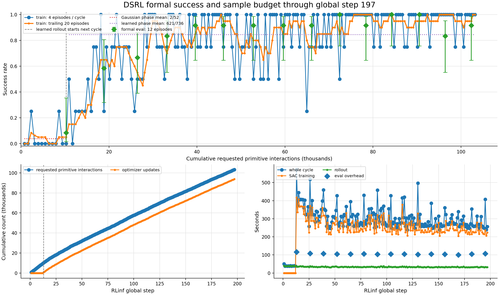
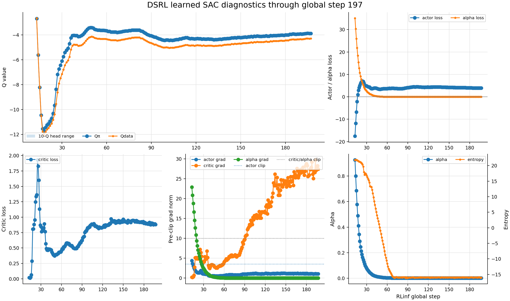
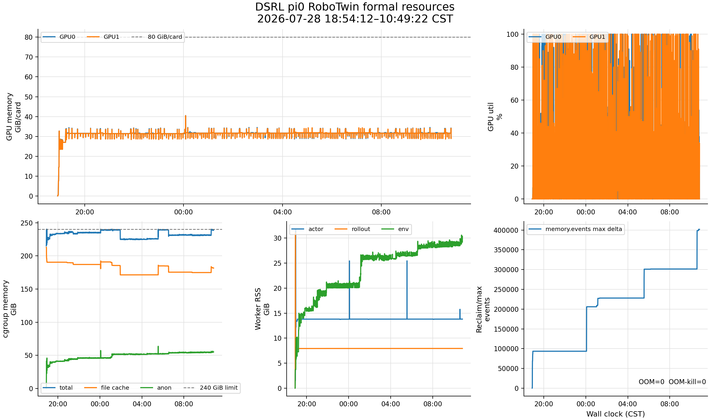

# DSRL × π0 × RoboTwin 正式实验收尾报告

> 训练开始：2026-07-28 18:54:12 CST
>
> 停止请求：2026-07-29 10:49:33 CST
>
> 停止完成：2026-07-29 10:49:41 CST

## 1. 最终状态

- 用户确认信息已经足够后，向本 run 唯一 driver PID 70062 发送 `SIGTERM`；driver、
  本次 Ray session 的全部后代和两个资源监控进程均退出。
- 最后完整训练 cycle 是 **step 198/650**。TensorBoard 在停止前最后 flush 到 step 197；
  step 198 的完整指标保存在 `formal_driver.log` 和 `metrics.log`。
- 最后一个可恢复 DCP 是 **global_step_195**：33,593,452,122 bytes、11 个必需文件、
  无临时残留。step 196–198 的日志与指标保留，但这三轮参数更新不在 DCP195 中。
- 停止后两张 A800 显存均为 0，OOM/OOM-kill 始终为 0。没有删除 run、checkpoint、
  Ray 日志或历史报告。

最终训练量：

| 项目 | 最终值 |
|---|---:|
| train cycles | 198 |
| train episodes | 792 = 198×4 |
| macro transitions / replay resident | 5,185 |
| requested primitive interactions | 103,700 = 5,185×20 |
| optimizer updates | 94,260 |
| Gaussian warm-up train success | 2/52 = 3.85% |
| learned actor train success | 624/740 = 84.32% |
| latest formal eval，step 195 | 11/12 = 91.67% |
| formal eval aggregate，step 65–195 | 123/132 = 93.18% |
| formal eval aggregate，step 130–195 | 68/72 = 94.44% |

## 2. 产物位置与打包范围

服务器原始 run 保持在：

```text
/root/autodl-tmp/RLinf_fastwam_rlinf/logs/20260728_dsrl_pi0_robotwin_n20_formal_v1
```

其中 checkpoint 目录约 94 GiB，包含 step 65、130、195 三个约 32 GiB DCP。它们是
RLinf 分布式恢复目录，不通过 Windows/聊天重复搬运；服务器运行包内提供逐文件大小、
时间、DCP metadata hash 和恢复路径。

轻量但完整的运行包：

```text
dsrl_pi0_robotwin_formal_v1_runtime_step198_20260729.tar.gz
SHA-256: f64762c1f95f881732facf9d7da2870dc1bfb96f9a2e4328180d145b8a7f877c
```

包内包括：

- `run/formal_driver.log`：完整控制台、每 cycle 指标、停止信号；
- `run/metrics.log`：指标表流水；
- `run/tensorboard/`：event 与 resolved TensorBoard config；
- `run/resource_monitor/`：`resources.csv`、`cgroup_detail.csv`、`peak.txt` 和 monitor logs；
- `formal_command.txt`、overrides、validated resolved YAML、启动/停止时间与 provenance；
- 本次 Ray session 的完整 `ray_logs/`；
- 三个 DCP 的文件 manifest 和 metadata SHA-256，不含 94 GiB payload；
- Git commit/log/status、从实现前基线到最终分支的 binary patch；
- 五个关键生产/config 文件快照和 Python/package/GPU 环境快照。

另一个工作材料包包含本专题全部规划、原始材料索引、实现日志、smoke/formal 流水账、
历次报告、最终图、根交接和长期规则。两个包均在本机 `exports/`，服务器运行包也保留在：

```text
/root/autodl-tmp/experiment_exports/dsrl_pi0_robotwin_formal_v1_20260729
```

## 3. 为什么最开始只有 1/12

第一个 formal eval 不是“原生 frozen π0 的 step-0 成功率”：

1. step 1–12 用标准 Gaussian repeat-H latent 收集 warm-up；
2. step 13 新增 40 条 macro 后，resident 达 512，并先做了 800 次 SAC update；
3. step 13 的 train rollout 仍属于 Gaussian phase，但随后 formal eval 已切到 learned
   latent actor，得到 1/12。

最有证据的原因是**策略分布被换了**：

- 原生 π0/PPO/GRPO 在没有外部 noise 时，对整个 `H×D = 50×32` 张量独立采样；
- DSRL 用一份 32D latent 沿 H=50 重复，再让新初始化的小 actor/encoder 学习这份 latent；
- frozen π0 的 4.028B 参数没有变，固定 repeat-latent 调用链也 bitwise 正确，但
  “repeat-H latent + 新 actor”本身不是原生 π0 的动作分布。

`N=20` 可能有次要影响：它比旧 RoboTwin N=50 更频繁重规划，可能截断原本完整的
50-step 协调 chunk；也可能更利于闭环纠错。由于没有同 checkpoint/seeds 的
repeat-latent N20/N50 A/B，不能把低起点主要归咎于 N=20。

你记得的旧 π0 数字没有错：历史 raw GRPO 首轮 train rollout 为约 83.6%，PPO smoke
约 78.1%，旧 frozen-SFT eval 笔记约 75%。但旧数值主要是 256 条 train trajectories、
N=50/native noise；本次首点是 12 条顺序 eval seeds、N=20/repeat latent/learned actor，
不是同协议基线。

## 4. 图里的细粒度指标

| 指标 | 本实验中的含义 | 读法 |
|---|---|---|
| train: 4 episodes/cycle | 每个 cycle 的 4 个训练回合成功率 | 分母很小，0/25/50/75/100% 跳动正常 |
| trailing 20 episodes | 最近 5 cycles、20 个训练回合 | 比单 cycle 稳定 |
| formal eval | 每 13 cycles 的 12 个评估回合；不进 replay | 主要效果曲线，但单点区间仍宽 |
| new transitions | 当轮 4 个回合产生的 macro 数 | 成功越早，通常越少 |
| resident transitions | flat replay 当前驻留的 macro 数 | capacity 25k 前等于累计插入数 |
| requested interactions | `macro×N=20` | 请求动作数，不是精确 TOPP physics ticks |
| planned updates | `new transitions×UTD20` | 每个新 macro 数据复用 20 次 |
| `Qdata` | critic 对 replay 中真实 latent 的平均 Q | 越不负通常意味着预计离成功更近；不是成功率 |
| `Qπ` | critic 对当前 actor 新 latent 的平均 Q | 与 Qdata 合看 actor 是否偏向更优 latent |
| 10-Q range | 10 个 Q head 的 min–max | 窄表示 ensemble 未分叉，不代表绝对校准正确 |
| critic loss | Q 对 TD target 的 MSE | 看长期发散/突增，不能直接当效果 |
| actor loss | `mean(alpha·logπ - Qπ)` | 同时受 Q 和温度影响，不是越小越好 |
| entropy / alpha | 随机性与自动熵温度 | target entropy=-16；末期约 -16/0.0024，已稳定 |
| grad norm | 梯度裁剪前的 norm | critic 末期约 27–29，实际更新仍被 clip=10 限制 |
| GPU util | 2 秒瞬时采样 | rollout/SAC/eval/DCP 分阶段，锯齿正常 |
| cgroup total/file/anon | 总记账/文件缓存/匿名工作集 | 判断真实 RAM 压力优先看 anon、PSI、OOM |
| worker RSS | 同类进程 RSS 之和 | 适合看趋势，可能重复统计共享页 |
| memory.events max | 触碰上限触发回收的次数 | 不等于 OOM，必须和 PSI、oom/kill 合看 |

每个 TensorBoard global-step 点是该 cycle 内数百次 optimizer update 的聚合值，不是一
个 minibatch 的瞬时值。







## 5. 内存高、显存低，以及旧 PPO/GRPO 配置

最终监控峰值：

- GPU0/GPU1：41,455/41,400 MiB，峰值发生在 DCP；常态约 31–32 GiB/卡；
- cgroup raw：触及 240 GiB 上限；anon 峰约 65.9 GiB，file 峰约 213.0 GiB；
- env/actor/rollout RSS 峰约 30.6/31.8/31.1 GiB；
- memory PSI avg10 峰 7.12，OOM/OOM-kill=0。

raw RAM 高主要是 checkpoint/model 读取形成的可回收 file cache，不能理解为 240 GiB
活跃模型内存。停止后 anon 立即降到约 0.3 GiB，而 file cache 仍约 181 GiB，正好说明
两者区别。

本次和旧两卡 PPO/GRPO 的 `actor.enable_offload`、`rollout.enable_offload`、
`fsdp.cpu_offload` 都是 false，模型和 optimizer 并没有主动卸到 CPU。把这些设 true
反而是 GPU→CPU。

可讨论但不能简单称为“把 RAM 搬到 GPU”的设置：

- `env.train.enable_offload=true` 是采集后关闭/重建 simulator 资源；设 false 可能减少
  重建，但会让 simulator 和 actor 同卡常驻，增加显存冲突；
- patch weight snapshot/transport 可选 CUDA，但旧容器曾出现 CUDA IPC
  `pidfd_getfd` 权限失败；CPU transport 只占权重同步快照，也解决不了 file cache；
- `full_shard` 是 GPU rank 间分片，不是 CPU offload。

下一次若只想提高 GPU 吞吐，优先做 `micro_batch_size 64→128` 的短 A/B；若研究 env
RSS，再单独 A/B `enable_offload/clear_cache_freq`。不要增加 env 数：旧 PPO/GRPO 的
16/32 env 才是 CPU RAM 放大的主要来源。

## 6. “图上 40”到底采了多少

成功率图横轴的 40 是 **40k requested interactions**，不是 global step 40。

| 位置 | train episodes | macro transitions | requested interactions | SAC updates | formal eval |
|---|---:|---:|---:|---:|---:|
| global step 40 | 160 | 1,353 | 27,060 | 17,620 | 最近 step 39：8/12 |
| 图上约 40k，即 global step 65 | 260 | 1,982 | 39,640 | 30,200 | step 65：11/12 |

所以 `4×40=160` 的确成立，但它数的是 **episodes**，不是 transition。每个 200-step
episode 在 N=20 下最多拆成 10 条 macro；成功可提前结束，因此到 step 40 实际是
1,353 条 macro。前三次 eval 另有 36 个回合，它们不进 replay，也不算进 27,060。

真正稳定到约 90% 的位置更接近 global step 65/图上 40k，而不是 global step 40：
step 39 仍是 8/12，step 52 为 10/12，step 65 为 11/12。

## 7. 相比 PPO/GRPO 是否体现采样效率

目前能说：

> DSRL 在约 33.2k requested interactions、208 个 train episodes 时达到 10/12；
> 在约 39.6k interactions、260 个 train episodes 时达到 11/12。它用小批在线采集、
> replay 和 UTD20，在大约一个旧 PPO/GRPO outer batch 的 episode 数量级内形成了
> 清晰、平滑的学习曲线。

旧 PPO/GRPO 每个 outer step 都采约 256 个训练 episode，名义 primitive 上界约
51.2k；但历史高起点约 78%–84%，而且是 N=50/native-noise train rollout。当前不能严格
声称“DSRL 已经比 PPO/GRPO 更样本高效”，因为 seeds、N、noise、train/eval 口径和实际
physics-step 统计都没有对齐；DSRL 在 40k 前还做了 30,200 次 SAC update，环境样本效率
高不等于 GPU/墙钟效率也高。

严格对照应固定同一 π0 checkpoint、N、reset seeds 和 eval policy RNG，在
0/20k/40k/100k budget 上比较 frozen base、DSRL、PPO、GRPO，并同时报告 interactions、
episodes、policy queries、optimizer updates、GPU-hours、wall-clock 和 success AUC。
