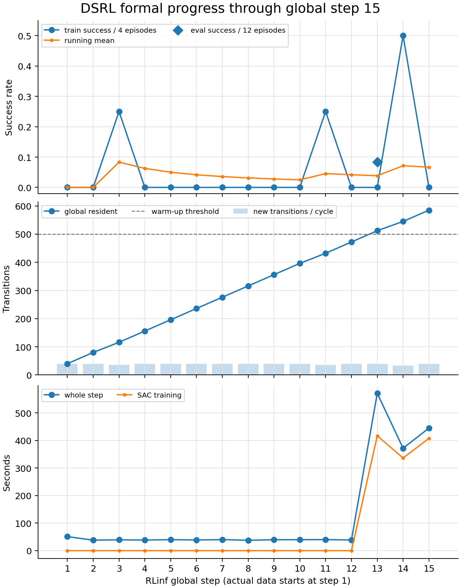
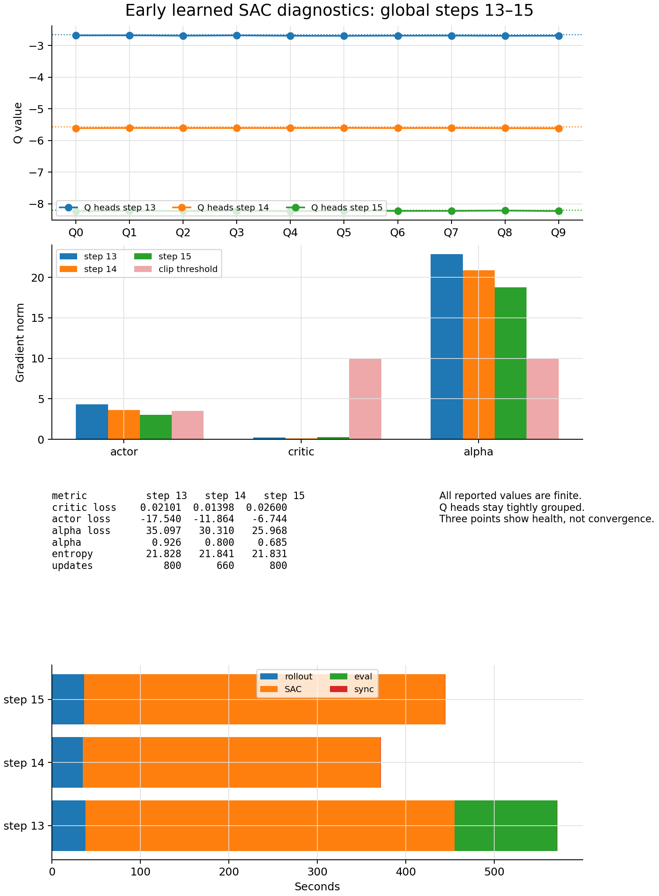
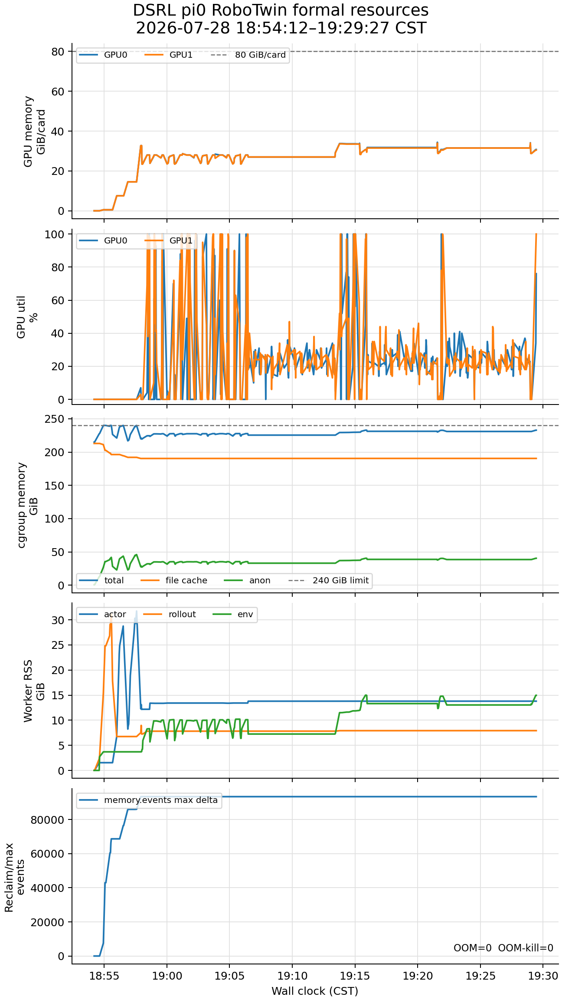

# DSRL × π0 × RoboTwin 正式训练状态报告：step 15

> 主现场边界：2026-07-28 19:29:08 CST；产物清点补充到 19:31:39 CST。
>
> 本报告是一次静态审阅快照，不表示 Codex 持续在线监控。训练保持运行。

## 1. 一句话结论

正式训练已正常跨过 warm-up 并完成前三轮 learned SAC update。最新完整记录是 global
step 15，step 16 已开始；driver、2 actor、2 rollout、2 env worker 均存活，所有已报告
loss、Q、alpha 和梯度均有限，无 CUDA/cgroup OOM、NaN、crash 或停止条件。当前只有
3 个 learned update cycles 和 1 次 12-episode eval，足以判断主链健康，不足以判断最终效果。

## 2. 当前进度

| 项目 | 当前值 | 解释 |
|---|---:|---|
| RLinf global step | 15 / 650 | collection cycle 进度 2.31%；前 12 轮是 warm-up，不能按 2.31% 理解为效果训练进度 |
| global replay resident | 585 macro transitions | flat replay 全局口径；capacity 25,000 |
| warm-up threshold | 500 | 已在 step 13 越过 |
| learned optimizer updates | 2,260 | step 13/14/15 分别 800/660/800 |
| requested primitive interactions | 约 11,700 | `585 × N20`；是请求量，不是 success 早退后的精确 physics-step 计数 |
| train episodes | 60 | 15 cycles × 4 env；其中大部分来自 Gaussian warm-up |
| eval episodes | 12 | 只在 step 13 做过第一轮 formal eval；不进入 replay |
| checkpoint | 0 | `save_interval=65`，首个 DCP 尚未到达 |

run root：

```text
/root/autodl-tmp/RLinf_fastwam_rlinf/logs/20260728_dsrl_pi0_robotwin_n20_formal_v1
```

## 3. warm-up 是否正常

正常，而且行为与设计一致：

1. step 1–12 累计到 472 条 global macro transitions，只用标准 Gaussian latent 收集，
   `actor/run_training` 约为毫秒级，没有 optimizer update。
2. step 13 再新增 40 条，resident 从 472 到 512，首次满足全局 `warmup_size=500`。
3. worker 随即按本轮新增量执行 `40 × UTD20 = 800` 次更新；没有把前 472 条 warm-up
   数据追补成 9,440 次更新。这与“先探索、越过阈值后按新数据量在线更新”的语义一致。
4. step 13 的训练 rollout 发生在首次 update 之前，仍属于 Gaussian collection；其后的
   12-episode eval 已使用同步后的 learned actor。step 14 才是第一轮 learned-actor
   训练 rollout。

因此它不是“先离线收一批再单独训练”，而是在线 off-policy：
Gaussian 收集到阈值后，持续交替采集、replay 抽样和 SAC 更新。

## 4. 主要效果指标

| 指标 | 结果 | 当前可得结论 |
|---|---:|---|
| 第一次 learned eval，step 13 | 1 / 12 = 8.33% | 证明 learned actor 的 sync/eval 主链有效；样本太少，不能宣称提升 |
| learned train rollout，step 14 | 2 / 4 = 50% | 是一个积极样本，但只有 4 episodes |
| learned train rollout，step 15 | 0 / 4 = 0% | 与上轮一起说明早期方差很大 |
| 全部 train cycles 描述性均值 | 4 / 60 = 6.67% | 混合 Gaussian warm-up 与 learned actor，不应作为算法效果结论 |
| Gaussian 阶段成功 | step 3、11 各 1 / 4 | 说明 frozen π0 + Gaussian latent 本身偶尔可成功 |

目前最重要的判断不是成功率高低，而是：越过 warm-up 后 learned actor 确实接管 rollout，
且第一轮 formal eval 能跑通。效果趋势至少要等待更多 learned cycles 和多次 12-episode
eval；formal eval 每 13 cycles 发生一次。

完整进度曲线：



## 5. 次要训练指标与健康度

| global step | critic loss | actor loss | alpha | entropy | Qπ / Qdata | actor / critic / alpha grad |
|---:|---:|---:|---:|---:|---:|---:|
| 13 | 0.0210 | -17.540 | 0.926 | 21.828 | -2.684 / -2.645 | 4.336 / 0.213 / 22.870 |
| 14 | 0.0140 | -11.864 | 0.800 | 21.841 | -5.604 / -5.562 | 3.615 / 0.122 / 20.856 |
| 15 | 0.0260 | -6.744 | 0.685 | 21.831 | -8.222 / -8.188 | 3.030 / 0.279 / 18.784 |

- 所有值均有限；critic loss 仍很小，10 个 Q heads 在每个 step 内紧密聚集，未见单头发散。
- Q 从约 -2.7 向 -8.2 同向移动，当前不构成异常。奖励在未成功时为 -1，而 macro discount
  是 `0.999^20 ≈ 0.98019`，长期 Q 的自然尺度本来就是负数；无限长常数 -1 的量级约为
  `-1 / (1 - 0.98019) ≈ -50.5`。
- alpha 从 0.926 降到 0.685、entropy 约 21.83 基本稳定，说明温度优化器在工作。
- `clip_grad_norm_` 返回裁剪前范数：actor 在 step 13/14 略高于 3.5，alpha 高于 10，
  因而实际发生裁剪；step 15 actor 已低于阈值，critic 始终远低于 10。这是有限且受控的早期更新。
- 只有三个点，目前只能叫“训练健康”，不能叫“收敛趋势”。

优化诊断曲线：



## 6. 墙钟时间和预计完成时间

前三个 learned cycles 的实测拆分：

| step | 新 transitions / updates | rollout | SAC | eval | sync | 整轮 |
|---:|---:|---:|---:|---:|---:|---:|
| 13 | 40 / 800 | 37.8 s | 417.1 s | 115.8 s | 0.6 s | 571.4 s |
| 14 | 33 / 660 | 34.9 s | 336.5 s | — | 0.6 s | 372.0 s |
| 15 | 40 / 800 | 36.5 s | 407.6 s | — | 0.8 s | 445.0 s |

由这三轮得到：

- SAC 吞吐约 `2260 / 1161.2 = 1.95 updates/s`；
- 普通 learned cycle 约 35–38 秒采集，随后按成功早退后的实际新 transition 数做
  660–800 updates；
- 在不含 eval 的 learned cycle 中，SAC 约占 91% 墙钟，rollout 约占 8%，sync 可忽略；
- 每 13 cycles 的 12-episode eval 实测约 116 秒，摊销约 8.9 秒/cycle；
- 每 65 cycles 的 DCP，按 smoke 约 28 秒，摊销不足 0.5 秒/cycle。

按当前 `1.95 updates/s`、每轮约 33–40 条新 transition 外推，整条 run 从启动算约
79–84 小时，预计在 **2026-08-01 02:00–07:00 CST** 完成。首个 step-65 DCP 预计在
2026-07-29 约 02:00 左右出现。

runner 在 step 15 显示的约 22 小时 ETA 仍不可信：其历史均值包含前 12 个几乎不训练的
低成本 warm-up cycles。等积累几十个 learned cycles 后，runner ETA 才会逐渐接近真实值。
若成功率升高，episode 更早结束，会同时减少 rollout 和 `D × UTD20` 更新数，实际可能更快；
DCP 或 cgroup 回收压力持续上升则可能更慢。

## 7. GPU、RAM 和磁盘

### 7.1 GPU

- 现场当前：GPU0/1 为 29,963 / 29,934 MiB。
- 本 run 峰值：35,213 / 34,787 MiB，即约 34.4 / 34.0 GiB；每张 80 GiB A800 使用不到
  44%，与 smoke 的约 34.8 GiB/卡一致。
- 进入 SAC 后的 2 秒采样平均利用率约 24.1% / 24.7%，间歇可到 100%。

显存不是瓶颈。平均利用率不高，主要因为当前负载是小 actor/Q 的大量串行 SAC updates，
中间夹杂 CPU/Ray 同步和 env 阶段；增加 env 不会消除 UTD20 的优化器墙钟，反而会增加
每轮新 transition 和随后必须做的更新数。

### 7.2 cgroup RAM

19:29 现场：

- raw `memory.current` 约 231.3 GiB / 240 GiB；
- anon 约 38.9 GiB；
- file cache 约 190.4 GiB，其中 inactive file 约 158.5 GiB；
- 本 run 观测峰值：anon 47.7 GiB、file 213.0 GiB、raw total 240 GiB；
- `memory.events max` 在初始化期从 477,728 增到 571,112，增加 93,384，之后已平台；
- 当前 memory PSI avg10 为 0，`oom=0`、`oom_kill=0`。

结论仍是“黄灯但正常”：贴近 240 GiB 的主要部分是模型/checkpoint 读取形成的可回收
file cache，不是训练匿名工作集吃掉 240 GiB；anon 已稳定在约 39–48 GiB，没有跨 cycle
单调泄漏形态。初始化确实触发过回收/限流，但压力已回落。因此继续保持 2 GPU / 4 env，
不因显存空余而扩并发。

actor、rollout、env 的单类进程 RSS 峰分别约 31.8、31.1、15.0 GiB；这些峰发生在不同阶段，
且含共享页，不能彼此相加，也不能再与 cgroup total 相加。

### 7.3 磁盘

- `/root/autodl-tmp` 尚余约 788 GB。
- 当前 run root 仅约 744 KiB，因为还没有 DCP。
- 预计 10 个 DCP × 约 32 GB = 约 320 GB，仍高于 200 GB 的停止安全线。

资源全曲线：



## 8. 当前产物

服务器 run root 已有：

- 实际 resolved YAML、精确命令/overrides、provenance、prelaunch 资源快照；
- `formal_driver.log`、`metrics.log`、TensorBoard event/config；
- 2 秒粒度的 `resources.csv`、`cgroup_detail.csv` 与 `peak.txt`。

当前尚无：

- DCP/checkpoint：首个保存点是 step 65；
- 视频：formal 明确 `save_video=false`；
- 可独立恢复的 replay/actor/Q/target/temperature 状态：它们目前只在活进程中，需等首个
  DCP 才形成磁盘恢复点。

本机/仓库侧审阅产物：

- [`FORMAL_RUN_VALIDATED_RESOLVED_20260728.yaml`](./FORMAL_RUN_VALIDATED_RESOLVED_20260728.yaml)
- [`FORMAL_TRAINING_LOG_20260728.md`](./FORMAL_TRAINING_LOG_20260728.md)
- [`FORMAL_PROGRESS_CURVES_STEP15_20260728.png`](./FORMAL_PROGRESS_CURVES_STEP15_20260728.png)
- [`FORMAL_OPTIMIZATION_CURVES_STEP15_20260728.png`](./FORMAL_OPTIMIZATION_CURVES_STEP15_20260728.png)
- [`FORMAL_RESOURCE_CURVES_STEP15_20260728.png`](./FORMAL_RESOURCE_CURVES_STEP15_20260728.png)

## 9. 本轮停点

不修改配置、不扩大并发、不停止训练，也不持续占用 Codex 轮询。下次用户要求检查时，先做一次
新的只读现场刷新，再更新：

1. 最新完整 global step、累计 transitions/updates 和 learned/eval success；
2. loss/Q/alpha/gradient 是否持续有限；
3. step 65 以后首个 DCP 的完整性、大小和保存耗时；
4. GPU/cgroup/PSI/OOM/磁盘曲线；
5. 基于更多 learned cycles 的新 ETA。
