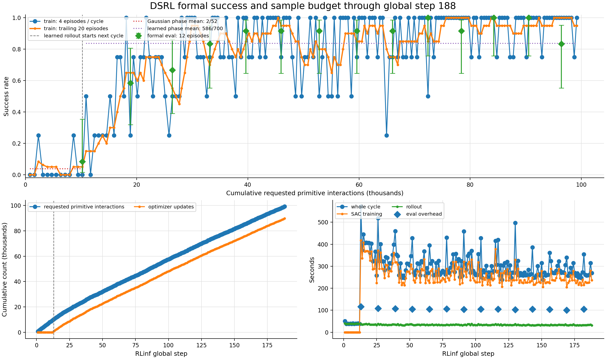
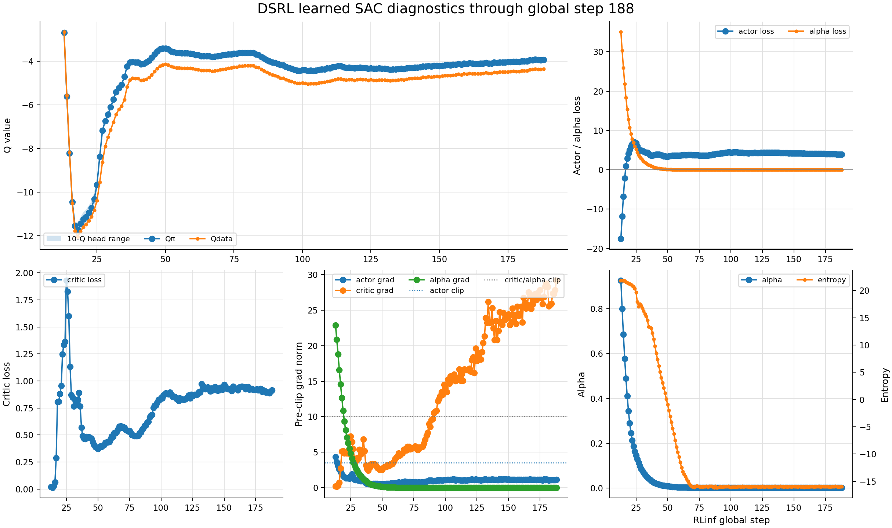
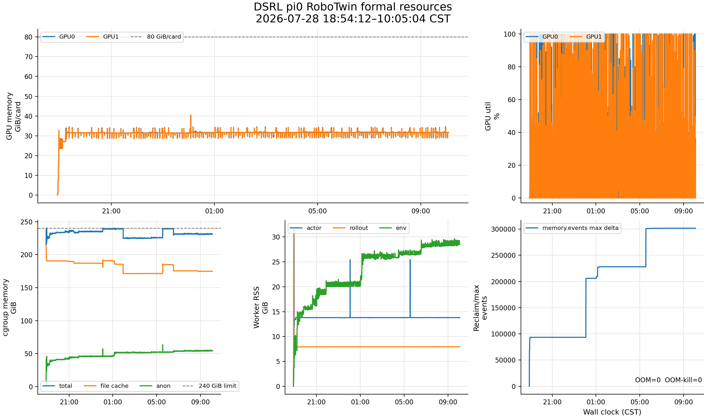

# DSRL × π0 × RoboTwin 正式训练状态报告：step 188

> 指标边界：2026-07-29 10:02:37 CST，最新完整 global step 188。
>
> 资源 CSV 覆盖到 10:05:04；10:04:22 只读探针确认 driver、2 个 actor、2 个 rollout
> worker 和 2 个 env worker 均存活。训练保持运行，配置与进程均未改动。

## 1. 当前结论

- 已完成 `188 / 650 = 28.9%`；replay resident 4,959，累计约 99,180 requested
  primitive interactions 和 89,740 optimizer updates，已经到达预设的约 100k
  interaction 审阅点。
- 14 次 formal eval 从 step 13 的 `1/12` 升至近期平台；step 65–182 合计
  `112/120 = 93.3%`，step 130–182 合计 `57/60 = 95.0%`。最新 step 182 为
  `10/12 = 83.3%`，但 Wilson 区间仍宽，且最近 20 个训练回合为 95%，目前不足以判定退化。
- Gaussian train phase 为 `2/52 = 3.8%`；learned train phase 累计
  `586/700 = 83.7%`，step 188 的 4 个训练回合全部成功。
- alpha/entropy 已在约 `0.0024 / -16` 附近稳定，自动温度的早期风险基本解除。
  critic loss、Q 值和各项梯度均 finite，但 critic 的**裁剪前**梯度已连续高于 clip=10；
  这是需要继续观察的优化压力，不是数值发散。
- 这是很强的 run 内样本效率信号：约 40k interactions 已到 11/12，约 72k 首次到
  12/12。但训练内 eval 顺序消费不同 reset seeds，尚不能替代同 seeds 的 frozen-base、
  PPO/GRPO 横向对照。

## 2. 成功率与采样效率

| formal eval | requested interactions | 成功率 | Wilson 95% 区间 |
|---|---:|---:|---:|
| step 13 | 10,240 | 1/12 = 8.3% | 1.5%–35.4% |
| step 26 | 18,860 | 7/12 = 58.3% | 32.0%–80.7% |
| step 39 | 26,440 | 8/12 = 66.7% | 39.1%–86.2% |
| step 52 | 33,160 | 10/12 = 83.3% | 55.2%–95.3% |
| step 65 | 39,640 | 11/12 = 91.7% | 64.6%–98.5% |
| step 78 | 46,000 | 11/12 = 91.7% | 64.6%–98.5% |
| step 91 | 52,840 | 11/12 = 91.7% | 64.6%–98.5% |
| step 104 | 59,620 | 11/12 = 91.7% | 64.6%–98.5% |
| step 117 | 66,020 | 11/12 = 91.7% | 64.6%–98.5% |
| step 130 | 72,420 | 12/12 = 100% | 75.7%–100% |
| step 143 | 78,400 | 11/12 = 91.7% | 64.6%–98.5% |
| step 156 | 84,240 | 12/12 = 100% | 75.7%–100% |
| step 169 | 90,520 | 12/12 = 100% | 75.7%–100% |
| step 182 | 96,420 | 10/12 = 83.3% | 55.2%–95.3% |

单次 12 回合会有较大抽样波动，因此最近的 10/12 应和多个节点合并看：step 65 以后
10 次评估共 112/120，最近 5 次共 57/60，仍是稳定的高成功平台。下一次评估在 step 195。

## 3. 优化状态

- step 188 的 critic/actor loss 为 `0.914 / 3.959`，`Qπ=-3.921`、
  `Qdata=-4.341`，10-Q head spread 仅 0.068；Q ensemble 没有分叉或逃逸。
- actor/critic/alpha grad 为 `1.106 / 29.180 / 0.0011`。代码记录的是
  `clip_grad_norm_` 返回的**裁剪前 norm**，因此 critic 的实际更新仍被 clip=10 限制。
- step 91–188 的 learned cycle 中，critic grad 98/98 次都高于 10，近期约
  25.5–29.2；这是持续重裁剪，说明 critic 学习率/尺度存在压力。与此同时 loss 近期约
  0.89–0.95、Q 值和 eval 平台稳定，所以当前没有停训或在线改参依据。
- entropy 已在 target=-16 附近稳定，step 188 为 -15.932；alpha 为 0.00237，
  alpha grad 很小。早期“alpha 快速下降、entropy 是否越过目标”的问题目前已收敛为健康状态。

## 4. 时间与训练总量

- 最近 20 个 cycle 平均 276.9 秒；去掉 eval 节点后为 269.2 秒，其中 train
  约 233.1 秒、rollout 约 32.8 秒。最近 50 个 cycle 的去 eval 均值为 272.5 秒，
  吞吐没有随运行时长明显恶化。
- 从 step 188 按最近 50 轮速度估算，剩余约 35.9 小时，预计约
  2026-07-30 22:00 CST 完成；这是动态估算，不含未来异常或外部抢占。
- step 195 会同时做 12-episode eval 和第三个 DCP，预计在本报告边界后约
  34–38 分钟到达。
- `max_steps=650` 是 runner 外层 cycle 数，不是 primitive step。成功会提前结束回合；
  若近期成功率保持，最终约 312k requested primitive interactions、303k optimizer
  updates，而不是所有回合跑满时的 520k/500k 上界。
- 当前已经回答“是否能快速学起来”：能，并在约 40k interactions 后进入高成功区。
  剩余训练主要用于观察平台稳定性、稀有失败和长期优化，而不是等待首次有效学习信号。

## 5. 显存、内存与 checkpoint

- 两张 A800 当前约 31.65/31.62 GiB；历史峰值 40.48/40.43 GiB，两个峰分别与
  step 130/65 DCP 保存对齐。learned 阶段平均利用率约 24.1%/25.3%，显存有余量。
- cgroup 当前约 231 GiB/240 GiB，其中 anon 54.3 GiB、file 174.9 GiB；
  inactive file 143.4 GiB、active file 31.2 GiB。raw 总量贴顶主要由 checkpoint/model
  文件缓存构成，不能按 231 GiB 活跃工作集解释。
- `memory.events max` 自初始化后累计增加较多，但最后一次变化停在 06:23；
  当前 PSI avg10=0，OOM/OOM-kill=0。step 65/130 DCP 窗口分别出现短时回收压力，
  保存结束后恢复，因此“可继续训练，但不宜扩大 env 并发”仍是合适判断。
- env-worker RSS 从 19:15 的 11.9 GiB 增到 10:00 的 28.5 GiB，峰值 29.65 GiB；
  02:00 后增长明显放缓，但尚未完全平台。总 anon 峰值 63.7 GiB 出现在 DCP130，
  离 240 GiB 上限很远，当前不像失控泄漏，仍需按后续节点追踪。
- step 65、130 两个 DCP 均约 32 GiB，必需的 actor、alpha、target model 和两 rank
  replay 均存在，无临时残留，结构检查通过。保存额外耗时约 30.3/27.9 秒。
  run 当前约 63 GiB，磁盘剩余约 726 GiB。

## 6. 下一观察点

1. step 195 的 eval、第三个 DCP 是否完整结束，最新 10/12 是否回到长期平台；
2. critic 裁剪前 norm 是否继续上升，以及 critic loss、Q head spread 或 eval 是否同步恶化；
3. env-worker RSS 是否真正平台，DCP195 是否再次只造成短时 file-cache/PSI 波动；
4. 在约 100k review 点另做同 seeds frozen-base/DSRL 对照，才给出相对采样效率结论。
