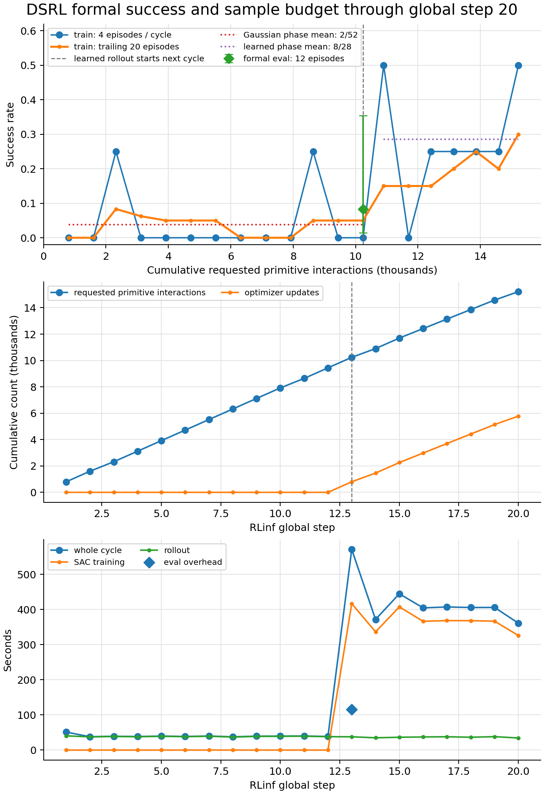
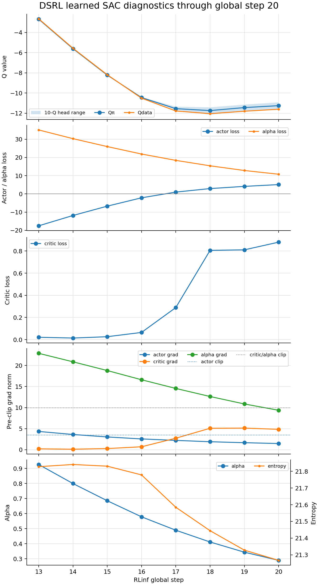
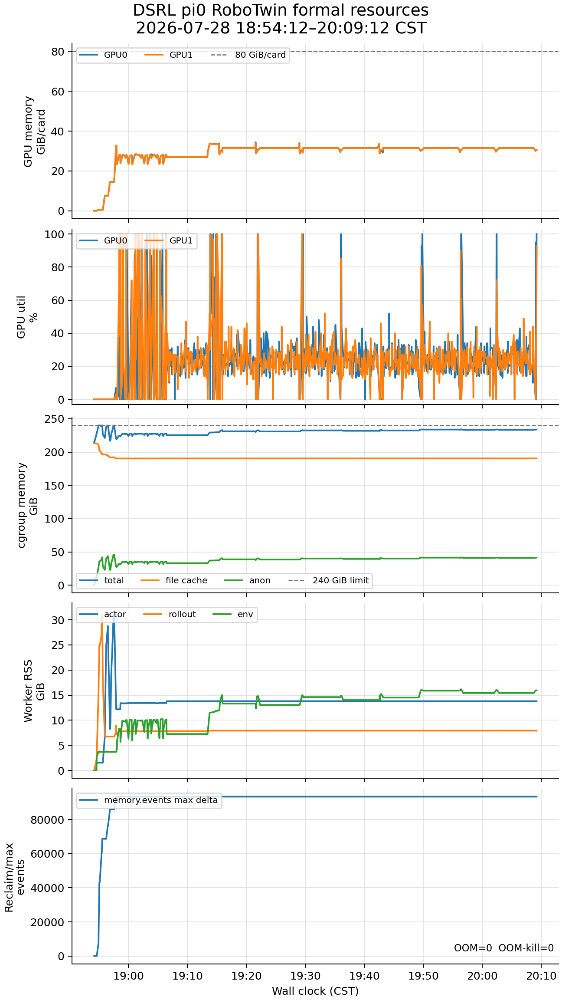

# DSRL × π0 × RoboTwin 正式训练状态报告：step 20

> 服务器现场边界：2026-07-28 20:08:11 CST。
>
> 最新完整 metric table 为 global step 20；采样 CSV 覆盖到 20:09:12。训练保持运行。

## 1. 当前判断

- driver、2 actor、2 rollout、2 env workers 均存活；服务器 branch/HEAD/upstream 为
  `codex/dsrl-pi0-robotwin@95e62518`，worktree clean。
- 已完成 `20 / 650` 个 collection cycles，即 3.08%；global replay resident 为 761，
  对应约 15,220 requested primitive interactions。
- learned SAC 已执行 5,780 optimizer updates，实测约 1.95 updates/s。
- 无 CUDA/cgroup OOM、NaN、Inf 或 worker crash。GPU、cgroup reclaim 和磁盘仍在原定边界内。
- 成功率出现积极方向，但只有一轮正式 12-episode eval，尚不能证明相对 PPO/GRPO 或
  frozen base 的采样效率优势。

## 2. 总共有多少 step

`runner.max_steps=650`，这里的一个 RLinf global step 是一个完整 collection cycle，不是一个
primitive action，也不是一次 optimizer update。当前设计中，一个普通 learned global step
包括：

1. 4 个并行 RoboTwin train episodes；
2. 将本轮有效 macro transitions 加入 replay；
3. 执行 `new transitions × UTD20` 次 SAC optimizer updates；
4. 同步 learned actor 给 rollout worker；
5. 如果命中周期，再做 eval 或 DCP。

整条 run 的周期：

| 事项 | 周期 | 预计总次数 |
|---|---:|---:|
| train collection cycle | 每 step | 650 |
| formal eval | 每 13 steps | 50 次 |
| DCP | 每 65 steps | 10 个 |
| eval episodes | 每次 12 | 全程 600 episodes |

formal eval 计划发生在 step `13, 26, 39, …, 650`；DCP 在
`65, 130, …, 650`。当前下一次 eval 是 step 26，距 step 20 还有 6 cycles。

## 3. 每个 step 实测多久

精确原始表见
[`FORMAL_STEP_TIMING_STEP20_20260728.csv`](./FORMAL_STEP_TIMING_STEP20_20260728.csv)。

| step | phase | success | transitions / updates | rollout | SAC | eval | total |
|---:|---|---:|---:|---:|---:|---:|---:|
| 1 | Gaussian warm-up | 0/4 | 40 / 0 | 40.6 s | 0.0 s | — | 51.1 s |
| 2 | Gaussian warm-up | 0/4 | 40 / 0 | 37.5 s | 0.0 s | — | 38.0 s |
| 3 | Gaussian warm-up | 1/4 | 36 / 0 | 38.7 s | 0.0 s | — | 39.3 s |
| 4 | Gaussian warm-up | 0/4 | 40 / 0 | 37.9 s | 0.0 s | — | 38.4 s |
| 5 | Gaussian warm-up | 0/4 | 40 / 0 | 39.2 s | 0.0 s | — | 39.9 s |
| 6 | Gaussian warm-up | 0/4 | 40 / 0 | 38.1 s | 0.0 s | — | 38.7 s |
| 7 | Gaussian warm-up | 0/4 | 40 / 0 | 39.4 s | 0.0 s | — | 40.0 s |
| 8 | Gaussian warm-up | 0/4 | 40 / 0 | 37.0 s | 0.0 s | — | 37.7 s |
| 9 | Gaussian warm-up | 0/4 | 40 / 0 | 38.9 s | 0.0 s | — | 39.6 s |
| 10 | Gaussian warm-up | 0/4 | 40 / 0 | 39.2 s | 0.0 s | — | 39.8 s |
| 11 | Gaussian warm-up | 1/4 | 36 / 0 | 39.4 s | 0.0 s | — | 40.1 s |
| 12 | Gaussian warm-up | 0/4 | 40 / 0 | 38.1 s | 0.0 s | — | 38.7 s |
| 13 | threshold + update + eval | 0/4 | 40 / 800 | 37.8 s | 417.1 s | 115.8 s | 571.4 s = 9:31 |
| 14 | learned | 2/4 | 33 / 660 | 34.9 s | 336.5 s | — | 372.0 s = 6:12 |
| 15 | learned | 0/4 | 40 / 800 | 36.5 s | 407.6 s | — | 445.0 s = 7:25 |
| 16 | learned | 1/4 | 36 / 720 | 37.3 s | 366.6 s | — | 404.8 s = 6:45 |
| 17 | learned | 1/4 | 36 / 720 | 37.9 s | 368.6 s | — | 407.4 s = 6:47 |
| 18 | learned | 1/4 | 36 / 720 | 36.5 s | 368.4 s | — | 405.8 s = 6:46 |
| 19 | learned | 1/4 | 36 / 720 | 38.2 s | 367.0 s | — | 406.1 s = 6:46 |
| 20 | learned | 2/4 | 32 / 640 | 34.3 s | 326.3 s | — | 361.4 s = 6:01 |

汇总：

- warm-up step 1–12：平均 40.1 秒，范围 37.7–51.1 秒；没有 SAC update。
- 普通 learned step 14–20：平均 400.4 秒，即约 6 分 40 秒；范围 6:01–7:25。
- step 用时主要由 `new transitions × UTD20` 决定：成功越早，transition 越少，随后
  optimizer updates 也越少，所以 step 20 比 step 15 快约 84 秒。
- formal eval 当前实测额外 115.8 秒；典型 eval cycle 预计约 8.5–9 分钟。
- DCP 在 smoke 中约额外 28 秒；每 65 steps 才发生一次。

以目前成功率和吞吐计算，未来普通 cycle 加上摊销 eval/DCP 约 6.8 分钟；若后续全是
40 transitions/cycle，则约 7.6 分钟。剩余 630 steps 约需 72–80 小时，完成时间区间更新为
**2026-07-31 20:00 至 2026-08-01 04:00 CST**。

## 4. 成功率：现在能看到什么

### 4.1 训练回合

- Gaussian collection，step 1–13：`2 / 52 = 3.85%`。
- learned rollout，step 14–20：`8 / 28 = 28.57%`。
- 最新 20 个 train episodes 的滑动成功率：30%。
- step 14–20 的逐轮成功率为：
  `50%, 0%, 25%, 25%, 25%, 25%, 50%`。

这是积极信号：learned actor 接管后，成功不再只是偶发单点。但这两个阶段使用不同的顺序
reset seeds，policy latent 也随机，因此 `3.85% → 28.57%` 只能称为 run 内描述性改善，
不能当作严格因果 A/B。

### 4.2 正式 eval

当前只有 step 13 的一轮 formal eval：

- `1 / 12 = 8.33%`；
- 二项 Wilson 95% 区间约 `1.5%–35.4%`。

12 episodes 足以做训练中方向监控，但单点区间很宽。每 13 cycles 评估一次，按当前吞吐相当于：

- 约每 9k–10k optimizer updates；
- 约每 18k–20k requested primitive interactions；
- 约每 1.4–1.6 小时墙钟；
- 每次 12 episodes，评估数据不进 replay。

下一次是 step 26；若吞吐不变，大约在 20:45–20:55 CST。至少积累 3–5 个 formal eval
点后，才适合讨论方向曲线。训练内 eval 使用顺序的新 seeds，不是每个 checkpoint 重复同一组
fixed seeds；因此它反映总体方向，但不是低方差 paired comparison。

## 5. 能否体现采样效率优势

当前能体现“值得继续”的早期方向，不能证明“相对方法优势”。

支持方向判断的事实：

- 约 10.24k requested interactions 越过 warm-up；
- 到 15.22k requested interactions，learned train phase 为 8/28，trailing-20 为 30%；
- learned actor 只训练了 5,780 optimizer updates，已经能在多个连续 cycles 中成功。

仍缺少的证据：

1. 只有一个 formal eval 点；
2. 没有同 checkpoint、同任务、同 fixed seeds、同 requested-interaction budget 的
   frozen-base / PPO / GRPO 对照；
3. train success 使用策略正在采集的数据，不能替代独立 eval；
4. DSRL 用 UTD20 换环境样本，可能是 environment-sample-efficient 但 compute-heavy，
   必须把 GPU-hours、wall-clock 与 interactions 分开报告。

真正能回答采样效率优势的主指标应是：

- success-vs-requested-interactions AUC；
- 达到 20% / 40% / 50% fixed-seed success 所需 interactions；
- 100k、200k requested interactions 审阅点的同 40 fixed seeds 评估；
- 同时报告 optimizer updates、GPU-hours、wall-clock、episodes 和 resets。

因此本 run 当前的准确表述是：**早期训练成功率较 Gaussian collection 明显向上，具备潜在
采样效率信号；正式优势结论尚未成立。**

## 6. 优化指标趋势

- Qπ / Qdata 从 step 13 的约 `-2.68 / -2.65` 移到 step 18 的约
  `-11.74 / -12.04`，step 20 回到 `-11.25 / -11.60`；不再持续单向下坠。
- step 20 的 10-Q 范围为 `[-11.61, -10.92]`，spread 约 0.69；仍属同量级，未见单头逃逸。
- critic loss 从 0.021 上升到 0.880，是当前最需要观察的训练指标；但 step 18–20 为
  `0.806 / 0.811 / 0.880`，critic grad 为 `5.09 / 5.13 / 4.84`，没有指数爆炸且低于 clip=10。
- actor grad 从 4.34 降到 1.47；alpha grad 从 22.87 降到 9.36，step 20 已低于 clip=10。
- alpha 从 0.926 降到 0.289，entropy 从 21.83 缓慢降到 21.27；温度更新连续。
- actor loss 由负转正本身不是失败判据，它会随 Q 和 entropy-temperature 尺度移动。

当前结论仍是 finite、可继续，但下次重点看 critic loss 是否在约 1 附近平台，还是继续快速增长。

## 7. 资源趋势

- GPU 峰值仍为 35,213 / 34,787 MiB；learned 阶段平均利用率约 24.3% / 24.0%。
- 20:08 现场 GPU 为 32,279 / 32,249 MiB；显存不是瓶颈。
- cgroup 采样末值约 233.3 / 240 GiB，其中 anon 约 40.9 GiB、file cache 约 190.5 GiB；
  anon 仍低于初始化峰值 47.7 GiB。
- `memory.events max` 仍停在 571,112，OOM/OOM-kill 为 0，当前 PSI avg10 为 0。
- `/root/autodl-tmp` 约剩余 789 GB；step 65 前仍无 DCP。

没有新的资源恶化证据，继续保持 2 GPU / 4 env，不扩并发。

## 8. 当前停点

本次只读刷新和本地报告不改变训练代码、配置或活进程。下一次检查优先覆盖：

1. step 26 的第二个 12-episode formal eval；
2. critic loss、critic grad 和 Q-head spread；
3. step 65 的首个 DCP 完整性、大小与保存耗时；
4. success-vs-interactions 曲线是否继续上升，而不是仅由 train-seed 难度波动造成。
