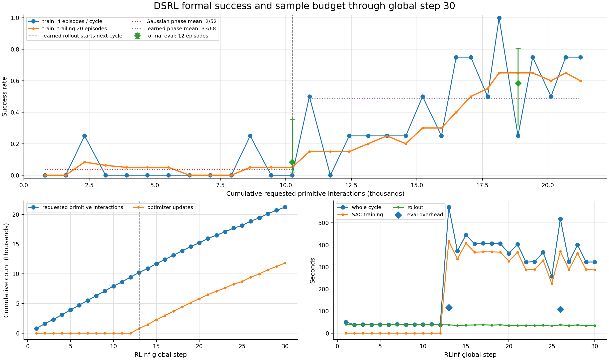
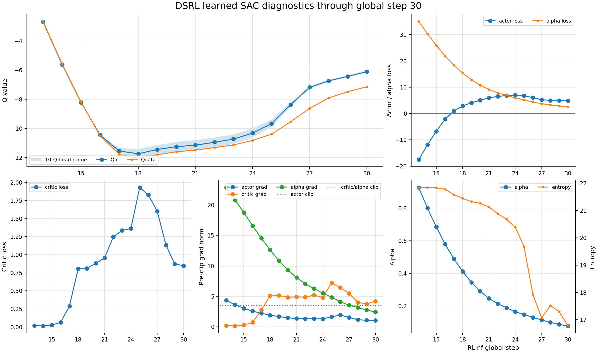
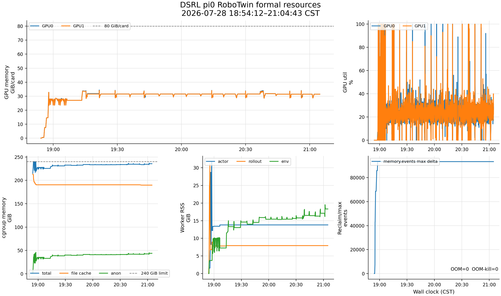

# DSRL × π0 × RoboTwin 正式训练状态报告：step 30

> 服务器现场边界：2026-07-28 21:03:56 CST。
>
> 最新完整 metric table 为 global step 30；资源 CSV 覆盖到 21:04:56。训练保持运行。

## 1. 简要结论

- 已完成 `30 / 650 = 4.62%`；replay resident 1,062，对应约 21,240 requested
  primitive interactions；累计 11,800 optimizer updates。
- 第二次 formal eval（step 26）为 `7/12 = 58.33%`，相比 step 13 的 `1/12 = 8.33%`
  明显向上。它是有价值的早期信号，但两次使用顺序的新 reset seeds，仍不能替代同 seeds
  的 frozen-base / PPO / GRPO 对照。
- learned train phase 为 `33/68 = 48.53%`；最近 20 个训练回合成功率为 60%，step 30
  为 `3/4`。
- critic loss 在 step 25 达到 1.929 后回落到 step 30 的 0.848；critic grad 4.20，
  Q-head spread 约 0.17，当前没有数值发散。
- driver、2 actor、2 rollout、2 env workers 均存活；无 OOM、OOM-kill、NaN、Inf 或
  checkpoint 异常。step 65 前仍无 DCP。

## 2. 成功率与采样预算

| 指标 | step 20 | step 30 |
|---|---:|---:|
| requested interactions | 15,220 | 21,240 |
| optimizer updates | 5,780 | 11,800 |
| learned train success | 8/28 = 28.57% | 33/68 = 48.53% |
| trailing-20 train success | 30% | 60% |
| formal eval | step 13：1/12 | step 26：7/12 |

step 26 formal eval 的 Wilson 95% 区间约为 32.0%–80.7%；step 13 为
1.5%–35.4%。区间仅小幅重叠，说明改善信号已经比 step 20 强得多，但样本仍少。

到 step 30，训练成功率已经不再是单个偶发点：step 22–30 的逐轮结果为
`75%, 75%, 50%, 100%, 25%, 75%, 50%, 75%, 75%`。下一次 formal eval 在 step 39，
按当前吞吐约在 22:00 CST 左右。

## 3. 优化指标

- critic loss：step 25 峰值 1.929，随后
  `1.827 → 1.601 → 1.131 → 0.871 → 0.848`，当前是回落而不是继续上冲。
- Qπ / Qdata：从 step 18 的约 `-11.74/-12.04` 回到 step 30 的
  `-6.10/-7.14`；10-Q 范围 `[-6.17,-6.01]`，没有单头逃逸。
- actor / critic / alpha grad：step 30 为 `1.06 / 4.20 / 2.41`，均低于对应 clip。
- alpha 从 0.926 降至 0.076，entropy 从 21.83 降至 16.77。当前成功率同步上升，
  因而暂不判为探索坍缩；但若 alpha 继续贴近 0、entropy 快速下降且 eval 回落，应列为
  新风险。

## 4. 时间与资源

- step 21–30 平均 356 秒；最近无 eval 的 step 27–30 平均 342 秒，即约 5 分 42 秒。
- step 26 含 12-episode eval，总计 518 秒，其中 eval 108 秒。
- 按最近吞吐，剩余训练约 61–65 小时；若后续成功率回落、每轮重新接近 40 transitions，
  墙钟会相应延长。
- GPU 当前约 31.4/31.4 GiB，历史峰值约 34.4/34.0 GiB；learned 阶段平均利用率约
  23.9%/24.5%。
- cgroup 当前约 235.6/240 GiB，其中 anon 43.9 GiB、file cache 189.7 GiB；
  `memory.events max` 自初始化后保持 571,112，PSI avg10=0，OOM/OOM-kill=0。
- 新的资源观察项是 env-worker RSS：19:15 约 11.9 GiB，21:00 约 17.1 GiB，
  21:05 约 18.3 GiB；actor/rollout RSS 基本稳定。总 anon 仍低于初始化峰值 47.8 GiB，
  当前无需干预，但下一次 step 39 和首个 step-65 DCP 应检查它是否继续跨 cycle 上升。

## 5. 可视化修正

上一版 optimization/resource PNG 是纵向长图，在 Codex 消息里按高度缩放后只剩窄缩略图。
本版将三组图改为约 16:9 的横向 small multiples，并增大有效绘图区；报告脚本新增
opt-in `--layout landscape`，默认 portrait 行为不变。

视觉检查还发现原 success 图固定 `ylim=0.62`，在 step 25 出现 100% train success 后会
裁掉高值；已改为完整 0%–100% 轴。资源图同时把横轴 tick 收敛为 30 分钟间隔，避免窄面板
标签重叠。

## 6. 下一次重点

1. step 39 的第三个 12-episode formal eval；
2. alpha/entropy 是否趋于稳定，以及 eval 是否维持；
3. env-worker RSS 与 cgroup anon 是否继续阶梯式增长；
4. step 65 首个 DCP 的完整性、大小、保存耗时与训练后续推进。
