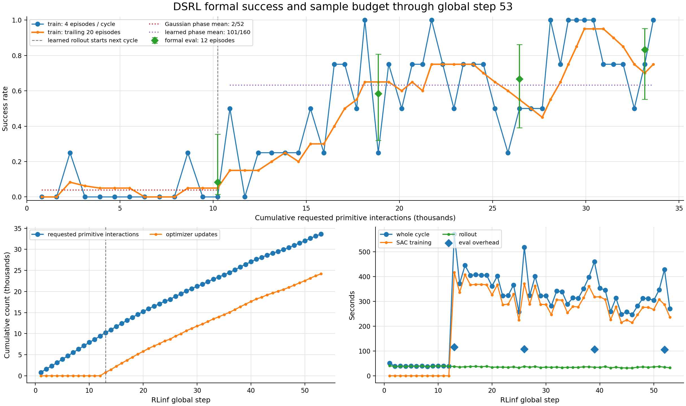
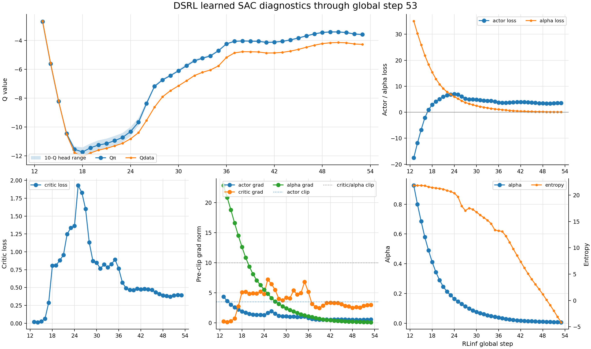
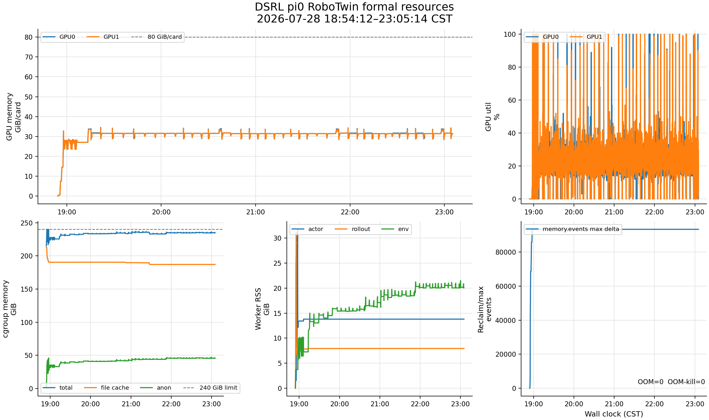

# DSRL × π0 × RoboTwin 正式训练状态报告：step 53

> 指标边界：2026-07-28 23:04:08 CST，最新完整 global step 53。
>
> 资源 CSV 覆盖到 23:05:42；23:02:13 只读探针确认 driver 和全部 workers 存活。
> 训练保持运行，配置与进程均未改动。

## 1. 当前结论

- 已完成 `53 / 650 = 8.15%`；replay resident 1,681，累计约 33,620 requested
  primitive interactions 和 24,180 optimizer updates。
- formal eval 连续为 `1/12 → 7/12 → 8/12 → 10/12`，对应
  `8.3% → 58.3% → 66.7% → 83.3%`；最近一次在 step 52、33.16k interactions。
- learned train phase 累计 `101/160 = 63.1%`，最近 20 个训练回合为 `15/20 = 75%`；
  step 53 的 4 个回合全部成功。
- critic loss 已稳定在约 0.39，10-Q head spread 约 0.11，actor/critic/alpha grad
  均有限；没有数值发散证据。
- 这是明显的 run 内学习信号，但还不能单独证明相对 frozen base、PPO 或 GRPO 的
  样本效率优势：训练内 eval 顺序消费不同 reset seeds，正式横向结论仍需同 seeds 对照。

## 2. 成功率与采样效率

| formal eval | requested interactions | 成功率 | Wilson 95% 区间 |
|---|---:|---:|---:|
| step 13 | 10,240 | 1/12 = 8.3% | 1.5%–35.4% |
| step 26 | 18,860 | 7/12 = 58.3% | 32.0%–80.7% |
| step 39 | 26,440 | 8/12 = 66.7% | 39.1%–86.2% |
| step 52 | 33,160 | 10/12 = 83.3% | 55.2%–95.3% |

四次 eval 单调上升，且最近一次下界已超过 50%，信号比 step 30 时更扎实。仍需注意每次
只有 12 回合，区间较宽；当前结果应表述为“在约 33k requested interactions 时达到
10/12 的训练内 eval”，不表述为已完成基线优势证明。

## 3. 优化状态

- critic loss 从 step 25 的 1.929 峰值持续回落，step 49–53 为
  `0.382 / 0.373 / 0.390 / 0.397 / 0.395`。
- step 53 的 `Qπ=-3.58`、`Qdata=-4.27`，10-Q 范围
  `[-3.64,-3.53]`；没有单个 Q head 逃逸。
- actor/critic/alpha grad 为 `0.54 / 2.96 / 0.072`，均低于 clip。
- alpha 已降到 0.0061，entropy 为 -4.15。目标 entropy 是 -16，因此“entropy 从正值
  下降到负值”本身仍与自动温度向目标收敛一致；但下降仍快，下一轮需确认是否在目标附近
  稳定，而不是越过后继续失控。formal eval 当前仍同步上升。

## 4. 时间、显存与内存

- step 40–53 平均 305 秒；排除 eval 的最近 13 轮平均 296 秒。step 52 的 12 回合
  eval 增加约 105 秒。
- 按最近吞吐，step 65 约还需 61 分钟，随后会同时发生第五次 eval 和首个 DCP；DCP
  保存耗时目前未知。剩余全程约 51 小时，保守计入 checkpoint 波动后约 51–55 小时。
- 最近成功较高使每轮有效 macro transitions 从最多 40 降到约 25.5；因此墙钟和最终
  requested interactions 都会低于“所有回合跑满”的上界。若近期成功率维持，650 cycles
  结束时约 0.34M requested interactions；正式比较必须继续以实际 interaction 横轴为准。
- 两张 A800 当前约 31.4/31.4 GiB，历史峰值 34.4/34.1 GiB；learned 阶段平均利用率
  约 24.0%/24.8%。利用率的周期性尖峰来自 rollout、SAC 和 eval 串行阶段，不是显存不足。
- cgroup 原始占用约 234.7/240 GiB，但 anon 45.6 GiB、file cache 187.1 GiB，其中
  inactive file 155.4 GiB；PSI avg10=0，OOM/OOM-kill=0。初始化后的
  `memory.events max` 增量已保持平台，不是持续恶化的回收风暴。
- env-worker RSS 从 19:15 的 11.9 GiB 升到 23:00 的 21.4 GiB，峰值 21.5 GiB；这是
  仍需追踪的阶梯增长。与此同时总 anon 仍低于初始化峰值 47.8 GiB，当前不足以判定泄漏，
  也不需要中断训练。

## 5. 下一观察点

1. step 65 的 `12-episode eval + first DCP` 是否完整结束，DCP 大小、耗时和后续推进；
2. entropy 是否在目标 -16 附近减速，alpha 是否停止快速贴近零；
3. env-worker RSS、cgroup anon 和 PSI 在 DCP 前后是否继续上升；
4. 用同一组固定 seeds 做 frozen-base / DSRL 审阅，才回答相对样本效率优势。
