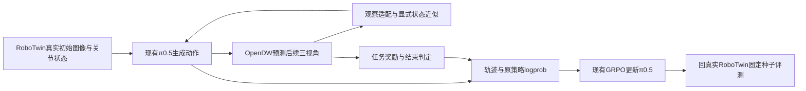

# RLinf × RoboTwin × π0.5 × GRPO × OpenDW：讨论与实施上下文

**历史方案归档（2026-10-04补注）：**本文保留2026-09-30的接口分析、资源快照和当时路线。下文“当前”“尚未启动”及复现顺序均指当时，不代表现行状态；后续已转入OpenDW＋WorldArena任务奖励＋π0.5的四卡smoke，当前路由见[组合主上下文](ROBOTWIN_OPENDW_PIPELINE_CONTEXT.md)和[四卡记录](robotwin_pipeline_20261003/multigpu_smoke_20261003.md)。旧资源记录不能作为重新借卡或重放脚本的依据。

更新：2026-09-30。阶段：主源核查、接口分析和资源规划；尚未安装OpenDW、下载完整权重、启动WM实验或修改在跑训练。服务器操作仅只读。

**2026-10-03后续路由：**当前讨论改为取OpenDW动态预测＋WorldArena奖励/环境设计＋我们RLinf主线，见[组合主上下文](ROBOTWIN_OPENDW_PIPELINE_CONTEXT.md)。本文资源快照与顺序为09-30历史。下文“真实14D state”须按最新实码纠正为policy可见控制目标/夹爪命令；不能据旧措辞推导必须预测实测qpos。

**后续讨论路由更新：** 用户提出先独立复现WorldArena官方RoboTwin/π0.5任务。新计划见 [WORLDARENA_FIRST_REPRODUCTION_PLAN.md](WORLDARENA_FIRST_REPRODUCTION_PLAN.md)。本文保留此前OpenDW优先方案及接口分析；当前待讨论顺序以新计划为准。

## 当前方向

继续使用 `Yutenji-Nyamu/rlinf_fastwam`，拟建独立分支 `codex/sz3-pi05-grpo-opendw-wm`。本轮先维护此文档；基点、首任务及动作时序确定后再创建实施分支，不直接从当前dirty checkout开工。深圳3为拟用服务器，当前0–3卡空闲，4–7卡继续原Dojo评测。

建议先独立跑通 **OpenDW的外部动作→未来视频**，WorldArena 2.0先读代码、借鉴接口，不将其完整复现设为前置任务。π0.5仍负责动作，GRPO仍负责优化；OpenDW提供预测视觉转移，奖励和结束语义需要另补。初期冻结WM，不要求梯度穿过视频生成器。

## 三台服务器现场（9月30日17:14–17:18）

| 服务器 | 实际工作 | GPU4–7 | GPU0–3 | 资源 |
|---|---|---|---|---|
| 深圳1 | 四条RLT学生在线训练：支架Clean420/Combo417，双瓶420/420；更新计数持续增加 | 各约20.2/27.7/21.4/27.4GiB | 当前空闲 | RAM可用约1.56TiB；根盘余209.7GiB，home452.2GiB，data428.8GiB |
| 深圳2 | OpenWAM×Dojo评估2887/6300，295成功，67项原生满预算；原RLT借卡暂停 | 每卡1worker×4env，各35.7–38.2GiB | 当前空闲 | RAM可用约1.80TiB；根盘余7.92GiB，data约6.61TiB |
| 深圳3 | π0.5×Dojo评估1837/6300，158成功，44项原生满预算；原RLT借卡暂停 | 每卡1worker×4env，各34.8–36.1GiB | 当前空闲 | RAM可用约1.76TiB；根盘余5.84GiB，data约6.78TiB |

1机四driver身份一致、ready_for_online=1；最近R400固定评：支架20%/20%，双瓶20%/40%，每次20回合，单点不作方法优劣结论。2、3机四路日志均有当前真实动作或视频落盘；不是只看pipeline活着。2机GPU7现为swap_blocks，所见scroll_y_max是已知非阻断UI回调错误，动作仍增加；该机seed1吐司原生结果已25/25。两watchdog均WATCHING且回执约7–8秒新鲜，未提前派发RLT。1机近3h、2/3机本次continuation启动以来，无所查新增Xid/OOM/I/O/AER，三机不可纠正ECC计数0。短时健康不等于既往GPU问题已根治。

两机原生_result满预算计数与controller summary COMPLETE计数用途不同；以原生结果计数说明产出，不据旧状态行推断丢失结果。部分任务结果不代表全任务最终成功率。

原始证据：`E:/Codex/home/visualizations/2026/09/28/01a0e6c7-bb8c-7421-8697-110ddd91d2f1/wm-plan-20260930/steps/w001–w006`；每步有命令、stdout/stderr、时间、退出码、SSH固定指纹与身份核验。本轮不改Dojo/RLT进程或参数。

## 要继承的基线：纯算法来源与最近实配分开

| 层次 | 已核事实 | 用法 |
|---|---|---|
| 纯π0.5 GRPO Control来源 | `codex/sz-sidney-pi05-current-rlinf`，运行代码f50e235c；公开归档1d015a2aa03ec8132d8207ba47a2be3dbe1d9591；二者生产源码一致。完成100轮并恢复至168，最终用户主动停 | 追溯模型、动作与GRPO接口；本地Git对象可读 |
| 最近Clean工程候选 | `2151a08ee1bd75df1bef0d8190e594bd5c7f7977`，`codex/sz2-grpo-can256-resume-n32-20260927-v1` | 实施基点候选；本地有配置/部署回执但无该Git对象，最终需核服务器实际树与配置 |
| 稳定性边界 | 旧开关Clean约59h、107轮；最新移罐仍有环境内存增长并提前停止 | 不将“版本最新”写成“该任务已稳定完成” |

最近Clean记录：Sidney π0.5；输出/执行C50、14D绝对关节动作、M10；三相机＋真实14D state；32环境×8 rollout=256轨迹/轮、G8；B512、micro32、U2、LR5e-6、Flow-SDE noise0.5；固定32回合每2轮评测、每10轮保存；rollout seed42。`mode=observe`仅记录DV，权重全1，使用原Clean损失。本次没有改变这些参数。

不要误用09-03旧实配B1024、每5轮评估，也不直接使用当前本地 `worktrees/pi05` HEAD或dirty的`pi05-stage`作为新基点。

基线证据：09-27实配（本机历史文件：`docs/server-admin/GRPO256_MEMORY_RESUME_20260927.md`）、09-23 Clean与256预算（本机历史文件：`docs/server-admin/RLT_TWO_TASKS_GRPO256_DV_20260923.md`）、内存增长/停机边界（本机历史文件：`docs/server-admin/SIX_TASKS_RLT_20260927.md`）、纯Control收尾（本机历史文件：`docs/rlinf-shenzhen-multitask-pi05/evidence/PI05_GRPO_CLOSEOUT_AND_ADV_START_20260906.md`）。

## OpenDW已公开哪些可用部分

固定源码 [e33befa8005a1585e0140dbf464566e90bc79aa1](https://github.com/dexmal/opendw/tree/e33befa8005a1585e0140dbf464566e90bc79aa1)，权重 [Dexmal/DW05-Robotwin@6ab5f9e2636610cba440d08264663efe70c3f761](https://huggingface.co/Dexmal/DW05-Robotwin/tree/6ab5f9e2636610cba440d08264663efe70c3f761)。

- 实际存在 `DW05RobotWinPolicy.rollout_video_with_actions()`，可接π0.5给出的外部动作；无需用DW动作专家替换π0.5。[接口](https://github.com/dexmal/opendw/blob/e33befa8005a1585e0140dbf464566e90bc79aa1/dexbotic/policy/dw05_policy.py#L542-L604)
- bundle包含model、统计量、VAE、文本编码器和tokenizer，文件合计约26.244GB（24.44GiB磁盘）。先下载Robotwin bundle即可，不需要同时下载Base。这不是运行显存估计；官方未给可核的H100最低显存与吞吐。
- 三视角拼成384高×320宽：上方头部320×256，下方左右腕各160×128；输出仍是拼图，要恢复π0.5的主图/左右腕观察结构。[拼图源码](https://github.com/dexmal/opendw/blob/e33befa8005a1585e0140dbf464566e90bc79aa1/dexbotic/policy/dw05_policy.py#L145-L181)
- 原始动作是L6+夹爪、R6+夹爪，共14D绝对关节；当前bundle的统计量触发z-score及±5裁剪。RLinf应交反归一化后的`actions`，不交内部`model_actions`，不重复反归一化。[DW变换](https://github.com/dexmal/opendw/blob/e33befa8005a1585e0140dbf464566e90bc79aa1/dexbotic/policy/dw05_policy.py#L326-L349)
- `infer_joint`返回video/action，没有reward/done/真实下一关节状态。官方在线demo把最后一条动作当下一proprio；Value Expert仍标为后续发布。[输出](https://github.com/dexmal/opendw/blob/e33befa8005a1585e0140dbf464566e90bc79aa1/dexbotic/model/dw05/dw05_core.py#L374-L399) · [状态近似](https://github.com/dexmal/opendw/blob/e33befa8005a1585e0140dbf464566e90bc79aa1/playground/online_demos/robotwin_online_demo.py#L1605-L1629)

两处发布差异：README里的`script/dw/infer_aloha_joint.py`当前Git树不存在，应走真实存在的policy/demo；HF config写action/proprio32，但model.pt元数据实际encoder维数14，runtime会据权重推断。部署应固定源码、checkpoint、统计量，不只照抄README或config维数字段。元数据核查仅读取权重开头约1MiB，不执行pickle或加载完整权重。

## 主要gap与准备采用的处理

| gap | 问题是什么 | 初步处理/待决定 |
|---|---|---|
| 动作时序 | 现有C50；DW默认32动作→9帧（首帧＋8未来帧，每4动作一间隔） | 先用独立32步真实片段验证官方预测。接训练前明确第50步对应帧与奖励位置，未经确认不改C50或采样预算 |
| proprio | 目标关节命令不等于接触后的实际关节状态 | 首轮可显式使用官方命令近似并测误差；记录它不是预测真值。若接触误差显著，再讨论状态预测/校正，不用全零掩盖 |
| 奖励与终止 | 视频本身没有原RoboTwin成功判定器 | GRPO不需要Value Expert，但需要任务奖励。选择与首任务匹配的reward/success模型，校准阈值；成功结束、超时结束、final_obs分开 |
| GRPO组内公平 | G8要同初态；WM噪声也会改变回报 | 复用同一真实reset样本，分别记录policy随机数和WM随机数；先确定WM随机性方案，防止把随机视频好坏误当动作好坏 |
| 并行与速度 | 当前DW主要推理入口batch=1 | 先测单条32步的显存、时延，随后决定独立WM服务/批处理；不要直接继承Dojo32并发或承诺WM比物理仿真快 |
| 真实性评估 | 策略可能利用模型/奖励预测误差 | 训练在WM，固定评测仍回真实RoboTwin；保存相同初态与动作的真实/预测对照 |

### C50不能直接硬接默认rollout

静态代码已核：输入50条、默认horizon32时，先预测32条，再把剩余18条重复末动作补14条成32；拼成17帧。末帧已经包含补出的动作，不能当准确第50步观察。仅把horizon设50也不行，offset仍每次加32，会重叠处理。

底层推理可能接受50条条件，并不证明时间语义/训练分布正确。64动作→17帧满足相对比例，也不构成擅自把C50改64的理由。后续可讨论保持C50做正确时间适配，或另设匹配C32的真实Control＋WM对照；后者属于显式实验配置变化，本轮未决定。

[分块/补齐/offset源码](https://github.com/dexmal/opendw/blob/e33befa8005a1585e0140dbf464566e90bc79aa1/dexbotic/policy/dw05_policy.py#L564-L602) · [训练时间约束](https://github.com/dexmal/opendw/blob/e33befa8005a1585e0140dbf464566e90bc79aa1/dexbotic/model/dw05/dw05_core.py#L28-L47)。demo导出8fps是视频播放设置，不能直接认作机器人控制频率。

## WorldArena 2.0的角色与旧结论更新

核定源码 [5978ce5c81e55b8c8358f4f5966a13ce385ff155](https://github.com/WorldArena2/WorldArena-2.0/tree/5978ce5c81e55b8c8358f4f5966a13ce385ff155)。其RL工程可参考RoboTwin/π0.5/GRPO接Wan、组内初态、reset/chunk_step、奖励和HTTP服务分离；示例动作块8，单头部图、腕部为空、state全零，不能直接替换当前三视角/14D真实state。Wan加载器也不直接读取OpenDW bundle。[环境观察](https://github.com/WorldArena2/WorldArena-2.0/blob/5978ce5c81e55b8c8358f4f5966a13ce385ff155/RL_env_benchmark/rlinf/envs/world_model/world_model_wan_env.py#L648-L696) · [配置](https://github.com/WorldArena2/WorldArena-2.0/blob/5978ce5c81e55b8c8358f4f5966a13ce385ff155/RL_env_benchmark/examples/embodiment/config/wan_robotwin_adjust_bottle_grpo_openpi_pi05.yaml#L86-L143)

**更正先前“奖励权重未确认公开”的笼统说法：**[WorldArena/WorldArena2.0@2c351f46](https://huggingface.co/WorldArena/WorldArena2.0/tree/2c351f46da784d4d8caca210ad1ca3b11c4b4124)现可见adjust_bottle、click_bell的π0.5及奖励模型文件，两任务resnet_rm.pth各588,338,878字节。它们只能作为对应任务的候选，不是任意RoboTwin任务通用奖励。

旧[WorldArena模型库](https://huggingface.co/WorldArena/WorldArena/tree/f5f27bc5d4e7a9c5c119eda38b2639c87c215d80/models)也有Wan相关文件，但后续元数据核查表明wan_adjust_bottle.pt是Video_Former/action_pred等结构，不能称为当前RL环境的任务WM。**后续更正：** DiffSynth虽未内置，install.sh明确拉取公开RLinf/diffsynth-studio；README正文也已含主要流程。当前更具体的缺口是该依赖动作层7D与RoboTwin14D不匹配，所查公开模型库尚未对应到配套DiT与reset bundle。精确证据见新计划第3节，不能再沿用“没有公开依赖”的判断。

我们的老Control树已经有WANWM入口。最新RLinf主干 [d34d4c3](https://github.com/RLinf/RLinf/tree/d34d4c320d08cb982de034aa9a011f08dc0fa217)又拆出可注册backend的open_session/generate/close_session，可参考设计；其默认单图/零state同样需要适配，不为获取接口而整体升级现有训练基线。[backend契约](https://github.com/RLinf/RLinf/blob/d34d4c320d08cb982de034aa9a011f08dc0fa217/rlinf/envs/sim/world_model/backend/__init__.py#L43-L104)

## 实施顺序（准备讨论，不是已执行）

1. **先OpenDW官方预测。** 深圳3独立环境与/data目录，优先空闲GPU3；固定上述bundle，取现有RoboTwin真实三视角/state/π0.5绝对动作中的32步片段，保存预测与真实视频、输入/输出、时延和显存。本阶段不接GRPO，无需奖励，不安装WorldArena整套。
2. **确定环境契约。** 首任务/对应policy权重、C50时间映射、next-proprio方案、奖励来源、终止和G8随机性。WorldArena的两个公开reward任务是可选起点；若换当前任务，配同任务真实Control。对齐后定义`reset/chunk_step`与final_observation，不把视频帧数当动作步数。
3. **接最少文件，验一次更新。** 固定所选Clean工程树，新增OpenDW backend/env、注册项和独立YAML；复用π0.5/Flow-SDE/GRPO/EnvWorker/权重同步。以少量针对性接口检查和一次真实参数更新验闭环，单次测试预算另列，不默认为正式训练预算。
4. **回RoboTwin看是否有效。** 同固定种子比较原policy与WM训练后的policy，再讨论更长WM rollout、奖励/状态改进和并行。双层日志记录首次成功、失败、版本和精确命令。

拟新增文件：`rlinf/envs/world_model/open_dw_backend.py`、`open_dw_env.py`；改环境注册；独立`examples/embodiment/config/...pi05_grpo_opendw.yaml`。实际目录以最终基点为准。RoboTwin当前adapter的奖励是块末奖励，返回[B,C]奖励及terminated/truncated；auto-reset需保留真正final_observation，这些都须继承，不能静默换成视频逐帧奖励。

OpenDW模型推理本身不依赖RoboDojo/Isaac Sim。计划先用深圳3空闲卡，不因WM规划停现Dojo。环境、权重、HF缓存、视频全部放/data；根盘仅余约5.8GiB，不能用默认根盘缓存承接26GB bundle。单卡是否够和正式GPU分配留给第一阶段实测，未宣称当前卡已预留。

## 本轮记录与下一步

- 已完成：官方代码/模型文件核查；纯Control和最近实配区分；三台服务器只读刷新；本MD建立。
- 未执行：创建实现分支、下载完整OpenDW/WorldArena权重、安装新环境、改C50/任务/奖励、训练或暂停现有任务。
- 下一步建议：先实施第1步OpenDW预测，首份真实轨迹来源沿现有RoboTwin数据；随后专门确认第2步的动作时序与奖励路线。
