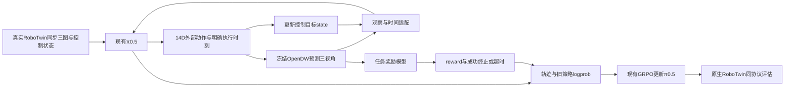

# RoboTwin × RLinf × OpenDW × 任务奖励：组合上下文

更新：2026-10-03 23:15。**N8/N16单块smoke均退出0，尚未证明有效学习；按用户要求改为接近正式的四卡N64/G8/R8 smoke。**旧LIBERO每轮N64×R8＝512条轨迹，G8已含于N；L320/C8共20,480个动作块。新四卡由4/5承载actor与rollout，6/7各一个OpenDW服务；N64分给两个env rank各32，WM各B1。先同并行跑L32一轮，再L384一轮核完整回合信号；这是资源与接线测试，不是正式收益。

原`runs/smoke-v3`已结束。其RLT归还首轮失败，原因是CPU通信worker携带全卡列表被scope-v4拒绝；v5已仅对该精确列表收窄，CPU检查通过，新的GPU4返回driver3432819活。用户明确WM优先，因此已退休只等待首轮的repair-owner，**不等RLT首轮验收再上WM**。GPU5–7是三份独立单卡RLT，旧GPU0图形上下文随本次精确撤卡处理。新四卡owner已23:31启动（3230235/start701253070），输出`runs/multigpu-v1`，启动时完整CP125/125/75/75；禁止重放旧owner/借还脚本。当前阶段实时读新owner回执，详见[四卡执行说明](robotwin_pipeline_20261003/multigpu_smoke_20261003.md)。

## 当前决定与执行边界

- 最新授权：全面核实后自行实现、smoke并选择串并行参数；方案与实测允许时安排正式训练。RLT低优先，WM需要卡即可精确切换，用完恢复；物理4–7范围。首任务adjust_bottle、H50/C32保持，正式轨迹预算改384=12个完整块；大模型奖励暂只讨论。
- 18:20–18:30深圳2历史只读记录：4–7卡均由本账号EXPO-FT `turn_switch`占用，唯一owner/driver匹配，77回合、12030真实动作，完成学习调用252→254。它是此前快照，本轮新smoke不更改EXPO。证据见[现场记录](robotwin_pipeline_20261003/server_status.md)。
- 当前LIBERO Wan WMRL与深圳2 EXPO是两条实验。LIBERO旧r6在深圳3，历史已核完成139轮后OOM并归还；memory-fix独立部署已准备，本轮未复训。不能将“深圳2有训练”写成“LIBERO WMRL仍在训练”。
- 之前已同意的micro64/global2048、环境卸载等待、资源监控、每10轮保存及独立原生评估、未来C8单双相机基线协议保持，见[授权部署记录](WAN_GOAL_DEPLOYMENT_20261003.md)。RoboTwin新方案不覆盖这些约定。
- 已选组合：**现有RLinf主线＋OpenDW Robotwin三视角动态模型＋WorldArena `adjust_bottle` RM＋Sidney π0.5-GRPO**。WM和RM冻结；原生RoboTwin评估仍决定是否有真实收益。原N8/N16短测仅历史，新的并行目标N64/G8/R8、四卡；H50/C32/M10/noise0.5/U2保持。短测GB512/micro8＝2次优化器更新；L384信号测GB2048/micro8＝6次更新，不能称与旧LIBERO的10次更新完全同预算。

## 1. 三个项目分别给什么

| 组件 | 已有且对我们有用 | 还不能据此声称 |
|---|---|---|
| 我们的RLinf | RoboTwin π0.5动作适配、Flow-SDE/GRPO、actor/rollout同步、保存恢复、原生评估；新OpenDW N8单块GPU smoke已退出0 | 全滤、梯度0，尚不能声称产生有效学习或原生收益 |
| OpenDW DW05-Robotwin | Robotwin模型包；头＋左右腕联合视频；外部14D绝对关节动作驱动；数据和WM训练入口 | 已有reward/done、可信任意chunk时刻输出、N64批处理，或公开Value Expert已可用 |
| WorldArena 2.0 | RLinf衍生的WM环境、HTTP服务/代理、RoboTwin π0.5/GRPO例程；两任务reward资产 | 其单头图/零state可直接替代我们的三图策略；对应14D Wan/reset包已齐全；两种reward都是真成功分类器 |

OpenDW也能生成动作，但本方案只用其`rollout_video_with_actions`入口，让π0.5继续决定动作。WorldArena是接口与奖励来源，**不需要把它的完整RLinf fork合并进我们仓库，也不需要先补齐其Wan模型包，才能尝试OpenDW路线**。[OpenDW官方代码](https://github.com/dexmal/opendw/blob/e33befa8005a1585e0140dbf464566e90bc79aa1/dexbotic/policy/dw05_policy.py#L542-L604)、[WorldArena集成说明](https://github.com/WorldArena2/WorldArena-2.0/blob/5978ce5c81e55b8c8358f4f5966a13ce385ff155/RL_env_benchmark/README.md)

## 2. 闭环怎样组成

WM回答“执行这些动作后会看到什么”；奖励模型回答“任务完成了没有、进展怎样”；GRPO比较同一起点的不同动作轨迹，更新π0.5。GRPO无需额外critic，也无需梯度穿过OpenDW。所有奖励仍是模型判断，最终在物理模拟器用原生成功判据验证。

## 3. 重要纠正：策略的state不一定是实测关节角

此前将“OpenDW无next proprio”直接推为“必须另训下一真实state预测器”，对我们这版RoboTwin说得过重。

深圳2共享RoboTwin源树本轮实核：HEAD `0008ae6800df9f75fc8de7098bacb01735fd8fd2`、已跟踪文件clean。

1. `envs/_base_task.py:512–519`的`get_obs()`调用`get_left/right_arm_jointState()`构造`joint_action.vector`。
2. `envs/robot/robot.py:528–539`里，这两个getter读取12轴`get_drive_target()`，再拼缓存的左右夹爪命令。
3. 另有`get_*_arm_real_jointState()`读取`get_qpos()`，但上述观察入口没有使用它。

因此，本版策略可见的14D state是**12轴控制目标＋2个夹爪命令**。关节实际因接触没走到目标，并不自动要求把policy state改成实测qpos；那反而会改变原观察语义。首smoke采用明确的WM合同：给OpenDW完整32条绝对命令，返回第32动作末图，同时将最后命令的12关节＋裁剪到[0,1]的2夹爪写为next-state；不额外训练state预测器。真实RoboTwin的规划失败/部分执行是后续原生对照要记录的差异，不能当WM已模拟了物理执行。完整调用链和版本边界见[接口审计](robotwin_pipeline_20261003/interface_audit.md)。

这只缩小了机器人state接口缺口。OpenDW仍要正确预测碰撞、抓取、物体运动；控制命令也不能提供物体位置或接触真值，成功判断仍需RM。最终选定π0.5 Control时仍需核它实际加载的RoboTwin版本和数据来源，不将本次共享源核验推广到所有RoboTwin/真机。

如果未来策略确实使用实测proprio，候选还有：明确命令近似的限制；单独训练状态转移器；联合训练视频＋状态。**WEAVER已有公开代码/权重和未来proprio预测头**，但配套为DROID/Franka 8D、双视角、5Hz；移到RoboTwin14D/三视角需数据和模型适配。RISE当前也用末动作更新state，并非现成实测state预测器。[WEAVER项目](https://arnavkj1995.github.io/WEAVER/)

## 4. 成功、reward、value、done要分开

| 名称 | 在这里的含义 | 常见混淆 |
|---|---|---|
| success | 任务是否已经满足 | 画面像目标、进度上涨未必完成 |
| reward | 交给优化器的分数，可由success或进展差分得到 | RM成功率不是原生成功率 |
| value/progress | critic预测未来回报；progress预测完成程度，部分论文也称value | 不是自动可用的success/done |
| done | 回合结束，区分成功等termination与预算到限truncation | 到限不等于成功，短分支末端也不应全当失败 |

**现有LIBERO Goal**使用任务ID条件的ResNet奖励网络，主图＋任务ID→sigmoid→round得到0/1。环境再做差分奖励，chunk内曾判成功就在块末记termination。它不是LIBERO原生几何判据，也不直接理解任意语言；Spatial的网络又有所不同。[官方Goal奖励实现](https://github.com/RLinf/diffsynth-studio/blob/2a2e05fa1f724828b243f272540989b19a6e54f8/diffsynth/models/reward_model.py#L326-L397)

**RoboTwin原生成功**可以查询物体位姿、功能点及接触事件；视频模型没有这些内部真值。它们适合给真实轨迹自动打训练标签，并用于最终评估，不能直接搬到生成RGB上调用。

**WorldArena两任务并不相同：**

- `adjust_bottle`默认ResNet18＋冻结T5/cross-attention判别器，输出连续分数，有公开任务资产。
- `click_bell`默认LPIPS与参考末帧相似度，不是已发布分类器的默认使用路径。相似可以意味着手到铃铛旁，却不证明真实按铃事件。
- 两者环境都做差分、原始分数≥0.9估计成功；阈值并未经我们的OpenDW生成域验证。正式π0.5 YAML奖励系数覆盖为5，不能只读env子配置说成1。[默认配置与实现核验](robotwin_pipeline_20261003/reward_options.md)

本次首smoke采用对应RM的连续概率，**不再sigmoid、不round**；RM内部完成224 resize与ImageNet归一化。差分初值0沿官方reset语义，一chunk累计等于末图score；奖励系数1继承我们的Sidney GRPO，不照搬WorldArena系数5。成功阈值0.9与GRPO保留组均值0.1–0.9是两回事：8条都未成功，分数不同仍可能有学习信号。

## 5. 奖励候选及推荐

| 路线 | 我们怎样使用 | 主要成本或限制 |
|---|---|---|
| 同任务WorldArena RM | 首smoke已选adjust_bottle，按官方预处理接入对应公开模型，留分数/画面记录 | 任务、阈值和假成功仍以数据判断；不能扩称全任务通用 |
| 自训轻量成功判别器 | 用原生RoboTwin成功标签标注成功/失败轨迹，按episode划分训练与验证 | 新任务需数据；接触事件可能需短视频/腕图，单帧不一定可辨 |
| TOPReward/WorldLoop、RoboReward | 通用VLM对照或离线终局复核；前者已有RLinf相关接口，后者4B/8B权重已公开 | 额外推理资源与RoboTwin校准；类别/概率不能直接照抄阈值 |
| Robo-Dopamine/GRM、RISE进度value | 后续稀疏信号不足时，研究稠密进展反馈 | 进展不等于成功；仍需可靠terminal标签，增加训练方法复杂度 |
| LPIPS参考图相似度 | 保留作原配方对照或诊断 | 不建议作为新任务唯一成功判据 |

**首选路径：同任务现有分类器能验过就复用；新任务优先原生标签训练轻量判别器。**通用VLM作为独立核验和对照，暂不因“覆盖广”替换所有奖励。Robo-Dopamine 2.0有RoboTwin实验，但仍结合原环境任务奖励与进展shaping，不能据其成绩宣称已经解决视频环境成功判定。所有官方源、权重与代码锚点集中在[奖励专题](robotwin_pipeline_20261003/reward_options.md)。

验证要同时看原生失败却高分的样本，以及短暂假成功后回落。政策会主动追逐高分，少量系统性误判就可能被放大；视觉流畅、RM训练准确率高或WM内成功率上涨，均不能代替原生效果。

## 6. 已明确的适配与smoke要观察的结果

| 接口 | 必须对齐的内容 | 当前状态 |
|---|---|---|
| reset/任务 | 同时刻三图、14D控制状态、文本；G8同组共享起点 | 新env读真实reset NPZ，槽位各自复制；需准备目标任务资产，旧LIBERO reset不适用 |
| 图像 | head/左腕/右腕顺序、拼图/拆图、色彩和resize | 已写明确拼拆：384×320画布，上256×320主图，下左右各128×160；原生reset直接进入策略预处理，避免先经过WM缩图 |
| 动作 | π0.5输出反归一化到14D绝对关节目标，再按OpenDW统计归一化 | 已明确；adapter不归一化，WM模型内部使用自己的stats；不动原模型chain/logprob |
| 时间 | 32动作→8未来帧，每4动作一图 | **已选C32**，首smoke只一个完整块；返回第32动作末图，避免C50补齐问题 |
| state | 完整C32最后命令与裁剪后夹爪 | 采用命令状态更新，和WM末帧同属32动作边界；不声称预测实测qpos |
| reward/终止 | 连续score差分；任一帧≥0.9估计成功，块末终止；到32动作截断 | 已按WorldArena块末语义写出；8次差分落到动作4/8/…/32，不将帧奖励重复4遍；保留瞬时成功位置 |
| 并行/随机数 | G8完整组；每槽独立图像/state/seed | 先逻辑N8、物理4服务队列，容量允许再试N16/N32；G8不被拆到多个env rank |
| 资源/恢复 | WM、actor装卸完成屏障，阶段峰值、故障回执与CP | 已准备Sidney runner等待patch；服务须同步确认卸载，真实峰值和释放待服务器回执 |
| 原生评估 | 同checkpoint、相机、C、动作预算与固定初态对照 | 有现有框架；新WM结果必须回原生RoboTwin验证 |

**C50冲突在首smoke中已通过明确选择C32解决。**策略仍预测H50，只执行前32条，旧策略logprob和actor重算都截取前32动作×14维；50步去噪chain保留，不将策略模型缩成H32。以后原生Control也用同C32比较。旧C50在跑任务不改；公共helper的50→补64陷阱保留在[旧接口证据](robotwin_pipeline_20261003/interface_audit.md)。

用户此前提出的新RoboTwin方案step limit 400，应按原生策略动作预算语义写入该方案；不是400视频帧或400个物理引擎子步。当前原生控制路径会先累计整chunk，成功却可能在子步提前返回，需明确计数与返回时刻的差别。它不授权把当前EXPO/RLT已有200动作配置改为400。实现前还需明确尾段不足整chunk如何返回正确时刻与truncation。[完整接口表](robotwin_pipeline_20261003/interface_audit.md)

## 7. 首先得到什么，后来能扩到什么

第一阶段命名为 **“OpenDW＋任务RM＋π0.5-GRPO基线”**，属于model-based RL，接近WMPO/WoVR固定WM阶段。并非组装后已自动复现三篇方法。

| 方法 | 在基础闭环上继续增加 | 工程距离判断 |
|---|---|---|
| WoVR部分机制 | KIR关键中间起点、首次成功后mask、有效长度处理 | 较近；现有RLinf有相关代码，需OpenDW数据与语义验证 |
| WMPO | 覆盖当前策略成功/失败行为的WM；GRPO过滤后动态补采样到有效批量够数 | 补采样中等，额外WM调用必须计成本；策略对齐需要数据与微调 |
| 完整WoVR/PACE | 新策略回原环境采动态轨迹→更新WM→验证并切换→继续RL | 较大，是阶段性数据和训练闭环 |
| VLA-MBPO | 真实离线状态短分支、value/GAE/bootstrap、Flow-Noise PPO | 较大，采样与训练目标都改变；只把GRPO rollout缩短不等于MBPO |
| RISE | 进度/TD value、优势条件策略输入与流匹配、预热和数据混合 | 独立方法分支，不能仅换reward名称 |

用户将这些方法整理归档；当前已重新授权实施基础smoke。**成功mask/KIR、有效组补样、WM对齐/PACE或value短分支**仍是后续方法讨论，不混入首个固定WM闭环。[方法及论文证据](robotwin_pipeline_20261003/method_map.md)

## 8. 本轮候选路线与验收（动态结果见实施记录）

1. 固定Sidney Control源码`2151a08e`、策略权重/normalizer、OpenDW bundle与任务RM；新增独立环境/服务/配置，少量服务器CPU接口检查。
2. 新owner仅借深圳3物理4起步，先得到真实模型加载/生成峰值，再在同次授权范围直接集成短smoke；必要时按证据调整串并行和阶段装卸，用新attempt保留每次结果。
3. 候选为N8/G8、R1、一条轨迹只32动作、1个runner iteration、U2；经历π0.5→OpenDW→RM→GRPO actor→CP保存，记录三图、state、分数、mask和资源。不会把“串行1步”误写成1条物理动作或1次optimizer调度。
4. 区分`pipeline_completed`与`learning_signal_verified`：一chunk全组同分时可能mask/优势/GRPO梯度全零，接线可完成，但不称已获得有效学习。初始score差分基准、成功阈值和过滤按合同记录，不伪造信号。
5. 正常完成或故障后精确释放本次driver、其Ray namespace演员与WM服务，保持共享Ray；再由同owner接回被借卡RLT并验续跑首轮，不自动扩到正式训练。

配置、源码入口、数学整除、容量候选与唯一owner要求见[smoke合同](robotwin_pipeline_20261003/smoke_contract.md)。本轮独立准备目录已有15项服务器CPU检查通过，WorldArena RM已strict加载并完成4张初态CPU打分；尚无GPU资源测量或集成训练结果。新授权和执行状态见[实施记录](robotwin_pipeline_20261003/execution_20261003.md)，[此前讨论暂停](robotwin_pipeline_20261003/discussion_only_20261003.md)只保留历史。

## 9. 文档路由与版本

- [接口逐项审计与state纠正](robotwin_pipeline_20261003/interface_audit.md)
- [奖励来源与候选](robotwin_pipeline_20261003/reward_options.md)
- [WMPO/WoVR/MBPO/RISE方法边界](robotwin_pipeline_20261003/method_map.md)
- [本次smoke合同、配置与runner素材](robotwin_pipeline_20261003/smoke_contract.md)
- [本轮深圳2现场与源代码证据](robotwin_pipeline_20261003/server_status.md)
- 上一轮[A2World/VLA-MBPO/OpenDW选型](robotwin_options_20261003/OVERVIEW.md)保留；09-30旧OpenDW/WorldArena实施顺序与资源状态仅作历史。本页为当前组合讨论入口。

固定来源：研究参考RLinf `c70606f0`；本次Sidney Control实施基点`2151a08e`；OpenDW `e33befa8`；OpenDW Robotwin HF `6ab5f9e2`；WorldArena `5978ce5c`；WorldArena HF `2c351f46`；此前实核深圳2RoboTwin源 `0008ae68`。本页已记录接线素材与授权路线，模型质量、显存、吞吐、服务器smoke是否完成及最终训练收益均须追加真实实验回执。
