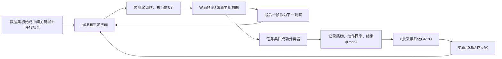

# 深圳3 Wan Goal：训练机制、数据量与四卡并行

2026-10-01。本文回答本轮关于每轮行为、奖励/过滤、单视角、参数来源和每卡资源的问题。依据固定源码、当前实际配置及w157–w160只读现场；没有改变方法、预算、过滤或活的控制器。

## 当前组合与闭环

当前是RLinf＋LIBERO Goal任务数据＋冻结Wan＋冻结成功分类器＋单视角π0.5＋GRPO。训练发生在Wan预测的图像环境中；物理LIBERO不是当前每一步的执行器。π0.5只更新动作专家及相关动作/时间投影，视觉/语言部分冻结。

Wan既给出动作的后果，也给出下一次决策的视觉输入。否则策略只能反复根据旧画面出动作，无法形成连续操作轨迹。奖励不作为π0.5的视觉输入；它在采集结束后用于策略优化。没有通过Wan或奖励网络反向传播。

每次Wan使用参考图及近期图像组成5张条件帧，结合8步动作，生成8张新图（接口总长度13帧），预测最后一帧进入下一次π0.5。策略与Wan均用5步去噪。KIR开启，可从官方数据中的初始帧或中间关键帧开始，减少长距离预测漂移；因此512个轨迹槽位不等于512次从任务起点开始的完整物理评估。

直接来源是[RLinf Wan例程](https://rlinf.readthedocs.io/en/latest/rst_source/examples/embodied/wan.html)。在方法上更接近[WoVR](https://arxiv.org/html/2602.13977v1)的静态WM训练阶段：Wan、KIR、GRPO及有效步mask；没有PACE采集更新策略的真实轨迹并继续训练WM。当前不是完整WoVR复现。WMPO也是动作条件闭环，但[官方WMPO](https://github.com/WM-PO/WMPO)使用OpenSora、OFT及VideoMAE奖励，是另一实现。未接入OpenDW或WorldArena。

## 奖励模型：来源与实际返回值

权重来自官方[RLinf-Wan-LIBERO-Goal](https://huggingface.co/RLinf/RLinf-Wan-LIBERO-Goal/tree/bd395971c3467de3dd19e7e6c7562af48a2894a6)，固定revision `bd395971c3467de3dd19e7e6c7562af48a2894a6`；文件`taskemb_resnet_rm.pth`，45,379,978 bytes。不是本次新训练的奖励，也不是Wan自动产生的分数。

实际加载的`TaskEmbedResnetRewModel`：

1. ResNet18风格的图像网络提取512维特征。
2. 指令按十个已知LIBERO Goal字符串映射成任务ID，再查64维可学习任务嵌入；不是自由语言理解器。
3. 拼接后经256维MLP和Sigmoid，最后执行`torch.round`，每帧实际输出0或1。
4. 环境启用相对奖励：`r_t = s_t - s_(t-1)`，reset的前分数为0，系数1。从“未成功”转为“成功”给+1，反向给-1。

该源码w158/w160实际SHA为`39838f06553d0c62ef42f3cf45d7b3cb34e1bc0b3543cbd12dac72b5d1141a65`。公开[奖励源码](https://github.com/RLinf/diffsynth-studio/blob/main/diffsynth/models/reward_model.py)及WoVR论文说明用成功状态标签和二元交叉熵训练分类器；此Goal checkpoint的完整训练切分与分类准确率未在模型卡中说明。

chunk中任一预测帧分数为1，即视为WM估计成功，并把done放在chunk末尾。若中间帧为1、最后又回0，会标成功但差分累计回报为0；不能严格把累计回报或组均值解释成成功率。当前成功都是奖励分类器对生成画面的判断，需要同输入的物理LIBERO评估才能测实际成功率。配置`reward.use_reward_model=false`关闭的是独立奖励worker，环境内部这个分类器仍在运行。

## 每个runner轮具体做什么

这里“轮”是runner epoch，和一次optimizer step不同。

1. 抽取8个组的条件，每组复制成8条轨迹，共64条同时采集；每卡16条、2组。
2. 各轨迹执行π0.5→Wan→奖励→下一画面的循环，动作预算320，8动作一个chunk，40个chunk槽位。轨迹时间依赖使这40步必须先后发生。
3. 顺序做8批这样的采集。每批重新抽条件，可重复；不是64个保证不同的场景。
4. 汇总轨迹回报，生成有效步mask、过滤整组，算组内相对优势。
5. 更新π0.5：本轮数据训练一遍，10次optimizer调度；同步给采样策略，开始下一轮。

|数据/计算口径|全局每轮|每卡/rank每轮|
|---|---:|---:|
|同时轨迹数N|64|16|
|组大小G|8条/组，8组/批|2组/批|
|顺序采集批次R|8|8|
|轨迹槽位|64×8＝512|128|
|动作槽位上限|512×320＝163,840|40,960|
|chunk样本槽位|512×40＝20,480|5,120|
|每次optimizer batch|2,048|512|
|microbatch|—|128|
|每次更新的梯度累积|四rank同步|4次microbatch|
|每runner轮optimizer调度|10|同步10次|

提前结束之后的槽位及整组过滤数据都不产生有效GRPO损失；20,480是样本槽位，不是20,480个有效样本。它们也不是独立的物理回合。数据规模沿官方π0.5配方；目前更值得观察的是有效数据比例和组内回报差异，而不是只看N64。

## 过滤、优势、无有效梯度

过滤先按有效步累计每条轨迹的回报，再求组内8条的均值；仅保留均值位于`[0.1, 0.9]`的整组。代码给loss mask置零，没有删除行，也没有自动重采直到凑足固定数量有效组。

在常见的单调0/1成功回报下：8条全失败，组均值0，过滤；8条全成功，均值1，过滤；1–7条成功，均值0.125–0.875，保留。上文chunk中分数反复的例外使它不总等于“成功率过滤”。

GRPO比较同一条件的8条轨迹：`A_i = (轨迹总回报_i - 组均值) / (组内样本标准差 + 1e-6)`，同一轨迹的优势用于其全部有效chunk。回报高于组均值的轨迹得到正优势，低于均值的得到负优势；这不是逐动作质量判断。同组回报全部相同，没有相对学习信号。当前没有额外全局whiten。8个动作奖励先求和成chunk奖励，再按done截断累计轨迹总回报；这条GRPO路径不使用gamma/GAE。已从固定现场`rlinf/algorithms/advantages.py:107–119`、`utils.py:81–89,136–145,365–368`补核；chunk动作概率是8动作×7维共56项Gaussian logprob求和，不是语言token概率。

“整轮无有效GRPO梯度”指最后有效mask为0，GRPO loss/grad为0。actor仍执行训练循环和10次optimizer调度，计算量不会因mask自动消失；AdamW动量或衰减仍可能使参数变化，不能直接说参数完全没动。空优势集合的min/max统计返回NaN，不代表权重NaN。

`rollout/loss_mask_fraction`同时扣掉提前结束后的步和整组过滤，不是成功率，也不是保留组比例。w159最新step9为7.1972653%，step8为1.5429688%；有效比例会波动，不能以20,480名义槽位替代有效数据量。参数全有限仍等原CP40完整保存后检查。

## 参数从哪来

|参数|当前值|依据与含义|
|---|---|---|
|N/G/R|64/8/8|官方π0.5 Goal：同时轨迹/每组轨迹/更新前顺序采集批次|
|动作预算L|320|官方π0.5 Goal；Wan默认240被该配方覆盖|
|策略预测H/执行C|10/8|保留π0.5 H10；原物理Goal C5改为Wan接口C8|
|策略与WM去噪|各5步|各自官方模型/例程配置|
|global/micro batch|2048/128|官方π0.5 Goal；4卡时rank batch512，累积4次|
|update_epoch|1|本轮采集数据训练一遍|
|学习率/seed|5e-6/42|官方π0.5 Goal|
|GRPO/clip|chunk级；0.2|官方π0.5 Goal；只更新动作专家，无critic|
|过滤/奖励系数|0.1–0.9/1|官方π0.5 Goal；未改过滤、未抄OFT系数5|
|WM图像/条件|256×256，5条件＋8预测|官方Wan接口|
|KIR/offload|开启|官方Wan；三类角色按阶段卸载|
|总轮数/保存间隔|1000/40|原π0.5 Goal预算，未额外扩大|
|物理资源|深圳3 4–7|本项目已授权分配；actor/env/rollout同放|
|评估|val_check_interval=-1|当前正式不自动跑物理LIBERO评估；eval配置存在不等于已经评估|

配方来源：[固定π0.5 Goal YAML](https://github.com/RLinf/RLinf/blob/d34d4c320d08cb982de034aa9a011f08dc0fa217/examples/embodiment/config/libero_goal_grpo_openpi_pi05.yaml)＋官方Wan环境。当前是两份官方配方的适配，不声称官方原样π0.5＋Wan例程。实际本地配置：`local_scripts/wan_goal_20260930/pi05/wan_goal_pi05_headonly_formal_sz3.yaml`。

## 单视角为什么仍可能成功

主相机仍看得到机械臂、目标和桌面，腕图是补充近距离信息；少一个视角不等于完全没有观察。当前腕图零填充且image mask=false，模型不把它当有效视觉输入；这和保留一张有效黑图不同。所选π0.5不依赖状态输入，零状态只是接口占位，不代表预测了真实关节状态。视觉部分仍可能计算零图tokens，mask不保证省掉全部腕图计算。

公开材料分三层：

- [OpenPI mask实现](https://github.com/Physical-Intelligence/openpi/blob/main/src/openpi/models_pytorch/pi0_pytorch.py)支持缺失相机的输入机制。这是工程依据，不是成功率依据。
- RLinf官方单视角OFT＋Wan的Goal表为48.2%→60.1%，说明单视角想象训练有有效实例，不能直接套到π0.5。
- [ProphRL论文§4.1.3/§4.3.1](https://arxiv.org/html/2511.20633v2)明确使用单RGB的π0.5变体：先做匹配输入的BRIDGE SFT 200k步，再用Prophet＋FA-GRPO＋FlowScale；SimplerEnv总成功率38.9±2.6%→51.0±1.2%。这是单视角π0.5成功先例，不是屏蔽现成双视角LIBERO checkpoint腕图的直接消融。

当前证明的是单视角π0.5可以进行真实GRPO参数更新；屏蔽腕图后的实际成功率还没有测出。除此之外，Wan来自既定VLA rollout，π0.5动作分布变化也可能带来WM误差；完整WoVR的PACE会刷新WM，当前冻结例程没有这一步。

## 每卡角色与串并行

四张物理卡4/5/6/7，每卡一个EnvWorker、一个MultiStepRolloutWorker、一个EmbodiedFSDPActor，共12个已验证自有GPU进程。

- 环境角色：16个批量WM环境槽位，2组；Wan一次pipeline调用的batch为16，不是启动16个独立仿真器。
- 采样角色：π0.5批量预测动作、记录采样概率。
- 训练角色：π0.5动作专家前向/反向，四rank同步梯度。`no_shard`为模型副本数据并行，不是四卡把单模型按层拆开；pipeline_stage_num=1。
- 采集与训练在runner阶段上先后执行，offload减少同时常驻显存。轨迹内40个chunk、每轮8批，以及各模型5次去噪都含顺序依赖；四卡和每卡16条轨迹在同一批并行。

15:44（w158）处于actor.run_training，四卡更新时GPU利用率均100%：

|物理卡|总显存使用GiB|actor MiB|rollout MiB|env MiB|
|---|---:|---:|---:|---:|
|4|48.39|47,802|790|908|
|5|48.79|46,936|2,062|910|
|6|48.73|46,936|2,062|848|
|7|48.38|46,696|1,822|970|

15:55（w160）采集时，四卡总显存60.88/61.27/61.22/60.86GiB；env约37.7–37.8GiB、采样策略约11.1–12.3GiB、actor当时暂留约10.9–12.0GiB。GPU利用率是短时快照98/98/100/1%，因角色交替和等待会波动；不能把瞬时1%视为任务退出或卡空闲。

15:39（w157）采集快照总显存约62.1–62.5GiB。因此此前“每卡约62GiB”是已观察到的采集阶段占用，不是常数，也不是持续采样得到的峰值上界。两阶段都已记录，可作为当前并行配方的资源依据。

## 现场进展与证据

w159 15:53：owner活、RUNNING_WM，完成step0–9共10个runner轮，其中step0/1/2/6/7/8/9七轮存在正mask及非零有限GRPO梯度，step3/4/5全组过滤；第11轮采集4/8。最新step9 grad=1.8499382、mask=7.1972653%、loss=0.00009743094、优势[-0.7245674,2.4748666]，均为实际TensorBoard读数；近期primary错误为空、monitor诊断为空。本轮1000.206秒，约16.7分钟，尚无正式checkpoint，仍按save40。七个有效runner轮不等于七次optimizer step，也没有逐小batch验收七十次有效更新。

细日志：`local_logs/wan-goal-20261001/steps/w157-user-wm-mechanism-status/`、`w158-user-wm-card-reward-audit/`、`w159-user-wm-current-status/`、`w160-user-wm-role-algorithm-source/`。每步退出0、identity_verified和host_key_verified均为true。

公开轻量证据：`docs/experiments/wan-goal-sz3-20260930/resume-20261001/monitor-repair-r6/wm-mechanism-parallel-live.json`；原始源码输出与完整日志留本地，不发布整份第三方源码/大文件。当前训练、资源路线和1000轮预算保持，WM结束/失败由唯一v6 owner完整释放后直接归还原四RLT。
