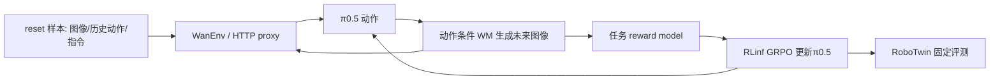

# WorldArena 2.0 优先复现：π0.5 × RoboTwin × GRPO × WM

**历史方案归档（2026-10-04补注）：**本文保留2026-09-30“先独立复现WorldArena”的讨论，不是当前实施顺序。后续采用OpenDW三视角动态模型、WorldArena任务奖励和现有RLinf策略链，并已转入四卡smoke；以[组合主上下文](ROBOTWIN_OPENDW_PIPELINE_CONTEXT.md)和[四卡记录](robotwin_pipeline_20261003/multigpu_smoke_20261003.md)为后续路由。下文未安装/未启动等状态均限定于当时。

**2026-10-03路由更新：**本页保留09-30独立复现讨论。新一轮优先讨论OpenDW动态预测＋WorldArena任务奖励/环境接口＋现有RLinf的组合，见[主上下文](ROBOTWIN_OPENDW_PIPELINE_CONTEXT.md)；无需以补齐WorldArena Wan bundle作为OpenDW路线前置，尚未启动新实验。

更新：2026-09-30。阶段：讨论与公开材料核查；未安装、未启动实验、未下载完整模型。本轮建议优先研究和独立复现 `adjust_bottle`，现有 π0.5 GRPO 基线保持，之后再移植 WM 环境。原 [OpenDW 上下文](OPENDW_PI05_GRPO_CONTEXT.md)保留接口与基线依据。

## 1. 当前判断

可以把近期顺序改为“先 WorldArena 官方单任务，再接回自己的工程”。它已经提供我们需要的 RLinf、RoboTwin、π0.5、GRPO 接口和任务奖励，适合学习完整闭环。**但目前已核公开材料还没有组成可直接运行的 RoboTwin WM bundle：主要缺口在匹配的动作条件 WM、14D 依赖版本和 reset 样本。** 因此不能把“π0.5 和 reward 权重已经发布”等同于“WM 训练环境已经全部配齐”。

优先 `adjust_bottle` 的依据是有官方 HTTP 最小入口、直接支持的 safetensors π0.5 格式、默认配置采用已公开的 T5 交叉注意力奖励。`click_bell` 也有 π0.5/reward 文件，但默认环境实际选 LPIPS 末帧相似度奖励，直接替换成 resnet reward 会改变实验。

先保持各项目自己的配套组合。WorldArena 独立复现使用其任务、policy、观测、C8 和 GRPO 设置；迁移到我们工程才讨论三相机、实际 state、C50 和 G8。两条实验的配置与结论分别记录。

## 2. WorldArena、RLinf、WMPO、WoVR是什么关系

| 名称 | 定位 | 与本路线的关系 |
|---|---|---|
| WorldArena 2.0 | 世界模型评测基准，含视频/触觉、作为 RL 环境、跨平台评测 | 本次只取 RL 环境轨道；无需同时部署触觉或真机部分 |
| RLinf | 策略训练基础设施 | WorldArena 的 `RL_env_benchmark/`包含 RLinf 源码和版权，是衍生工程；不是我们现用仓库的同一个版本 |
| WMPO | 利用视频 WM 训练 VLA 的具体方法；官方实现基于 OpenSora、OpenVLA-OFT、VideoMAE 和 GRPO | WorldArena 将其列为相关工作；不能把 WorldArena 叫 WMPO |
| WoVR | 基于 RLinf/Wan 的方法，含关键帧初始化 KIR、masked GRPO、策略与 WM 协同改进 PACE | 是 WorldArena 论文被评测的 WM 方法之一；公开 Wan 示例不等于完整复现其所有机制 |

WorldArena 论文附录 B.1 明确采用 **RLinf＋RoboTwin＋π0.5＋GRPO**；固定 WM 和 reward，优化 policy 后回 RoboTwin 测试。表 2 比较 7 种 WM，包含 WoVR；WMPO只出现在相关工作引用。代码正式 `adjust_bottle` 训练配置覆盖 `enable_kir: False`，不能仅凭工程有 KIR 代码称为完整 WoVR。

依据：[WorldArena 论文 B.1](https://arxiv.org/html/2605.17912v1#A2.SS1)、[公开配置](https://github.com/WorldArena2/WorldArena-2.0/blob/5978ce5c81e55b8c8358f4f5966a13ce385ff155/RL_env_benchmark/examples/embodiment/config/wan_robotwin_adjust_bottle_grpo_openpi_pi05.yaml)、[WMPO 官方实现](https://github.com/WM-PO/WMPO/blob/c836d74ec6f4525c93fe980d54d0ca870118615a/README.md)、[WoVR 论文](https://arxiv.org/html/2602.13977v1#S4.SS2)。

## 3. 公开材料核对表

固定 WorldArena 源码：[`5978ce5c81e55b8c8358f4f5966a13ce385ff155`](https://github.com/WorldArena2/WorldArena-2.0/tree/5978ce5c81e55b8c8358f4f5966a13ce385ff155)（2026-09-26）。以下区分“文件存在”“静态接口支持”和“实际加载成功”；本轮没有 GPU 加载验证。

| 必需部分 | 已核公开状态 | 对首次运行的影响 |
|---|---|---|
| RL runner、π0.5 GRPO、Wan env、HTTP 服务 | WorldArena 仓库均有对应实现与配置 | 能复用完整调用结构 |
| adjust_bottle π0.5 | `WorldArena/WorldArena2.0/pi05_adjust_bottle/model.safetensors`与 norm stats，约7.47GB模型文件 | loader 有对应 safetensors 分支；还需运行验证 |
| click_bell π0.5 | 同库 `pi05_click_bell/model_state_dict/full_weights.pt`与 norm stats | loader 有 full_weights.pt 分支；不是缺权重 |
| 两任务 learned reward | `reward_model/<task>/resnet_rm.pth`各588,338,878字节 | 其中adjust_bottle的小范围元数据可见 visual_encoder/t5_encoder 键，支持匹配 T5CrossAttn 的判断；click_bell只核文件存在/大小，完整加载均待实施 |
| reward 用 T5 | 同库有 T5 权重/tokenizer | 与视频模型文本编码器分开配置 |
| DiffSynth 依赖 | 安装脚本拉取公开 `RLinf/diffsynth-studio`，确有 `wan_video_new.py`和训练代码 | **修正上一轮“主仓库没目录所以依赖缺失”的判断**；真正问题是兼容版本 |
| 14D RoboTwin WM 实现 | 所查依赖 HEAD `2a2e05fa` 的动作层为 `Linear(7, dim)`与`Linear(28, 4*dim)`；WorldArena传14D | 不能只改路径；需定位对应14D实现及匹配权重 |
| 任务 WM checkpoint | 新HF库未见环境配置所需的 `dit_model.safetensors`；旧库另有Wan文件 | 尚未核到与上述14D环境直接配套的下载入口 |
| Wan2.2 VAE/通用5B基座 | Wan-AI官方发布 | 可补通用组件，通用视频基座不能代替已训练的机器人动作条件WM |
| reset 小数据集 | 环境需要 `dataset/*.npy`，含条件图像、动作、语言和目标等 | 所查新模型库没有这一配套目录；大量原始视频也不能直接作为reset输入 |
| 原始数据编码器 | README引用 `encode_vla_to_rlinf.py`，所查WorldArena和DiffSynth树未找到；`train_rlinf.py`存在 | 从公开原始数据自建reset包仍需补齐转换规则；不能假定文档命令可直接执行 |

模型库固定版本：[WorldArena2.0@2c351f46da784d4d8caca210ad1ca3b11c4b4124](https://huggingface.co/WorldArena/WorldArena2.0/tree/2c351f46da784d4d8caca210ad1ca3b11c4b4124)；[旧 WorldArena@f5f27bc5d4e7a9c5c119eda38b2639c87c215d80/models](https://huggingface.co/WorldArena/WorldArena/tree/f5f27bc5d4e7a9c5c119eda38b2639c87c215d80/models)。

旧库 `models/wan_adjust_bottle/wan_adjust_bottle.pt`约194.5MB，安全读取的序列化元数据是 Video_Former、action_pred 等动作预测结构，不能将文件改名当作 Wan DiT。`models/wan_video/epoch.pt`约10GB可见Wan blocks/head/patch_embedding，但还没有建立其与当前动作条件14D环境的兼容证据。文件名包含Wan不足以确认用途。

依赖依据：[安装脚本](https://github.com/WorldArena2/WorldArena-2.0/blob/5978ce5c81e55b8c8358f4f5966a13ce385ff155/RL_env_benchmark/requirements/install.sh#L949-L954)、[DiffSynth动作层@2a2e05fa1f724828b243f272540989b19a6e54f8](https://github.com/RLinf/diffsynth-studio/blob/2a2e05fa1f724828b243f272540989b19a6e54f8/diffsynth/models/wan_video_dit.py#L411-L424)、[π0.5加载器](https://github.com/WorldArena2/WorldArena-2.0/blob/5978ce5c81e55b8c8358f4f5966a13ce385ff155/RL_env_benchmark/rlinf/models/embodiment/openpi/__init__.py#L53-L102)。

当前WorldArena WM推理加载DiT＋VAE，未传文字prompt；Wan基座附带UMT5不等于该入口必须加载它。奖励T5是独立必需项。通用资源见 [Wan2.2-TI2V-5B@921dbaf3](https://huggingface.co/Wan-AI/Wan2.2-TI2V-5B/tree/921dbaf3f1674a56f47e83fb80a34bac8a8f203e)。HF另有数据集archives，但本轮未证明它们对应上述reset包；缺口结论限于已核发布物及加载链，不表示全网绝对没有文件。

说明：README引用的独立 `README_WORLD_MODEL_ENV.md`在所查树中不存在，但主要流程实际已经写在 `RL_env_benchmark/README.md`；缺这个文档链接本身不是运行阻塞。安装脚本未固定DiffSynth提交，复现时需锁定兼容版本。

## 4. 实际调用链与有用代码



最有用的代码不是整个训练工程的复制，而是以下接口设计：

| 文件（相对 `RL_env_benchmark/`） | 作用 | 迁移用法 |
|---|---|---|
| `rlinf/envs/world_model/world_model_wan_env.py` | reset、组内共享初态、视频历史、chunk_step、奖励/结束 | 借鉴把视频生成器包装成RL环境的方法 |
| `rlinf/envs/world_model/wan_http_server.py` | 独立进程加载WM、提供生成服务 | 可把重WM放单独GPU；运行阶段先本机私有通信 |
| `rlinf/envs/world_model/world_model_wan_http_env.py` | 继承WanEnv，通过HTTP调用WM | 说明模型服务与RL进程可解耦；reset数据和reward仍在客户端 |
| `rlinf/models/embodiment/reward/robotwin_reward_model.py` | 任务图像＋语言奖励 | 可复用匹配任务的权重/预处理；不能泛用于任意任务 |
| `examples/embodiment/config/env/wan_robotwin_adjust_bottle_http.yaml` | 最小WM环境配置 | 对齐图像、条件帧、动作维数和模型路径 |
| `examples/embodiment/config/wan_robotwin_adjust_bottle_http_grpo_openpi_pi05.yaml` | 最小训练入口 | 验一次真实更新；不当作正式论文预算 |

接口流程见[官方集成说明](https://github.com/WorldArena2/WorldArena-2.0/blob/5978ce5c81e55b8c8358f4f5966a13ce385ff155/RL_env_benchmark/README.md)。HTTP样例使用pickle/base64传输，初期仅在自己的受限服务地址使用，不公开暴露端口。

## 5. 与我们已跑通工程的差距

| 方面 | WorldArena公开配方 | 我们当前基线 | 迁移要做什么 |
|---|---|---|---|
| 框架与算法 | RLinf衍生工程、π0.5、GRPO | RLinf、Sidney π0.5、GRPO | 同框架可复用接口；不整仓覆盖升级 |
| 观测 | 单头部图、腕图None、14D全零state | 三图、实际14D state | 需要兼容的policy和完整WM观测；给空腕图不能保持原基线等价 |
| 时序 | 5条件帧＋8动作→8未来帧；执行C8 | H50/C50，M10 | 确定C50怎么映射到WM时间；不能截前8条后仍当执行了50条 |
| 随机与组 | 正式示例G4、32env；最小HTTP G2、2env | G8、32env×8rollout | 同组初态与policy/WM噪声分别记录；预算独立 |
| 模型去噪/优化 | 正式例M5、LR2e-5、B6400/micro8 | M10、LR5e-6、B512/micro32 | 接回时保留我们配方，不连带照抄 |
| reward与终止 | 内置学习奖励或LPIPS，示例action-level奖励 | RoboTwin物理成功、块末reward | 对齐奖励位置、成功/超时和final_observation；校准预测reward |
| checkpoint | 对应两个任务的官方π0.5 | 当前Sidney任务权重 | 首先用官方模型复现，再讨论同任务模型切换 |
| 真实评测 | 有RoboTwin eval配置，但主例 `val_check_interval=-1` | 固定32回合每2轮 | 必须显式运行真实评测；训练启动不会自动完成这一步 |

动作外部都为14D绝对关节，并不代表模型内部变换相同：WorldArena两个头部图π0.5配置启用 `extra_delta_transform=True`，输入/输出有DeltaActions/AbsoluteActions；我们的Sidney为False。迁移应在反归一化后的环境 `actions` 边界，保留各自stats和变换。全零state也会影响WorldArena的delta还原，不能直接照搬给Sidney。[数据配置](https://github.com/WorldArena2/WorldArena-2.0/blob/5978ce5c81e55b8c8358f4f5966a13ce385ff155/RL_env_benchmark/rlinf/models/embodiment/openpi/dataconfig/__init__.py#L314-L338)

当前Wan实现还固定截取历史4帧、从第5帧后取预测及按8帧更新队列；因此改一个 `chunk: 50`字段不足以支持C50。这个限制对应所查Wan实现，不泛指所有世界模型。模型每次调用的seed字段也不足以证明batch内同组噪声完全相同。[环境时序源码](https://github.com/WorldArena2/WorldArena-2.0/blob/5978ce5c81e55b8c8358f4f5966a13ce385ff155/RL_env_benchmark/rlinf/envs/world_model/world_model_wan_env.py#L648-L695)

因此，**框架距离较近，实验语义差距仍然明显**。若继续同一官方任务、同C8/单图组合，移植主要集中于环境与配置；若要求保留我们三图/C50/真实state并接OpenDW，仍需单独完成观测、时间、奖励适配，不能承诺仅改几行配置。

特别注意：`reward.use_reward_model: false`只表示没启用独立reward worker；WanEnv内部仍可能加载reward。不要把这一字段读成“没有奖励模型”。`click_bell`默认LPIPS与`adjust_bottle`默认T5CrossAttn也不能混同。

奖励实现按预测帧评分，默认相邻差分乘5；任一帧分数达到0.9估计成功，再把termination放到块末。这些是预测规则，与物理模拟器的真实成功判断不同，接回时需明确保留还是改变。[奖励源码](https://github.com/WorldArena2/WorldArena-2.0/blob/5978ce5c81e55b8c8358f4f5966a13ce385ff155/RL_env_benchmark/rlinf/envs/world_model/world_model_wan_env.py#L229-L258)

官方社区已在 [issue #5](https://github.com/WorldArena2/WorldArena-2.0/issues/5)提出全零state与真实评测state差异；2026-09-30查看仍无维护者回复。它是需要核查的已知差异，不据此断言整个方法无效。[issue #2](https://github.com/WorldArena2/WorldArena-2.0/issues/2)旧的权重/数据请求同样未回复，但当前HF已出现policy/reward，不能用旧issue推断这些权重未公开。issue #1属于触觉轨道数据问题，与本次RL环境部署无直接关系。

## 6. 最短实施路线（尚未启动）

1. **对齐官方发布物，先验π0.5和reward。** 深圳3独立目录/环境，拉固定WorldArena源码及其明确依赖；只取adjust_bottle必要文件。用对应RoboTwin任务加载官方π0.5，并运行对应reward。并行核准14D DiffSynth版本、WM checkpoint、reset npy。产出真实仿真视频与小型资源清单；此时只称policy/reward验证，尚不称WM闭环。
2. **跑一次官方WM→policy→reward闭环。** 匹配组件齐全后采用官方HTTP最小例：2env/G2/1epoch/8步。输出预测视频、动作、reward、实际执行配置和耗时/显存。确认actor确实更新、参数发生改变；若同组reward全相同导致GRPO零优势，不能以runner退出成功代替更新证明。
3. **回RoboTwin测原policy与更新policy。** 使用相同任务、固定种子、相同评测设置。先验证训练产物可加载和实际动作闭环；短验证不宣称论文指标复现。再用正式例配置讨论更长实验。
4. **移植到自己的 `rlinf_fastwam`，再替换WM。** 单独分支接环境/服务/奖励，复用我们已验π0.5/GRPO。先确认同一WM的移植结果，再考虑OpenDW。OpenDW的三视角、C32时间、下一state和reward适配见原专题。

若第1步仍找不到匹配的WM/reset发布物，明确列出所需文件与版本，不自动开始重训WM、改任务或改C50。重新训练任务WM会新增数据与计算预算，应作为新的具体方案讨论。也可以先完成已具备材料的policy/reward推理，保留可复用产出。

官方启动模板（只是入口，路径和依赖尚未在深圳3配齐）：

```bash
cd "$RLINF_ROOT"  # 指WorldArena仓库的RL_env_benchmark
# 先配置 WAN_PATH、WAN_ROBOTWIN_ADJUST_BOTTLE_CKPT、OPENPI_CKPT_PATH、
# ROBOTWIN_REWARD_MODEL_PATH、T5_MODEL_PATH、ROBOTWIN_PATH
bash examples/embodiment/run_wan_http_server.sh env/wan_robotwin_adjust_bottle_http
```

另一个终端：

```bash
cd "$RLINF_ROOT"
bash examples/embodiment/run_embodiment.sh wan_robotwin_adjust_bottle_http_grpo_openpi_pi05 ALOHA
```

实施时沿官方配置，只解决路径、依赖版本和本机资源问题；启动前记录resolved config、完整命令、独立Ray namespace/端口、输出目录、GPU分配和本次验证结束条件。服务器状态以实施前新快照为准；本轮没有预留或借卡。

## 7. 仓库与双层日志

仍使用 `Yutenji-Nyamu/rlinf_fastwam`保存我们的复现胶水代码、配置和文档；官方WorldArena作为独立上游checkout。建议复现记录分支 `codex/sz3-worldarena-pi05-repro`，后续适配另建分支；本轮均未创建。

建议远端根目录 `/data/chenyiteng/projects/worldarena-pi05-sz3`；模型、HF缓存、环境和视频放/data。日志沿用两层：

- 粗日志：目的、做了什么、问题/依据、解决方式、当前里程碑和下一步。
- 细日志：step编号、命令、时间/退出码、各Git/HF revision、resolved config、模型/数据清单、stdout/stderr、视频/指标/参数更新证据路径、显存/内存/耗时。

公开只推审过的源码、配置与轻量证据；大模型和视频留数据目录。本轮只写本地计划与路由，没有Git发布或服务器变更。

## 8. 更完整闭环的备选，以及论文结果怎么读

如果优先目标改成“最快验证一个现成WM-RL完整闭环”，[RLinf官方Wan教程](https://rlinf.readthedocs.io/en/latest/rst_source/examples/embodied/wan.html)的LIBERO＋OpenVLA-OFT＋Wan配方更完整：有policy、WM、VAE、reward与reset数据。已核公开 [Spatial bundle](https://huggingface.co/RLinf/RLinf-Wan-LIBERO-Spatial/tree/cfffe6b86babb4a9464d4ba53339e6fa31c3e0fb)、[Object](https://huggingface.co/RLinf/RLinf-Wan-LIBERO-Object/tree/ad71e7875837b6b705d75450c9ebcc8f97d02cf5)、[Goal](https://huggingface.co/RLinf/RLinf-Wan-LIBERO-Goal/tree/bd395971c3467de3dd19e7e6c7562af48a2894a6)。教程跑冻结WM阶段，PACE协同更新需另外实现。

这一备选会同时换成LIBERO/OFT/7D/单视角无proprio，因此本轮不自动切过去。当前主目标仍是RoboTwin＋π0.5，WorldArena用于先复现与理解，OpenDW保留为后续WM候选。

WorldArena[官网RL表](https://v2.world-arena.ai/)的proxy reward设置：SFT在Click Bell/Adjust Bottle为43.75%/55.08%；WoVR环境RL为75.00%/67.19%；物理仿真RL为87.30%/78.90%。这是各配套训练后的policy回到RoboTwin的结果，不是下载某个checkpoint直接加载就保证达到的成功率，也不是通用Wan基座的成绩。

## 9. 本轮记录与待讨论项

- 已核：论文/官网、固定代码、HF文件列表与小范围权重元数据、安装依赖来源、官方issues，以及与我们现基线的接口差异。
- 修正：DiffSynth是公开外部依赖；README正文有主要流程；两个π0.5格式有加载分支；click_bell默认奖励不是T5CrossAttn。
- 仍需匹配：Robotwin 14D动作条件WM及代码版本、reset bundle；奖励实际标定和策略实际推理还未在本机运行。
- 建议选择：先adjust_bottle独立官方复现；暂时不改我们原π0.5 GRPO。若公开WM组件确实补不齐，再讨论请求上游、自己训练或先用完整LIBERO示例，不默默扩大范围。

后续实现中的三项关键讨论：是否保持官方C8单图先做闭环；何时切回我们的C50/三图；同任务reward如何用于OpenDW输出并校准。先后顺序清楚后再安排正式训练预算。

轻量审计证据：`E:/Codex/home/visualizations/2026/09/28/01a0e6c7-bb8c-7421-8697-110ddd91d2f1/worldarena-first-20260930/asset-contract-audit.json`，包含固定源码片段、SHA256、HTTP206范围回执和安全解析的权重元数据；相关源文件在同目录 `baseline-audit/`。每个检查的权重只读开头约1MiB，未执行pickle。浏览器只读检查issues，不向作者发送消息。
