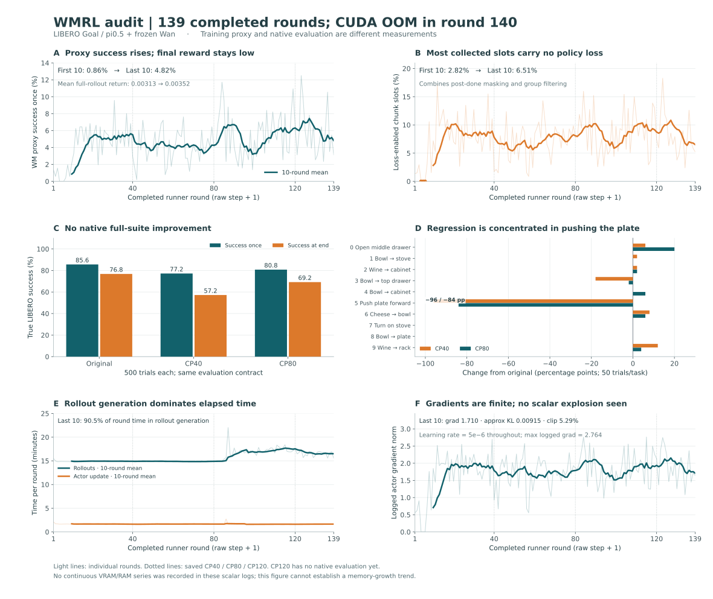

# WMRL 训练动态与真实评估审计 · 2026-10-03

仅分析已有日志与只读刷新，不改变实验。完整输入为39个TensorBoard tag、每tag 139轮；真实轮次=`raw step+1`。最新完整训练轮139，第140轮采集已完、actor训练发生CUDA OOM；CP40/80已完成原生LIBERO评估，CP120尚未评估。图中不补造显存或内存曲线。

## 核心结果

- 原生500回合总体：原模型428/500=85.6%，CP40 386/500=77.2%，CP80 404/500=80.8%；两检查点均未超过原模型。这只覆盖已评40/80，不代表尚未评的CP120。
- **退化主要集中于推盘子任务**：48/50→0/50→6/50；分别损失48与42个成功，超过全套净损失42与24。其余9任务合计380/450→386/450→398/450；这是事后定位，不是剔除失败任务后重算主成绩。CP40额外退化的“开上层抽屉放碗”为11→2，CP80回到10。
- 真实`success_at_end`为76.8%→57.2%→69.2%；“曾成功但最后不成功”的回合数44→100→58，表明训练后保持最终成功状态也更弱。该指标属于相同固定320步评估，不是另一套试验。
- WM代理成功率前10→后10轮0.859%→4.824%；**全长rollout的平均相对回报仅0.003125→0.003516，几乎持平**。需区分任一时刻成功与最终帧/完整回报；不可把proxy上涨直接当作真实策略改进。
- 有效mask前10→后10轮2.823%→6.509%；后10平均每轮仅1333.1/20,480个chunk槽位参与loss。它同时包含首done后的截断与整组奖励过滤，不能说“93.5%的组被过滤”。139轮中136轮正mask，仅第4/5/6轮整轮全过滤。
- 139轮有71,168个名义轨迹槽位、2,846,720个chunk槽位，mask折算累计220547.0个有效chunk槽位（7.75%）。不是同数目的独立物理回合或有效优化更新。
- loss、grad、approx KL等训练标量均有限；最大记录轮汇总grad2.764。末10近似KL0.00915、clip5.29%、LR恒5e-6，没有日志层面的梯度数值爆炸证据。只有第4/5/6轮空mask的奖励/优势统计非有限；不能据此认定模型权重NaN。
- 末10轮采集占总时长90.5%；actor训练102.8→99.1秒/轮，总轮长1003.8→1094.7秒，增量主要来自采集895.8→990.5秒。耗时不是显存/内存的测量，不能用它证明或排除泄漏。

## 真实任务分解

| 任务 | 原模型 | CP40 | CP80 | 变化pp：CP40 / CP80 |
|---|---:|---:|---:|---:|
| 0 · open the middle drawer of the cabinet | 37/50 | 40/50 | 47/50 | +6 / +20 |
| 1 · put the bowl on the stove | 49/50 | 50/50 | 49/50 | +2 / +0 |
| 2 · put the wine bottle on top of the cabinet | 49/50 | 50/50 | 50/50 | +2 / +2 |
| 3 · open the top drawer and put the bowl inside | 11/50 | 2/50 | 10/50 | -18 / -2 |
| 4 · put the bowl on top of the cabinet | 44/50 | 44/50 | 47/50 | +0 / +6 |
| 5 · push the plate to the front of the stove | 48/50 | 0/50 | 6/50 | -96 / -84 |
| 6 · put the cream cheese in the bowl | 46/50 | 50/50 | 49/50 | +8 / +6 |
| 7 · turn on the stove | 50/50 | 50/50 | 50/50 | +0 / +0 |
| 8 · put the bowl on the plate | 50/50 | 50/50 | 50/50 | +0 / +0 |
| 9 · put the wine bottle on the rack | 44/50 | 50/50 | 46/50 | +12 / +4 |

三个阶段均500唯一task/trial、每任务50，policy rank seed为42/43，environment seed base=0，双相机/H10/C5/5步去噪、LIBERO Goal320步的同一原生评估合同。本地汇总回执不含逐trial结果，**不计算配对检验**；同种子也不保证各策略变长调用之后继续共用相同随机噪声。没有多训练seed，不据这一次评估声称跨seed统计显著。JSON中的Wilson区间仅为给定试验的二项描述区间。

## 全量标量摘要

数值维持日志原单位，时间为秒；`success_once`和mask为0–1比例。前10含第4/5/6轮空mask，优势非有限项从均值中排除；所有非有限位置在JSON中保留。KL为采样近似可出现负值。源码中ratio先把无效位置置0再masked_mean，actor按microbatch及rank求平均；空mask微批的0也参与日志聚合，故ratio/clip/近似KL受无效微批比例影响，不能把ratio 0.826解读为所有有效动作概率都降到原来的82.6%。

| tag | 前10均值 | 后10均值 | 全程最小–最大 |
|---|---:|---:|---:|
| `env/success_once` | 0.00859375 | 0.04824219 | 0–0.125 |
| `env/return` | 0.003125 | 0.003515625 | 0–0.02539062 |
| `rollout/rewards` | 0.0009913188 | 0.001489482 | 0.0003930817–0.004564607 |
| `rollout/loss_mask_fraction` | 0.02823242 | 0.06509277 | 0–0.1828125 |
| `train/actor/grad_norm` | 0.7087851 | 1.709838 | 0–2.764112 |
| `train/actor/approx_kl` | 0.005885181 | 0.009148751 | -0.002895132–0.0364453 |
| `train/actor/clip_fraction` | 0.02862944 | 0.05294342 | 0–0.1002075 |
| `train/actor/ratio` | 0.3522044 | 0.8259523 | 0–1.00969 |
| `train/actor/lr` | 5e-06 | 5e-06 | 5e-06–5e-06 |
| `time/generate_rollouts` | 895.7935 | 990.524 | 887.5507–1321.927 |
| `time/actor_training` | 102.8151 | 99.05845 | 94.99236–164.3632 |
| `time/step` | 1003.782 | 1094.671 | 989.3279–1530.201 |

真正靠近学习数据的`rollout/rewards`为：首done截断、整组过滤后的保留**动作槽位**平均相对差分奖励，跨rank按有效sum/count聚合（固定`metric_utils.py:473–533`），不是chunk成功率或轨迹总回报。原始rewards为`[40,128,8]`，chunk mask广播到8个动作。前10的非空轮均值0.0009913→后10 0.0014895；它确实增加，但有效mask及保留样本分布也在变，不能单独解释为策略整体改善。此指标全rank无有效数据时NaN；它与actor ratio按微批等权平均并补0的口径不同。

`env/episode_len`始终320、`env/num_trajectories`始终512；它们反映固定槽位预算，不是证明每个episode到320才第一次done。env可在首次done后继续生成固定长度画面，`env/success_once`累计任意时刻命中；相对奖励的`env/return`跨完整长度望远镜累加为最终分数。actor在首done后mask掉，优化的是截断回报，不能把全长`env/return`直接当作actor训练目标。尤其首done chunk内曾1后0时，成功日志为真而该chunk末差分回报可为0，需专门计数才能估其规模。

## 数据动态目前可见与不可见

可见：每轮全局success、回报、有效mask、优势范围、梯度、loss、近似KL、clip、耗时，以及静态reset资料库存。不可见：实际各任务训练采样次数/KIR起点分布、各任务有效mask、奖励原始概率与阈值来回翻转、真实与生成帧的一致性、首done后成功保持、逐rank/逐进程连续资源。**当前数据支持优先定位推盘任务与成功保持性；不支持已经坐实reward hacking、任务采样偏置或显存随轮数单调增长。**

现场完整枚举742份NPY，496个initial、246个KIR，bad=[]。每任务51–97份；推盘为49+30=79份，占库存10.65%，不存在该任务缺数据。初态样例1帧、KIR样例25帧；包含image/reward/instruction/delta_action，不含state keys。以下为文件库存，不能当作实际训练采样次数或概率。

| 任务 | Initial文件 | KIR文件 | 合计 |
|---|---:|---:|---:|
| 0 · open the middle drawer of the cabinet | 50 | 47 | 97 |
| 1 · put the bowl on the stove | 49 | 13 | 62 |
| 2 · put the wine bottle on top of the cabinet | 50 | 17 | 67 |
| 3 · open the top drawer and put the bowl inside | 49 | 31 | 80 |
| 4 · put the bowl on top of the cabinet | 50 | 10 | 60 |
| 5 · push the plate to the front of the stove | 49 | 30 | 79 |
| 6 · put the cream cheese in the bowl | 50 | 38 | 88 |
| 7 · turn on the stove | 50 | 1 | 51 |
| 8 · put the bowl on the plate | 50 | 30 | 80 |
| 9 · put the wine bottle on the rack | 49 | 29 | 78 |

轻量后续记录应在现有rollout路径按任务汇总reset/KIR起点计数、成功/首done chunk末分数、有效组/有效步，保留少量固定种子视频对照；资源记录需独立按时间采样GPU总量/进程显存、主机MemAvailable、各自有进程RSS，并标训练阶段。相同阶段内比较基线与峰值，才能判断增长。

## 证据与复现

- [完整标量与只读现场](E:/Codex/home/visualizations/2026/10/02/01a0fc97-7ba7-7a22-811c-f17d4422e077/wmrl-audit-20261003/sz3/deep-v2.out)
- [原生真实评估回执](E:/Codex/home/visualizations/2026/10/03/01a0ffb6-b309-7fa1-9ae0-b20e6d63a11c/three-server-refresh/sz3/wm-official-eval.out)
- [原生任务枚举](E:/Codex/home/visualizations/2026/10/01/01a0f6dd-5f6f-7462-b7df-25b90ed941d1/wm-rlt-review-20261002-1155/libero-task-names.json)
- [reset数据库存枚举](E:/Codex/home/visualizations/2026/10/02/01a0fc97-7ba7-7a22-811c-f17d4422e077/wmrl-audit-20261003/sz3/dataset.out)
- [可机读计算与全部39 tag统计](../../experiments/wan-goal-sz3-20261003/metrics-analysis.json)
- [PDF图](../../experiments/wan-goal-sz3-20261003/training-audit.svg)
- [离线分析脚本](../../../local_scripts/wmrl_audit_20261003/training_dynamics.py)

源文件SHA256保存在分析JSON，统计直接取完整139轮而非历史快照拼接。本离线分析仅消费父审计提供的只读数据库存，不自行扫描原始训练数据、访问SSH或运行服务器实验；没有参数/调度改动。
