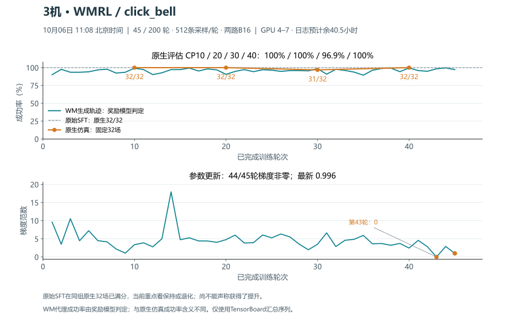

# WMRL 结果与奖励模型讨论补存 · 2026-10-06

本次补存最近训练轻量结果和本轮讨论。它不改变实验源码、任务、奖励、训练参数或 RLT 候补路由。发布是否成功以本目录后续 `published.json` 和远端 SHA 为准；`manifest.json` 的 `pushed=false` 仅表示打包时刻。

## 已有云端覆盖

上一轮已发布至 `codex/wmrl-bell-reward-20261005`，父提交为 `66a240c2fe256f3dbccb09c0d3ea4f369979fe3a`。其内容覆盖原生 Rynn 32 条成败测试、click_bell 奖励小测、工程 smoke、正式配置与首次采样，以及前序 OpenDW/B16、Rynn 接线和数值测试的继承源码/文档。该结果发布回执本次补存到 [results_published.json](../publication_bell_20261005/results_published.json)。旧目录 README 中的“准备中”属于冻结历史状态，不表示上述内容未推。

本轮只读重新核到该分支远端与独立发布 checkout 同为上述提交，checkout 全净；29 份运行源码绑定及 owner plan 哈希保持。按首发59项清单比较本机字节：57项完全同，另2项为已在 `66a240c` 更新的执行 MD 和轻量回执，未发现新的训练源码遗漏。

旧 LIBERO/Wan 的源码、评估与审计在独立分支 `codex/sz3-wan-goal-20260930`，前次核验提交为 `21b5d590a9116d94e38c139a3ec4aa9723abbcc3`；未声称已并入本分支或 main。前序发布覆盖及历史小遗漏见 [10 月 5 日盘点](../robotwin_pipeline_20261003/publication_inventory_20261005.md)。

## 本次新增范围

- [奖励来源与自行获得的方法](../robotwin_pipeline_20261003/reward_sources_20261006.md)：上游项目各提供什么，换任务还缺什么。
- [Rynn 尝试与可用路线](../robotwin_pipeline_20261003/rynn_options_20261006.md)：真实成败证据、数值信号边界与接入选项。
- [11:08 固定快照摘要](wmrl-summary-1108.json)、[WM 标量 CSV](wmrl-scalars-1108.csv)、[WM 曲线 SVG](wmrl-curves-1108.svg)：仅深圳 3 的 WMRL，不含同次采集的 EXPO 数据。
- [本轮实时轻量状态](live_status.json)：采样时刻明确列在文件中；不拿 11:08 图冒充实时状态。
- 精确发布生成器及 [逐文件清单](manifest.json)。不重新复制已发布的完整源码树。

11:08 固定快照：按铃完成 45/200 轮，44/45 轮梯度非零；原生 CP10/20/30/40 为 32/32、32/32、31/32、32/32，原始 SFT 在同组也是 32/32。它说明更新在发生，但该任务/种子组的原始成绩已经很高，尚未显示原生收益。WM 内代理成功率不能替代原生成功率。

CSV 用一基轮数；摘要中原 TensorBoard `native_evals.step` 保留零基下标，例如 step9 对应 CP10。曲线只取 `tensorboard/all` 汇总，不混 rank 数据。原始服务器读回只记录哈希，不发布展开大日志。

## 发布边界

复用独立 publication checkout，在上述父提交后追加同分支提交。生成器先核远端与本地父提交、工作区全净、稳定结果/运行源码哈希；stage 与 push 分开，不 force push。训练 checkout、Git index、owner 和其他用户进程不变。

继续排除模型、checkpoint、reset 数据、视频、完整原始日志、凭据/完整环境/plan、生成 RPC payload，以及其他实验和工作区修改。Git 轻量备份不代表大文件已经异地备份。
