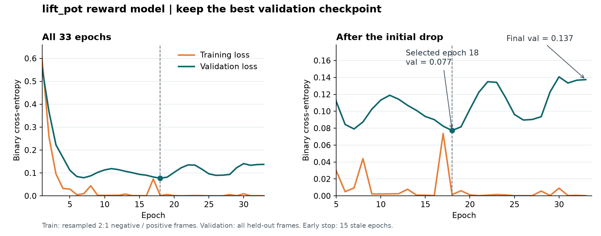

# 抬锅RM收敛与接入WMRL

2026-10-06。本文维护新RM的效果判断与接线；动态启动状态由执行窗口追加。14:57已完成服务器CPU准备，尚未启动新WMRL。

## RM已收敛，当前不续训

本次原生128回合包含56成功、72失败。按seed隔离训练/验证/测试，训练33轮触发15轮耐心早停，保留验证集最优第18轮。

| 时点 | 训练loss | 验证loss | 判断 |
|---|---:|---:|---|
| 第18轮 | 见CSV | 约0.07718 | 验证最优，保存为部署候选 |
| 第33轮 | 约0.00012957 | 约0.1374 | 训练更贴合已有图，验证变差 |

这符合小数据上的过拟合迹象，不支持“尚未收敛，再延长训练即可改善”。当前继续使用第18轮，不恢复第33轮续训。如果后续问题集中在特定锅外观或临界姿态，优先补对应的真实失败和成功边界样本，再保留独立留出集检验。

完整数据：[逐轮CSV](lift_pot_rm_history.csv)。曲线仅反映这份原生数据上的拟合与泛化，不能证明生成画面的判断可靠。

验证集阈值固定为 **0.7082200646400452**，测试仍用该阈值：TP8、FN3、FP1、TN196。即11张首次成功画面认对8张，197张未完成画面误报1张；25个测试回合中1个存在提前误报。结果可用于继续接入试验，不把它称为已充分验证的真实成功裁判。

## 错例看到了什么

已查看所有测试FP/FN及部分TP的相邻帧；轻量对应关系见[错例元数据](error_review_metadata.json)，原图留在本地证据目录和服务器，不纳入Git。

- **FP seed100160，第96步，分数0.986。** 主图已经很像双手抬起锅；前一块第64步约0，后一块第128步约0.019。它与正确成功的seed100030画面相似，但原生回合真实失败标签保持。仅凭主图无法确定高度、夹爪接触或朝向中哪项未满足，不能据此说标签错了。
- **漏判成功图**包含不同锅外观及刚触达成功边界的情形，提示视觉泛化或判定边界可能有缺口。当前证据没有证明具体原因，也没有证明延长同一数据训练能解决。

后续沿同一个冻结阈值看生成样本，优先留存这些临界姿态。不要根据这份测试的个别错例重新调阈值后，继续把同一测试称为独立验收。

## 接线沿用已跑通的两个任务

仍是：π0.5输出动作 → OpenDW生成三视角 → 主图RM成功分数 → 阈值转0/1 → GRPO更新π0.5。

本次替换task、reset、RM权重和阈值；保留原RLinf/OpenDW训练、卸载、监控、保存、评估及RLT借还流程。新RM是单任务ResNet18，图像预处理和训练端一致，提供与现有服务兼容的批量成功分数。它不需要旧RM的T5文字编码，但策略仍接收任务文字。

奖励仍沿旧接法：每个C32块生成8帧，对8张主图取最高成功分数；首次达到阈值，在C32块末给1并结束该轨迹，其余给0。**新RM的训练与阈值主要来自C32边界图，中间生成帧仍需抽查。** 这次先保持已跑通的奖励语义，不把“在原生留出集较准”扩展为“OpenDW里同样准”。

reset使用现有`lift_pot` clean50的完整50条：同一frame0的头图、左右腕图和14D控制目标；复用既有解码与256尺寸，无新增专家筛种子。该数据本身是既有专家数据，不能称为无偏的原生策略轨迹。

原生固定评估从既有任务训练seed池排除本次RM128的requested seeds后取32个；原eval池仅20个，不拼接或新跑专家筛选。原SFT先在这32个seed跑baseline，之后每10轮用同一集合评估。RM128的43.75%来自另一组seed，不直接当新固定32组的baseline。

## 参数与执行顺序

| 阶段 | 配置 | 用途 |
|---|---|---|
| 原SFT原生baseline | GPU4，N16×2，C32/384；固定32 seeds | 独立真实环境对照；两批推进seed，不重复前16 |
| 短smoke | GPU4–7，N64/G8、双WM B16；R1、单C32块、1轮、actor global64 | 保持正式并行规模，验证接线和资源；单块可全0，不能据此验证完整学习效果 |
| 正式 | GPU4–7，N64/G8/R8、双WM B16；C32/384、200轮；actor global2048/micro8、每轮2个更新epoch | 每轮512条轨迹；每10轮保存和原生评估 |

G8已包含在N64中，每轮轨迹数是64×8=512，不再乘组大小8。正式评估N32×1；baseline N16×2使用同32个requested seeds，关闭固定reset以推进第二批，正式每次评估则复用固定集合。

smoke和正式输出分开，**正式从原始SFT开始，resume/ckpt均为空**；不把smoke的global64优化器断点接到global2048正式训练。smoke通过原有工程验收后接正式，完整采样的奖励分布、有效组和梯度继续写日志；真实效果以原生评估为准。

WM优先于RLT，仅使用本用户指定GPU4–7；正常结束或失败后由原生命周期归还对应RLT。无需修改共享Ray或其他用户任务。

## 已完成的准备与当前边界

14:57服务器CPU验证：5项RM adapter测试通过，50组reset已生成并核验，32个独立requested seeds已冻结，RLT借还周期已准备。新RM checkpoint和report哈希绑定；配置差异与来源写入准备回执。

此时**未launch、未发生新GPU采样，也没有新smoke/正式训练结果**。准备通过不等于生成域准确率或正式训练成功。后续实际owner、阶段、首轮指标和发布commit以本文件新增执行段及根交接为准。

权重、完整日志、原始图像和reset数组保留服务器；Git仅包含本次源码、配置准备器、loss曲线/CSV、文档和轻量回执。

## 15:06 后台已启动

15:02:24 启动唯一owner `runs/lift-pot-v1`，PID3019581/start724116770；15:06身份与服务心跳正常。当前仍在首份OpenDW的CPU加载阶段，服务尚未占GPU，旧RLT4–7继续运行；两份服务CPU就绪后原owner才精确借卡。**尚未完成新任务smoke，尚未进入正式WMRL。** 后台顺序为独立原生32回合基线→同并行单块smoke→正式200轮，不依赖窗口持续在线。原退出/失败归还路径保持，未操作其他用户任务。

本次真实checkpoint已在OpenDW服务的Python环境CPU加载；5项输入/分数一致性测试通过。另将50个已准备初始主图送入真实RM：0/50超过阈值，最高0.001514、阈值0.708220，无起点误判成功。此项不代替生成域测试。

原生baseline使用与RM128不重叠的32个requested seeds；采集和自动smoke会提供新结果。服务继续保留原样本与资源日志，后续可直接检查生成画面的误报、回报分布、有效组和梯度。CPU准备和启动成功不代表训练收益。
