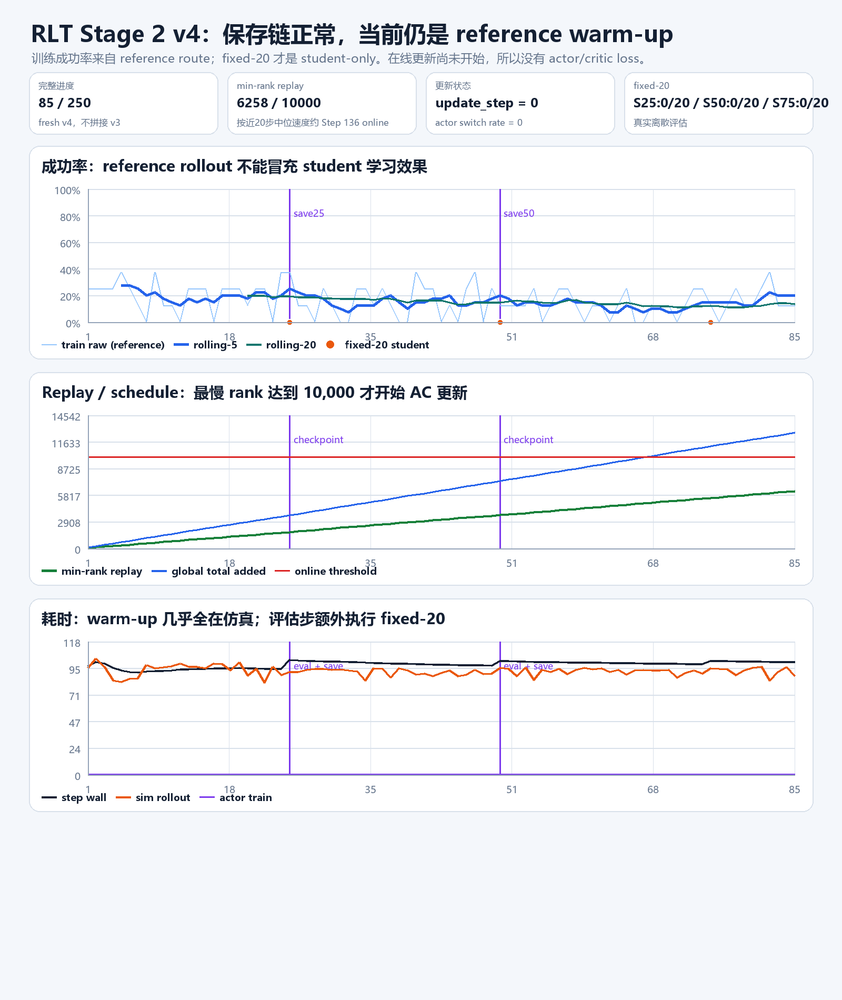
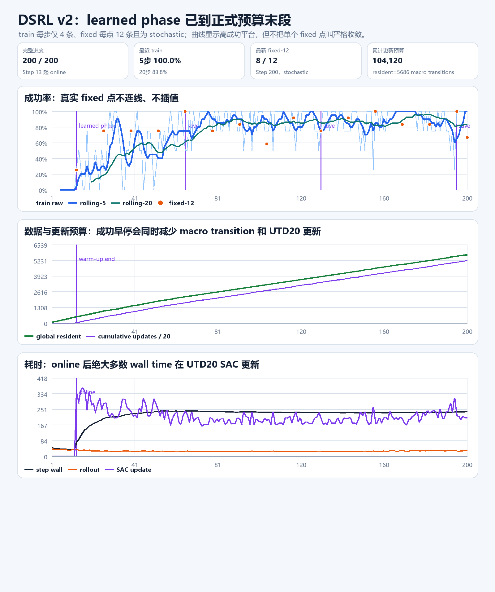
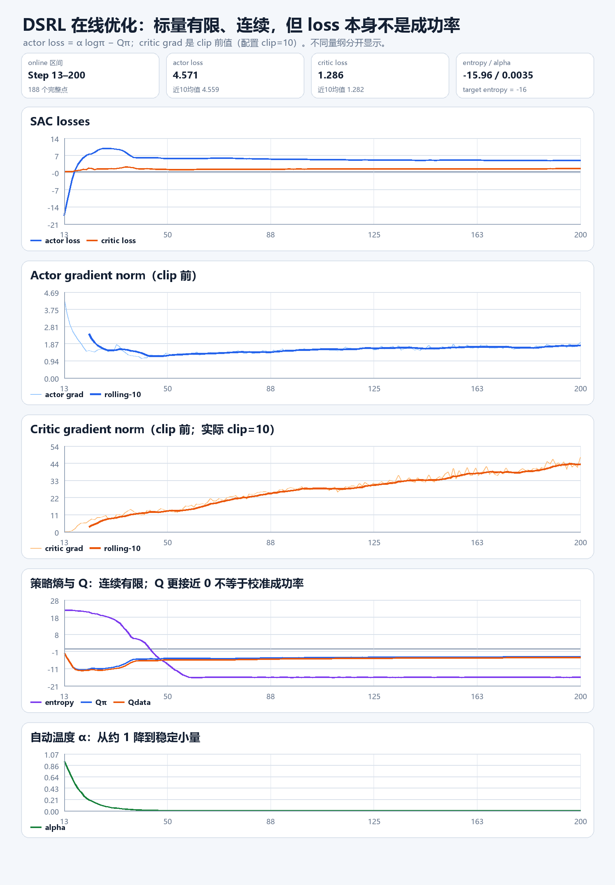
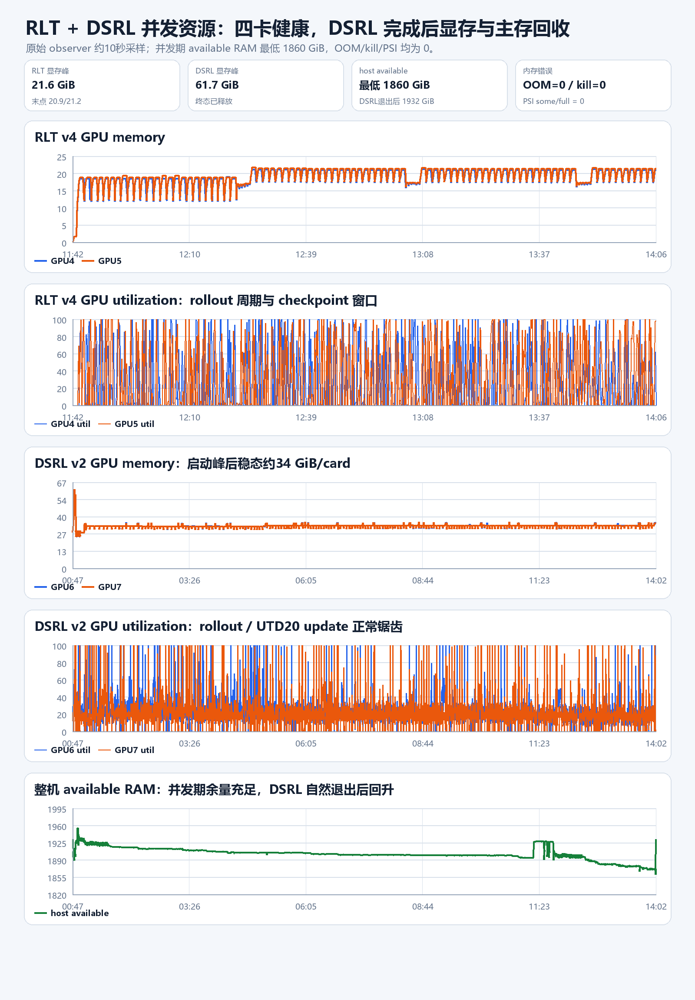

# RLT / DSRL formal：产物、指标与资源终态刷新（2026-08-24）

## 1. 先给结论

本报告使用深圳服务器现场、原始 driver log、TensorBoard event 和约 10 秒粒度 resource CSV。图表冻结在
2026-08-24 14:05 CST 左右：RLT Stage 2 v4 完整到 Step 85；DSRL v2 已在 14:02 自然完成
Step 200/200、保存 `global_step_200` 并以 exit code 0 退出。检查期间没有停止、重启或修改任何训练。
交付前 14:21 CST 再做一次窄探针：RLT 仍 alive，TensorBoard 已完整到 Step 94，min-rank replay
6,944/10,000、全局累计 14,034，`actor_switch_rate=0`、`update_step=0`；GPU4/5 正常。下面曲线仍保持
Step85冻结口径，避免把不同下载时刻的数据拼在一起。

| 实验 | 当前状态 | 最重要的解释 |
|---|---|---|
| RLT Stage 1 | 2,000/2,000 已完成，current-AR artifact 已保存 | 这是离线学到的 RLT 表征，不是 RoboTwin 控制策略 |
| RLT Stage 2 v4 | 图表快照 Step 85；交付前现场 Step 94/250，进程继续运行 | 仍由 reference policy 收集 replay；`update_step=0`，尚未开始 AC 更新 |
| DSRL v2 | 200/200、exit 0、最终 checkpoint 完整 | formal 已完整闭环；成功率进入高平台，但 fixed-12 仍有小样本波动 |

## 2. RLT：现在到底学到哪里

### 2.1 Stage 1 已完成

- clean-50：50 episodes、7,188 frames、三相机、14D action/state。
- exact pi0、current causal AR、`train_vla=false`；只训练 RLT token module。
- 2,000 步完成；旧完成报告中前 100 步 loss 均值约 3.258，后 100 步约 0.549，末点约 0.571。
- `global_step_2000` 为 22.10 GB（十进制）/ 4 files；其中聚合 `full_weights.pt` 为 9.56 GB。
- artifact manifest 锁定模型身份、AR 定义、clean-50、norm、数据维度和精确权重路径。

这说明 reconstruction 目标已经得到稳定优化；它不能单独证明 RoboTwin 控制成功率。

### 2.2 Stage 2 v4 仍处于 reference warm-up

图表快照的精确指标：

- 完整 Step 85/250；train success 全程均值 16.03%，最近 5 步 20.0%，最近 20 步 13.75%。
- 这些 train episode 全部来自 reference route：`actor_switch_rate=0`、`ready_for_online=0`、
  `update_step=0`，因此不能称为 student 的训练成功率。
- 三个真实 student-only fixed-20：Step 25、50、75 均为 0/20。它们准确说明“未更新 student 当前不会做
  任务”，还不能说明在线学习失败，因为在线 optimizer 尚未开始。
- 两个 rank 中较小的 replay 为 6,258/10,000；全局累计 12,653 transitions。按最近约 20 步的中位
  增速外推，约在 Step 136 达到 online 门槛；这是速度外推，不是保证。
- warm-up 普通 step 平均约 98.3 秒，其中 rollout 约 92.3 秒；每 25 步的 fixed-20 评估另需约 200 秒。
- 目前没有 actor/critic loss 是正确的 schedule 结果，不是日志缺失。

### 2.3 RLT checkpoint 是什么

| checkpoint | 完整大小 | 文件数 | online update | 状态 |
|---|---:|---:|---:|---|
| Step 25 | 140.16 MB | 3,648 | 0 | `complete=true` |
| Step 50 | 230.54 MB | 7,392 | 0 | `complete=true` |
| Step 75 | 322.00 MB | 11,181 | 0 | `complete=true` |

每个 checkpoint 包含：

- FSDP/DCP actor/critic 与 optimizer/scheduler 状态，含 `.metadata` 和两个 `.distcp` shard；
- 聚合 `full_weights.pt`（约 8.66 MB；Stage 2 控制头很小）；
- 两 rank target model；
- 一条 transition 一个小文件的 replay。Step 75 两 rank 已累计 5,675 + 5,493 = 11,168 条；
- 两 rank RLT 私有 sidecar 和 `complete.json`，记录 runner step、`update_step`、累计 transition、world size
  与 resume contract。

所以 checkpoint 随 replay 增长，而不是模型权重越来越大。三份都可恢复，但恢复后仍处在 warm-up。

## 3. DSRL：200 步完整结果

### 3.1 成功率与数据预算

- Step 1--12 为 Gaussian warm-up；Step 13 起进入 learned phase。
- 全 200 步 train success 均值 72.25%；learned phase 均值 76.86%；最近 20 步 83.75%，最近 5 步
  4/4 全成功。
- 共 16 个真实 stochastic fixed-12 点，均值 78.65%；最后三点为 10/12、12/12、8/12，均值
  83.33%。末点下降不宜单独解释为退化，因为每点只有 12 条且 evaluation 本身是 stochastic。
- 最终 replay resident 5,686 macro transitions；累计执行 104,120 次计划 optimizer updates。
- online 后最近约 20 步：rollout 约 30 秒/步，SAC update 约 230 秒/步；两类 timer 有重叠，但可以清楚
  判断主要 wall time 在 UTD20 更新，不在仿真。

### 3.2 优化指标怎么读

Step 200：

- actor loss = 4.571，critic loss = 1.286；近 10 步均值分别约 4.559 / 1.282；
- alpha = 0.00350，entropy = -15.96，接近 target entropy -16；
- Qpi = -4.515，Qdata = -4.918，均连续有限；
- actor grad norm = 1.93；critic grad norm = 47.37。

critic grad 图画的是 clip 前值，配置实际会 clip 到 10。它在训练后半段持续上升，是后续扩大预算时最值得
监视的信号；但本次 loss、Q、entropy、成功率均有限且训练自然 exit 0，不能据此称为数值发散。

### 3.3 DSRL checkpoint 是什么

| checkpoint | 完整大小 | files | `update_step` |
|---|---:|---:|---:|
| Step 65 | 33.59 GB | 11 | 34,020 |
| Step 130 | 33.59 GB | 11 | 67,900 |
| Step 195 | 33.59 GB | 11 | 101,760 |
| Step 200 | 33.59 GB | 11 | 104,120 |

每份约 33.59 GB 的主要组成是：两 rank actor local shard、两 rank target model、两份 compact replay、
两份 DSRL trainer sidecar（含 update counter 和 156 tensors / 2,672,362 parameters 的 critic-only FP32
shadow）以及很小的 alpha optimizer state。`save_full_model_weights=false`，因此这些是完整 strict-resume
分片，不是单文件 Hugging Face/推理权重。四个 checkpoint 合计约 134.38 GB（十进制）。

## 4. 并发资源是否正常

| 资源 | 现场结果 | 判断 |
|---|---:|---|
| RLT GPU 4/5 显存峰 | 21.18 / 21.61 GiB | 80 GiB 卡上很宽松；当前是 rollout 主导 |
| DSRL GPU 6/7 启动峰 | 61.75 / 61.75 GiB | 初始化短峰；没有 OOM |
| DSRL 稳态显存中位数 | 33.34 / 33.34 GiB | 约卡容量 41%；符合既定预算 |
| 并发期 host available 最低 | 1,859.99 GiB | 离内存压力很远 |
| DSRL 退出后 host available | 1,932.06 GiB | 主存随进程自然回收 |
| cgroup OOM / OOM-kill / PSI | 0 / 0 / 0 | 没有资源故障 |

DSRL 自然退出后 GPU 6/7 回到约 5 MiB。RLT GPU4/5 继续呈 rollout/checkpoint 周期性锯齿；图中没有
持续单调显存增长。主机 available RAM 在并发期有缓慢下降和 checkpoint/缓存台阶，但退出后明显回升，
本次证据不支持“并发训练造成内存泄漏”。

现场磁盘仍健康：`/`、`/home`、`/data` 分别约余 250.74 GB、2.353 TB、2.971 TB（十进制）。大产物都在
`/data`；Windows 只下载了约 3 MB 的日志/event/resource 和派生图，没有下载 checkpoint、replay 或视频。

## 5. 产物索引：每类文件告诉我们什么

| 类别 | 文件/目录 | 主要用途 |
|---|---|---|
| 参数与复现 | `resolved.yaml`、`command.txt`、launch manifest | 最终 Hydra 配置、精确命令、GPU/Ray/输出合同 |
| 人类可读运行账 | `driver.log` | 每步 train/fixed、replay、schedule、loss、耗时、保存与异常 |
| 结构化训练标量 | `tensorboard/events...` | 本报告曲线的主要数据源；避免从 Rich 表格截断值猜数 |
| 资源 | `resource.csv` | 约 10 秒粒度 GPU memory/util、host available、OOM/PSI |
| 恢复 | `checkpoints/global_step_*` | generic 分片 + target + replay + 算法私有 sidecar |
| Stage 1 绑定 | `stage1_artifact_manifest.json` | exact pi0、current AR、clean-50、norm、维度和权重 provenance |
| 视频/逐 episode 轨迹 | 本次均无 | formal 显式 `save_video=false`；没有 MP4 不是故障 |

需要注意：RLT fixed 是 student-only 20 条；DSRL fixed 是 stochastic 12 条。模型、route、采样预算和阶段
均不同，不能把两者百分比或 checkpoint 大小直接作算法优劣比较。

## 6. 本地可复核材料

- [轻量 evidence 目录](evidence/formal-artifact-refresh-20260824/README.md)
- [机器可读汇总](evidence/formal-artifact-refresh-20260824/summary.json)
- [RLT Step 1--85 派生指标](evidence/formal-artifact-refresh-20260824/rlt_v4_metrics_step1_85.csv)
- [RLT 三个 fixed-20](evidence/formal-artifact-refresh-20260824/rlt_v4_fixed20.csv)
- [DSRL Step 1--200 派生指标](evidence/formal-artifact-refresh-20260824/dsrl_v2_metrics_step1_200.csv)
- [DSRL 16 个 fixed-12](evidence/formal-artifact-refresh-20260824/dsrl_v2_fixed12.csv)
- [制图与统计脚本](../../local_scripts/render_shenzhen_rlt_dsrl_artifact_refresh_20260824.py)
- [本轮细粒度流水账](evidence/RLT_DSRL_FORMAL_ARTIFACT_REFRESH_LEDGER_20260824.md)
- [轻量 ZIP](../../exports/shenzhen_rlt_v4_step85_dsrl_v2_final200_light_evidence_20260824.zip)：
  约 1.1 MB / 25 entries，包含本报告、原始轻量数据、派生 CSV、四张图与复现脚本；不含大产物。

本报告的曲线是可复现的 Step85 快照；交付前现场为 Step94。RLT 仍在运行，后续动态步数继续以服务器
只读刷新为准，不回写或拼接旧 v3 曲线。
