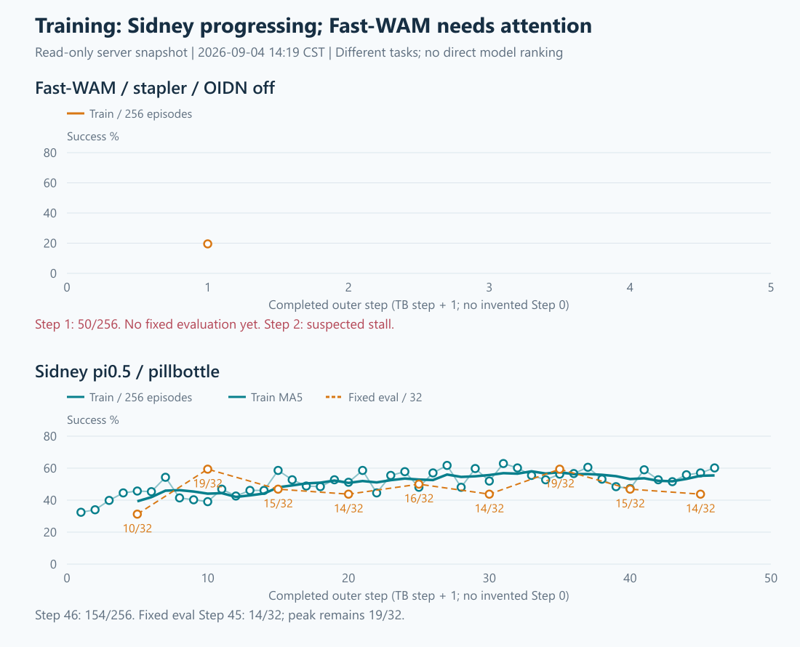

# 当前训练与服务器简报（09-04 14:19，14:23补充只读栈）

## 1. 结论与图

Sidney继续正常推进；Fast-WAM完成第一步真实更新，但第二步环境交互出现停滞，不能称“两项均健康”。
本轮仅普通账号只读刷新、无暂停信号的`py-spy dump --nonblocking`、本地制图/交接更新；没有停止进程、改参数、重启Ray或安装依赖。

[桌面交互总图](current-training-health-20260904-1419/dashboard.html) ·
[优化指标PNG](current-training-health-20260904-1419/optimization.png) ·
[资源PNG](current-training-health-20260904-1419/resources.png)

两任务不同，不用这张图作模型排名。服务器TensorBoard step为0-based，本图+1后与日志完整step一致；
横轴从0开始但不虚构Step0成绩。Fast只有1点，尚无MA5/MA10或固定评估。

## 2. 训练现场

| 项目 | Fast-WAM clean/noOIDN | Sidney pi0.5 |
|---|---|---|
| 任务 | move_stapler_pad | move_pillbottle_pad |
| 完整step | 1/100 | 46/100 |
| 最新训练成功率 | 50/256 = 19.53% | 154/256 = 60.16% |
| MA5 / MA10 | 不足5步，不报均线 | 55.47% / 54.57% |
| fixed32 | 尚未到Step5 | Step40=15/32，Step45=14/32；最好仍是Step10/35的19/32 |
| 优化（最后完整step） | grad7.397、KL0.003895、clip2.124%，有限 | grad25.283、KL0.022414、clip5.312%，有限 |
| checkpoint文件现场 | 未出现保存代，尚未到Step10 | Step40双local-shard与full_weights均在且非零；未做恢复加载 |
| fatal/OOM/OIDN/Traceback | 所查均0，但存在无报错停滞 | 所查均0 |

Fast-WAM第一步`time/step=2497.6s`，约41.6分钟，已经完成rollout→actor更新；资源CSV每分钟采样峰值为
64,693MiB/卡（63.18GiB），不是完整瞬时峰值，不能宣称所有后续更新都能容纳。
仅一个step和没有fixed eval，尚不能评价本次学习效果。

Sidney前10步训练均值41.68%，最近10步54.57%，但fixed32近期回到14/32，仍未证明固定评估持续改善。
Step40文件：`checkpoint_rank_0.pt`与`checkpoint_rank_1.pt`各10,150,817,963B，
`full_weights.pt`8,526,574,644B。文件级存在不等于本轮恢复验证。

### Fast-WAM停在哪里

- 最新完整Step1记录时间13:28:46；rank0第二步采样8/8于14:04:08结束。
- 从约14:05到14:18的每分钟资源记录，GPU6/7均为0%利用率；14:23补查仍为0%。
  两卡显存分别固定17,699/58,727MiB，driver/worker仍活着，没有exit_code。
- rank1 EnvWorker PID1053120仍在`interact`，上层`VectorEnv.step`等待线程池future；
  多个子线程停在`MPLib.TOPP → toppra.available_solvers → importlib`锁等待，另有线程停在相机`_get_rgba`。
- rank1 rollout PID1053117等待future，actor PID1053114在`recv_rollout_trajectories`；rank0环境已空闲。
  **rank0日志8/8不代表两rank采样都完成**，因此不能把当前阶段写成“正在正常actor更新”。
- 这是已观察到的环境侧等待链，不足以断言唯一根因是导入锁、相机或旧补丁移除；
  当前没有出现旧OIDN invalid-handle/pthread-key fatal，也不是已报告的显存OOM。
- 本轮不停止/重启；建议下一步只围绕rank1环境等待链定位。原50h预估在停滞状态下不再适用。

## 3. 服务器各方面（14:19 CST）

| 方面 | 现场 |
|---|---|
| GPU0 | liwenbo进程，约9.5GiB；未干预 |
| GPU1/2/3 | 无compute进程，显存各4MiB |
| GPU4/5 | Sidney，约67.1/67.4GiB，随训练阶段变化 |
| GPU6/7 | Fast-WAM约17.3/57.4GiB；连续空闲利用率与停滞一致 |
| GPU温度 | 34—53°C；本次采样 |
| GPU错误 | 空闲GPU1 SRAM可纠正ECC累计/volatile各2次（同一计数口径，不相加）；无法确定发生时间。各卡不可纠正ECC=0，row remap错误/待处理=0 |
| CPU | 128逻辑CPU，load1/5/15=5.20/6.00/6.80；短采样空闲95—96%，I/O wait=0 |
| RAM | 总约1.97TiB；MemAvailable约980.4GiB（0.957TiB） |
| Swap/压力 | Swap已用约2.55GiB，但vmstat采样si/so=0；memory/io PSI avg10/60/300均0 |
| 磁盘 | `/`余222.8GiB，`/home`余1.31TiB，`/data`余1.27TiB；inode使用率3%/2%/1% |
| 基础服务 | ssh与mihomo均active，systemd failed units=0；22/6389/7890端口在监听 |
| shared Ray | gcs_server321933/raylet322685原进程仍在，约11天13小时；未重启 |
| 源码 | Fast RLinf4faade1d、clean RoboTwinf3e30a8、Sidneyf50e235c均符合源锁，working tree clean |

RAM占用主要集中在环境进程：Sidney两EnvWorker RSS约378.3/373.8GiB，Fast约70.4/61.7GiB。
RSS可能含共享页，不能简单相加当独占物理内存。可用RAM随同时加载新Fast模型/环境下降，不能单凭曲线确认泄漏。
本轮普通账户无法读取完整系统内核journal，未重做sudo内核/SMART深审；
服务端口可用不等于已检查所有外网连接，不把未检查项写成“全部无异常”。

## 4. 原始证据与可复现性

- [14:19统一JSON快照](CURRENT_TRAINING_HEALTH_20260904_1417.data.txt)：身份、两run实际resolved/TB、checkpoint文件、GPU/RAM/CPU/磁盘/服务/Git。
- [14:23非阻塞线程栈与CPU计数](CURRENT_FASTWAM_STALL_20260904_1421.txt)：普通账户既有py-spy，未安装工具、未发进程信号。
- [图表汇总数值](current-training-health-20260904-1419/summary.json)、[图表数据](current-training-health-20260904-1419/plot-data.json)。
- 采集脚本：`local_scripts/sz_current_training_health_20260904.py`经SSH stdin执行，不写服务器文件；
  针对停滞追加`sz_fastwam_stall_readonly_20260904.sh`。本地渲染脚本`render_current_training_health_20260904.cjs`。
- 图已逐张视觉检查；本地字体缓存目录不可写告警不影响PNG生成或显示，未为消除告警改系统配置。
