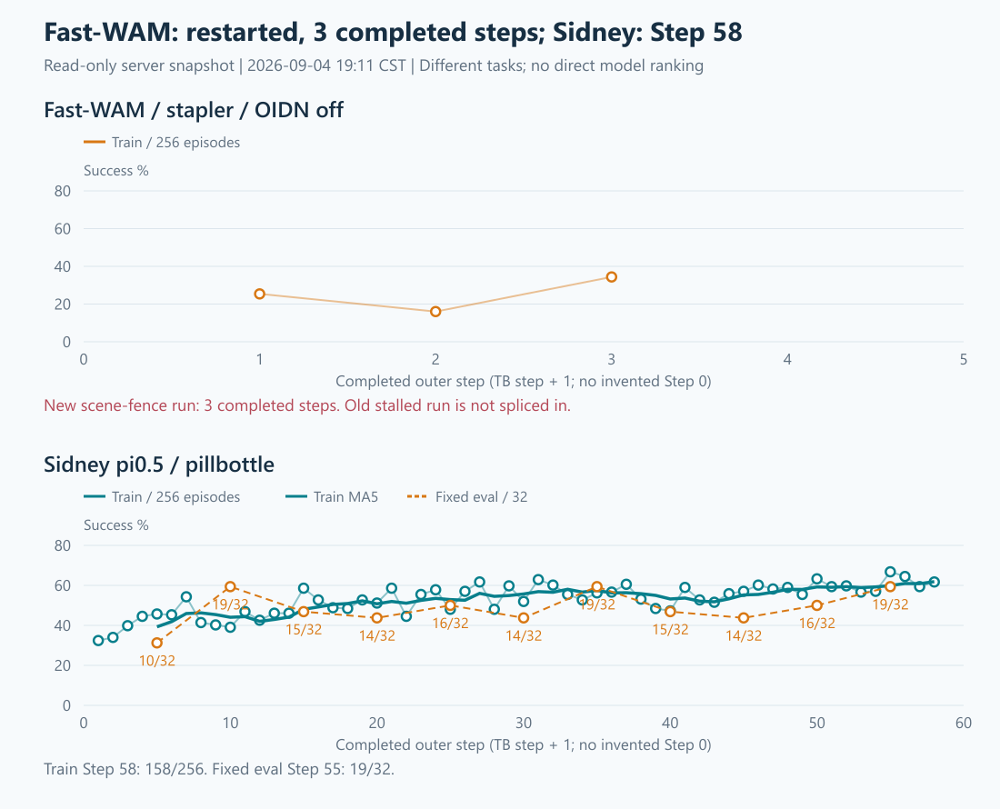
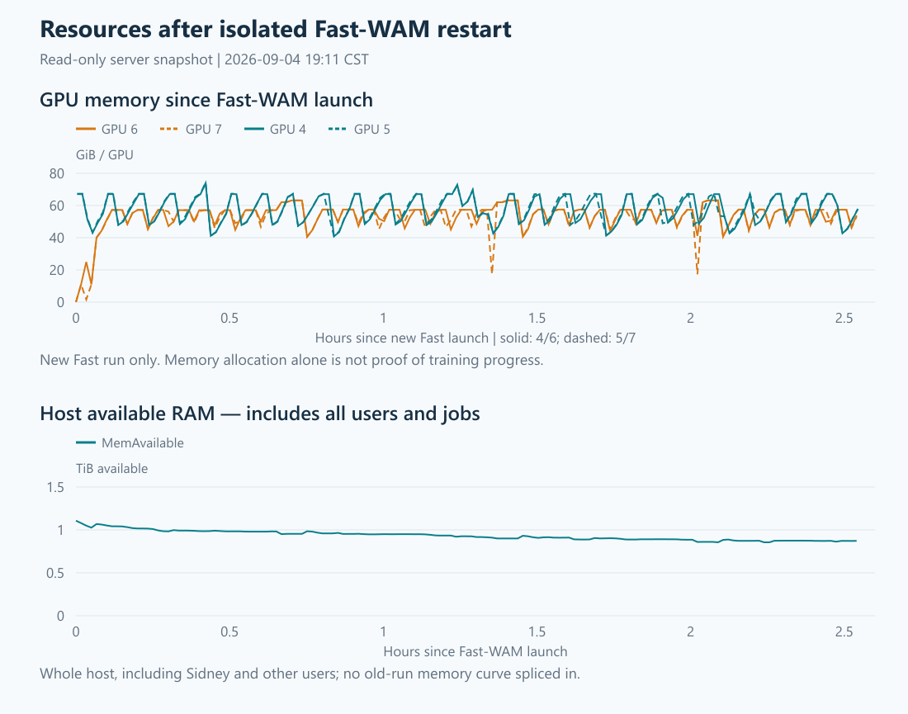

# 19:11 两项实验与深圳整机只读刷新

现场时间：2026-09-04 19:11:16—19:11:23 CST。普通账号chenyiteng，固定host-key密码SSH，身份探针通过。
未改代码、配置、依赖、进程或shared Ray；未进行GPU推理、checkpoint恢复、SMART或管理员内核检查。

## 1. 当前实验

| 项目 | Fast-WAM clean/noOIDN/scene-fence-v3 | Sidney π0.5 pillbottle |
|---|---|---|
| 完整step | 3/100 | 58/100 |
| 正在执行 | Step4 rollout 6/8，19:09仍推进 | Step59 rollout，19:07进入 |
| 最新训练成功率 | 88/256＝34.38% | 158/256＝61.72% |
| 近期趋势 | Step1—3：65→41→88 /256 | MA5 61.88%，MA10 60.39% |
| 最新fixed32 | 尚未到首次Step5 | Step55=19/32=59.38%，追平Step10/35 |
| 最新checkpoint | 无；尚未到首次Step10 | Step50双rank local shard和full_weights均在 |
| 所查fatal/OOM/OIDN/Traceback/RuntimeError | 均0 | 均0 |
| 最近外层耗时 | Step3约38.82分钟 | Step58约22.22分钟 |

Fast已完成此前卡住的Step2及后续Step3，证明此次已跨过旧早期停滞边界；不等于长程稳定性已经证实。
尚未覆盖首次fixed评估及DCP保存，3个训练点也不足以判断学习收益。只画新v3，不拼接旧run的50/256。
Fast合同仍为32env×8=256轨迹、G8、GB1024/MB2/update_epoch2，每外层4次optimizer call。
Sidney为64env×4=256轨迹、GB1024/MB32/update_epoch2，每外层2次optimizer call；不按异任务成功率排名。

Sidney fixed序列（Step5…55）：`10,19,15,14,16,14,19,15,14,16,19 /32`。
训练均值继续提高，固定评估回到历史最好，但仍未超过最好，不能写成已持续泛化改善。
两run wrapper、driver和双rank worker均在；没有exit_code/finished标记。checkpoint仅文件级核验，未测试恢复。

## 2. 服务器各方面

| 项目 | 本轮现场 |
|---|---|
| GPU分配 | 0号liwenbo占用约9.63GiB；1/2/3号采样时空闲；4/5 Sidney；6/7 Fast |
| GPU当前显存 | 4/5约57.97/58.26GiB；6/7约55.77/55.52GiB |
| 本run资源采样峰值 | Fast双卡各63.18GiB；Sidney双卡74.51/74.72GiB；非瞬时硬件峰值保证 |
| GPU温度 | 34—47°C |
| CPU | 128逻辑CPU；load1/5/15=9.26/8.93/8.85；两次1秒样本空闲94%/93%，iowait0 |
| RAM | 总1.968TiB，可用0.872TiB（约893GiB）；可用量仍缓降 |
| Swap | 已用约5.97GiB，接近总量；本轮vmstat无swap-in/out，不能仅凭占用断言正在内存抖动 |
| PSI | memory/io 10/60/300秒均为0，无当前压力信号 |
| 磁盘可用 | /约222.8GiB，/home约1.30TiB，/data约1.20TiB；使用率22%/43%/64%，inode充足 |
| 服务 | ssh/mihomo active；failed unit=0；shared Ray原gcs/raylet已持续约11天18小时，未重启 |
| GPU硬件计数 | 所查不可纠正ECC/row-remap failure为0；GPU1 SRAM可纠正计数2，与17:03相同 |

RAM占用主要集中在环境进程：Sidney两EnvWorker RSS约387/401GiB，Fast约97/102GiB。
RSS含共享页，不能将其简单相加当独占物理内存；单凭available曲线也不足以确诊泄漏。
GPU单点利用率低，但日志与连续资源采样仍推进/波动；不能据单次0%认定重新卡住。
普通账号journalctl提示无系统日志权限，本轮**不声称**已排除内核Xid/OOM或完成NVMe SMART复核。

## 3. 隔离、数值与下一步

- Fast仍为RLinf_1、Sidney为RLinf；scene-fence仅Fast双EnvWorker映射，Actor/Rollout/driver/Sidney均未映射，LD_PRELOAD为空。
- 三工作树HEAD及clean：Fast `62526cc95047`，RoboTwin clean/noOIDN `f3e30a83365c`，Sidney `f50e235c5ab1`。原库和shim的SHA256与前次相同。
- Fast Step3记录grad norm9.410、KL约0.000964、clip0.90%；Sidney Step58 KL约0.0200、clip5.51%。日志聚合值不用于无效的跨模型强弱比较。
- 下一次刷新重点：Fast首次Step5 fixed、Step10 DCP及后续reset边界；Sidney Step60 fixed/checkpoint；RAM是否持续下降。没有新增监控自动化或重启。

[优化图](current-training-health-20260904-1911/optimization.png) · [桌面交互图](current-training-health-20260904-1911/dashboard.html)

## 4. 原始证据与复算

- [本轮完整只读快照](CURRENT_TRAINING_HEALTH_20260904_1911.data.txt)：配置、TB、resource.csv、文件级checkpoint、进程、GPU/ECC、RAM/PSI、磁盘/服务、Git。
- [图与计算摘要](current-training-health-20260904-1911/summary.json)。TB step按runner的0基口径+1，和完整日志step对齐；不虚构Step0。
- 复用 `sz_scene_fence_health_20260904.sh` + `sz_current_training_health_20260904.py`，通过stdin执行，未写远端脚本。
- 本地 `render_scene_fence_restart_20260904.cjs` 参数化渲染，补齐当前横轴刻度并澄清outer step措辞；3张PNG均目视核查，HTML带悬停数值。
- GPU1 ECC历史比较仅读取本地17:03的 `PI05_PI0_COMPARISON_LIVE_20260904.txt` 对应GPU字段；没有遍历旧实验。
