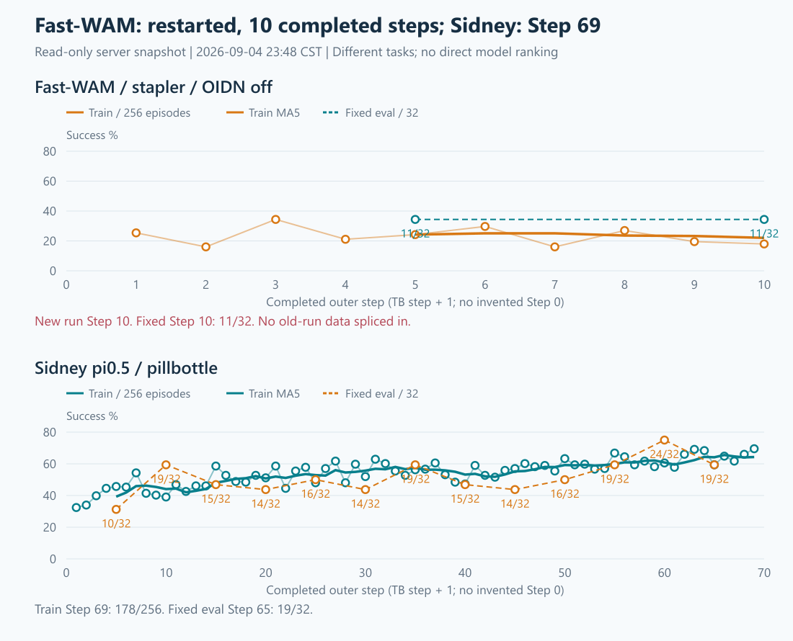
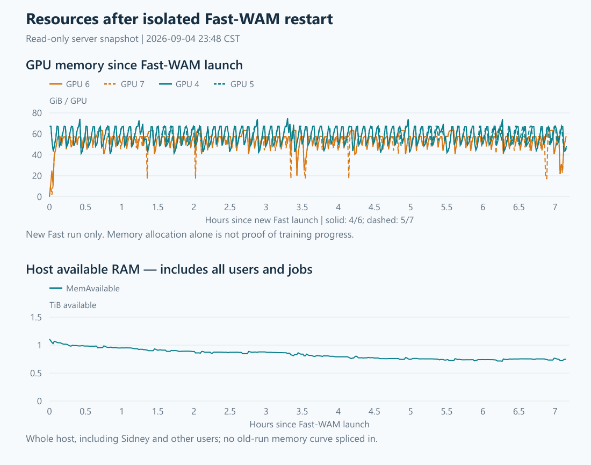

# 23:48 两项实验与整机只读刷新

现场时间：2026-09-04 23:48:42—23:48:49 CST。普通账号chenyiteng，固定host-key Paramiko，uid1003确认。
只读取现有日志、TensorBoard、resource.csv、checkpoint文件、进程、GPU/内存/磁盘/服务/Git；未启动推理或训练、未恢复checkpoint、未改依赖/进程/shared Ray。

## 1. 有没有提升

| 实验 | 最新完整训练 | 固定评估 | 判断 |
|---|---|---|---|
| Fast-WAM noOIDN/scene-fence-v3，stapler | Step10/100；46/256=17.97%；近5步22.03% | Step5、10均11/32=34.38% | 暂未见提升；前5步训练均值24.22%，后5步22.03%，仍波动 |
| Sidney π0.5，pillbottle | Step69/100；178/256=69.53%；近10步64.34% | Step55=19/32 → Step60=24/32 → Step65=19/32 | 训练明显上升；fixed曾创新高75%，但随后回落，尚未稳定保持 |

Sidney首10步训练均值41.68%→最近10步64.34%，增加22.66个百分点。Step60首次超过此前19/32峰值，但不能把单点75%写成已稳定达到75%。
Fast仅画新v3：训练Step1—10为`65,41,88,54,62,76,41,69,50,46 /256`；不拼接旧128轨迹/OIDN或早期卡住run。
两个任务和模型不同，成功率不用于直接排名。本轮未增加SFT同协议评估，不能据这些点计算严格的“相对SFT增益”。

## 2. 运行、checkpoint与数值

- 两run wrapper/driver和双rank worker均在，exit_code/finished标记均无；Fast已进入Step11 rollout，Sidney进入Step70 rollout。最新完整步日志分别为23:44、23:45。
- 两driver全文所查OIDN/pthread key/Python fatal/CUDA OOM/OutOfMemoryError/Traceback/RayActorError/Segfault/RuntimeError均0。并非内核或所有worker日志的穷尽排错。
- Fast Step10于23:44保存：`actor/dcp_checkpoint/__0_0.distcp`=14,455,154,049字节，`__1_0.distcp`=14,454,317,078字节，`.metadata`=2,919,728字节，均存在非零。
- Sidney最新Step60：双`checkpoint_rank_*.pt`各10,150,817,963字节，`full_weights.pt`=8,526,574,644字节，均存在。未执行恢复测试。
- Fast已跨过旧Step2停滞、两次fixed评估及首个DCP保存；这是运行边界进展，不是长程问题已根治或策略已学好的证明。
- 最新Fast grad norm8.209、approx KL=-0.000168、clip1.59%；Sidney grad norm15.000、approx KL0.00627、clip2.25%；所取标量有限。approx KL是采样聚合量，微小负值不等于真KL为负，也不凭单点判故障。

[优化指标图](current-training-health-20260904-2348/optimization.png)。BC本轮未启动，未将本次“看看”视为之前GPU3短测的批准。

## 3. 服务器整体

| 项目 | 现场 |
|---|---|
| GPU分配 | 0号其他用户约9.63GiB；1/2/3号各4MiB且无compute进程；4/5 Sidney；6/7 Fast |
| 当前显存 | GPU4/5约50.07/52.63GiB；6/7约57.94/57.93GiB；随采集/训练/评估/offload阶段变化 |
| 本run采样显存峰值 | Fast双卡63.18GiB；Sidney双卡74.51/74.93GiB；不是连续硬件峰值保证 |
| CPU/温度 | 128逻辑CPU，load1/5/15=8.83/8.90/9.14；两次1秒CPU空闲94%/93%，iowait0；GPU34—51°C |
| RAM | 总1.968TiB，可用761.70GiB；较19:11约893GiB少约131GiB，仍有余量，但应关注长期下降 |
| Swap/压力 | Swap约5.97GiB已满；本轮vmstat换入/换出均0；memory PSI=0，IO近10秒0、60秒0.01%、300秒0.06% |
| 磁盘 | `/`余222.78GiB，`/home`余1.28TiB，`/data`余1.07TiB（用68%）；inode使用1—3% |
| 服务 | ssh/mihomo active、failed unit0；shared Ray原PID321933/322685存活近12天 |
| GPU错误计数 | 所查不可纠正ECC均0、row remap failure为No；GPU1可纠正SRAM计数仍2，未较19:11增加 |

主存占用集中在环境进程：Sidney EnvWorker RSS约387/401GiB；Fast约165/162GiB。RSS含共享页，不能简单相加当独占物理占用；不能据available下降单独确诊泄漏。
单点GPU利用率0不等于卡死：完整step持续增加，本轮GPU7还采到81%，此前多次采样有计算活动。
普通账号无系统journal权限；本轮没有管理员内核/Xid或NVMe SMART检查，不宣称已排除这些层面的异常。

## 4. 隔离与证据

三树HEAD/clean现场核对：Fast `62526cc95047`、RoboTwin noOIDN `f3e30a83365c`、Sidney `f50e235c5ab1`；均无dirty输出。
Fast为RLinf_1，Sidney为RLinf；只有Fast两个EnvWorker映射scene-fence库，其他actor/rollout/driver/Sidney均未映射，LD_PRELOAD均空。原库和shim SHA256随原始快照保留。

- [完整只读快照](CURRENT_TRAINING_HEALTH_20260904_LATE.data.txt)、[压缩传输原件](CURRENT_TRAINING_HEALTH_20260904_LATE.zlib.txt)、[复算摘要](current-training-health-20260904-2348/summary.json)。
- [桌面交互图](current-training-health-20260904-2348/dashboard.html)；静态成功率/优化/资源三图均目视检查。横轴从0显示，但真实记录从Step1开始；TB step+1与日志对齐。
- 复用现有只读采集脚本；第一次大文本传回仅294,912字节，JSON不完整，未用于结论。增加可选zlib/base64输出后重新只读获取，解压/JSON完整校验通过，546,209字符，替换本轮无效截断副本。
- 仅本地更新采集输出选项、解码器、渲染文案和交接；服务器脚本经stdin执行，无远端脚本/训练写入。未创建监控自动化或执行Git提交/推送。

下一次关注：Sidney Step70 fixed/checkpoint能否保持提升；Fast后续fixed是否脱离11/32；主存是否继续下降。此处是接续建议，不是已安排的定时监控。
