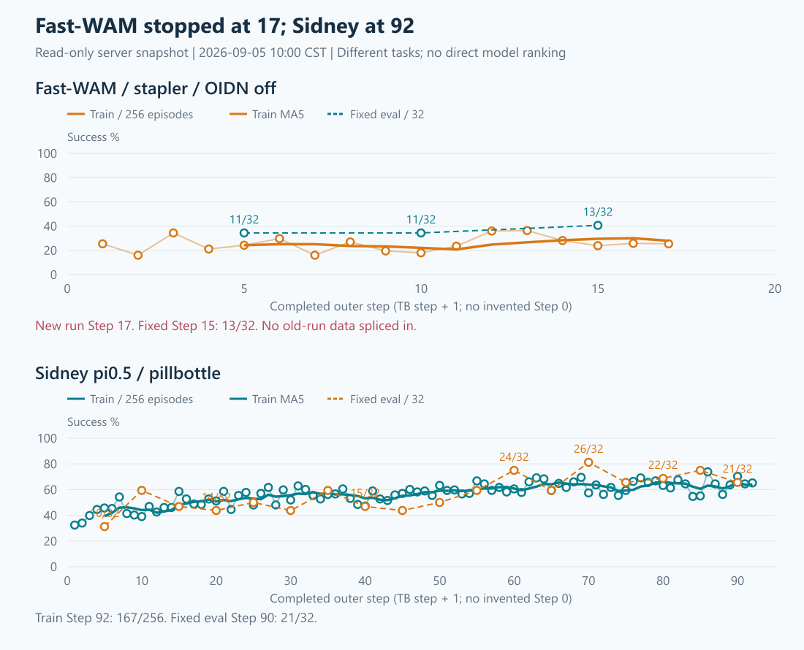

# 实验与整机只读刷新：2026-09-05 10:00 CST

身份：固定host-key、普通账号 `chenyiteng` 的只读SSH；动态快照10:00:22–10:00:29。另对Fast失败段作定点日志读取，无测试、进程干预、依赖或训练修改。旧交接不能覆盖本次现场。

## 1. 实验结果和趋势

| 实验 | 本次现场 | 提升判断 |
|---|---|---|
| Fast-WAM / stapler / noOIDN / scene-fence-v3 | 完成Step17/100，Step18并发reset期间fatal，**04:47:11退出255**；最新训练65/256＝25.39%，MA10=26.33% | fixed Step5→10→15为11→11→13/32（34.38→34.38→40.63%）；小幅改善，不足以证明稳定提升 |
| Sidney π0.5 / pillbottle | 完成Step92/100，Step93 rollout2/4；最新训练167/256＝65.23%，MA10=63.24%；driver仍在 | 训练首10均41.68%→最近10均63.24%；最新fixed Step90=21/32，最好Step70=26/32。近5次fixed均超过早期最好19/32，后期改善证据更强，但仍波动 |

Sidney fixed完整序列（Step5到90，每5步）：`10,19,15,14,16,14,19,15,14,16,19,24,19,26,21,22,24,21 /32`。近5次是26、21、22、24、21，不能把最好81.25%当成稳定水平。

两项任务、模型、输入不同，图仅看各自趋势，不排名。outer step使用TensorBoard step+1，无虚构Step0，不拼接旧Fast运行。



[交互图](current-training-health-20260905-1000/dashboard.html) · [优化信号](current-training-health-20260905-1000/optimization.png) · [资源趋势](current-training-health-20260905-1000/resources.png) · [汇总数据](current-training-health-20260905-1000/summary.json)。PNG已视觉核验。

## 2. Fast这次退出的已知边界

首个可见主故障来自EnvGroup rank0：

```text
Fatal Python error: PyGILState_Release: auto-releasing thread-state,
but no thread-state for this thread
```

当时其他Python线程在RoboTwin `vector_env.py` reset线程池中，主环境线程等待reset；fatal所示当前原生线程没有Python frame。可确定发生在并发reset阶段，**尚不能仅凭这份栈指定某个C++析构或唯一根因**。随后环境worker死亡、通信失败，最终driver退出255。

本run driver未检出 `OIDN Error`、`pthread_key_create failed`、CUDA OOM或OutOfMemoryError。它已跨过旧Step2挂帧边界；这次看到的是线程状态fatal，不应直接称为相同挂帧、OIDN重新开启或补丁引入。旧scene-fence修复不等于已经修复所有原生线程生命周期问题。

原Fast driver/wrapper不在，GPU6/7各6MiB且无compute进程，不能再报“在训练”。本轮没有重启、追加补丁或回撤。

原始边界：[定点日志](FASTWAM_EXIT_BOUNDARY_20260905.data.txt)；命令：[只读脚本](../../../local_scripts/remote_commands/sz_fastwam_exit_boundary_20260905.sh)。

## 3. Checkpoint与版本

- Fast最新**Step10**：双rank `.distcp` 与 `.metadata` 均现场存在；两份约14.46GB，metadata约2.92MB。没有Step17 checkpoint，没有测试恢复。
- Sidney最新**Step90**：双rank local shard及完整 `full_weights` 均存在；rank各约10.15GB、完整权重约8.53GB。未恢复测试。
- Fast HEAD `62526cc95047c8a4a6e948a76be8eeec8a3926de`、noOIDN RoboTwin `f3e30a83365cdda1165911422dc3ce73e703201e`、Sidney `f50e235c5ab1f4390f0ba92bfb13390ed0a86810`，现场均clean。Sidney所查driver fatal/OOM等均0。

Fast路径：`/data/chenyiteng/results/rlinf-shenzhen/fastwam-grpo/runs/fastwam-grpo-control-fresh100-2gpu32x8-g8-b1024-u2-m10-fixed32-eval5-phys67-dcp-clean-nooidn-scene-fence-v3`。

Sidney路径：`/data/chenyiteng/results/rlinf-shenzhen/pi05-sidney/runs/move-pillbottle-pad-grpo-formal100-2gpu64x4-g8-b1024-u2-m10-noise0p5-h200-fixed32-eval5-phys45-localshard-v1`。

## 4. 整机各方面

| 项目 | 10:00只读现场 |
|---|---|
| GPU | 0为其他用户约9.6GiB；4/5 Sidney约67.1/67.4GiB、利用率85/100%；1/2/3/6/7无compute进程 |
| GPU温度/错误 | 33–49°C；不可纠正ECC=0，row-remap failure=No；GPU1可纠正SRAM累计2，未见增长 |
| RAM | 总约1.97TiB，available约**1103GiB＝1.078TiB**；Fast退出前后available明显恢复，不再沿用昨晚下降状态 |
| Swap / 压力 | 约5.83GiB已用；当前无swap-in/out；memory/io PSI avg10/60/300均0；已用swap本身不等于正在抖动 |
| CPU | 128逻辑CPU，load约6.95/7.05/7.03；约95% idle，iowait0 |
| 磁盘 | `/data`余**767GiB**、使用78%；`/home`余约1.23TiB，root余约223GiB。/data较昨晚减少，仍需关注产物增长；本轮未删除任何文件 |
| 服务/进程 | ssh、mihomo active，无failed services；shared gcs/raylet原PID321933/322685持续，Sidney原driver3176215仍在 |

资源记录峰值：Fast约63.62GiB/卡；Sidney最高约74.93GiB/卡。这是各run采样峰值，不是连续峰值捕获，也不是BC容量预测。Env进程RSS可能包含共享页，不能直接相加作独占RAM。

本次未作管理员内核日志/SMART深检，不能据此排除所有硬件问题。主风险是Fast已经退出，以及/data产物增长；当前没有整体CPU或内存压力证据。

原始现场：[解码快照](CURRENT_TRAINING_HEALTH_20260905.data.txt)；[压缩原始返回](CURRENT_TRAINING_HEALTH_20260905.zlib.txt)。
