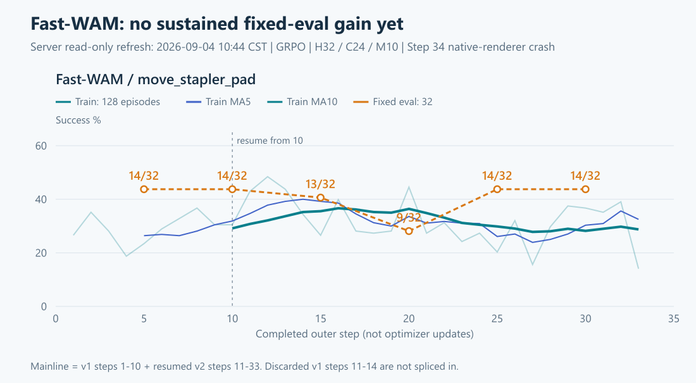
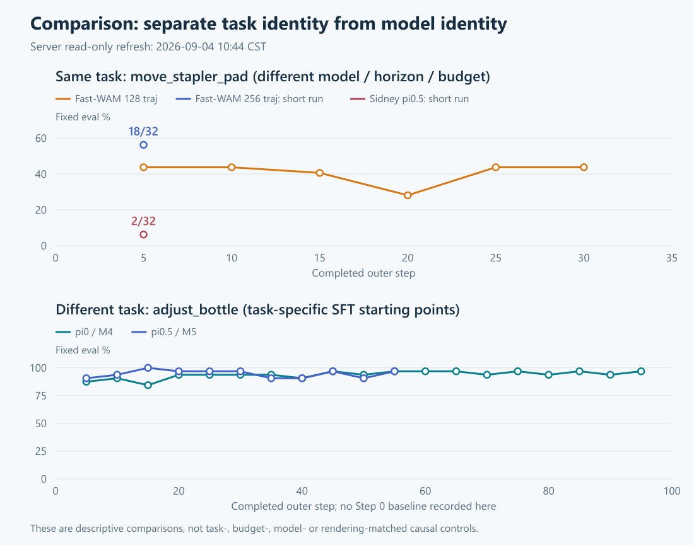

# Fast-WAM：学习效果、对照口径与最小修复复核

2026-09-04；本轮为只读研究讨论，不授权改服务器、升级、回撤、测试或续训。

## 1. 直接结论：锁版本、小范围；旧补丁去留待证

**本轮不升级 OIDN/SAPIEN，不关闭降噪，不改相机，不修改 Sidney 共用环境。**这里不是说任何版本永远不能升级，而是当前“保持原观测、修复长程稳定性”的目标不适合整库升级。若定位到已知原生生命周期缺陷，优先在锁定的 2.0.1 基线上回移必要修复，并保持 API/core/CUDA 库成套匹配。即使只回移释放代码，也应核对图像输出一致性，不能口头保证完全无变化。

旧 Python 补丁的结论改为：**有效性未证实，必要性待审；不因复发立即整体回撤，也不因结构更清楚就永久保留。**本轮保留停机现场，不执行回撤。最终修复逐块审计：

| 旧改动 | 现有依据 | 去留标准 |
|---|---|---|
| child 不清全局缓存、批量 close 后统一清 | 清理职责更集中，但 clear_cache 仅清 registry；旧“必然销毁兄弟 renderer”依据不成立 | 若原生所有权修复后原始调用顺序安全，且无独立必要性，删除这部分改动 |
| reset 从线程池移回调用线程 | 官方 RLinf #1040 也在 ThreadPool reset 发生同型 PyGILState fatal；是相关线索，不是线程亲和性证明 | 若确认创建/销毁线程约束则按约束统一；否则不保留无依据的串行化。step 仍在线程池，现补丁不是完整线程亲和性修复 |
| 集中关闭、清 Python 引用与 GC | Python 引用下降不等于 C++ device/key 已释放 | 只保留有可复核所有权用途的释放，去掉为猜测服务的额外回收 |

“没有证据有效”不等于“已有证据无用”；但最终交付也不能让实验性改动无限期挂着。

## 2. 网上有没有相关讨论？有，而且不止 Fast-WAM

本轮 GitHub API 查询 `RLinf/RLinf robotwin` 返回89个 issue/PR，`OIDN`返回2个，`pthread_key_create`返回0个；这只是查询命中数，不是穷尽所有日志附件。按相关性读取正文、评论及明确相关 PR diff。

| 一手来源 | 具体发现 | 对我们能说明什么 |
|---|---|---|
| [RLinf #1040](https://github.com/RLinf/RLinf/issues/1040) | LingBot-VLA/RoboTwin 在 vector_env.reset、ThreadPool 中报同型 PyGILState_Release fatal；A100仍有显存余量；评论中训练 env=8/32 也失败，未给出根治方案 | **最接近旧事故的栈级线索**。跨模型存在；不能把降低并发当已证实根治，也不能证明这份报告同样有 pthread-key 耗尽 |
| [RLinf #947](https://github.com/RLinf/RLinf/issues/947) | 官方 Docker 的 π0.5/H20 评估失败；用户关闭 OIDN 后能跑 | 指向共享原生渲染栈；关降噪改变 RGB，只能算诊断线索，不是本任务可直接采用的修复 |
| [RLinf #758](https://github.com/RLinf/RLinf/issues/758)、[RoboTwin #191](https://github.com/RoboTwin-Platform/RoboTwin/issues/191) | RLinf维护者将相关报告指向 RoboTwin OIDN/filter 问题 | 没有发现与我们长程 key 申请失败一一对应、已经验证的直接补丁 |
| [SAPIEN #219](https://github.com/haosulab/SAPIEN/issues/219) | H20/H100 ray-tracing/driver 挂起线索 | 我们是长程 key 申请失败后退出，不是首次 task_picture 挂起；不能直接换驱动或禁用 RT |
| [RLinf #1268](https://github.com/RLinf/RLinf/issues/1268) | π0.5 + GRPO + absolute joints 在另一任务、C16 下训练不稳，暂无评论解决方案 | π0.5 并非任意任务/配置都能稳定学习；不是 Fast-WAM 特有算法故障的证据 |
| [RLinf #1287](https://github.com/RLinf/RLinf/issues/1287) | 腕部视图穿透/透明，用户通过相机 near 改动解决 | 是观测几何问题，不是 OIDN key 问题；不能混在稳定性修改里顺手改 RGB |
| [RLinf PR #1466](https://github.com/RLinf/RLinf/pull/1466) | 提议 clear_cache_freq 1→8 以减少 bootstrap；报告短程2-step测试；当前 closed、merged_at=null | **未合并提案，且目标主要是速度**。不能称“上游已证明8更稳定”，也不能与 FAQ 的1来回试值当根治 |
| [RLinf PR #897](https://github.com/RLinf/RLinf/pull/897)、[PR #1326](https://github.com/RLinf/RLinf/pull/1326) | 初始化/offload及actor显存释放、wrapper offload接口整理 | #897已在四份本地服务器工作树祖先中；当前 wrapper 已有 offload。不是漏合一个显存补丁即可解释本次 key 耗尽 |
| [RLinf #1175](https://github.com/RLinf/RLinf/issues/1175) | 旧多worker seed独立shuffle可能造成重叠，上游有partition修复 | 我们当前 wrapper 已调用 partition_success_seeds，不直接命中所示旧代码。仍需区分 requested seed 与不稳定初态 retry 后的 actual seed |

另读 RoboTwin #89：5080 的 core dump 报告、仅有换大显存的评论，缺乏同型调用链，未用它归因。公开 issue 是线索；没有把讨论者的猜测当维护者确认的根因。

原生候选仍是 [OIDN 9f816f77 的 DeviceGuard 强引用修复](https://github.com/RenderKit/oidn/commit/9f816f77eb3d6bddaf8d07a96c480444f3d0ee4b)与 [d4af2c66 的释放顺序修复](https://github.com/RenderKit/oidn/commit/d4af2c667497a42a5c06c95e6d6b5d7f5cd35349)。它们提供比随意加 GC 更具体的机制，但尚未证明本事故命中；不盲回移2.2.x的不同所有权结构。前轮原生逐提交分析保留在 [干净修复讨论 §3—5](OIDN_CLEAN_FIX_DISCUSSION_20260904.md#3-广泛检索后哪些线索真正相关)。

## 3. Fast-WAM 实验到底有没有效果？

### 3.1 128轨迹主线：会做，但未证明持续 RL 增益

10:44 CST现场重新读取 driver、全量 TensorBoard scalar、resolved、资源CSV、checkpoint目录；不是引用旧图。主线严格拼接 v1 Step1—10 + 从该 Step10 恢复的 v2 Step11—33；v1废弃分支 Step11—14 不拼入。

- 首10步训练平均 **29.14%**，末10步 **28.75%**；末5步32.50%。中间短暂上升，后段回落；不能只选峰值说收敛。
- fixed32 Step5/10/15/20/25/30 = **14、14、13、9、14、14 /32**。最后43.75%仅回到 Step5/10 水平；没有持续超过早期检查点。
- 没有同协议 Step0 fixed32 基线，无法精确量化相对原始 checkpoint 的 RL 净增益；旧 standalone 11/16也不是这个协议的 Step0。
- 最新仍是完成Step33后于Step34原生渲染崩溃，exit255；无该run存活wrapper。Step30的两片DCP与metadata均重新确认存在，未恢复加载。
- 训练是随机初始噪声并插入 Flow-SDE transition；Fast-WAM eval使用固定初始噪声与官方ODE路径。训练成功率与固定评估并非同一个随机策略，二者不必重合。

### 3.2 256轨迹档：不能遗漏，但不能夸大

`16 env × 16 rollout / GB2048 / train-offload=false` 的 pi0style-v3 完成5步，fixed Step5 **18/32=56.25%**；随后 CUDA OOM（不是本次 OIDN 故障）。这是值得保留的较高单点，**不是“加大group已经解决学习问题”**：仅一次评估，而且采样量、并发、offload都变了。

`32×8`另一档完成3步、没有fixed eval；更早同名v1启动即退出，不能当训练曲线。所有已取数据保留原run身份。

## 4. 和有效 π0 / π0.5 的全口径对比

### 4.1 先把任务与初始模型分开

| 实验 | 任务 / 起点 | 训练表现（首5步均值→末5步均值） | 固定评估证据 | 应如何解释 |
|---|---|---|---|---|
| Fast-WAM 128主线 | move_stapler_pad；官方RobotWin release | 26.41%→32.50%（首/末10均值基本不变） | 14/32→14/32，过程最低9/32 | 有任务能力，持续RL增益不足 |
| π0 Control | adjust_bottle；该任务SFT | 75.08%→94.69%，记录到Step96 | Step5 28/32，后段多次30—31/32 | 学习上升证据较清楚，但不是同任务模型对照 |
| 官方 π0.5 Control v2 | adjust_bottle；该任务SFT | 83.52%→87.19%，记录到Step58 | Step5 29/32，Step15 32/32，后段29—31/32 | **起点已很强**，不是从低成功率靠RL练到97% |
| Sidney π0.5 move | **同为move_stapler_pad**；多任务SFT | 5.86%→6.17%，仅8步 | Step5 **2/32** | 直接反例：不能说π0.5天然在这任务比Fast-WAM强 |
| Sidney π0.5 pillbottle | move_pillbottle_pad；同一个多任务SFT | 39.30%→56.33%，本轮Step37 | Step5 10/32，Step10/35均19/32 | 训练上升，但固定评估尚未持续超Step10；也是异任务 |

首/末窗口是描述性统计，不是独立重复实验或显著性检验。π0/官方π0.5的终态本轮确认为wrapper已不存活；未在本讨论重新归因它们停止原因。不要称它们当前仍在跑，也不要称100步完成。

### 4.2 resolved科学参数与资源合同

| 字段 | Fast-WAM 128主线 | π0 Control | 官方 π0.5 Control v2 | Sidney π0.5 |
|---|---|---|---|---|
| 任务 | move_stapler_pad | adjust_bottle | adjust_bottle | move / pillbottle 两个独立run |
| H / C / denoise M | 32 / 24 / 10 | 50 / 50 / 4 | 50 / 50 / 5 | 50 / 50 / 10 |
| episode上限 | 192 | 200 | 200 | 200 |
| env × rollout | 32×4 | 64×4 | 64×4 | 64×4 |
| trajectories / G8 groups | 128 / 16 | 256 / 32 | 256 / 32 | 256 / 32 |
| query records上限/步 | 1024（8/episode） | 1024（4/episode） | 1024（4/episode） | 1024（4/episode） |
| GB / MB / update epoch | 1024 / 2 / 2 | 1024 / 32 / 2 | 1024 / 32 / 2 | 1024 / 32 / 2 |
| optimizer calls / outer step | 2 | 2 | 2 | 2 |
| LR / noise_level | 5e-6 / 0.3 | 5.6e-6 / 0.5 | 5e-6 / 0.3 | 5e-6 / 0.5 |
| denoise时间网格 | official shift=5 | 线性 | 线性 | 线性 |
| train env offload | true | false | false | false |
| 模型输入 | 三相机按official方式拼图、VAE/video conditioning | 三独立图像、SigLIP/语言前缀 | 同类OpenPI前缀 | 自有camera key/norm适配 |
| 训练范围 | canonical action expert；video/proprio/T5/VAE冻结 | action expert及非冻结投影；VLM冻结 | 同类，π0.5状态合同不同 | 同官方π0.5训练框架 |
| 状态/输出 | 14D absolute qpos，自有norm | 14D absolute qpos，自有norm | 14D absolute qpos，自有norm | 14D absolute qpos，自有norm |
| 权重 / checkpoint | bf16模型、FP32 density/chain；FSDP2 DCP | OpenPI混合dtype；旧local-shard协议 | OpenPI混合dtype；local-shard | OpenPI混合dtype；local-shard |

共同点：clean domain、aloha-agilex、三相机、train auto_reset=false/ignore_terminations=false、G8、GRPO组内标准化、chunk-level reward/logprob、clip±0.2、reward filter0.1—0.9、无critic、DVAC off、无entropy bonus、同Adam betas0.9/0.95、WD0.01、grad clip1、fixed32/eval5。**相同 scalar noise 参数不意味着相同物理探索强度**，网格/normalizer/动作耦合/denoise步数都不同。

完整6-run、309个resolved叶子的同异（包括输出路径、默认未用字段、缺省字段）见 [逐叶JSON](fastwam-review-20260904/resolved-leaf-comparison.json)。这些是实际run的resolved，不是拿当前默认YAML冒充历史配置。代码HEAD则是本轮现场状态，不自动等同各run启动时全部代码版本。

### 4.3 源码核对：哪些是设计，哪些才是问题

本轮Fast-WAM/π0/π0.5/Sidney HEAD分别为`4faade1d50bf`、`ab0988498a04`、`ae7e5da72acf`、`f50e235c5ab1`，四工作树clean。四份`advantages.py`及RoboTwin wrapper hash相同；Fast与π0基础loss hash相同。π0.5/Sidney另有DVAC分支，不能宣称整文件完全相同；当前 Control 的DVAC关闭。Fast本地镜像与服务器相关源码仅CRLF差异，归一化后内容一致；其他分支以服务器采集源码为准。

- **继承的估计器**：`advantages.py:90`对G8终局reward求组内均值/标准差；全成或全败组无组内区分，reward filter还会mask该组。更多query不等于更多独立成败对比。128档只匹配query预算，确实没有匹配π0的32组。
- **正常接入**：`fastwam_policy.py:270/431`的old/replay都截相同C24；`fastwam_rl.py:573`重放已记录transition，非另抽噪声；`robotwin_adapter.py:191/257/295`按official拼图及单次norm/decode。当前静态审计未看到GRPO接成PPO、动作重复反归一化等明显错接；这不替代同权重实测parity。
- **有意差异**：Fast-WAM生成H32、执行并训练C24；使用shifted grid，按sample选随机denoise index。OpenPI源码按推理batch共享所选index、线性网格，eval仍有初始高斯noise。两者都是单stochastic-transition思路，但不是完全相同随机策略，也不是完整最终动作密度的精确计算。
- **正常冻结，不是只训练824个数**：`builder.py:136`仅开放`mot.mixtures.action`。日志`trainable_parameters=824`来自`len(inventory['trainable'])`，是参数张量/名字数，**不是参数元素总数**。不能由此误判模型几乎全冻住。
- **指标解释缺口**：`losses.py:240—310`先按mask算每个MB的KL/clip/ratio；`utils.py:323`在全mask时返回0；actor把MB指标算术平均。Fast MB2更易出现全mask小批次，所以ratio=0.6—0.9不等于真实有效样本ratio偏移这么大。现有日志没有逐MB有效计数，无法离线精确反解。
- **不要把MB2本身当更新bug**：实际loss带`loss_mask_sum/max_episode_steps`，走`masked_mean_ratio`，之后按gradient_accumulation缩放。这是不同于日志masked-mean的统计口径；不能直接断言MB32→2必然把训练梯度错误缩小16倍。
- **已确认原生缺口**：svulkan2 DenoiserOidn初始化不充分验证创建结果、执行失败后仍继续输出；应修错误传播及已建资源的清理，但这只能阻断级联故障，不能冒充泄漏根治。

Fast末10步logged KL≈0.00132、clip≈0.99%；π0对应各自末10步约0.0162/6.83%，官方π0.5约0.0193/5.64%。这仅是值得调查的低变化信号，受mask/MB、336 vs700维chunk密度、时间网格及任务不同影响。Fast梯度非零（末10步均值9.34，为裁剪前值），没有证据支持“完全没有更新”。

## 5. 为什么不太work？我的排序与下一步

**先分开两件事：崩溃使预算没跑完；曲线不升说明现有完成预算内收益不足。修复渲染不会自动让GRPO变有效。**目前也无证据证明Step34前所有RGB已被渐进破坏，不能反过来拿事故解释全部学习平台。

1. **最确定的比较偏差是任务/起点。**官方π0/π0.5有adjust_bottle任务SFT高起点；Fast选的是它尚未饱和的stapler任务，同任务Sidney短跑更低。因此不能先给Fast模型能力判负。
2. **最值得查的学习机制是“有区分度的组数 + 有效更新幅度”。**Fast相同query预算下只有一半成败组；每个episode8个query获得的是同一成败监督，不是8份独立信息。组内全成/全败、done mask及同类失败可能进一步减少有效信号；需真实混合成败组数、valid记录数、按valid加权的update前后ratio/clip，不能从总体30%成功率推断组内多样性充足。
3. **探索/时间尺度可能不合这任务。**C24/192、shift5/M10/noise0.3与OpenPI C50/200/线性网格差异很大；同一noise数字不保证有用的探索。需要看失败停在抓取、搬运、放置还是超时，而不是一开始同时改LR、noise、chunk和horizon。
4. **预算不足与工程约束是真实限制。**主线33步=约4224条trajectory；π0同33步约8448条，而且其完整记录到96步。256档有18/32单点却被OOM截断，不能判断更多组是否能带来持续收益；常驻env也已实测可能挤爆Fast显存。
5. **实现/观测兼容仍是待检风险，不是已发现错误。**锁定了拼图、norm、冻结集合和replay结构，但若固定评估仍弱，最高信息量检查是同输入/同噪声下原始checkpoint与adapter的动作一致性，以及Step0/10/30的同协议评估和少量失败视频；不要无证据重写模型接口。

建议只沿一条主线：

**先锁住RGB与依赖 → 隔离复现真实camera/render/reset/offload生命周期，记录key/device/filter申请释放及归属 → 对确认的所有者做最小上游回移/本地释放修复，同时补齐fail-fast → 逐块删去无必要旧补丁 → 再在原预算下核对有效GRPO组与真实策略变化。**

下一轮如要实施，先展示隔离诊断的命令、资源、对象计数、重复次数上限、停止条件并批准；不先重跑一晚。后续学习诊断同样应保持原模型/任务/预算，先补有效计数和同协议基线，再决定唯一需要改的参数。当前没有批准、运行上述测试，也没有作参数调整。

## 6. 本轮服务器现场与证据

- 10:42资源：GPU4/5约67.07/67.35 GiB，GPU6/7各5 MiB；MemAvailable约1.165 TiB/总1.968 TiB，load5.31；shared Ray原进程仍在。这里只刷新GPU/RAM/进程，没有把前轮SMART/内核健康审计冒充本轮重检。
- 10:44训练：Sidney pillbottle完成Step37，success60.55%，MA5/10=56.33/56.45%，下一Step38 rollout；fixed评估最新仍Step35=19/32，未超过Step10；driver所查fatal/OIDN/OOM/traceback为0，Step30双rank及full_weights文件在。Fast v2状态如§3，未再启动。
- [交互图表](fastwam-review-20260904/dashboard.html)：7个hover图；[优化PNG](fastwam-review-20260904/optimization.png)、[资源PNG](fastwam-review-20260904/resources.png)。四张静态PNG与HTML均由相同数据生成；主线连续性/评估点断言通过，桌面hover及390px无横向溢出检查通过，浏览器pageerror=0。小屏优先打开独立PNG。
- [现场清单](FASTWAM_LEARNING_AND_MINIMAL_FIX_REVIEW_20260904.inventory.txt)、[11-run原始数据/config/checkpoint](FASTWAM_LEARNING_AND_MINIMAL_FIX_REVIEW_20260904.data.txt)、[简表JSONL](FASTWAM_LEARNING_AND_MINIMAL_FIX_REVIEW_20260904.summary.jsonl)。
- [现场源代码/hash/HEAD](FASTWAM_LEARNING_AND_MINIMAL_FIX_REVIEW_20260904.source.txt)、[真实embodied actor/utils与PR祖先](FASTWAM_LEARNING_AND_MINIMAL_FIX_REVIEW_20260904.actor.txt)。
- [GitHub搜索、初选issue/PR](FASTWAM_LEARNING_AND_MINIMAL_FIX_REVIEW_20260904.issues.jsonl)、[选定issue评论与PR diff](FASTWAM_LEARNING_AND_MINIMAL_FIX_REVIEW_20260904.issue-follow.jsonl)。

## 7. 取证与编辑账本

- 完整读取AGENTS、PROJECT_CONTEXT、HANDOFF、窗口交接及唯一Fast-WAM current SSOT；其他只读直接相关对照启动/任务证据，无遍历全部历史。
- `sz_fastwam_compare_inventory_20260904.sh`：固定host-key普通账号身份探针、GPU/RAM/procs、浅层自有run与worktree清单。
- `sz_fastwam_comparison_data_20260904.sh`：11个明确选中run的server event/resolved/terminal/checkpoint读取；event raw_step+1与driver人类step对齐。尾部源码枚举遇服务器rg不可用，中断发生在所有11-run数据输出之后；另脚本用限定Path读取补齐源码，未安装rg。
- `sz_fastwam_comparison_sources_20260904.sh`及`sz_fastwam_compare_actor_20260904.sh`：补齐四源码树、真实embodied actor、algorithm utils、seed hash与PR897祖先关系。Windows CRLF造成原字节hash不同，归一化文本核对，未改源文件换行。
- `fastwam_issue_research_20260904.cjs`、`fastwam_issue_follow_20260904.cjs`：只读公开API；大日志评论保存在原始证据，按问题选读。未发布issue/PR、未外发用户源码。
- `render_fastwam_review_20260904.cjs`：生成4张PNG、7图HTML及309叶config比较；`check_fastwam_review_20260904.cjs`验证图表交互与手机宽度。此为本地文档可视化检查，不是项目compose/import/smoke。字体缓存警告未阻止生成，已目视检查主图和比较图。
- 本地更新本证据、旧讨论的当前去留口径、SSOT路由和HANDOFF；无服务器写入/升级/回撤/渲染测试/训练/恢复操作，没有触碰其他用户或shared Ray。
