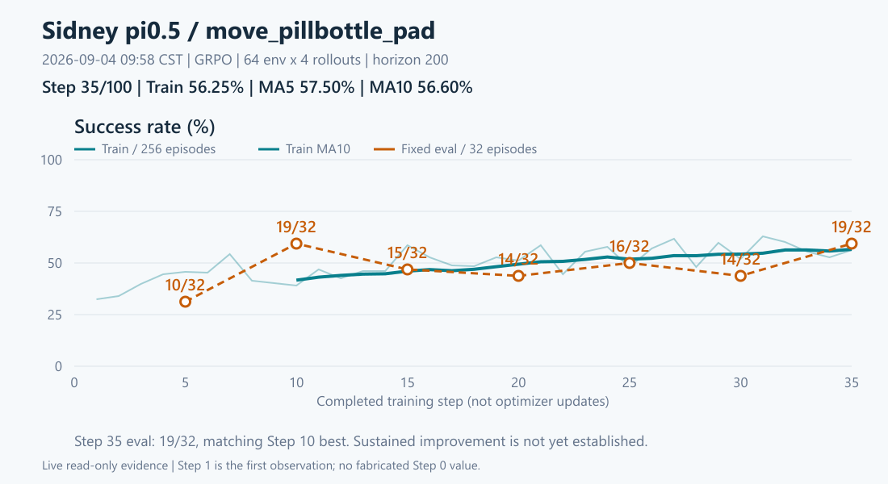

# Fast-WAM OIDN复发与服务器只读调查（2026-09-04）

后续源码讨论更正：`clear_cache`清registry引用，不等于强制销毁活跃renderer；旧因果定性过强。
本run resolved清理频率为1，8只是VectorEnv缺省值。见[干净修复讨论](OIDN_CLEAN_FIX_DISCUSSION_20260904.md#1-直接回答不整体回撤但收回已修好根因的说法)。以下保留09:58实验/资源快照，并修正相关解释。

## 授权与账本

- 用户请求：Sidney简要可视化、服务器各方面健康、深入解释Fast-WAM旧故障/补丁/复发因果。
- 本轮仅调查与本地可视化/文档；不改服务器代码、环境、参数、训练或shared Ray，不启动渲染测试或续训。
- 已完整读四份入口文件，专题读取Fast-WAM current port SSOT；仅为旧故障追溯补读renderer修复账本和对应精确检查/启动脚本。
- SSH复用普通账号固定host-key Paramiko，隐藏密码仅当前进程，先身份探针。
- 现场批次1：`local_scripts/remote_commands/sz_health_oidn_investigate_20260904.sh`，检查CPU/RAM/PSI/磁盘/inode/GPU/服务/内核可见日志，刷新Sidney全量标量与轻量资源数据，读取两个指定Fast-WAM driver和精确EnvWorker日志、补丁diff/源码。
- 批次1的base task路径最初误写为`robotwin/envs/_base_task.py`导致该段只读读取中断；按栈给出的`envs/_base_task.py`窄补读，已完成。后续Sidney标量采集正常返回。没有因此启动任何测试。
- 批次2：`sz_oidn_source_followup_20260904.sh`读取实际base task/EnvWorker/offload和完整栈关键帧，证明两rank加载补丁；只发HTTP HEAD测试网络。
- 管理员补查：普通账号内核日志无权限，因此使用用户提供的toom账号隐藏密码认证，以sudo仅读取内核事件、SMART、服务；身份与sudo均验证成功，没有写配置、安装或启动测试。
- 官方源码：按本地版本锁读取OIDN2.0.1、CPython3.11.14与glibc2.35实现。网页接口部分不可读，改用官方GitHub原始文件只读获取，未安装或克隆运行时。
- 批次3：`sz_oidn_native_readonly_20260904.sh`补读SAPIEN析构器、OIDN加载辅助、cgroup限制/事件和当前Git状态。
- 最终刷新：`sz_sidney_final_readonly_20260904.sh`，09:58 CST重新获取两run状态/Step30文件、GPU/RAM、Sidney全量标量；没有加载checkpoint。
- 本地可视化：`render_sidney_brief_20260904.cjs`将服务器标量绘制为3张PNG和离线HTML；不在Windows运行项目测试。首次HTML悬浮检查发现嵌入脚本的换行转义错误，窄改tooltip分隔后复测通过：5图、悬浮信息有效、page error=0、390px页面无横向溢出；3张PNG及整页截图已目视检查。字体缓存警告不影响图像生成，未修改系统缓存设置。
- 本地只更新本调查证据、旧修复账本的结论限定、专题SSOT当前状态和HANDOFF；未commit/push或上传服务器文件。

## 1. 直接结论

截至2026-09-04 09:58 CST：**Sidney仍正常训练，Step35 fixed32回到19/32；整机未见资源耗尽或硬件错误证据。Fast-WAM确实运行了renderer补丁，但补丁没有覆盖全部原生生命周期问题。**

- 补丁不是未加载：两rank崩溃栈都进入补丁worktree的`vector_env.py:198/407`，当前文件hash与提交一致、工作树clean。
- 新故障先出现OIDN的`pthread_key_create failed`，后有invalid handle、Python线程状态fatal，再引出通信断开。
- 和旧故障属于同一SAPIEN/OIDN原生渲染/线程局部状态故障族，但首次症状顺序、触发阶段和终止栈不同；还不能宣称两次唯一根因完全相同。
- 目前最强机制解释是反复创建/销毁场景与降噪器时，原生线程局部存储键资源未及时回收或状态损坏。已定位到键分配失败；**尚未定位是哪一个对象/库持有未释放资源**，也没有现场活跃键数或分配释放计数。

## 2. Sidney：训练上涨，Step35评估追平最好成绩

最终采样09:58:30 CST，完整Step35/100，下一轮Step36 rollout 0/4；wrapper与训练进程仍在，未生成exit文件。

| 指标 | 刷新结果 |
|---|---|
| 训练成功率 | Step35 `56.25%`；MA5 `57.50%`，MA10 `56.60%` |
| 固定32评估（Step5/10/15/20/25/30/35） | `10/19/15/14/16/14/19`个成功；Step35=`59.375%`，追平Step10，尚未证明持续改善 |
| 优化 | 已采集全部approx KL、grad norm；数值有限，未见持续爆炸形态；这不是训练收益证明 |
| 日志 | OIDN/pthread/Python fatal/Traceback/CUDA OOM/OutOfMemoryError/nonfinite检索均为0 |
| Step30 checkpoint | 双rank local shard各`10,150,817,963 B`，full_weights=`8,526,574,644 B`；文件存在、非零，未做恢复测试 |
| 条件ETA | Step25→35平均`23.65分钟/步`，若后续速度不变且无异常，约09-05 11:30 CST到100；不是保证 |

图中训练每步256 episodes、评估固定32 episodes分别展示，不能把两条曲线混为一个指标。TB原始scalar step加1映射到driver已完成训练步；没有补造Step0观测。MA10只从拥有完整10点的Step10起画。



[离线交互总览](../../rlinf-shenzhen-multitask-pi05/evidence/sidney-live-20260904/dashboard.html)包含成功率、KL、梯度范数、GPU显存和整机MemAvailable；[数据](../../rlinf-shenzhen-multitask-pi05/evidence/sidney-live-20260904/data.json)来自本轮现场，不是交接快照。

## 3. 整机：余量足，环境进程高内存需留意

基础健康采样09:44—09:53 CST；GPU/RAM/实验最终刷新09:58 CST。普通账号认证与管理员toom/sudo身份均实际验证。

| 方面 | 现场事实 | 判断与边界 |
|---|---|---|
| CPU/负载 | 128逻辑CPU；load `5.28/5.40/5.36`，连续vmstat空闲约96%、IO wait 0 | 未见CPU/IO拥堵；单时段采样 |
| RAM/交换 | 总约1.97 TiB，可用`1.16 TiB`；swap用约2.54 GiB、采样si/so均0；memory/io PSI均0 | 没有当前内存压力；历史swap占用不等于正在换页 |
| 进程内存 | Sidney两EnvWorker RSS约`375/360 GiB`（PID3177205/3177207），线程188/187；全机可用内存趋势缓降 | RSS可能包含共享页，不能简单相加当唯一物理用量；仅凭整机曲线不能确认泄漏 |
| GPU用途 | 0卡其他用户任务约9.5 GiB；4/5为Sidney约`67.07/67.35 GiB`；1/2/3/6/7无compute任务 | 采样时空闲不等于已获独占使用授权；显存随训练/评估阶段波动 |
| GPU健康 | 8×H100 80GB，温度33—49℃；ECC、row remap错误计数0，pending/failure No | 未发现显卡硬件异常信号 |
| 磁盘/inode | `/`余222.88 GiB；`/home`1.31 TiB；`/data`1.30 TiB；inode使用3%/2%/1% | 空间充足；两块NVMe SMART critical warning/media error/error log均0，33/36℃ |
| 服务/内核 | ssh、mihomo active，无failed systemd unit；原shared Ray核心仍存活约11天9小时 | 崩溃时窗内核warning无条目；近24h未检出OOM/NVRM Xid/NVMe I/O/EXT4/MCE相关记录，不等于穷尽所有硬件故障 |
| cgroup/进程限制 | 用户及Ray scope memory.max均max，memory.events中oom/oom_kill均0；pids未触限；无僵尸 | 没有cgroup杀进程证据，不能将pthread key问题解释为OS线程数上限 |
| 网络 | GitHub直连200、代理SSL超时；Hugging Face直连失败、代理200；eno1收发error均0 | 直连与代理各有适用出口，不能统一说“外网全通”；网卡drop计数是累计值，不代表当前丢包率 |

用户scope的memory.current包含缓存/共享计费，不与MemAvailable、RSS直接等同。NVMe历史unsafe shutdown计数不对应本次训练退出，不能据此归因。

## 4. 旧故障 → 补丁 → 本次复发

| 阶段（北京时间） | 证据 | 能说明什么 |
|---|---|---|
| 旧v1：09-02 14:49:50起 | 完整Step14，Step15第三次fixed eval先报invalid handle；约13秒后才报key_create失败；终态为PyGILState_Release线程状态错误 | 失败在eval episode自动reset/close链，旧SubEnv允许兄弟场景仍活着时清理全局SAPIEN cache |
| 09-03补丁 | 单文件`vector_env.py`，commit `8c7380c1`；子环境close禁止全局clear；整批释放后才有条件clear；reset/setup回到调用线程，step保留线程池 | 修复的是cache所有权/时机和reset线程上下文；未改SAPIEN/OIDN原生device/TLS生命周期 |
| 09-03 18:14续训 | 原v1 Step10恢复，科学参数不变；后来完成Step15/20/25/30评估，完整到Step33 | 跨过旧失败点；重启后实际新增完成23步（11—33），不是新跑33步；这不证明根因彻底消失 |
| 09-03 23:49:18新首错 | Step34训练第一wave先报key_create失败，两rank随后invalid handle反复出现 | 并非首次发生在fixed eval；原生错误已在终止栈之前出现 |
| 09-03 23:51前后 | 第一wave后bootstrap/reset关闭子环境，`scene=None → Scene.__del__ → clear`时Python autoTSSkey mapping fatal；通信随之断开 | 终止点在补丁的child close，尚未走到该轮全局clear；仅移动clear时机不能覆盖此处失败 |
| 09-03 23:51:49 | wrapper exit255；Step33为最后完整步 | 不应把后续NCCL/Gloo连接关闭当首因；也不是正常完成100步 |

实际补丁按`clear_cache_freq`决定full reset是否GC/global clear；8只是代码默认值。10:13补读run resolved后确认train/eval均为1，且wrapper原样传入，因此本run每次full reset都在关闭所有child后清理一次。full close同样关child后clear一次。上一版将默认8当作实际值，现已更正。

此前验收只包含静态/import、模拟生命周期顺序及跨过Step15；缺少长程原生分配/释放平衡证据。**旧代码确有重复全局缓存清理行为，但本轮后续C++源码表明该API只清缓存registry，不等于unsafe强制释放；不能据此认定确定的活跃资源所有权bug或旧崩溃根因。**跨过Step15最多算阶段性回归通过，不能排除原生生命周期问题，也不能凭一次续训归因补丁延迟了崩溃。

## 5. 为什么不是补丁没加载？为什么仍会死？

### 5.1 加载证据不是环境变量猜测

两新EnvWorker（PID2813140、2813142）的fatal栈都包含：

```text
RLinf EnvWorker: _run_interact_once → _bootstrap_and_send_train → bootstrap_step
  robotwin_env.py:251 reset
  lifecycle-fix/robotwin/envs/vector_env.py:407 full reset
  lifecycle-fix/robotwin/envs/vector_env.py:198 SubEnv.close(clear_cache=False)
  lifecycle-fix/envs/_base_task.py:651 self.scene = None
  site-packages/sapien/wrapper/scene.py:424 __del__ → clear
```

旧栈使用共享base checkout并进入ThreadPool中的reset；新栈进入补丁路径的调用线程关闭链。它证明补丁正在执行，不仅仅是启动shell填了ROBOTWIN_PATH。`assets_path`仍指共享资源目录也不等于代码从那里导入。

现场锁：Fast-WAM HEAD=`4faade1d50bf21d1caf1b8a4e5f89282a810208a`；Sidney=`f50e235c5ab1f4390f0ba92bfb13390ed0a86810`；RoboTwin fix=`8c7380c118ce7ca8a4ea4df53d753adc8fab0df2`；三worktree均clean。补丁文件SHA256=`863ab2a6f8f03742b4918bc049160f64200d814d5cc19c54d2fa35781407e93b`。

### 5.2 key不是线程：错误已经下沉到原生库

服务器SAPIEN=`3.0.1`，随包加载OIDN=`2.0.1`，glibc=`2.35`，CPython=`3.11.14`。当前RoboTwin每次setup建立scene/renderer，ray tracing denoiser设为oidn；关闭时依次清camera、robot、scene、renderer、engine引用。

1. OIDN `ThreadLocal`构造会申请pthread key，析构才删除。该key是**进程内线程局部数据的索引槽**，不是创建一个OS线程。对应[OIDN 2.0.1官方实现](https://github.com/RenderKit/oidn/blob/v2.0.1/core/thread.h#L31)。
2. 本机`PTHREAD_KEYS_MAX=1024`。[glibc 2.35实现](https://github.com/bminor/glibc/blob/glibc-2.35/nptl/pthread_key_create.c#L24)找不到可用槽就返回EAGAIN。结合OIDN首错，直接失败点是该类键无法再分配，不能用“RAM还有很多”反证；提高ulimit线程数也不针对它。
3. 版本对应的[SAPIEN Vulkan denoiser实现](https://github.com/haosulab/sapien-vulkan-2/blob/d8516a4f1467167122ae85f53a8532dbceb1eec2/src/renderer/denoiser_oidn.cpp#L35)建立OIDN CUDA device，在denoise后获取并记录error；该路径不立即终止任务。因此首个原生错误后仍可能继续rollout并反复输出invalid handle。
4. 新终态Python消息实际来自设置已有TSS映射失败，而不是另一次key_create；[CPython实现](https://github.com/python/cpython/blob/v3.11.14/Python/pystate.c#L1650)与[pthread_setspecific封装](https://github.com/python/cpython/blob/v3.11.14/Python/thread_pthread.h#L915)支持这一区别。不能把它单独当“键泄漏已完全证实”的证据。

把它理解成：上层补丁修正了“何时清共享缓存”，但底层还有“创建的降噪器及其进程内索引何时真正释放”的问题。**最强嫌疑是累积保留/释放失衡，另一种可能是原生状态损坏；不是已定位某一行缺了delete。**所查官方denoiser源码含device释放路径，不能假装已找到缺失release。

注意：SAPIEN源码按3.0.1 tag及其svulkan2 submodule版本定位；未重建wheel或证明本地二进制逐字节等同该提交。首错日志没有原生调用栈；上方Python栈对应最终崩溃，不倒推为首个key分配发生的精确位置。

## 6. Fast-WAM保留结果与下一步边界

09:58重查：v2仍exit255，GPU6/7无该run计算进程；Step30 DCP两shard=`14,455,154,049 B`和`14,454,316,950 B`，`.metadata=2,919,712 B`。**只做文件存在/大小核验，未证明可恢复加载。**

下一步最有信息量的是一个单独获批的原生生命周期诊断：在隔离进程、相同SAPIEN/OIDN和scene/camera/reset/offload路径下，记录pthread key及OIDN device的创建/释放/净存活数与调用来源，判断增长来自哪一层。先给出精确命令、资源、运行上限和停止条件再申请运行；本轮没有执行该probe或任何渲染smoke。

暂不追加clear_cache、不调大ulimit、不关闭降噪器、不升级依赖、不自动从Step30重跑；这些动作既不能替代归因，也可能改变观测或干扰现役任务。Sidney继续原运行，shared Ray及其他用户不动。

## 7. 原始证据索引

- [健康/旧新driver/补丁diff与首批标量](OIDN_RECURRENCE_INVESTIGATION_20260904.raw.txt)
- [两rank完整关键栈、base task/worker源码、包版本、网络探针](OIDN_RECURRENCE_INVESTIGATION_20260904.source.txt)
- [管理员内核/服务/NVMe只读结果](OIDN_RECURRENCE_INVESTIGATION_20260904.admin.txt)
- [实际SAPIEN析构、OIDN加载辅助、cgroup及Git](OIDN_RECURRENCE_INVESTIGATION_20260904.native.txt)
- [09:58最终实验/GPU/RAM/checkpoint刷新](OIDN_RECURRENCE_INVESTIGATION_20260904.final.txt)
- [官方OIDN/glibc/CPython源片段](OIDN_RECURRENCE_INVESTIGATION_20260904.primary.jsonl)、[对应svulkan2 denoiser源码](OIDN_RECURRENCE_INVESTIGATION_20260904.svulkan.txt)
- [前次修复账本](ROBOTWIN_VECTOR_RENDER_LIFECYCLE_FIX_LEDGER_20260903.md)

大文件、模型与checkpoint留在服务器；本地仅轻量日志、数值、图和文档。所有状态均为上述采样时刻，后续查询仍应刷新。
