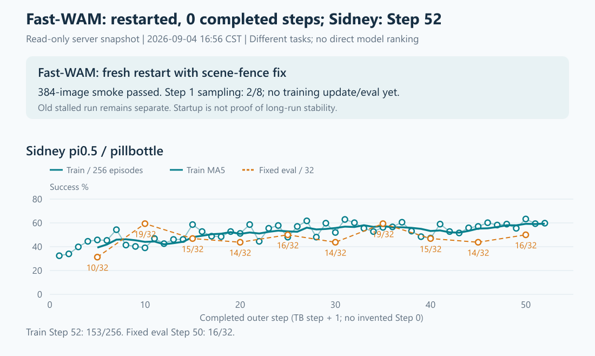

# 修复回顾与训练现场（2026-09-04 16:56 北京时间）

## 1. 这次问题与最终修法

旧 noOIDN / 256 轨迹 run 完成 Step1 后，在 Step2 相机取图等待 GPU 完成时挂住；持有 GIL 的等待让其他线程也无法继续。
源码及实际库反汇编确认：svulkan2 的 timeline render 路径漏接已有的 scene-access fence 协议，存在 GPU 尚未用完共享场景资源、CPU 已可能更新或复用的同步缺口。
关闭 OIDN 可能移除了原来附带的同步，从而暴露缺口；这是具体机制线索，不等于已证明旧挂帧的唯一根因，也没有证据认定 shared Ray 多训练并发是根因。

最终补丁只补齐该路径的 fence reset / submit，使后续场景更新能等待 GPU 真正完成；锁住原 SAPIEN/svulkan2/OIDN，不改训练算法或恢复旧 Python cache/reset 补丁。
补丁只在 Fast 的 RoboTwin Env 初始化中局部加载，未覆盖共享库。中途采用全局预加载的 v2 引起 PyTorch 权重读取失败，三组加载对照确认原权重正常后，已删除全局预加载设计。
最终提交为 [62526cc9](https://github.com/Yutenji-Nyamu/rlinf_fastwam/commit/62526cc95047c8a4a6e948a76be8eeec8a3926de)，此前已推送；本次现场 HEAD 相同、working tree clean。

最终短测：2 场景 × 64 帧 × 3 相机 = 384 图，环境/渲染段 52.16s、进程 exit0；渲染前后原 SFT 权重 archive 读取均通过，实际动态符号绑定也已核对。
这些是前轮已完成的回归，不是本轮重复测试；尚不能宣布旧 Step2 故障或长程稳定性已验证通过，更不声称修复旧 OIDN key 耗尽问题。
[实现、加载方式纠正与测试证据](SCENE_FENCE_RESTART_AND_HEALTH_20260904.md#1-最终改动与测试)。

## 2. 当前训练

只读快照时间 16:56:31—16:56:39：[原始现场](SCENE_FENCE_FOLLOWUP_HEALTH_20260904.txt)。本轮未修改、停止或重启服务器任务。

| 实验 | 最新完整步与进度 | 成功率与保存 | 异常 |
|---|---|---|---|
| Fast-WAM scene-fence-v3 | 完整 0 步；Step1 采样已从 1/8 推进到 2/8（16:52:15 日志），双 Env/Rollout 仍交互/生成 | 尚无训练指标、固定评估或 checkpoint | 所查 fatal/OIDN/OOM/RuntimeError/退出均无 |
| Sidney π0.5 | 完整 Step52；Step53 采样 2/4 | Step52 153/256=59.77%；Step50 固定评估 16/32=50%；Step50 双 rank 分片与完整权重均在 | 同上 |

Fast 16:38:36 从原 SFT fresh100 启动；32env × 8 = 256 轨迹/步，并发不变，其他训练/评估参数继承旧 256/noOIDN 合同。
当前两个 Fast Env PID1569541/1569544 映射原生补丁；Actor/Rollout/driver 与 Sidney 均不映射，各进程均无 LD_PRELOAD。
本轮涉及的三个 worktree 代码锁仍为 Fast 62526cc9、clean RoboTwin f3e30a83、Sidney f50e235c，均 clean；原库及补丁 SHA256 与前轮一致。
Fast 分钟采样 GPU6/7 曾分别有 70%/69% 利用率，不能因单次低利用率判定再次卡死；但也还未完成一次更新或越过旧 Step2 边界。

Sidney 最近 5/10 步训练均值为 59.38%/57.97%，首 10 步均值 41.68%，训练采样呈上升。
固定评估 Step5→50 为 10、19、15、14、16、14、19、15、14、16 /32，仍未稳定超过 Step10/35 的 19/32；不把训练上升等同于固定评估改善。
Step50 两份 local-shard 各 10,150,817,963B，full_weights 8,526,574,644B；仅核实文件，本轮没有恢复测试。

## 3. 整机情况

| 项目 | 16:56 现场 |
|---|---|
| GPU | 8×H100 80GB；0/1/2 其他用户约 9.5/8.4/8.3GiB，3 空闲；4/5 Sidney 66.6/67.3GiB；6/7 Fast 55.5/57.3GiB，均为瞬时值 |
| CPU / 内存 | 128 逻辑 CPU，load1=11.75，vmstat 即时 CPU idle≈92%；RAM 可用 0.98TiB / 总约 1.97TiB；memory PSI avg10/60=0 |
| Swap / I/O | swap 已用约 2.55GiB，但本次 vmstat si/so=0；I/O PSI avg10=0、avg60=0.01，未见当前换页或 I/O 压力 |
| 磁盘 | /data 可用 1.24TiB，/home 1.31TiB，根分区 222.8GiB；inode 使用仅 1–3% |
| 进程 / 服务 | 两训练 driver 与 shared Ray 原进程均在；SSH/mihomo active，failed services=0；未干预其他用户 |
| GPU 健康边界 | 温度 37–49°C；不可纠正 ECC=0，无 pending remap / remap failure。GPU1 有 2 次可纠正 SRAM ECC 计数，不能据此判定新发事件或训练故障 |

Sidney 两个 Env RSS 合计约 0.77TiB，是当前主要 RAM 占用，仍需观察后续增长；当前尚有余量，不能仅凭占用认定泄漏。
普通账号不能查看系统内核日志，本轮未做管理员内核/SMART或外网连通性测试；不把权限下的“无日志”当成系统无 Xid/OOM 的证明。

## 4. 简图

[交互看板](scene-fence-followup-20260904-1656/dashboard.html) · [训练 PNG](scene-fence-followup-20260904-1656/success.png) · [优化 PNG](scene-fence-followup-20260904-1656/optimization.png) · [资源 PNG](scene-fence-followup-20260904-1656/resources.png)。
图由本轮快照生成并视觉核对；TB 横轴 +1 对齐完整训练步，不虚构 Step0，不拼接旧 Fast 的 50/256，不作异任务模型排名。

