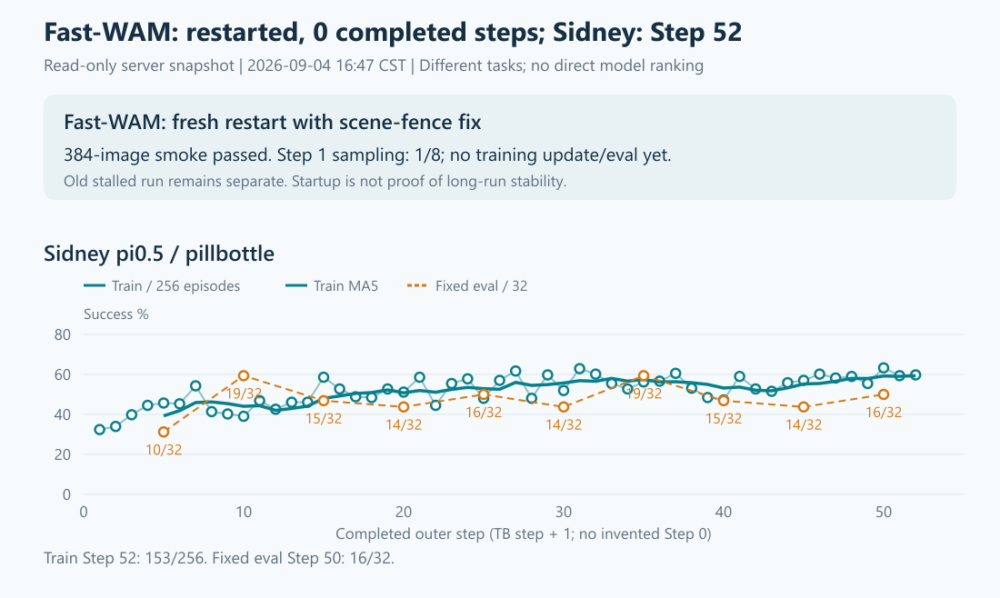

# Fast-WAM修复重启与服务器简报

## 1. 最终改动与测试

Fast分支已推送至[62526cc9](https://github.com/Yutenji-Nyamu/rlinf_fastwam/commit/62526cc95047c8a4a6e948a76be8eeec8a3926de)。
原生改动仅补齐timeline render的scene-access fence：场景准备后reset，渲染提交带上fence，让后续场景更新等待真实的GPU完成状态。
锁住原SAPIEN/svulkan2/OIDN版本与渲染配置；不恢复旧Python cache/reset补丁，不加其他训练修补。

最终接入仅在RoboTwin环境初始化内局部加载（RTLD_LOCAL）；Actor、Rollout、driver与Sidney不加载补丁。
中途v2采用全局预加载，导致PyTorch不能读取权重版本；plain/preload/late-load三组对照确认是加载方式问题，原权重正常。
已删除全局预加载设计，而非绕过权重错误或替换权重。完整过程、命令、结果见[实施账本§2](SCENE_FENCE_FIX_RESTART_LEDGER_20260904.md#2-逐操作记录)。

最终回归通过：2场景×64帧×3相机=384图；环境/渲染段52.16s、进程exit0；渲染前后原SFT archive读取均通过，
动态链接记录确认原渲染虚函数绑定到补丁。[测试结果](scene-fence-fix-20260904/env-local-smoke-result.json)、[真实绑定](scene-fence-fix-20260904/env-local-native-binding.txt)。
这是短程兼容性/渲染回归，尚不是旧Step2挂点已解决或长期稳定性的证明。

## 2. 新训练合同与现场

新run尾缀`clean-nooidn-scene-fence-v3`，16:38:36启动。GPU6/7，32env×8=256轨迹/步，原SFT fresh100。
完整resolved相对旧256/noOIDN v1仅6处名称/输出路径变化，所有训练/评估叶子不变。
GB1024、MB2、update_epoch2、4次optimizer calls/步，fixed32/eval5、DCP/save10，noOIDN均保留。
[完整配置](scene-fence-fix-20260904/v3-train-resolved.yaml)、[精确命令](scene-fence-fix-20260904/v3-train-command.txt)、[预算与停止条件](scene-fence-fix-20260904/v3-train-contract.json)。

16:47:50—16:47:58现场：[完整只读快照](SCENE_FENCE_V3_SAMPLING_HEALTH_20260904.txt)。此前[16:43权重/隔离核验](SCENE_FENCE_V3_FINAL_HEALTH_20260904.txt)也保留。

| 项目 | 现场 |
|---|---|
| Fast-WAM v3 | 两侧Actor/Rollout已加载原始权重，Step1采样进度1/8（rank0日志，首轮315.85s），两侧Env/Rollout仍交互/生成；完整0步，无训练成功率/fixed eval/checkpoint，所查异常均0 |
| 隔离核验 | Env1569541/1569544映射补丁；Actor1569534/1569536、Rollout1569537/1569540、driver1568973、全部Sidney进程均未加载 |
| Sidney | 完整Step52，训练153/256=59.77%；MA5/MA10=59.38/57.97%，首10步平均41.68% |
| Sidney固定评估 | Step5→50：10、19、15、14、16、14、19、15、14、16/32；仍未稳定超过Step10/35的19/32 |
| Sidney checkpoint | Step50双rank local-shard各10,150,817,963B，full_weights=8,526,574,644B；文件级核验，未做恢复加载 |

Fast wrapper/PGID1568962，observer1568964，driver1568973，namespace RLinf_1；旧v1停滞日志/v2失败证据原样保留。
shared Ray GCS321933/raylet322685与Sidney driver3176215原进程保持不变。
本次只确认重启进入采样，尚未完成一次更新，也未越过旧Step2挂点；不报未经测量的ETA，不拼接新旧Fast曲线。

## 3. 整机情况

8×H100 80GB：GPU0其他用户约9.53GiB，GPU1–3空闲；GPU4/5 Sidney约50.4/51.0GiB，GPU6/7 Fast约43.5/43.8GiB。
Fast分钟采样显存峰值约57.26GiB/卡，GPU7在16:46/16:47分钟点为41%/74%，首轮结束后显存回落；不能用单次0%断言停滞。
这些是瞬时显存，不是完整更新峰值；瞬时GPU低利用率本身不等于卡死，需结合采样进度。
128逻辑CPU、load1=10.25；RAM可用约1.04TiB，memory/I/O PSI avg10/60均0；
`/data`余约1.25TiB、`/home`余约1.31TiB，根分区余约223GiB。
SSH/mihomo active，无failed services；NVML所查不可纠正ECC=0、无pending remap或remap failure。
普通账号无系统内核日志可见权限，本轮没有重做管理员内核/SMART审计，不能据此声称系统日志绝无Xid。
Sidney两个EnvWorker RSS合计约0.77TiB，当前有余量，但后续仍需看增长；没有干预它。

## 4. 简图

[交互看板](scene-fence-restart-20260904/dashboard.html) · [成功率PNG](scene-fence-restart-20260904/success.png) · [优化PNG](scene-fence-restart-20260904/optimization.png) · [资源PNG](scene-fence-restart-20260904/resources.png)。
TB横轴按step+1对应日志完整步，允许写盘延迟但不移动点；不虚构Step0，不拼接旧Fast指标，异任务不作模型排名。

