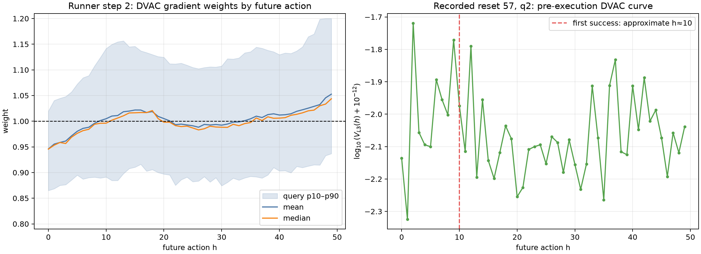
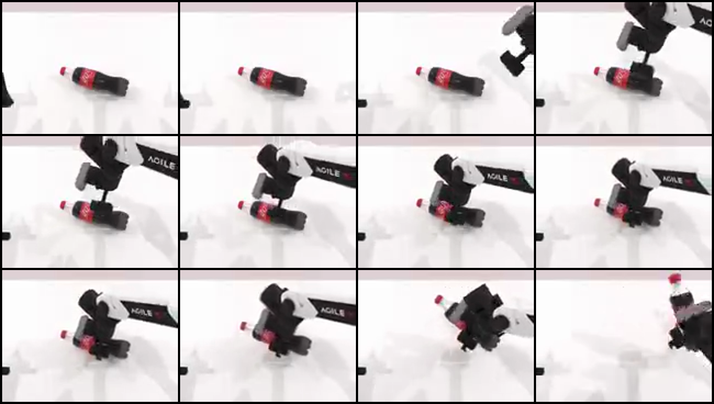

# Idea2：训练实现与 2-step smoke 结果

最后更新：2026-08-20  
结论：**train-SDE DVAC 信号、recent-5 权重、per-`h`梯度缩放和抽样 control trace 已完成真实两卡端到端
验证；后续获批100-step正式训练已启动，现场进度与分析转到[07](07_FORMAL_TRAINING_LIVE_ANALYSIS_STEP24_20260821.md)。**

逐指令、错误与修复见
[TRAINING_IMPLEMENTATION_AND_SMOKE_LEDGER.md](evidence/TRAINING_IMPLEMENTATION_AND_SMOKE_LEDGER.md)，
轻量原始证据见[evidence/training_smoke_2step_20260820](evidence/training_smoke_2step_20260820/README.md)。

## 1. 实现结果

训练主体保持历史成功 π0-GRPO 的 chunk reward、GRPO advantage、joint ratio、joint PPO clipping、
`H=C=50`、active `D=14`、`M=4`、`flow_sde`和global grad clip。新增内容只有：

1. rollout复用已有4次velocity forward，计算`V_L2/L3/L4[h]`，不增加模型forward；
2. runner step 1用`w=1`照常训练并建立全部trajectory action-query×`h`统计；
3. step 2起按最近5个已完成step计算
   `z=(log(V_L3+1e-12)-mu)/max(sigma,1e-6)`，再用`w=1+0.1 clip(z,-2,2)`；
4. actor在原`[B,H,D]`log-prob求和前用straight-through方式只缩放反向贡献，前向joint ratio/clip不变；
5. RoboTwin control loop旁路抽样head frame、success和双臂TOPP进度，不拆C50、不重跑planner/TOPP/policy。

代码已commit并推送：

- RLinf：`052a2ee8902c51595caa997736f1ec76699ad8df`，
  `personal/codex/idea2-dvac-train-weighting`；
- RoboTwin/wamppo：`43696bbab85fef3dd98074c5ba0ccb90786d0e94`，
  `origin/codex/idea2-dvac-control-trace`。

## 2. 服务器前测

- RLinf telemetry + train：`8 passed, 3 warnings`；
- control trace：`4 passed`；
- 新/旧Hydra配置均完整resolve；新resolved config SHA256为
  `5633cc32b787528b8b6a12ec5d4eee27be732f7312df1f0135b114187f2c324e`；
- default-off旧配置不请求endpoint；
- 覆盖`z→V`、recent窗口、权重边界、straight-through前向恒等/反向倍率、trajectory重排、
  `T/T+1 done`对齐、control progress/bin和ffmpeg编码。

前测中发现并窄修复：环境offload后录像重名、ffmpeg二次timeout可能外溢、`T+1 done`与`T`个query
错位、错误超参可能产生负权重，以及recent统计不应被loss mask筛掉。没有安装新依赖或改公共worktree。

## 3. 真实 smoke 合同

| 项目 | 取值 |
|---|---|
| 设备/并发 | 2×A800；16 train env |
| 串行rollout | 每step 8 epochs |
| GRPO | G8、global batch512、micro32、update epoch2 |
| 动作/flow | H=C50、D14、M4、flow_sde |
| 预算 | 2 runner steps；256 trajectories；1,024个actor/loss action queries；4 optimizer steps |
| 权重 | step1 warmup `w=1`；step2 apply `[0.8,1.2]` |
| control trace | worker0/slot0/一条episode；最多200帧 |

运行于`2026-08-20 23:09:32+08:00`启动，`23:38:00`自然结束，wall time 28分28秒；driver、
wrapper与纯观察observer均为rc=0。`global_step_2` checkpoint存在，run目录约9.7 GiB。

## 4. warmup和apply是否真的发生

| 指标 | runner step 1（内部索引0） | runner step 2（内部索引1） |
|---|---:|---:|
| trajectory action queries | 512 | 512 |
| pooled `log V_L3` count | 25,600 | 25,600 |
| 当前 mean / std | -4.4432 / 0.6690 | -4.4114 / 0.6397 |
| history steps / count | 0 / 0 | 1 / 25,600 |
| weight范围 | 1.0 / 1.0 | 0.8 / 1.2 |
| warmup | 是 | 否 |
| pre-clip grad norm | 46.7490 | 40.9796 |
| PPO clip fraction | 0.1936 | 0.1040 |
| approximate KL | 0.0879 | 0.0406 |

第二步完整512-query数组中，48.33%的`h`权重大于1，51.67%小于1；总体均值1.0028。前25个`h`
平均0.9953，后25个`h`平均1.0103，说明此前推理数据里看到的future-`h`效应确实进入了首版在线权重，
但幅度仍小。rank-local、loss-mask有效query上的p05/p95约为0.87/1.18。

这些数字只证明“信号→权重→梯度挂点”工作，不证明两步就提高了成功率。step 2当步on-policy
`success_once=0.7734375`也不是fixed-ID评估结果。

## 5. 资源结果

observer每2秒只读采样773次，没有阈值、告警动作、timeout、signal或退出码联动。

| 资源 | 峰值/最低可用 |
|---|---:|
| GPU0 memory | 29,774 MiB（29.08 GiB） |
| GPU1 memory | 29,490 MiB（28.80 GiB） |
| cgroup current | 82.03 GiB峰值 |
| cgroup anon / file | 68.59 / 12.43 GiB峰值 |
| host MemAvailable | 最低约909.65 GiB |
| cgroup high/max/OOM/OOM-kill events | 全程0→0 |

这说明当前半串行预算的16-env smoke很宽松；不能据此把正式训练并发直接翻到32/64。历史完整
16 env×16 rollout epoch的100-step run曾接近240 GiB cgroup上限，正式训练为了可比性仍应保持16并发。

## 6. 细录像和success对齐

新recorder不是调用official direct-evaluator recorder，而是自写的轻量旁路，复用RoboTwin camera和ffmpeg。
它在原control loop里按双臂较慢一侧的TOPP progress近似映射`h`，每个新bin取一帧：

- 实际只生成一支录像；环境offload/recreate后没有重复或覆盖；
- 111帧、H.264/yuv420p、160×120、10 FPS、11.1秒、15,011 bytes；
- reset 57在q2中首次成功：`action_slot_start=100`，近似`h≈10`，对应`physics_idx=1101`；
- 同一个q2在执行前的`V_L3(h=10)=0.01062`。

`h≈10`是TOPP后双臂同步进度映射，不是“精确执行原始第10行waypoint”；单条轨迹也不能说明成功总在
高V或低V处。它已经比旧RLinf的6帧query级MP4细很多，并能定位query内部首次success。

当前配置每次不间断driver启动只录一条episode。完整100-step预计仍是一支约几十KB的录像；训练DVAC
NPZ按本次932 KB / 1,024 queries粗略线性外推，102,400 queries约91 MB。真正占空间的是checkpoint：
本次`global_step_2`使run目录约9.7 GiB，历史save-every-10的100-step训练才是百GiB量级。

## 7. 正式训练前的选择

历史完整预算平均约1,450秒/runner step：

- 30 steps约12.1小时，满足“先跑12小时以上”的pilot目的；
- 50 steps约20.1小时；
- 100 steps约40.3小时，与历史100-step曲线最直接对齐。

首个修改版建议二选一：一次不间断30-step pilot，或直接100-step。正式配置恢复历史
`16 env×16 rollout epoch`，其余基线参数和本次DVAC公式保持不变。当前recent-5统计没有装入DCP，
所以30-step后另起进程续到100会重新warmup一步，不是方法状态的无缝续训；若要30→100无缝续训，
应先加recent-stats checkpoint恢复。

用户随后选择直接100 steps。正式修改版已于2026-08-21 00:14左右启动：恢复历史
`16 env×16 rollout epoch`，保持G8/B512/mb32、优化器/FSDP/H/C/M/save10等主体参数，只增加DVAC、
独立输出与一条抽样control trace。权威run为
`/root/autodl-tmp/idea2_dvac_train_runs/idea2_dvac_apply_formal_100step_2gpu16env_20260821`；按用户要求只确认
worker和模型加载正常后退出持续观察。
