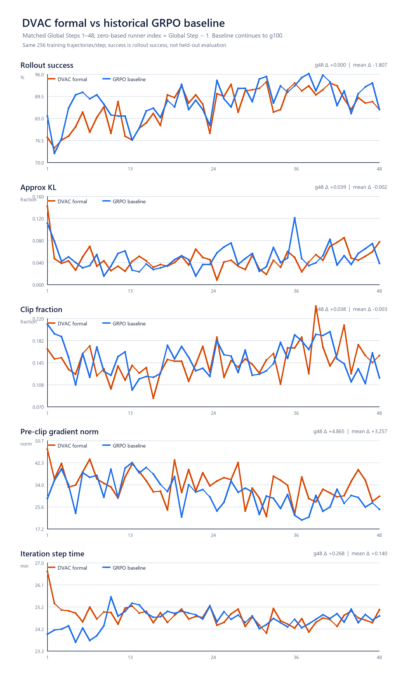

# Formal训练Step48现场刷新与方法讨论

最后更新：2026-08-21 20:21（Asia/Shanghai）  
操作边界：服务器只读检查与小文件下载；未改变训练进程、代码、配置或服务器产物。

## 1. 当前结论

- 20:21训练进程仍在，最新完整表为`Global Step 48/100`，没有driver exit/finished marker。
- 当前方法截至g48仍没有形成相对历史GRPO的稳定领先：g1–48训练rollout success均值`86.19% vs 88.00%`，差`-1.81pp`；g48两者恰好都是`85.55%`。
- 最近差距已比最初小：g39–48为`89.14% vs 90.39%`，差`-1.25pp`。这仍是on-policy训练rollout，不是held-out评估。
- PPO运动幅度仍在同一量级；当前g1–48平均KL稍低、clip fraction稍低，pre-clip grad norm稍高。没有数值发散迹象。
- Step48权重继续正常工作，且保留了此前观察到的结构：高侧命中明显多于低侧、负advantage平均权重更高、chunk后半平均权重更高。
- 资源轨迹与历史成功GRPO相近；截至现场没有cgroup OOM或CUDA OOM。

## 2. 同step训练曲线

关键窗口：

| Global step窗口 | DVAC rollout success | 历史GRPO | 差值 |
|---|---:|---:|---:|
| 1–10 | 79.80% | 84.92% | -5.12pp |
| 11–20 | 84.06% | 84.57% | -0.51pp |
| 21–30 | 88.28% | 88.09% | +0.20pp |
| 31–40 | 90.55% | 93.09% | -2.54pp |
| 41–48 | 88.77% | 89.65% | -0.88pp |
| 1–48 | 86.19% | 88.00% | -1.81pp |

两条线持续交叉；早期g1尚未启用非均匀权重就已经落后，因此这条单run曲线目前最合适的判断仍是“效果不明显”。

## 3. 优化指标

| 指标，g1–48均值 | DVAC | 历史GRPO | 差值 |
|---|---:|---:|---:|
| approx KL | 0.04583 | 0.04773 | -0.00190 |
| PPO clip fraction | 0.14685 | 0.14979 | -0.00294 |
| pre-clip grad norm | 34.014 | 30.757 | +3.257 |
| 单step耗时 | 1485.18s | 1476.79s | +8.39s |

g48单点为：KL`0.077`、clip fraction`0.157`、pre-clip grad norm`29.441`、step time`1501.6s`。最近5步均值为KL`0.0558`、clip`0.152`、grad norm`33.49`。

由于两条训练的pre-clip norm都远大于`clip_grad=1`，公共梯度尺度最终会被统一压回1；DVAC主要保留的是各`h`相对贡献造成的方向变化。当前没有记录真实`cos(G_weighted,G_off)`，因此不能仅从norm判断方向实际改变了多少。

## 4. Step48方法信号

日志口径：

- current `log V_L3 mean/std = -4.009 / 0.530`；
- recent-5 history `mean/std = -4.035 / 0.521`；
- rank-local mean weight约`1.027`。

两rank `rollout_step0047.npz`合并后的loss-mask有效数据：

| 项 | Step48 |
|---|---:|
| valid query | 293 |
| weight p05 / median / p95 | 0.887 / 1.016 / 1.200 |
| weight=0.8 | 0.11% |
| weight=1.2 | 8.13% |
| negative-adv mean weight | 1.049 |
| positive-adv mean weight | 1.012 |
| negative - positive | +0.0365 |
| 后25个h - 前25个h | +0.0371 |
| h0 / h49 mean weight | 0.975 / 1.091 |
| V_L3后半/前半均值比 | 1.288 |

因此当前映射依然主要在给高V位置增权，而明显压低到0.8的位置很少；future-h位置趋势依然是权重结构的重要来源。

## 5. 资源

20:03的完整资源CSV覆盖19.895小时：

- cgroup：起点`12.79 GiB`，末值`197.52 GiB`，峰值`207.35 GiB`；
- GPU0/1显存峰值：`30.37 / 30.22 GiB`；
- `memory max/oom/oom_kill`全部为0；
- 数据盘可用约`775 GiB`，当前run约`39 GiB`。

20:21即时值为cgroup约`199.8 GiB`，GPU0/1约`26.3 / 27.7 GiB`，OOM计数仍为0。

与历史GRPO相同约19.9小时比较，从各自run起点到末值的cgroup增长为`184.72 vs 189.28 GiB`；到峰值的增长为`194.56 vs 194.15 GiB`，非常接近。当前没有看到DVAC telemetry造成明显额外主机内存增长；GPU峰值约多1 GiB。

## 6. 证据

- [Step48训练指标总览](evidence/formal_live_step48_20260821/analysis/TRAIN_METRICS.png)
- [Step48与历史GRPO同轴图](evidence/formal_live_step48_20260821/analysis/BASELINE_COMPARISON.png)
- [训练指标JSON](evidence/formal_live_step48_20260821/analysis/TRAIN_METRICS_SUMMARY.json)
- [Step48方法统计JSON](evidence/formal_live_step48_20260821/analysis/METHOD_STEP48_SUMMARY.json)
- [逐step CSV](evidence/formal_live_step48_20260821/analysis/TRAIN_METRICS.csv)
- [Step48两rank原始方法shard目录](evidence/formal_live_step48_20260821/run/dvac_train/)
- [20:03只读现场审计](evidence/formal_live_step47_20260821/LIVE_READONLY_AUDIT.txt)
- [20小时资源CSV](evidence/formal_live_step47_20260821/runtime/resources.csv)

方法细节、recent-5来源、位置残差、PAR/SSVPO/BPGO/HTMR与straight-through依据统一见[动作权重与近期credit专题](10_ACTION_WEIGHT_POSITION_RESIDUAL_AND_RECENT_CREDIT_LITERATURE_20260821.md)。
