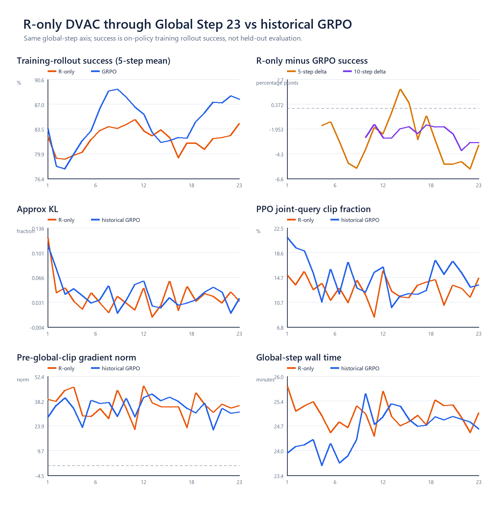
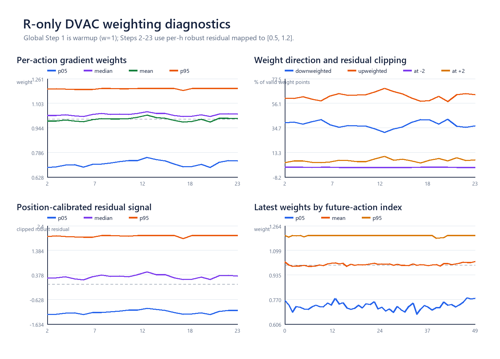
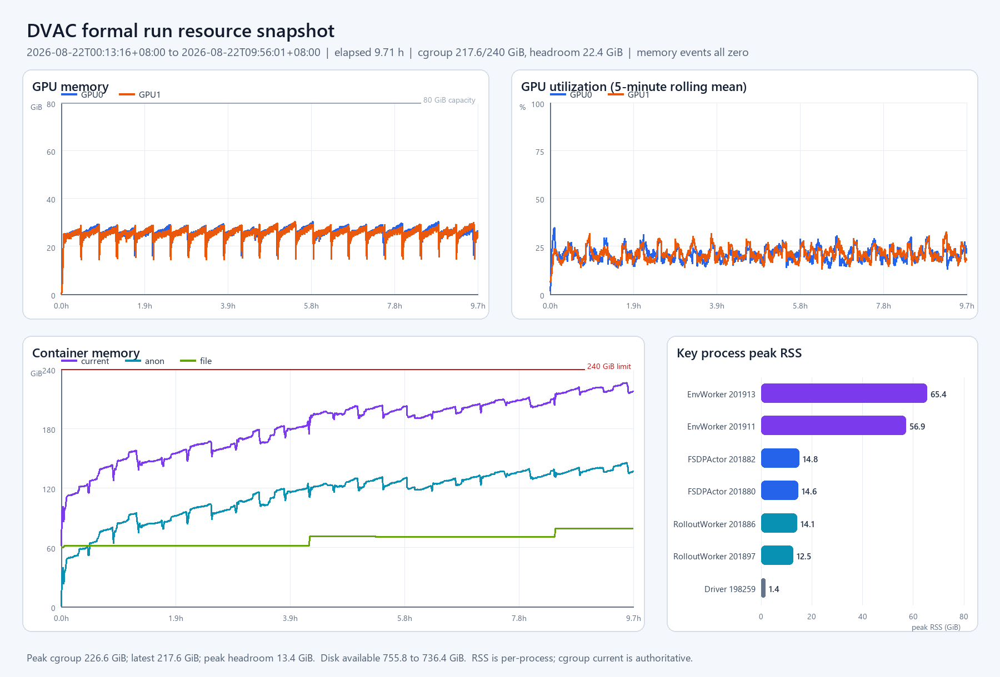

# R-only DVAC 100-step formal：Global Step 23 现场分析

最后更新：2026-08-22 10:04（Asia/Shanghai）  
运行：`idea2_dvac_r_only_downweight_formal_100step_2gpu16env_20260822`

## 1. 当前结论

截至服务器现场刷新，最新完整训练步是 **Global Step 23/100**；wrapper、driver、observer仍在，
`global_step_10`和`global_step_20`两个完整checkpoint已保存。g23累计完成5,888条训练trajectory，日志中的
累计elapsed为`09:35:29`，按当时速度剩余ETA约`32:06:37`。

当前最简洁的判断是：

- **训练健康**：没有CUDA OOM、worker fatal或cgroup memory事件；KL、ratio、loss和grad均finite。
- **目前没有效果领先证据**：g1–23训练rollout success均值为`82.52%`，历史成功GRPO同step轴为
  `84.97%`，差`-2.45pp`。g23单步为`86.72% vs 85.55%`，但最近5/10步仍低于历史线。
- **R-only方法按设计生效**：g2–23的实际权重p05/median/p95约为`0.715/1.031/1.198`；约`37.56%`
  action-h被降权、`62.44%`被增权，整体均值`0.9995`。
- **固定future-h趋势已大幅去除**：g23原始`log V`后25格比前25格高`0.191`，位置基线本身解释
  `0.141`；进入训练的residual只剩`0.023`，最终平均权重只差`+0.0034`。
- **GPU空间宽松，RAM较高但当前稳定**：两卡峰值显存约`30.37/30.22 GiB`；cgroup峰值
  `226.62/240 GiB`、快照末`217.56 GiB`，所有`high/max/oom/oom_kill`均为0。

这里的success是每一步新采样的**on-policy训练rollout成功率**，不是独立held-out评估；两条训练线的早期
差距不能直接等价为最终策略效果差距。

## 2. 主要训练指标

| 指标 | R-only g1–23 | 历史成功GRPO g1–23 | 怎样理解 |
|---|---:|---:|---|
| rollout success均值 | 82.52% | 84.97% | 当前差`-2.45pp`，但不是held-out eval |
| g23 success | 86.72% | 85.55% | 单步差`+1.17pp`，单点波动较大 |
| 最近5步success | 84.30% | 87.73% | R-only仍低`3.44pp` |
| 最近10步success | 82.89% | 86.13% | R-only仍低`3.24pp` |
| mean approx KL | 0.0387 | 0.0423 | 新旧policy变化幅度相近，R-only略低 |
| mean joint-query clip fraction | 12.81% | 14.67% | 被PPO ratio clip的有效query比例；不是action比例 |
| mean pre-global-clip grad norm | 35.52 | 34.43 | 两者都远高于`clip_grad=1`；最终全局范数都会被裁到1 |
| mean global-step wall time | 25.02 min | 24.60 min | 当前约慢0.42 min/step，约1.7% |

R-only的权重是在每个future action的log-prob反向贡献处生效；PPO仍先以整条query的joint ratio决定是否进入
clip分支，随后全模型梯度仍经过`clip_grad=1`。因此它主要改变50个action-h对最终梯度的**相对组成与方向**，
不是把最终优化步长直接放大到`1.2×`或缩小到`0.5×`。

## 3. 我们的方法信号现在长什么样

Global Step 1是warmup，所有`w=1`；Global Step 2–23使用recent-5、per-h median/MAD位置基线：

| 方法量 | g2–23汇总 | g23精确NPZ |
|---|---:|---:|
| mean weight | 0.9995 | 1.0054 |
| p05 / median / p95 | 0.715 / 1.031 / 1.198 | 0.724 / 1.033 / 1.200 |
| 降权 / 增权比例 | 37.56% / 62.44% | 36.37% / 63.63% |
| 命中0.5下界 | 0.30% | 0.17% |
| 命中1.2上界 | 6.28% | 6.94% |
| 正adv query平均权重 | 0.989 | 0.992 |
| 负adv query平均权重 | 1.018 | 1.026 |

虽然增权位置数量更多，降权侧幅度更大，所以总体权重仍接近1。正负adv的权重差是当前数据相关性，公式没有
按adv正负显式分支；GRPO advantage继续决定强化或抑制方向。

g23的两个rank使用完全相同的50格center与scale。最新NPZ合计1,024个query，其中346个通过loss mask，
形成17,300个实际参与loss的`query × h`权重点。

## 4. 资源状态

资源快照覆盖`00:13:16–09:56:01`，随后于`09:59:55`再次现场读取`memory.max`和memory events：

| 资源 | 当前事实 |
|---|---|
| GPU0 / GPU1峰值显存 | 30.368 / 30.218 GiB；80 GiB容量很宽松 |
| GPU利用率 | 瞬时峰值均100%；全时段平均约20.83% / 21.06%，对应rollout、环境和更新交替 |
| cgroup RAM | 峰226.62 GiB；快照末217.56 GiB；live约217.39 GiB；上限240 GiB |
| 最近30分钟RAM | 首尾仅`+0.185 GiB`，期间随训练阶段周期波动 |
| memory events | `low/high/max/oom/oom_kill`全部0；swap=0 |
| 主要RSS来源 | 两个EnvWorker合计峰121.73 GiB、末113.49 GiB |
| 磁盘 | `/root/autodl-tmp`约737 GiB可用；本轮减少约19.4 GiB，对应g10/g20两个DCP |

绝对cgroup值比同运行时长的v1高约50.3 GiB，但file cache高约54.1 GiB，且本轮启动时已有约59.9 GiB
file cache；anon和EnvWorker RSS反而略低。扣除各自启动基线后，两轮total增长只差约1.62 GiB，目前没有
看到R-only统计本身造成额外worker内存膨胀。RSS可能重复计算共享页，容器总量以cgroup为准。

## 5. 服务器产物清单与用途

当前run目录约20 GiB，主要由两个checkpoint组成；DVAC与日志本身很小。

| 产物 | 当前规模 | 包含什么 / 用来做什么 |
|---|---:|---|
| `metrics.log` | 133,791 B快照 | 每个完整Global Step的success、reward/adv、KL、clip、ratio、loss、grad、耗时和DVAC摘要 |
| TensorBoard events | 约62 KB | 同训练标量的交互查看入口；本次离线图以`metrics.log`为准 |
| `checkpoints/global_step_10,20` | 各约9.7 GiB | 模型/优化器等分布式checkpoint；用于恢复或后续评估，未下载到轻量本地包 |
| `dvac_train/actor_rank*/rollout_step*.npz` | 46份，合计约24 MiB | 每步、每rank的`V_L2/L3/L4`、residual、weight、adv、loss mask、denoise/query/reset元数据 |
| `runner_step_metrics.csv` | 每rank 23行 | 每步权重分位数、上下界命中、正负adv权重、history与训练摘要 |
| `rolling_stats_state.json` | 每rank约4.85 KB | recent-5的50格median/MAD/scale；当前包含runner18–22的5,120 query |
| `run_manifest.json` | 每rank约1.1 KB | schema、source commit、R-only配置和运行来源 |
| `control_trace/...` | 约40 KB | 一条抽样reset57：115帧、160×120、10 FPS，含MP4/frames/metadata；不是整批录像 |
| runtime配置与日志 | 约35 MiB | resolved config、精确launch命令、driver日志、每2秒资源CSV和进程RSS |

本地轻量现场快照为：

- `evidence/r_only_formal_live_g23_20260822/raw/current_snapshot_g23_20260822.tar.gz`：2,721,062 B；
- 解压后约34.65 MiB，主要是28.66 MiB的逐进程RSS表；
- 未下载checkpoint正文，也未复制全量Ray/TensorBoard缓存。

## 6. 本次分析产物

- `analysis/TRAINING_VS_GRPO_G23.png/.csv`：训练success、KL、clip、grad、step time同轴对照；
- `analysis/DVAC_R_ONLY_DIAGNOSTICS_G23.png`：权重、residual、边界命中和latest per-h结构；
- `analysis/RESOURCE_OVERVIEW_G23.png`：GPU、cgroup RAM与关键进程RSS；
- `analysis/ANALYSIS_SUMMARY_G23.json`、`RESOURCE_SUMMARY.json`：图中精确数值；
- `analysis/TRAIN_METRICS_G23.csv`、`DVAC_STEP_METRICS_G23.csv`、`LATEST_HORIZON_G23.csv`：可继续画图的表；
- `analysis/analyze_r_only_g23.py`、`analyze_resources_g23.py`：可复现脚本。

目前最值得继续看的不是某个单步success，而是：训练完成更多step后R-only与历史线的recent-10差是否收敛、
RAM周期峰是否继续接近240 GiB，以及最终checkpoint做同一fixed-ID held-out评估后的真实策略差异。
