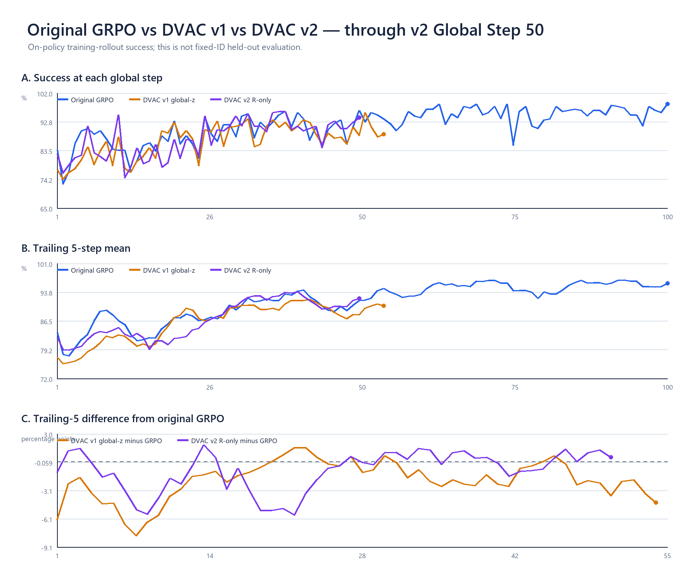
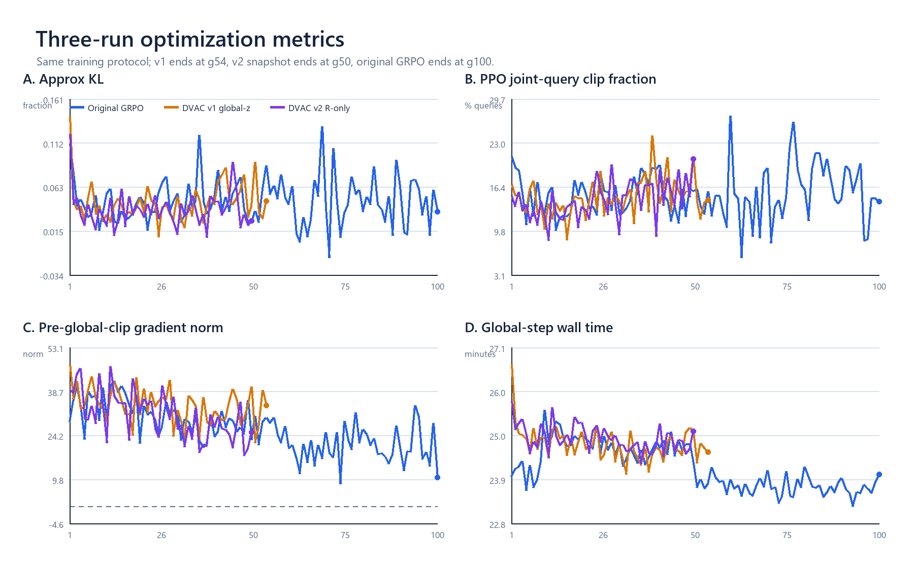
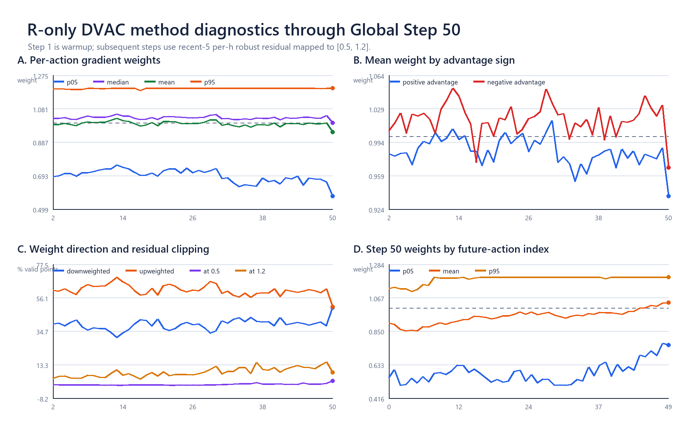
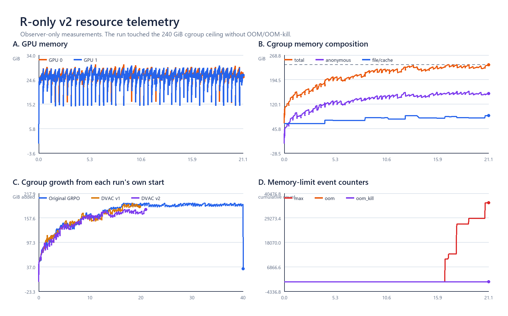

# R-only formal g50：三次训练同轴对照与资源分析

快照时间：2026-08-22 21:12:19 CST（资源CSV延伸至21:21:20）  
当前run：`idea2_dvac_r_only_downweight_formal_100step_2gpu16env_20260822`

## 1. 当前现场

- R-only v2已完整完成Global Step 50/100；wrapper、driver、observer仍存活，后续rollout继续。
- g50单步训练rollout success为`94.14%`；这是on-policy训练数据，不是fixed-ID held-out评估。
- run约`49 GiB`、runtime约`110 MiB`；本地快照含g50 metrics、两rank逐step CSV、两份
  `rollout_step0049.npz`和资源CSV，不含checkpoint正文。
- 最后一次精确目录枚举已确认g10/g20/g30/g40 checkpoint；g50完成后run由39 GiB增至49 GiB，
  但本轮没有把这个体积变化单独当作g50 checkpoint目录的精确枚举证据。

## 2. 三次训练的success对照

三条线使用同一个Global Step横轴：历史原始GRPO、v1 global-z DVAC、v2 R-only DVAC。

| 训练 | g1–50均值 | 最近5步均值 | 最近10步均值 | g50单步 |
|---|---:|---:|---:|---:|
| 原始GRPO | 88.23% | 91.72% | 90.47% | 96.48% |
| DVAC v1 global-z | 86.33% | 88.05% | 88.95% | 88.28% |
| DVAC v2 R-only | 87.26% | 92.19% | 90.90% | 94.14% |

相对原始GRPO：

- v1前50步均值`-1.90pp`，最近5步`-3.67pp`，最近10步`-1.52pp`；
- v2前50步均值`-0.97pp`，最近5步`+0.47pp`，最近10步`+0.43pp`。

因此到g50，v2近期已经追平并略高于历史GRPO，但全程累计均值仍略低；曲线仍频繁交叉，尚不能从
training rollout success alone判断held-out效果。

图的三部分：A是每一步原始success；B是向后包含当前步的5步平均，用来压低单步随机波动；C直接画
`DVAC - 原始GRPO`的5步均值差，高于零表示同一步附近DVAC更高。

## 3. 优化指标

| g1–50均值 | 原始GRPO | DVAC v1 | DVAC v2 |
|---|---:|---:|---:|
| Approx KL | 0.0468 | 0.0454 | 0.0381 |
| PPO joint-query clip fraction | 15.02% | 14.84% | 14.35% |
| pre-global-clip gradient norm | 30.70 | 34.13 | 30.74 |
| 每个global step耗时 | 24.61 min | 24.77 min | 24.89 min |

- A（KL）：一次更新后新旧policy差了多少；v2没有变得更激进，均值反而略低。
- B（PPO clip fraction）：多少query的joint ratio落入PPO裁剪分支；v2与原GRPO同量级。
- C（梯度范数）：global grad clip之前的整体梯度大小；v2均值几乎等于原GRPO。
- D（耗时）：v2较原GRPO平均多约`0.28 min/step`，约17秒或1.1%。

这些量共同说明：R-only确实改变了action间的相对反向贡献，但没有把训练推到一个明显不同的整体
步长或PPO裁剪状态。

## 4. R-only方法本身怎样工作

g2–50的有效action权重总体为：

- 平均p05 / median / p95：`0.692 / 1.029 / 1.199`；总均值`0.995`；
- `38.97%`位置被降权、`61.03%`位置被增权；
- 命中下界0.5约`0.60%`，命中上界1.2约`8.41%`；
- 正advantage query平均权重`0.984`，负advantage query平均权重`1.018`，当前数据中仍略偏向加强
  失败trajectory的负向更新。

g50单步更偏降权：p05 / median / p95=`0.563 / 1.001 / 1.200`，均值`0.945`；有效query为207。
每query的weight ESS为`0.972`，等效约`48.6/50`个action参与；相对uniform系数向量的平均夹角约
`9.1°`，按advantage汇总后的夹角约`11.5°`。这说明方法已经真实改变更新方向，但仍远弱于只保留20%
位置的hard 80/20（其weight ESS约0.2）。

图A看每步权重分布；B看正负advantage位置得到的平均权重；C看增权/降权比例及上下界命中；D看g50
的50个future-action位置。g50后部权重仍整体更高，说明“按h校准历史中心”去除了固定位置基线后，
当前batch相对近期历史仍存在后部更高的residual形状。

## 5. 资源

- GPU：峰值`30.37/30.22 GiB`；21:12现场约`25.3/24.9 GiB`，两张80 GiB A800显存充足。
- cgroup RAM：峰值`239.9999/240 GiB`；21:21约`239.11 GiB`。anonymous峰值`159.60 GiB`，
  file/cache峰值`84.90 GiB`。
- `memory.events max`首次非零为16:51:53，最新累计`36140`；它表示分配撞到cgroup上限后发生了回收/
  重试，不是36140次OOM。`oom=0`、`oom_kill=0`，训练仍继续。
- 以各run自己的启动值为零，在20小时处cgroup增量约为：原GRPO`192.2 GiB`、v1`184.7 GiB`、
  v2`170.1 GiB`。v2增量并没有更大；它启动时已有约`61.5 GiB` cgroup占用，因此绝对值先触顶。
- 主机可用RAM最低仍约`818 GiB`，数据盘最低可用约`705 GiB`；当前限制来自该容器240 GiB配额，
  不是整机RAM或磁盘耗尽。

## 6. 本地证据

- [汇总JSON](evidence/r_only_formal_live_g50_20260822/analysis/SUMMARY_G50.json)
- [三次训练逐step CSV](evidence/r_only_formal_live_g50_20260822/analysis/THREE_RUN_METRICS_G50.csv)
- [v2逐step方法CSV](evidence/r_only_formal_live_g50_20260822/analysis/V2_DVAC_STEP_METRICS_G50.csv)
- [g50逐h CSV](evidence/r_only_formal_live_g50_20260822/analysis/V2_LATEST_HORIZON_G50.csv)
- [本轮逐操作账](evidence/r_only_formal_live_g50_20260822/OPERATION_LEDGER.md)

当前最简结论：训练和方法分支都在正常工作，v2近期training-rollout曲线优于v1并追平原GRPO；尚未出现
全程稳定领先。GPU不是瓶颈，容器RAM已经成为当前运行的主要约束。
