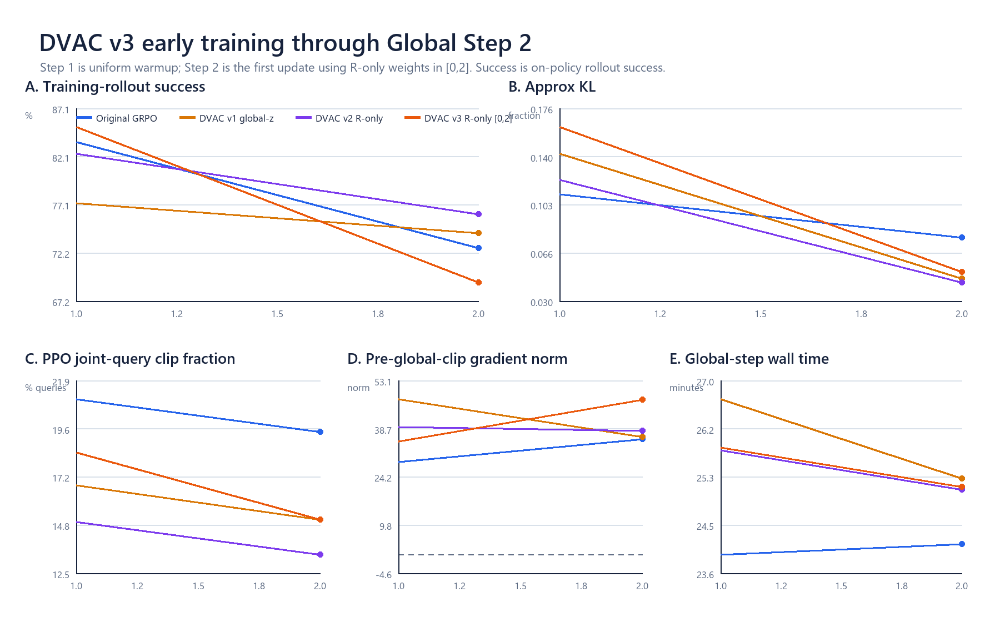
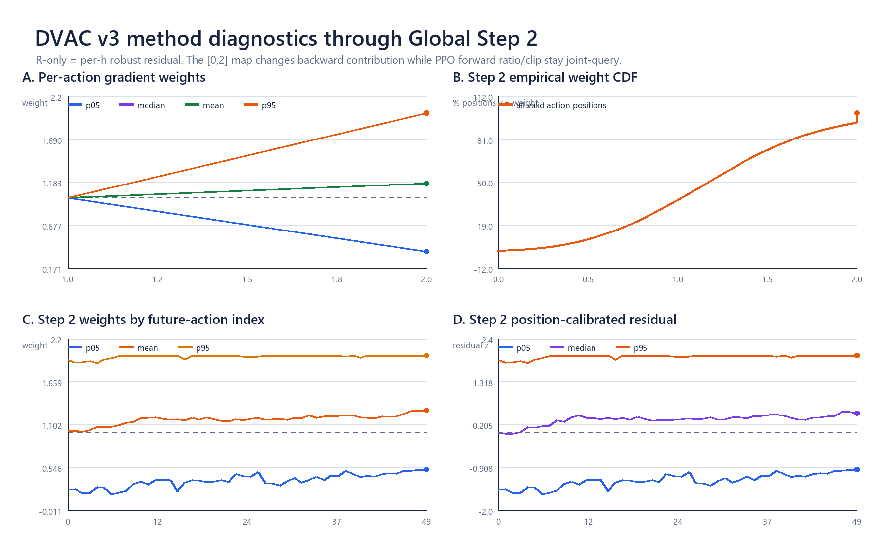
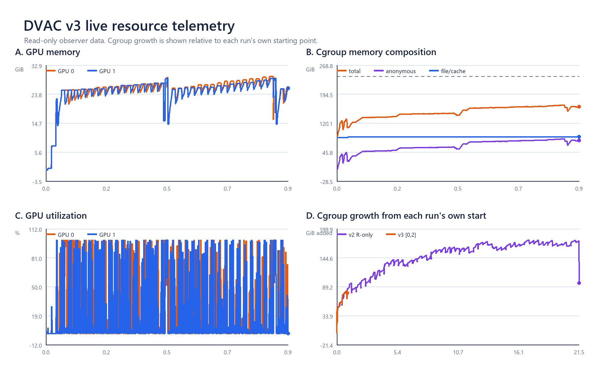

# R-only v3 `[0,2]` formal：Global Step 2 早期现场分析

日期：2026-08-22

## 1. 结论

本报告的完整产物清点锁定在 `2026-08-22T23:38:08+08:00`；最终 `23:42:55` 刷新时，v3 formal
最新完整训练步为 **Global Step 2/100**，Step 3 rollout 已到 `7/16`。wrapper/driver/observer 与两组
actor、rollout、env worker均存活；
driver 中没有 fatal、Ray actor death、CUDA OOM 或 NCCL error，cgroup `oom=oom_kill=0`。

当前可判定：

- **训练链正常**：Step 2 完整完成、双 rank 指标和 NPZ 同步落盘，并成功进入 Step 3。
- **新权重确实生效且比 v2 明显更强**：Step 2 的实际 p05/median/p95 为
  `0.365/1.171/2.000`，per-query weight ESS 从 v2 Step 2 的 `0.985` 降到 `0.896`；
  等效 future-action 数从 `49.2/50` 降到 `44.8/50`，系数角从 `6.7°` 增到 `18.1°`。
- **优化标量仍是有限值且在历史量级内**：Step 2 KL=`0.052`、query clip=`15.1%`、
  pre-global-clip grad norm=`47.279`、ratio=`0.9996`、step time=`25.15 min`。
- **资源当前正常**：双卡峰值 `29.38/28.80 GiB`；cgroup 峰值 `166.77/240 GiB`，
  没有新增 `max`、OOM 或 OOM-kill 事件；磁盘仍有约 `708 GiB`。

唯一需要继续观察的是 Step 2 training-rollout success=`69.14%`，低于三条历史实验的 Step 2。
但这个 rollout 发生在 **Step 1 的 uniform warmup 更新之后、Step 2 的 `[0,2]` 更新之前**，因此它不能由
新权重直接解释。Step 2 的数据用于刚刚完成的第一轮 `[0,2]` actor update；最早能看到行为层影响的是正在
运行的 Step 3 rollout。

## 2. 训练时序与主指标

每个 Global Step 的顺序是：

```text
rollout -> reward/GRPO advantage -> actor update -> 同步新policy -> 下一Global Step rollout
```

所以：

- Step 1 rollout：fresh SFT；Step 1 update：warmup，所有 `w=1`。
- Step 2 rollout：只受 Step 1 uniform update 影响；Step 2 update：第一次使用 `[0,2]`。
- Step 3 rollout：第一次能观察 `[0,2]` 更新后的行为。

| 指标 | v3 Step 1 | v3 Step 2 | 当前解释 |
|---|---:|---:|---|
| rollout success | 85.16% (218/256) | 69.14% (177/256) | on-policy 训练采样，不是 held-out eval；Step 2 尚未受新权重更新影响 |
| approx KL | 0.162 | 0.052 | Step 1 偏高，Step 2 已回到历史常见区间 |
| PPO joint-query clip | 18.4% | 15.1% | 有效 query 粒度；与历史 GRPO/v1/v2 同量级 |
| pre-global-clip grad norm | 34.84 | 47.28 | Step 2 较高，但与 v1 Step 1=`47.49`、v2历史峰值=`46.90`接近；之后统一 clip 到 1 |
| policy ratio | 0.986 | 1.000 | 有限，接近 1 |
| step wall time | 25.84 min | 25.15 min | 与 v2 Step 2=`25.10 min`几乎相同 |

Step 2 同位置历史 success 为：原 GRPO `72.66%`、v1 `74.22%`、v2 `76.17%`、v3 `69.14%`。
两个点不足以形成训练效果结论；这里主要用于确认数据流、优化标量和方法分支正常。



## 3. `[0,2]` 实际改变了多少

Step 2 有 `671` 个 loss-valid query，即 `33,550` 个 future-action 权重点。实际分布为：

| 量 | v2 Step 2 `[0.5,1.2]` | v3 Step 2 `[0,2]` |
|---|---:|---:|
| p05 / median / p95 | 0.689 / 1.026 / 1.194 | **0.365 / 1.171 / 2.000** |
| mean weight | 0.989 | **1.172** |
| 下调 / 上调位置 | 39.2% / 60.8% | **37.3% / 62.7%** |
| 命中下界 / 上界 | 0.49% / 4.54% | **0.63% / 6.77%** |
| per-query weight ESS | 0.985 | **0.896** |
| 等效发言 action 数 | 49.2 / 50 | **44.8 / 50** |
| weight top-20% mass | 23.4% | **31.7%** |
| 系数角 | 6.7° | **18.1°** |

这里 ESS 的通俗含义是“50 个 action 的发言权等效还分散在多少个位置”。v3 已经明显改变分配，
但仍远没有 hard 80/20 那样只保留约 `10/50` 个位置（ESS约0.2、top-20% mass=100%）。

把 GRPO 的 `|advantage|` 也计入后，最强的 20% action-query 位置所占绝对 credit 从 uniform 的
`42.50%` 增到 `48.12%`，global credit ESS 从 `0.679` 降到 `0.571`。因此这次并非只改动约1%；
它已经把更新力量明显集中到部分 action 上。

Step 2 中，正 advantage query 的平均权重为 `1.118`，负 advantage query 为 `1.245`。公式没有读取
advantage 正负；这个差异表示本批失败/负 advantage 数据恰好具有更高 residual，因此此次更新对它们的
抑制更强。



## 4. DVAC 信号与 future-h

Step 2 使用 Step 1 的 `1,024 query × 50 h` 建立每个 h 的 median/MAD 历史基线。双 actor rank 读到的
50点 center 和 scale 完全一致（最大差为0），说明跨 rank 历史统计同步正常。

虽然已去掉 Step 1 的固定位置曲线，Step 2 后25个 h 的平均权重仍比前25个高 `+0.0768`。这不是配置退回
raw-V；它表示 Step 2 相对 Step 1 的位置形状发生了变化。当前历史只有一步，后续 recent-5 窗口填满后，
再判断该差值是否稳定更有意义。

## 5. 资源与产物

### 资源

资源快照覆盖启动后约56分钟：

- GPU峰值：GPU0 `29.38 GiB`，GPU1 `28.80 GiB`，显存余量很大。
- cgroup：启动 `84.96 GiB`，快照最新 `161.98 GiB`，峰值 `166.77 GiB`，上限 `240 GiB`。
- 同一 elapsed 下，v3 从自身起点增长 `77.02 GiB`，v2 增长 `80.79 GiB`；当前没有额外资源膨胀迹象。
- `memory.events max` 从启动到快照都为 `36757`，没有新增；`oom=0`、`oom_kill=0`。
- host available RAM 最低约 `897.99 GiB`；数据盘可用最低约 `707.22 GiB`；`/dev/shm`约120 GiB可用。
- RSS 最大的是两条 EnvWorker，约 `32.6/22.1 GiB`；这与 v2 的环境侧主存结构一致。



### 当前产物

在23:38的产物清点现场：run=`1.9 MiB`、runtime=`3.6 MiB`，已有：

- `metrics.log` 与 TensorBoard event/config；
- 两个 actor rank 各自的 Step 1、Step 2 NPZ，共4个；
- 两份 runner metrics CSV 和一份 control-trace frame CSV，共3个；
- 一个抽样 control-trace MP4（reset57，114 frames，success）；
- rolling statistics 与 source/config manifest；
- resource CSV、per-process RSS、resolved config 与启动命令。

checkpoint interval=`10`，因此 Step 2 时没有 checkpoint 是预期行为；第一份应在完整 Step 10 后出现。

轻量快照和派生表：

- [四条早期训练指标 CSV](evidence/v3_formal_live_g2_20260822/analysis/FOUR_RUN_EARLY_METRICS_G2.csv)
- [v3逐步DVAC指标 CSV](evidence/v3_formal_live_g2_20260822/analysis/V3_DVAC_STEP_METRICS_G2.csv)
- [Step 2逐h指标 CSV](evidence/v3_formal_live_g2_20260822/analysis/V3_LATEST_HORIZON_G2.csv)
- [资源 CSV](evidence/v3_formal_live_g2_20260822/analysis/V3_RESOURCES_G2.csv)
- [机器可读摘要](evidence/v3_formal_live_g2_20260822/analysis/SUMMARY_G2.json)

## 6. 当前判断边界

这次检查回答了“训练、强权重分支和产物链是否正常”：答案是 **正常**。它还证明 v3 的训练干预明显强于
v2。它尚未回答“任务效果是否更好”：Step 3 才是第一批受 v3 update 影响的 rollout，而 held-out fixed-ID
评估仍未运行。最自然的下一次只读观察点是 recent-5 历史填满后的 Global Step 6，或首个 checkpoint 的
Global Step 10。
