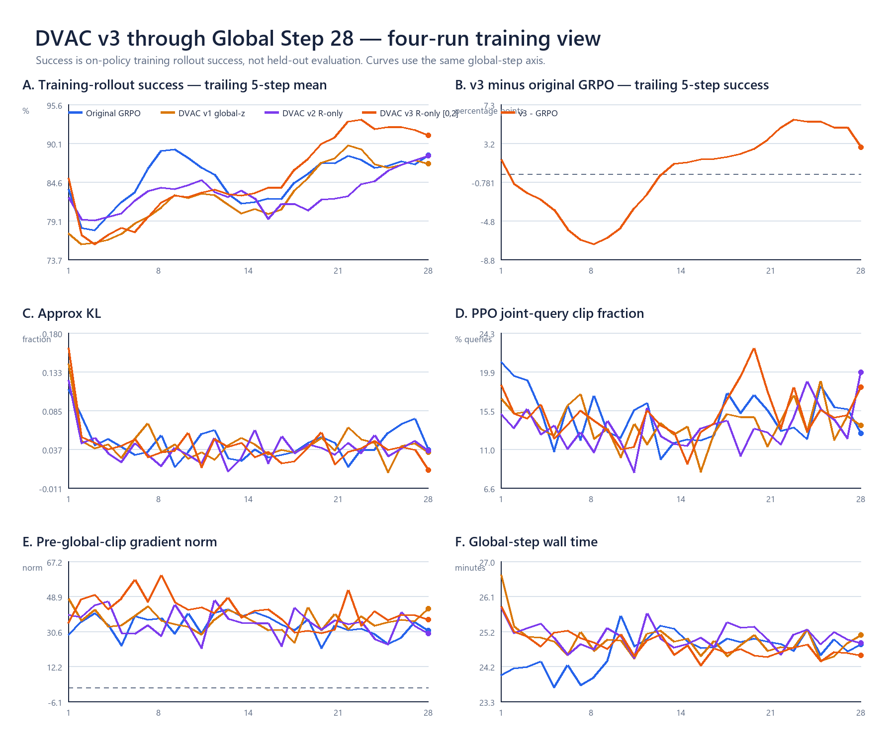
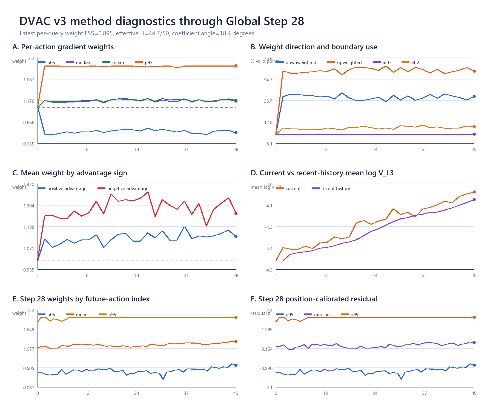
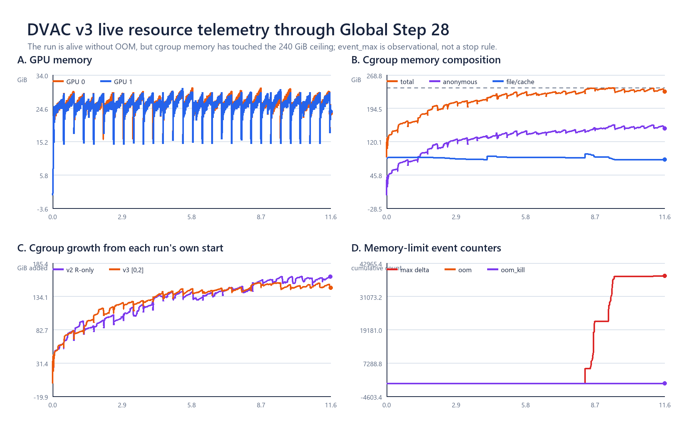

# R-only v3 `[0,2]` formal：Global Step 28 现场分析

日期：2026-08-23

## 1. 当前结论

本次轻量快照锁定在 `2026-08-23T10:15:59+08:00`：v3 formal 已完整完成
**Global Step 28/100**。最终只读刷新到`10:31:33`时，Step 29 rollout已到`12/16`；
wrapper/driver/observer、2 actor、2 rollout、2 env worker均存活，核心训练数值全部finite，fatal扫描为0，
`oom=oom_kill=0`。

简要判断：

- **训练和方法链正常**：g28训练success=`90.63%`、KL=`0.0113`、query clip=`18.13%`、
  pre-global-clip grad norm=`36.57`，并持续产出双rank DVAC NPZ/CSV。
- **当前训练曲线比前三条更好看**：g1–28 v3 success均值=`85.90%`，与原GRPO的`85.57%`接近；
  最近5/10步为`91.17/92.30%`，高原GRPO同窗口`2.81/4.26`个百分点。这里仍是on-policy训练
  rollout，不是held-out评估。
- **`[0,2]`干预稳定且明显强于v2**：g28 per-query weight ESS=`0.895`，等效
  `44.7/50`个future action，系数角=`18.4°`；不是又退回接近uniform的轻微重排。
- **显存宽松，主存压力很高**：两卡峰值`30.37/30.22 GiB`；cgroup已触到`240 GiB`硬上限，
  `memory.events max`比启动增加`38,362`，但尚无OOM/OOM-kill。当前最大RSS仍来自两个EnvWorker。

## 2. 四条训练同轴比较

| g1–28 | 原GRPO | DVAC v1 | DVAC v2 R-only | DVAC v3 `[0,2]` |
|---|---:|---:|---:|---:|
| success均值 | 85.57% | 83.54% | 83.55% | **85.90%** |
| 最近5步均值 | 88.36% | 87.19% | 88.28% | **91.17%** |
| 最近10步均值 | 88.05% | 88.20% | 86.29% | **92.30%** |
| mean approx KL | 0.0445 | 0.0435 | 0.0390 | 0.0410 |
| mean query clip | 14.71% | 13.86% | 13.41% | 14.90% |
| mean pre-clip grad norm | 33.52 | 36.23 | 34.66 | 41.50 |
| mean step time | 24.63 min | 24.90 min | 25.01 min | 24.77 min |

v3在g8附近一度明显落后，此后逐步追上，并在约g14后进入持续正差区间；到g28，5-step success
相对原GRPO为`+2.81pp`。优化标量和每步用时仍与三条历史实验在同一量级，因此当前曲线差异并不是由
明显的训练停顿或吞吐下降造成。

## 3. 方法实际改动强度

g28共有`264`个loss-valid query、`13,200`个action位置：

- 权重p05/median/mean/p95=`0.399/1.158/1.178/2.000`；
- `37.61%`位置降权、`62.39%`位置增权；`0.49%`命中0、`7.91%`命中2；
- weight top-20% mass=`31.78%`，per-query ESS=`0.895`，等效H=`44.7/50`；
- 加入GRPO `|advantage|`后，top-20%绝对credit从uniform的`39.98%`升到`44.83%`，
  global credit ESS从`0.723`降到`0.621`；
- 正advantage query平均权重=`1.133`，负advantage query=`1.258`。公式没有读取正负号；这个差异表示
  当前失败/负advantage样本的position-calibrated residual整体更高，因此被更强抑制；
- 双actor rank的50点center/scale最大差均为0，recent-5按h统计同步正常。

g2–28的平均p05/median/p95=`0.431/1.166/1.996`，per-step分布没有明显塌回1。raw `V_L3`几何均值
相对g1增加约`52.7%`，但这是on-policy信号，同时包含模型变化和访问状态变化。

## 4. 资源与产物

资源CSV覆盖约`11.64 h`：

- GPU峰值：`30.37/30.22 GiB`；无CUDA OOM。
- cgroup：启动`84.96 GiB`，快照最新`231.92 GiB`，峰值`240 GiB`；最新anonymous/file-cache分别
  `149.66/80.23 GiB`。
- `memory.events max`从`36,757`增到`75,119`，首次新增约在启动后`8.32 h`；
  `oom=0`、`oom_kill=0`。
- 同elapsed的v2总量约`226.06 GiB`、anonymous约`148.81 GiB`；v3分别高`5.86/0.85 GiB`。
  因此anonymous/EnvWorker增长与v2很接近，v3更早触顶主要还包含启动基线较高和file/cache更多，
  暂无证据指向`[0,2]`权重计算本身新增了显著RAM占用。
- host available RAM最低约`819.66 GiB`，数据盘最低约`685.49 GiB`，宿主机和磁盘仍充足；风险集中在
  当前run自己的240 GiB cgroup上限。

服务器已存在完整的`global_step_10`与`global_step_20`，各约`9.7 GiB`；save interval仍为10。
快照时run约`20 GiB`、runtime约`43 MiB`，已有56个双rank step NPZ、3个CSV和1个control-trace MP4。

本地轻量快照与派生产物：

- [四run逐步训练表](evidence/v3_formal_live_g28_20260823/analysis/FOUR_RUN_TRAINING_G28.csv)
- [v3逐步方法指标](evidence/v3_formal_live_g28_20260823/analysis/V3_DVAC_STEP_METRICS_G28.csv)
- [g28逐h指标](evidence/v3_formal_live_g28_20260823/analysis/V3_LATEST_HORIZON_G28.csv)
- [资源时间序列](evidence/v3_formal_live_g28_20260823/analysis/V3_RESOURCES_G28.csv)
- [机器可读摘要](evidence/v3_formal_live_g28_20260823/analysis/SUMMARY_G28.json)

## 5. 当前判断

截至g28，**训练进程、优化数值、DVAC权重与产物链均正常；v3训练rollout近期表现优于原GRPO、v1和v2**。
但训练success仍不能代替fixed-ID评估。当前最需要持续观察的不是显存或数值稳定性，而是cgroup主存已经
多次触到240 GiB上限；observer只记录，不会据此干预运行。
