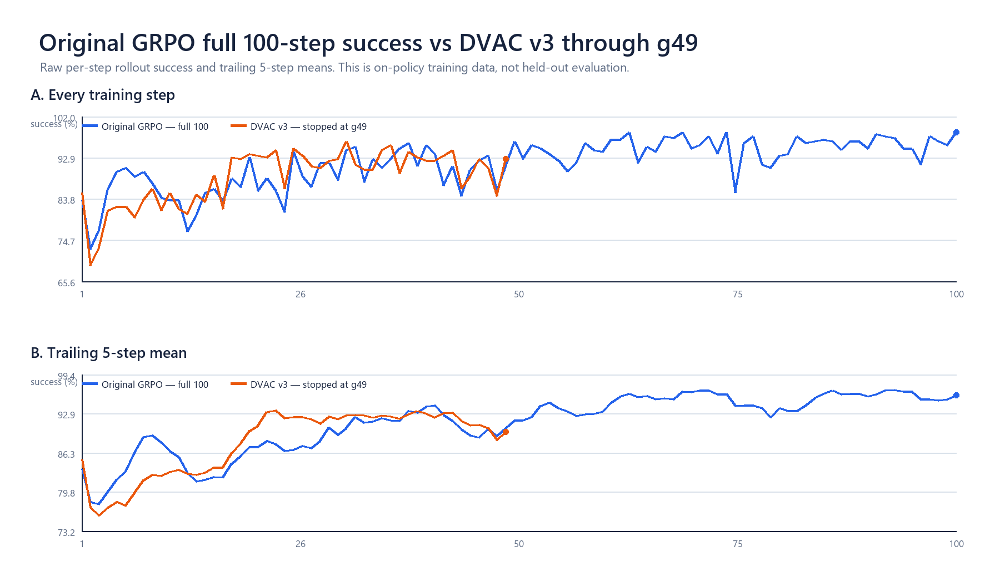
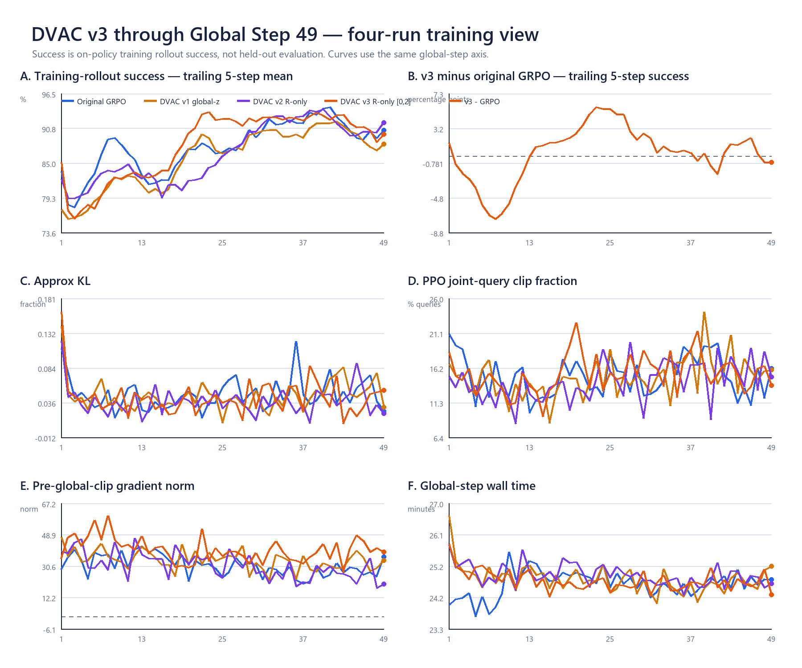
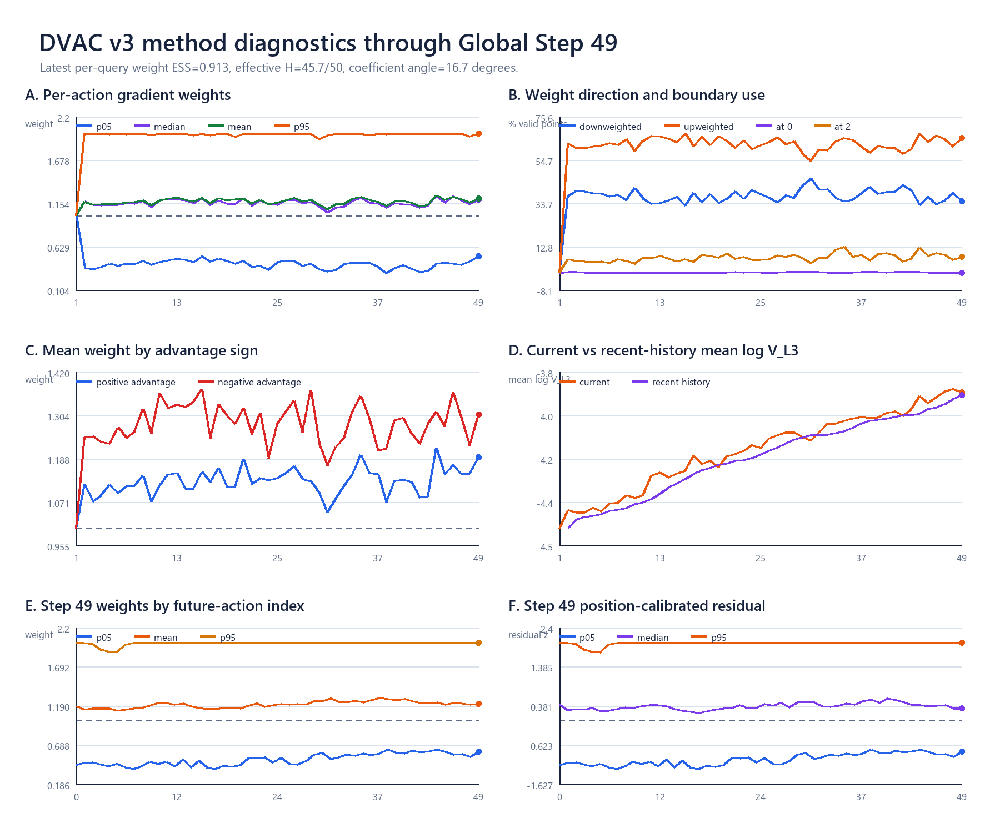
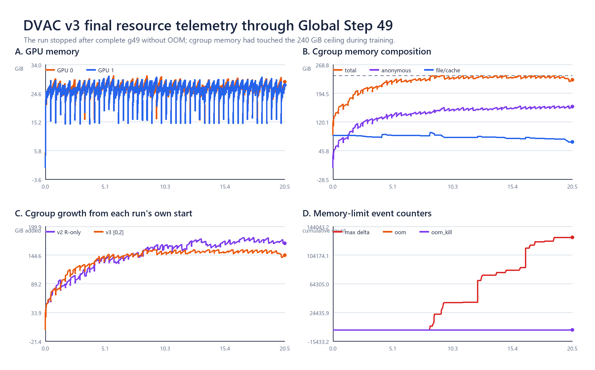

# R-only v3 `[0,2]`：g49 收尾、方法强度与下一实验

日期：2026-08-23

## 1. 结论先行

R-only v3 已按用户授权停止，最终只计入完整写出的 Global Step 1--49；正在进行的下一轮 rollout 不计入。
停止后本次进程组完全退出，两卡显存归零，`oom=oom_kill=0`。服务器保留 g10/g20/g30/g40 四个
checkpoint和98个双rank step NPZ；本地只下载了g49代表材料、完整标量日志和资源时序。

训练rollout success方面，v3在g1--49相对原GRPO：

| 口径 | 原GRPO | v3 | v3 - 原GRPO |
|---|---:|---:|---:|
| 累计均值 | 88.058% | 88.409% | +0.351 pp |
| 最近5步 | 90.469% | 89.766% | -0.703 pp |
| 最近10步 | 90.391% | 90.703% | +0.313 pp |

两条曲线频繁交叉；这些是on-policy训练rollout，不是fixed-ID held-out评估。因此v3说明`[0,2]`方法能稳定
改变训练并完整运行到g49，但当前数据还不支持“效果稳定优于原GRPO”。

## 2. v3究竟把训练改大了多少

g49有283个进入loss的query，共14,150个`query × h` action位置。权重分布为：

| 指标 | g49 |
|---|---:|
| min / p05 / median / mean / p95 / max | 0 / 0.493 / 1.185 / 1.209 / 2 / 2 |
| 降权 / 增权位置 | 34.69% / 65.31% |
| 命中0 / 命中2 | 0.16% / 7.96% |
| per-query weight ESS | 0.913 |
| 等效发言action数 | 45.66 / 50 |
| 权重系数相对uniform的夹角 | 16.72° |
| top-20% weight mass | 30.91% |

这里的`16.72°`是50维**权重系数向量**相对全1向量的角度，不是完整模型参数梯度夹角。它能回答“credit
重新分配有多强”，不能代替一次双backward真实梯度探针。

按相同概念看三版的典型强度：

| 版本 | 信号 | 权重范围 | 典型weight ESS / 系数角 |
|---|---|---|---|
| v1 | global z-score | `[0.8,1.2]` | 约0.992 / 约5° |
| v2 | per-h residual | `[0.5,1.2]` | closeout约0.973 / 约9° |
| v3 | per-h residual | `[0,2]` | g49 0.913 / 16.72° |

所以v3不是只改了1%--2%。g49中，若把`|advantage| × weight`看作反向传播前的绝对credit系数：

- 总绝对credit质量相对uniform约为`1.242×`；
- top-20% credit质量由54.54%升到56.93%；
- pre-global-clip gradient norm均值为40.08，原GRPO同窗口为30.86。

但global grad clip会把整条参数梯度统一缩到阈值1，不改变其方向。因此名义总量增加不会等比例变成最终步长；
v3更重要的作用仍是改变各action梯度合成后的方向，随后AdamW再把该方向转换为参数更新。

## 3. 方法相关信号怎样变化

v3 apply区间g2--49的平均统计：

- p05 / median / p95 weight：`0.416 / 1.161 / 1.995`；
- 降权 / 增权位置：`37.47% / 62.53%`；
- 命中0 / 命中2：`0.415% / 7.586%`；
- positive-advantage query平均权重：`1.128`；
- negative-advantage query平均权重：`1.282`；
- raw `V_L3`几何均值从g1到g49增加约82.1%。

公式没有读取advantage正负；负advantage权重更高是数据关联：失败/负向query在本次训练中往往具有更高的
R-only residual。因此v3实际更强地放大了部分负向抑制。raw V的上升同时混合了模型变化和on-policy访问状态
变化，不能单独解释为模型自身越来越不确定。

## 4. GRAIL与DelTA给我们的具体参照

[GRAIL](https://arxiv.org/html/2606.04889)与当前挂点最像：它把每个token的detached重要性权重直接乘入
PPO credit。区别是它的信号来自最终答案损失对token embedding的gradient×input saliency，更接近
“该位置会不会影响结果”；主范围可到`[0.5,5]`，而且只加权错误rollout最好。这提示后续若想继续扩大
DVAC倍率，较有依据的方向是先看失败/负advantage上的信号是否更集中，再只对这一侧使用强映射。

[DelTA](https://arxiv.org/html/2605.21467)先比较逐token梯度更接近正advantage还是负advantage梯度中心，
再给权重。它的主范围只有`[0.8,1.2]`；扩大到`[0.5,1.5]`没有提升，同范围随机权重明显退化。它说明真正
关键的是信号是否把梯度分给了正确位置，而不只是数值跨度。因此下一层最有信息量的机制量是：

\[
w(q,h)\rightarrow \Delta\log\pi(q,h),
\]

即完成一次AdamW更新后，高权重action的policy log-prob是否确实改变更多。

更强的同接口参照还有：

- [Beyond 80/20](https://proceedings.neurips.cc/paper_files/paper/2025/hash/a797c2d2e0c1fdabf4d1ab8cd0b465c6-Abstract-Conference.html)：
  top-20%高熵token保留、其余80%归零，按全token均值换算约为`{0,5}`，远强于v3；
- [OAR](https://aclanthology.org/2026.acl-long.1132/)：outcome influence从低端0→1、高端1→3，再按每条
  sequence归一为mean-one；
- [A3PO](https://aclanthology.org/2026.acl-long.134/)：正rollout强化低概率20%，负rollout强化高概率20%，
  选中位置从`×2`逐渐衰减回1。

这些工作共同说明：更强的下一版最好同时明确“选哪些位置、正负advantage是否同映射、是否mean-one”，而不是
只继续把静态区间扩到更大。

## 5. 原GRPO完整曲线与v3对照

上半图是每步原始success；下半图是trailing-5均值。原GRPO画满100步，v3只画实际完成的49步，不外推。

机器可读总表见
[SUMMARY_G49.json](evidence/v3_formal_stop_g49_20260823/analysis/SUMMARY_G49.json)。

轻量收尾包：
[idea2_dvac_v3_formal_stop_g49_20260823.zip](../../exports/idea2_dvac_v3_formal_stop_g49_20260823.zip)，
4,566,769 bytes、32个成员，SHA256=
`534C4541CFEF604725AFF660C38C190E985E13F639835C162620AA558389338C`。checkpoint正文与其余step NPZ未入包。

## 6. 本轮下一实验

新实验使用v1的global-z信号和v3的`[0,2]`强度：

\[
w(q,h)=1+0.5\,\operatorname{clip}(z(q,h),-2,2).
\]

它回答一个单独问题：保留future-h固定位置趋势后，强权重是否与R-only v3表现不同。任务、fresh SFT、
2卡16 env、G8、B512/mb32、update2、flow-SDE、chunk reward/log-prob、PPO ratio clip、global grad clip、
优化器和checkpoint节奏全部沿用原成功GRPO。完整启动合同见
[27号文档](27_GLOBAL_Z_W0TO2_FORMAL_LAUNCH_20260823.md)。
