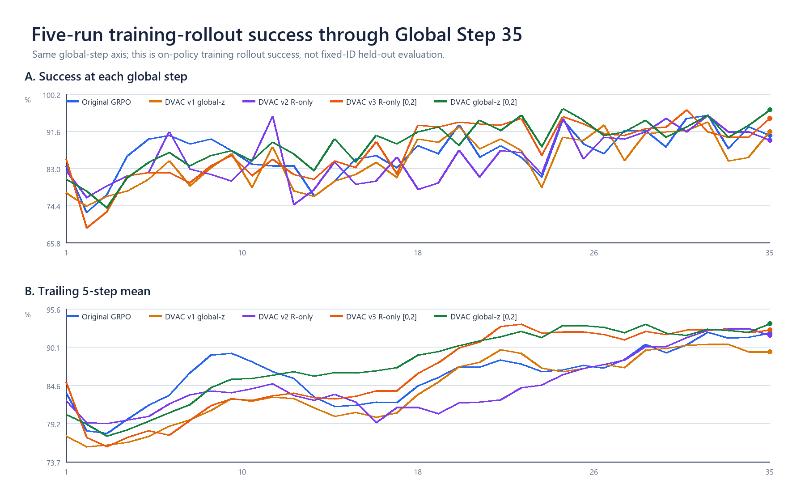
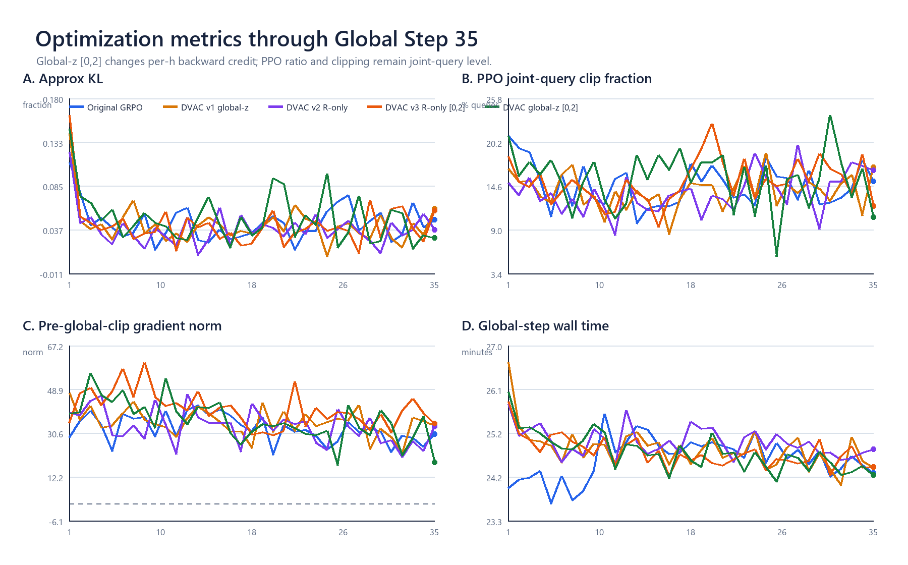
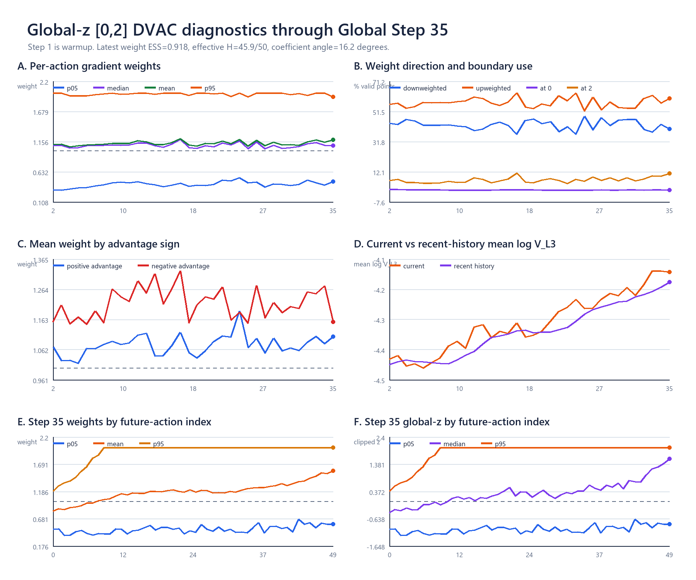
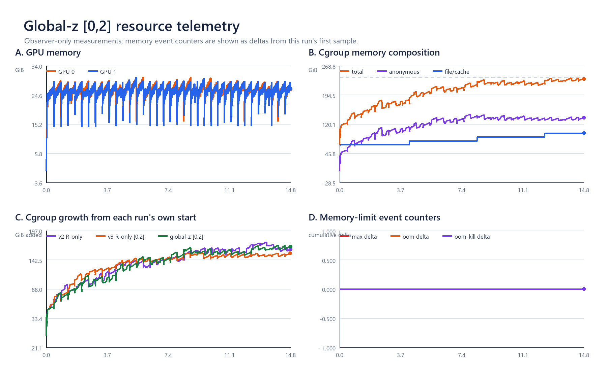

# Global-z `[0,2]` 正式训练现场分析：g35 数据快照与 g36 在线状态

时间：2026-08-24  
分析边界：训练/DVAC/资源图冻结在**完整 Global Step 35**；最后一次 AutoDL 现场刷新为
`2026-08-24T10:25:38+08:00`，此时**完整到 g36，g37 rollout 3/16**。本轮只读，没有停止、重启或修改训练。

## 1. 先说结论

训练正在正常进行：wrapper、driver、observer、两组 EnvWorker、actor 与 rollout worker 都存活；
`fatal=0`，没有 CUDA OOM、cgroup OOM 或 OOM-kill。g36 的 rollout success 为 `96.875%`，approx KL=`0.036`、
joint-query clip fraction=`16.8%`、pre-global-clip grad norm=`22.180`，数值没有出现发散形态。

到 g35 为止，global-z `[0,2]` 的训练-rollout success 在五条历史曲线中暂时最好：相对原 GRPO 的
g1--35平均、最近5步、最近10步分别为 `+1.908 / +1.406 / +2.109` 个百分点。加入已完成的g36后，
当前实验g32--36五步均值为`94.375%`，原GRPO同区间为`91.719%`，差`+2.656pp`。

这仍是on-policy训练rollout，不是fixed-reset held-out评估；它说明当前训练轨迹积极、运行健康，不能单凭
前36步宣布最终策略优于基线。

资源方面GPU很宽松，主存接近但尚未触发cgroup上限：历史峰值`237.86/240 GiB`，最后现场
`235.97/240 GiB`，本次run内`memory.events.max/OOM/OOM-kill`增量均为0。主存仍是后续最需要观察的量。

## 2. 当前运行与产物

最后现场（10:25:38 CST）：

| 项目 | 当前事实 |
|---|---:|
| 完整训练步 | g36/100 |
| 在途 | g37 rollout 3/16 |
| g36 success | 96.875% |
| g36 approx KL / PPO clip | 0.036 / 16.8% |
| g36 pre-global-clip grad norm | 22.180 |
| g36 ratio | 1.023 |
| 核心worker | 2 EnvWorker + 2 actor + 2 rollout worker，均ALIVE |
| fatal / OOM / OOM-kill | 0 / 0 / 0 |
| DVAC NPZ | 72 = 2 actor ranks × 36 completed steps |
| checkpoints | g10、g20、g30，各约9.7 GiB |
| run / runtime目录 | 30 GiB / 55 MiB |
| control trace | 1个抽样MP4（按现有固定抽样合同） |

产物数量与配置合同一致。NPZ连续到`rollout_step0035.npz`；零基`step0035`对应UI里的Global Step 36。

## 3. 五条训练曲线怎样读

图：[五run success](evidence/global_z_w0to2_live_g35_20260824/analysis/GLOBAL_Z_FIVE_RUN_SUCCESS_G35.png)

图上半是每一步256条训练trajectory的success，下半是最近5步滑动平均。g1--35统一比较为：

| run | 平均success | g35 success | 最近5步 | 最近10步 |
|---|---:|---:|---:|---:|
| 原GRPO | 86.752% | 90.625% | 92.109% | 90.703% |
| v1 global-z `[0.8,1.2]` | 84.821% | 91.406% | 89.453% | 89.688% |
| v2 R-only `[0.5,1.2]` | 85.268% | 89.453% | 91.797% | 91.016% |
| v3 R-only `[0,2]` | 87.221% | 94.531% | 92.578% | 92.266% |
| **当前global-z `[0,2]`** | **88.661%** | **96.484%** | **93.516%** | **92.813%** |

三个最干净的描述性比较：

- 对原GRPO：平均/最近5/最近10步为`+1.908/+1.406/+2.109pp`。
- 对v1（同为global-z，只把强度从`[0.8,1.2]`放大到`[0,2]`）：
  `+3.839/+4.063/+3.125pp`。
- 对v3（同为`[0,2]`，但v3先去future-h位置趋势）：
  `+1.440/+0.938/+0.547pp`。

当前结果支持继续跑：强global-z没有破坏训练，而且前36步success较好。两条曲线仍会交叉，且不同run不是
逐样本配对更新，因此现在最合适的措辞是“积极的训练期结果”。

## 4. 优化指标是否正常

图：[五run优化指标](evidence/global_z_w0to2_live_g35_20260824/analysis/GLOBAL_Z_FIVE_RUN_OPTIMIZATION_G35.png)

g1--35均值：

| run | approx KL | joint-query clip | pre-global-clip grad norm | 每步时间 |
|---|---:|---:|---:|---:|
| 原GRPO | 0.0446 | 14.68% | 32.52 | 24.60 min |
| v1 global-z | 0.0423 | 13.97% | 35.08 | 24.82 min |
| v2 R-only | 0.0380 | 13.71% | 33.28 | 24.96 min |
| v3 R-only `[0,2]` | 0.0425 | 15.09% | 40.60 | 24.74 min |
| **当前global-z `[0,2]`** | **0.0493** | **15.45%** | **35.86** | **24.74 min** |

解释：

- KL与clip略高于原GRPO，但仍处在历史正常波动区间，没有持续抬升。
- grad norm是在global norm clip之前测得。所有run大多数step都远大于`clip_grad=1`；global clip统一缩短
  整条梯度，不会消除DVAC在50个future action之间造成的相对方向变化。
- 当前训练速度与v3几乎相同，DVAC记录与加权没有引入明显step-time开销。

## 5. 我们的方法在训练里实际做了多大改变

图：[global-z方法诊断](evidence/global_z_w0to2_live_g35_20260824/analysis/GLOBAL_Z_METHOD_DIAGNOSTICS_G35.png)

g35双rank合并、只看进入loss的80个有效query：

| 方法量 | g35 |
|---|---:|
| weight p05 / median / mean / p95 | 0.472 / 1.122 / 1.184 / 2.000 |
| 被降权 / 被增权 | 40.10% / 59.90% |
| 命中0 / 命中2 | 0.05% / 11.03% |
| 每query weight ESS | 0.918 |
| 等效参与action数 | 45.9 / 50 |
| 权重系数角 | 16.24° |
| 最高20%位置掌握的weight质量 | 32.43%（均匀时20%） |
| 正adv / 负adv的query平均weight | 1.115 / 1.269 |
| 加权后绝对credit总量 / uniform | 1.192× |

这里的“weight”就是反向传播时每个future action的发言倍率。ESS=`0.918`表示这已经明显强于v1/v2的小幅
重排，但仍不是80/20 hard mask那种只剩10/50个位置发言。g35里负advantage对应的action平均权重更高，
因此这一批主要更强地压制失败方向；公式本身没有读取advantage正负，这是DVAC信号与本批失败轨迹的相关性。

global-z还保留了future-h位置结构：g35后25格平均weight比前25格高`0.230`，`h`与mean weight的
Spearman相关为`0.951`。这与R-only的关键差别很清楚：当前实验会系统性多训练chunk后部，同时再叠加
state/action自身的DVAC变化。NPZ核验`w=1+0.5*clip(z,-2,2)`最大误差约`5.96e-8`，实现与配置一致。

信号本身也在变化：g1到g35，raw `V_L3`几何均值增加约`37.4%`。g35 current/history mean log V为
`-4.123/-4.157`，即当前批约比recent-5参考高`3.5%`，所以整体mean weight大于1并不奇怪。

## 6. 资源图怎样读

图：[资源监视](evidence/global_z_w0to2_live_g35_20260824/analysis/GLOBAL_Z_RESOURCES_G35.png)

- GPU：两卡历史峰值`30.37/30.22 GiB`，g37 rollout现场约`25.6/25.4 GiB`；离80 GiB很远。
- cgroup：从run启动时`67.85 GiB`增长；下载快照的最新值`235.28 GiB`、历史峰值`237.86 GiB`。
  最后现场为`235.97/240 GiB`，约余`4.03 GiB`。
- 组成：最后下载点anonymous约`136.08 GiB`、file/cache约`97.12 GiB`。两个EnvWorker RSS现场约
  `57.54/55.72 GiB`，仍是主存主体。
- event：本次run从首样本到现在`max/OOM/OOM-kill`增量均为0。计数器中的旧`max=165367`是同一cgroup
  先前运行留下的累计值，本轮没有继续增加。
- 宿主与磁盘：host available约`844 GiB`，`/root/autodl-tmp`约余`640 GiB`。

所以当前资源结论是：GPU和磁盘充足，训练正常；cgroup主存已经接近240 GiB，但没有新memory-max事件，
也没有OOM。继续运行时主要看这条曲线即可，不需要改变训练行为。

## 7. 本轮本地材料

冻结快照与复现脚本位于：

- `evidence/global_z_w0to2_live_g35_20260824/raw/`：g35日志、双rank CSV/NPZ、配置、TensorBoard与资源CSV；
- `evidence/global_z_w0to2_live_g35_20260824/analyze_global_z_g35.py`：离线分析与作图；
- `evidence/global_z_w0to2_live_g35_20260824/analysis/SUMMARY_G35.json`：机器可读汇总；
- `evidence/global_z_w0to2_live_g35_20260824/analysis/FIVE_RUN_TRAINING_G35.csv`：五run同轴表；
- `evidence/GLOBAL_Z_W0TO2_LIVE_G35_LEDGER_20260824.md`：服务器与本地逐指令流水账。

当前不需要干预训练。下一次刷新可以直接从g36之后增量读取；正式效果判断仍应落到保存checkpoint的
fixed-reset评估，而不是只看训练rollout曲线。
