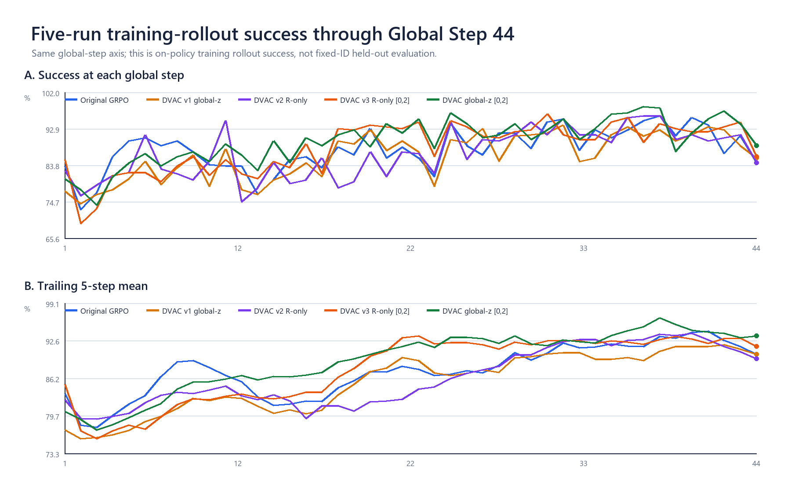
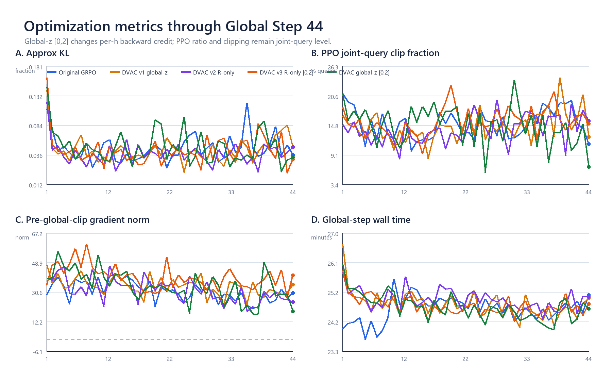
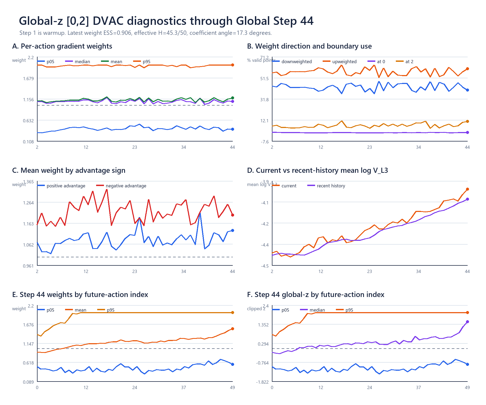
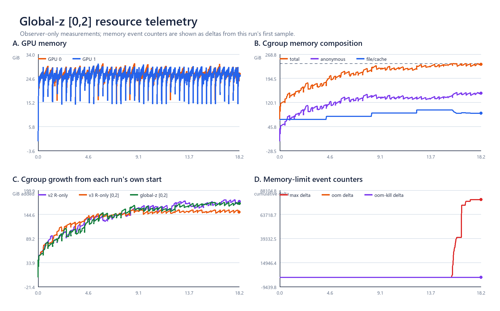

# Global-z `[0,2]` 正式训练现场分析：g44 数据、方法与资源快照

时间：2026-08-24  
分析边界：训练、DVAC方法量与资源图冻结在**完整 Global Step 44**；最后AutoDL现场刷新为
`2026-08-24T13:50:35+08:00`，当时正在生成g45 rollout `10/16`。本轮只读，没有改变训练进程或配置。

## 1. 当前结论

训练仍在正常推进：wrapper、driver、observer、两组EnvWorker、两组actor和两组rollout worker均存活；
`fatal=0`，两个Traceback都是既有可选CuRobo导入探针，没有CUDA OOM、cgroup OOM或OOM-kill。

到g44为止，当前global-z `[0,2]` run的training-rollout success为：

- g1--44平均`89.790%`；原GRPO同区间`87.784%`，高`2.006pp`；
- 最近5步`93.438%`；原GRPO`90.313%`，高`3.125pp`；
- 最近10步`94.414%`；原GRPO`91.680%`，高`2.734pp`。

这是同global-step的训练中on-policy rollout对比，不是固定reset独立评估。当前可以确认的是：强global-z加权
没有破坏训练，且前44步训练轨迹继续保持积极；checkpoint策略是否真正更强仍需后续fixed-ID评估回答。

资源结论比g35时有一个变化：GPU仍宽松，但cgroup主存已经触及`240 GiB`上限并产生新的
`memory.events.max`计数。冻结快照内峰值`239.99996 GiB`、近上限样本223个、max-event增量`78,665`；
最后现场为`239.62/240 GiB`、max-event增量`81,328`。`OOM/OOM-kill`仍为0，训练继续存活。它表示内核发生了
限额回收/等待，不等于OOM；本轮只记录，没有改变运行。

## 2. 当前运行与服务器产物

| 项目 | g44/g45现场事实 |
|---|---:|
| 完整训练步 | g44/100 |
| 在途 | g45 rollout 10/16 |
| g44 success / return | 88.672% / 0.8867 |
| g44 approx KL / joint-query clip | 0.032 / 6.8% |
| g44 pre-global-clip grad norm | 18.527 |
| 核心worker | 2 EnvWorker + 2 actor + 2 rollout worker，均ALIVE |
| fatal / CUDA OOM / cgroup OOM-kill | 0 / 0 / 0 |
| DVAC NPZ | 88 = 2 ranks × 44 completed steps |
| checkpoint | g10、g20、g30、g40，各约9.7 GiB |
| run / runtime目录 | 39 GiB / 69 MiB |
| 细录像 | 1个固定抽样episode，115帧 |

`rollout_step0043.npz`是零基runner step 43，对应界面Global Step 44。两个rank各有44个连续NPZ，没有缺步。
g40 checkpoint内部是两份约5.20 GB的DCP shard和一份约1.03 MB metadata；这是可恢复训练权重/优化器状态，
不是轻量分析文件。

## 3. 五条训练成功率曲线

统一比较g1--44：

| run | 平均success | g44 success | 最近5步 | 最近10步 |
|---|---:|---:|---:|---:|
| 原GRPO | 87.784% | 84.375% | 90.313% | 91.680% |
| v1 global-z `[0.8,1.2]` | 86.071% | 85.547% | 90.313% | 90.977% |
| v2 R-only `[0.5,1.2]` | 86.594% | 84.375% | 89.531% | 91.523% |
| v3 R-only `[0,2]` | 88.255% | 85.938% | 91.641% | 92.500% |
| **当前global-z `[0,2]`** | **89.790%** | **88.672%** | **93.438%** | **94.414%** |

三组最有信息量的同口径差值：

- 对原GRPO：累计/最近5/最近10步为`+2.006/+3.125/+2.734pp`；
- 对v1（同global-z信号，弱区间）：`+3.720/+3.125/+3.438pp`；
- 对v3（同`[0,2]`区间，R-only信号）：`+1.536/+1.797/+1.914pp`。

当前线在后半段大多位于上方，但单步仍有明显波动和交叉，因此应看滑动均值与最终fixed-ID评估，而不是只看g44单点。

## 4. 优化指标

g1--44均值：

| run | approx KL | joint-query clip | pre-global-clip grad norm | 每步时间 |
|---|---:|---:|---:|---:|
| 原GRPO | 0.0468 | 15.15% | 31.14 | 24.61 min |
| v1 global-z | 0.0447 | 14.58% | 34.10 | 24.76 min |
| v2 R-only | 0.0378 | 14.05% | 31.61 | 24.91 min |
| v3 R-only `[0,2]` | 0.0434 | 15.45% | 39.80 | 24.72 min |
| **当前global-z `[0,2]`** | **0.0486** | **14.79%** | **34.21** | **24.67 min** |

这些量说明：

- 当前KL、PPO clip fraction与原GRPO同量级，没有随step持续抬升；
- grad norm在全局裁剪前统计，配置`clip_grad=1`，因此绝大多数更新最终都会统一缩短；global clip不改变
  整条梯度方向，也不会取消50个future action之间的相对重排；
- 平均step时间只比原GRPO多约0.06分钟，未见明显计算开销。

## 5. 方法在g44实际怎样改变训练

g44双rank合并后，1024个采集query中有181个loss-mask有效query进入GRPO更新。其50个future-action权重为：

| 方法量 | g44 |
|---|---:|
| weight p05 / median / mean / p95 | 0.430 / 1.128 / 1.180 / 2.000 |
| 被降权 / 被增权 | 40.0% / 60.0% |
| 命中0 / 命中2 | 0.221% / 10.829% |
| per-query weight ESS | 0.906 |
| 等效参与action数 | 45.29 / 50 |
| 权重系数角 | 17.28° |
| top-20% weight质量 | 32.44%（均匀为20%） |
| 正adv / 负adv query平均weight | 1.149 / 1.257 |
| 加权后绝对credit / uniform | 1.218× |

通俗解释：权重不是直接改reward或advantage，而是在每个`h`的log-prob反向贡献上乘倍率。g44已经不是
微弱扰动：最高20%的action拿到约32.4%的权重质量，系数向量相对uniform约转17.3°；但它仍远没有
hard 80/20只让10/50个位置发言那么集中。

g44失败方向（负advantage）平均权重比成功方向更高，因此这一批更强地压制失败轨迹中的高DVAC action。
公式本身不读取advantage正负，这个差异来自本批信号与成败的相关关系。

global-z保留了明显future-h结构：后25格平均weight比前25格高`0.194`，`h`与mean weight的Spearman相关
为`0.960`。所以该run同时测试了“raw DVAC高的位置多训练”和“chunk后部普遍多训练”这两个共同效果；
它与v3 R-only先去位置趋势的设计构成清楚对照。

NPZ逐点核验`w=1+0.5*clip(z,-2,2)`最大绝对误差`5.96e-8`，所有主训练数值和最新数组均finite。
g1到g44，on-policy raw `V_L3`几何均值增加约`62.3%`；这同时混合策略变化与访问状态变化，适合描述训练中
信号演化，不单独解释为模型本体不确定性增加。

## 6. 资源

- GPU：两卡历史峰值`30.37/30.22 GiB`；快照末端约`26.23/25.65 GiB`，离80 GiB容量很远。
- cgroup：从`67.85 GiB`增长到`237.34 GiB`，历史峰值`239.99996/240 GiB`。
- 组成：末端anonymous约`148.11 GiB`，file/cache约`87.10 GiB`；两个EnvWorker RSS约`63.72/60.75 GiB`。
- memory event：`2026-08-24T11:03:52+08:00`首次出现本run新增max事件；到快照末端max增量
  `78,665`，但OOM与OOM-kill增量均为0。
- host和磁盘：宿主available RAM约`832.8 GiB`；`/root/autodl-tmp`约余`629.6 GiB`。

因此GPU、磁盘和宿主总RAM充足；当前最紧的是容器240 GiB内存上限。新增max事件表明训练已经发生过
内存限额压力，但没有中止，也没有数据表明数值训练异常。

## 7. 产物分别包含什么信息

服务器run目录主要分五类：

1. `metrics.log`与TensorBoard event：每个Global Step的时间、success/return、reward、advantage范围、
   KL、ratio、PPO clip、loss、grad norm、学习率等主训练曲线；TensorBoard config保存resolved训练配置副本。
2. `dvac_train/actor_rank*/runner_step_metrics.csv`：每rank每step一行，共44行；记录当前/历史`log V_L3`
   均值方差、权重分位数、上下边界命中率、正负advantage权重均值及actor优化指标。
3. `dvac_train/actor_rank*/rollout_step*.npz`：逐query×future-h原始数据。g44每rank的主张量形状为
   `[4,128,50]`，包括`V_L2/V_L3/V_L4`、`weights`、`clipped_z`、reward/done、old log-prob；
   query级还包括advantage、loss mask、reset ID、query index、action slot、stage和来源env rank。
4. `rolling_stats_state.json`与`run_manifest.json`：前者保存用于下一步z-score的最近5步统计状态；后者保存
   `L=3`、window=5、strength=.5、z-clip=2、source commit和schema合同。
5. `checkpoints/global_step_*`：每10步一份约9.7 GiB的DCP恢复点。当前已有g10/20/30/40。

另有两类旁路产物：

- `control_trace`只抽样worker0/env0的第一个episode：reset57、115帧、160×120、10 FPS、CRF32；
  `frames.csv`把frame映射到query、control/physics step和近似future-h，并在frame114、query2、
  `h≈13.72`记录首次success。
- runtime目录保存精确launch command、resolved config、完整driver输出和逐秒resource CSV；服务器还保留
  约53.8 MB的`process_rss.tsv`用于按进程追踪RAM。

本地轻量快照共20个文件、`10,687,115 bytes`，保留上述高信息量小文件和g44双rank代表NPZ，没有复制
39 GiB run正文、checkpoint或全部历史NPZ。字段清单见
[`ARTIFACT_CONTENTS_G44.json`](evidence/global_z_w0to2_live_g44_20260824/analysis/ARTIFACT_CONTENTS_G44.json)，
机器汇总见[`SUMMARY_G44.json`](evidence/global_z_w0to2_live_g44_20260824/analysis/SUMMARY_G44.json)。

## 8. 当前判断

当前无需修改训练：它仍在推进，训练成功率曲线积极，KL/clip稳定，方法权重确实产生了比v1/v2更强的
action级重排。需要持续观察的是cgroup max事件与最终是否自然走到g100。最终方法效果判断仍应在保存的
checkpoint上用同一组fixed reset做独立评估。

本轮所有服务器命令、下载、分析和视觉检查见
[`GLOBAL_Z_W0TO2_LIVE_G44_LEDGER_20260824.md`](evidence/GLOBAL_Z_W0TO2_LIVE_G44_LEDGER_20260824.md)。
